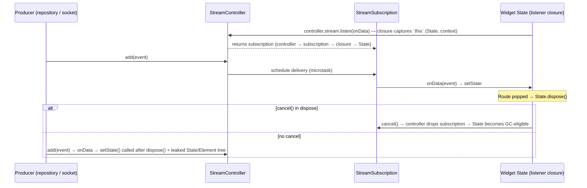

# Dart - Async, Streams & Isolates

> [!info] Deep dive of [[Dart]]

> [!abstract] TL;DR
> - **Event loop**: each Dart isolate runs **one thread** with an event loop and two queues. The **microtask queue** is always drained completely before the next **event** (timer, I/O, gesture, frame). `Future`, `async/await` and `Stream` are built on these queues. Nothing runs in parallel inside an isolate.
> - **Streams**: they come in two kinds.
>   - **Single-subscription** streams allow one listener and buffer events until that listener arrives.
>   - **Broadcast** streams allow many listeners, don't buffer, and drop events nobody is listening to.
> - **Subscriptions**: every `listen()` returns a `StreamSubscription` that keeps its callback (and everything the callback captures, such as a Flutter `State`) alive until it's **cancelled**. Not cancelling it is the classic Flutter memory leak.
> - **Isolates**: true parallelism comes from **isolates**, separate heaps that communicate only by message passing.

## Concept

### The event loop and its two queues
| Queue | Filled by | Priority |
|---|---|---|
| **Microtask** | `scheduleMicrotask`, `Future.microtask`, `then` callbacks of already-completed futures, `await` continuations | Drained **fully** after each event, before anything else |
| **Event** | `Timer`, `Future(() {...})` / `Future.delayed`, I/O completions, isolate messages, platform/UI events, frame callbacks (Flutter) | One event at a time |

```dart
void main() {
  print('1 sync');
  Future(() => print('5 event (Future → Timer.run)'));
  Future.microtask(() => print('3 microtask'));
  scheduleMicrotask(() => print('4 microtask'));
  Future.value(0).then((_) => print('… microtask too (completed future)'));
  print('2 sync');
}
// 1 sync, 2 sync, 3 microtask, 4 microtask, … microtask too, 5 event
```
- Long microtask chains **starve** the event queue. In Flutter, that means no frames, no input and a frozen UI. Heavy CPU work blocks both queues, so move it to an isolate.

### Future, async/await
- A `Future<T>` is a **single** eventual value or error. `async` functions return a Future immediately and run synchronously until the first `await`.
- `await f` suspends the function. When `f` completes, the continuation is scheduled as a **microtask**.
- An error in a Future nobody listens to becomes an **uncaught async error**: `runZonedGuarded` / `PlatformDispatcher.instance.onError` sees it in Flutter.

### Stream: a sequence of async events
| | Single-subscription (default) | Broadcast |
|---|---|---|
| Create | `StreamController<T>()`, `async*`, `File.openRead()`, HTTP body | `StreamController<T>.broadcast()`, `stream.asBroadcastStream()` |
| Listeners | **Exactly one, ever.** A second `listen` throws `Bad state: Stream has already been listened to`, even after cancel | Any number, at any time |
| Buffering | Buffers events until the listener arrives. Respects pause (backpressure) | **No buffering.** Listeners only get events emitted **after** they subscribe. Events with **no listener are dropped** |
| Typical use | One consumer of a sequence (file, HTTP, a BLoC's internal input) | Event bus, UI notifications, multiple widgets observing the same source |

### `close()` vs `cancel()`: two different responsibilities
- **`StreamController.close()`** is producer side: no more events, listeners get `onDone`. The owner of the controller closes it.
- **`StreamSubscription.cancel()`** is consumer side: stop listening and release the callback. Each listener cancels its own subscription.
- Closing a controller doesn't free a listener you subscribed to a **different, long-lived stream** (e.g. a repository's broadcast stream), and cancelling your subscription doesn't close someone else's controller. Mixing these up is the #1 interview pitfall.

### Isolates
- Each isolate has its **own heap, event loop and microtask queue**, with no shared mutable memory and therefore no locks or data races. They run in parallel on separate OS threads (the VM schedules them on a thread pool).
- **Communication** is by message passing only: `SendPort` / `ReceivePort`. Messages are deep-copied, except immutable or transferable data (`TransferableTypedData`, and `Isolate.exit` hands over the result without copying).
- **Isolate groups** (Dart 2.15+): isolates spawned from the same code share one heap structure and program code, so spawning is cheap (~ms) and messaging is fast, but objects still aren't shared.
- **Flutter**: `Isolate.run(fn)` (Dart 2.19+) / `compute(fn, arg)` for one-off CPU work (JSON parsing, image processing, crypto). Long-lived worker isolates use ports. On **Flutter web**, isolates aren't available (`compute` runs on the main thread), so use web workers for real parallelism.

## How It Works



**Why it leaks**: a long-lived object (singleton service, repository, global event bus, socket client) holds the controller. The controller holds the subscription, the subscription holds the `onData` closure, and the closure captures the `State` (and through it the `Element`, `BuildContext` and the whole subtree). The widget is gone from the screen, but the **reference chain from a long-lived root** keeps it alive. That's the textbook definition of a leak: a long-lived object holding a short-lived one.

**Bidirectional isolate communication**:
1. The main isolate creates a `ReceivePort` and spawns the worker, passing `mainReceivePort.sendPort`.
2. The worker creates its own `ReceivePort` and sends its `SendPort` back as the first message.
3. Both sides now hold the other's `SendPort`, so they can talk in both directions. Close ports when done, or the isolate stays alive.

## Practical Usage

### Cancel in `dispose` (the baseline answer)
```dart
class _OrdersPageState extends State<OrdersPage> {
  late final StreamSubscription<OrderEvent> _sub;

  @override
  void initState() {
    super.initState();
    _sub = context.read<OrderRepository>().events.listen((e) {
      if (!mounted) return;              // defensive; cancel() below is the real fix
      setState(() => _apply(e));
    });
  }

  @override
  void dispose() {
    _sub.cancel();                         // consumer side: stop listening
    super.dispose();
  }
}
```

### Many subscriptions: collect and cancel together
```dart
final _subs = <StreamSubscription<dynamic>>[];

void initState() {
  super.initState();
  _subs
    ..add(auth.changes.listen(_onAuth))
    ..add(cart.items.listen(_onCart))
    ..add(connectivity.onChange.listen(_onNet));
}

@override
void dispose() {
  for (final s in _subs) { s.cancel(); }  // returns Futures; await if cleanup order matters
  super.dispose();
}
// Alternatives: RxDart CompositeSubscription; package:async StreamGroup (merge streams → one subscription);
// package:async CancelableOperation for cancellable one-shot async work (not a "cancelable_operation" plugin).
```

### Let the framework own the lifecycle
```dart
// StreamBuilder subscribes in initState/didUpdateWidget and cancels on dispose or when the stream instance changes.
class _OrdersViewState extends State<OrdersView> {
  late final Stream<List<Order>> _orders = widget.repo.watchOrders();   // create ONCE

  @override
  Widget build(BuildContext context) => StreamBuilder<List<Order>>(
        stream: _orders,                         // ❌ never `widget.repo.watchOrders()` here: new stream every build → resubscribe every frame
        builder: (context, snap) => switch (snap) {
          AsyncSnapshot(hasError: true, :final error) => ErrorView(error!),
          AsyncSnapshot(hasData: true, :final data) => OrderList(data!),
          _ => const Center(child: CircularProgressIndicator()),
        },
      );
}
```
- Riverpod `StreamProvider` / `ref.listen`, BLoC (`BlocBuilder`, `bloc.close()` via `BlocProvider`) and `StreamBuilder` all manage subscriptions for you. That's the main reason to prefer them over manual `listen` in widgets.

### Broadcast streams done right
```dart
class EventBus {
  final _controller = StreamController<AppEvent>.broadcast();
  Stream<AppEvent> get events => _controller.stream;   // expose Stream, not the controller
  void emit(AppEvent e) { if (!_controller.isClosed) _controller.add(e); }
  Future<void> dispose() => _controller.close();        // owner closes
}

// Converting a single-subscription source; pause the source when nobody listens (avoid losing/ wasting events)
final shared = socket.messages.asBroadcastStream(
  onListen: (sub) => sub.resume(),
  onCancel: (sub) => sub.pause(),   // cancelling here would end the broadcast stream permanently
);
```
- **Late subscribers miss state** with broadcast streams. If a new listener must immediately get the **current value** (auth state, connection status, cart), use RxDart `BehaviorSubject` (replays the last value), a `ValueNotifier`/`ValueListenable`, or a state-management store (Riverpod/BLoC), which models *state*, not *events*.

### Isolate examples
```dart
// One-off CPU work (Dart 2.19+). Closure must not capture non-sendable objects (e.g., BuildContext, sockets).
final orders = await Isolate.run(() => parseOrders(hugeJsonString));

// Flutter helper (same idea; works on web by running on the main thread)
final thumbs = await compute(makeThumbnails, imageBytes);
```

## Patterns & Anti-patterns
| Pattern | When | Anti-pattern to avoid |
|---|---|---|
| Cancel every manual `listen` in `dispose` | Any subscription in a `State` | Relying on `mounted` checks alone (still leaks the State) |
| `StreamBuilder` / Riverpod / BLoC own subscriptions | UI consuming streams | Manual `listen` + `setState` everywhere |
| Create the stream once (field / provider) | `StreamBuilder.stream` | Calling a stream factory inside `build` (resubscribes each rebuild) |
| Owner closes controller, listeners cancel subscriptions | Shared services | Widgets closing a service's controller, or never closing it on app/feature teardown |
| Broadcast for events, BehaviorSubject/ValueNotifier for state | Multi-listener data | Broadcast stream for "current user" state (late listeners see nothing) |
| `Isolate.run`/`compute` for >16 ms CPU work | Parsing, image ops | Heavy sync loops on the UI isolate (jank) |
| `StreamTransformer`s (`map`, `where`, `debounce` via RxDart) | Search boxes, sensors | Hand-rolled timers inside listeners |

## Performance & Trade-offs
- Stream delivery is asynchronous by default (one microtask hop per event). `StreamController(sync: true)` delivers synchronously, which is faster but re-entrancy-prone. Use it only inside well-understood pipelines.
- Broadcast streams have per-listener overhead and no backpressure. A slow listener can't slow the producer, so heavy work in listeners must be offloaded or debounced.
- Isolate messages copy mutable data. Sending 50 MB of objects costs time and memory, so send bytes/`TransferableTypedData` or use `Isolate.exit`.
- Microtask-heavy code (deep `then` chains) is cheap per step but can delay frames when there are thousands of steps.

## Tips & Reminders
> [!tip]
> - Mental model: "microtasks cut the line; events take turns; isolates run in parallel and only talk by mail."
> - Turn on lints: `cancel_subscriptions`, `close_sinks`, `unawaited_futures`, `use_build_context_synchronously`.
> - Detect leaks in tests with **`leak_tracker_flutter_testing`** (tracks undisposed `StreamSubscription`s, controllers, notifiers in `testWidgets`), and in DevTools' Memory tab (retaining paths).
> - **In ZP's stack**: [[Supabase]] Realtime channels and `supabase.from(...).stream()` are subscriptions too. Call `removeChannel`/`cancel` in `dispose`, or wrap them in a Riverpod `StreamProvider.autoDispose`.

## Version Notes
| Version | Change |
|---|---|
| Dart 2.12 | Sound null safety (typed stream/future APIs) |
| Dart 2.15 | Isolate groups: fast spawning, cheaper message passing, `Isolate.exit` without copy |
| Dart 2.19 | `Isolate.run` |
| Dart 3.0 | Patterns make `AsyncSnapshot`/result handling concise. Mandatory null safety |
| Flutter 3.18+ | `leak_tracker` integration for widget tests |
| Dart 3.x | Ongoing VM/GC improvements. Stream/Future semantics stable |

## Critical Issues & Gotchas
> [!danger] Uncancelled subscriptions = leaks + crashes
> Symptoms are memory growing with each navigation (DevTools shows many `_XxxPageState` instances), `setState() called after dispose()` errors, and duplicate side effects (the same event handled N times after visiting a screen N times). Cancel in `dispose`, or let `StreamBuilder`/providers own the subscription.

> [!warning] Gotchas
> - Re-listening to a single-subscription stream (e.g. `stream` getter on an HTTP response or `async*` function) throws `Bad state`.
> - `asBroadcastStream()` keeps the source subscription alive after all listeners leave unless you pass `onCancel`. Cancelling the source in `onCancel` ends the broadcast stream for good.
> - Adding to a closed controller throws. Guard with `isClosed`, or design ownership so it can't happen.
> - Errors in streams without `onError` propagate as uncaught async errors and can crash in debug.
> - `await for` on a stream that never closes never finishes. Cancel via `break`/`return` or use `listen` with an explicit cancel.
> - Isolates can't receive closures capturing non-sendable objects (BuildContext, platform channels, open sockets).

## Related
- [[Dart]]
- [[Flutter]] — where these leaks show up
- [[Flutter - Interview Questions]] — Q1–Q3 and Q7 answer outlines
- [[Flutter - State Management]] — framework-managed subscriptions
- [[JavaScript - Event Loop & Async]] — same microtask/task model in JS

## References
- Dart asynchrony (event loop): https://dart.dev/libraries/async/async-await
- Streams: https://dart.dev/libraries/async/using-streams
- `Stream.asBroadcastStream`: https://api.dart.dev/dart-async/Stream/asBroadcastStream.html
- Isolates: https://dart.dev/language/isolates
- `package:async` (CancelableOperation, StreamGroup): https://pub.dev/packages/async
- leak_tracker (detecting leaks): https://github.com/dart-lang/leak_tracker/blob/main/doc/leak_tracking/DETECT.md
