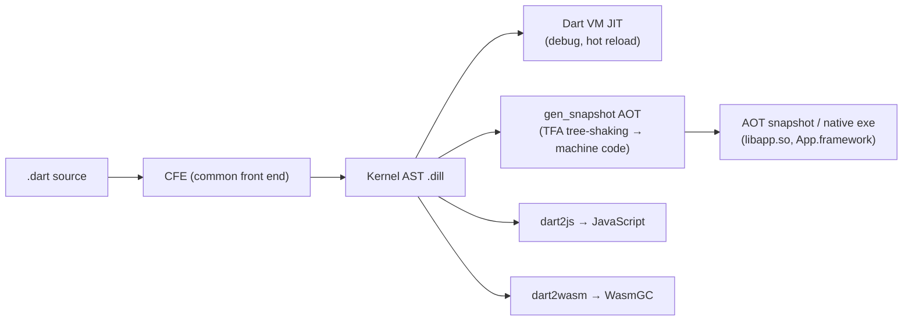

# Dart - VM, Compilation & Garbage Collection

> [!info] Deep dive of [[Dart]]

> [!abstract] TL;DR
> - **One language, several back ends**:
>   - **JIT** on the Dart VM for development (hot reload, fast edit-compile cycle).
>   - **AOT** to native machine code for release (Flutter mobile/desktop, `dart compile exe`).
>   - **dart2js / dart2wasm** for the web.
> - **Memory**: each isolate group owns a heap with a **generational GC**. Young objects live in a **new space** collected by a fast parallel *scavenger* (copying). Survivors are promoted to an **old space** collected by **concurrent mark-sweep/compact**.
> - **Flutter**: the engine schedules GC work into idle time between frames, which is why allocation-heavy `build()` methods cause jank only when they outrun that budget.

## Concept

### Compilation pipeline


| Mode | Used by | Startup | Peak perf | Hot reload | Notes |
|---|---|---|---|---|---|
| **JIT** (Kernel → VM) | `dart run`, Flutter debug | Slow-ish (compile on demand) | Good after warm-up (optimizing compiler, deopt) | **Yes** | Asserts on, Observatory/VM service enabled |
| **AOT** | Flutter profile/release, `dart compile exe`/`aot-snapshot` | **Fast** (precompiled) | Predictable, no warm-up | No | Required on iOS (no JIT allowed). Type-flow analysis (TFA) tree-shakes unused code |
| **JIT snapshot** | `dart compile jit-snapshot` | Faster than plain JIT | Same as JIT | No | Training run stores compiled code for CLI tools |
| **dart2js** | Flutter web (default), Dart web | n/a | Good | Web hot reload (3.8+) | Minified, `-O2`..`-O4` |
| **dart2wasm** | Flutter web `--wasm` | Faster than JS for heavy UI | Better than JS on Chromium | — | Needs WasmGC (Chrome 119+, Firefox 120+, Safari 18.2+). Falls back to JS |

### Flutter build modes
| Mode | Compiler | Asserts | DevTools | Use for |
|---|---|---|---|---|
| Debug | JIT | On | Full | Development, hot reload |
| **Profile** | AOT | Off | Performance + memory tools | **All performance measurement** |
| Release | AOT, obfuscation optional | Off | None | Store builds |

> [!warning] Never measure performance in debug mode
> Debug runs JIT with asserts and extra checks. It's routinely 5–10× slower than release, so jank in debug says little about production. Use `flutter run --profile` on a **real device**.

### Hot reload vs hot restart
- **Hot reload**: the frontend compiles only changed libraries to an incremental Kernel delta. The VM reloads them into the running isolate, keeps heap state, and Flutter calls `reassemble()` and rebuilds. Limits: changes to `main()`, global/static initializers, enum↔class conversions, and generic type parameter changes need a restart.
- **Hot restart**: recompiles and restarts the isolate, losing state. Faster than a cold launch because the native side stays alive.

## How It Works

### Heap layout and generational GC
| Space | Holds | Collector | Pause characteristics |
|---|---|---|---|
| **New space** (nursery) | Freshly allocated objects (bump-pointer allocation via TLABs) | **Parallel scavenger**: semi-space copying (Cheney-style). Live objects are copied to to-space; garbage is never touched | Short stop-the-world pauses, cost ∝ **live** objects, not garbage |
| **Old space** | Objects that survived ~2 scavenges, large objects | **Mark-sweep**, with **concurrent marking** and **incremental/parallel** phases; **mark-compact** when fragmentation is high | Most marking runs alongside the mutator. Short final pauses |
| Code / read-only | AOT instructions, constants | Not collected (snapshot data) | — |

- **Generational hypothesis**: most Dart objects (widgets, closures, short-lived lists in `build()`) die young. Scavenging them is cheap, so idiomatic Flutter code that allocates many immutable widgets per frame is fine.
- **Write barriers** track old→new pointers (remembered set) so a scavenge doesn't scan the whole old space, and track pointer stores during concurrent marking.
- **Isolate groups** (Dart 2.15+): isolates spawned from the same code share one heap and GC. That makes `Isolate.spawn` cheap (no re-loading code) and enables `Isolate.exit()` to hand a result to another isolate **without copying**. Isolates still can't share mutable objects; the shared heap is an implementation detail.
- **Idle-time GC**: Flutter's engine calls `Dart_NotifyIdle` with a deadline when a frame finishes early. The VM uses that slack to run scavenges and finish marking, pushing GC out of the critical path.

### What the GC can't fix
- **Reachability leaks**: anything still referenced is live. Typical Flutter chain: a global stream/controller → listener closure → `State` → `BuildContext` → whole widget subtree. See [[Dart - Async, Streams & Isolates]] for the subscription leak pattern.
- **Native memory** (images, `dart:ffi` allocations, platform textures) is outside the Dart heap. `Image` objects, `ui.Picture`, and decoded bitmaps need explicit `dispose()`. Use `NativeFinalizer` for FFI handles.

### Weak references and finalizers
```dart
final cache = Expando<Metrics>();             // weak-keyed side table: entry dies with the key
final ref = WeakReference(largeObject);       // 2.17+: ref.target becomes null after GC
final fin = Finalizer<String>((token) => log('collected $token'));
fin.attach(resource, 'res-42', detach: resource);
// Finalizer callbacks are best-effort: may run late or never (e.g. on exit). Never rely on them for correctness.
```

## Practical Usage

### Compile commands
```bash
dart compile exe bin/server.dart -o build/server          # self-contained native binary (AOT + runtime)
dart compile aot-snapshot bin/server.dart                  # run with dartaotruntime
dart compile kernel bin/tool.dart                          # portable .dill
dart compile js -O2 web/main.dart -o build/main.js
dart compile wasm web/main.dart -o build/main.wasm

flutter build apk --release --obfuscate --split-debug-info=build/symbols
flutter build ipa --release --obfuscate --split-debug-info=build/symbols
flutter build web --wasm                                   # dart2wasm with JS fallback
```
- `--split-debug-info` strips symbols from the binary (smaller app). Keep `build/symbols/` per release so you can run `flutter symbolize` on crash stacks. Losing it means unreadable production stack traces.
- `--obfuscate` renames identifiers. It's light deterrence, not security: secrets in the binary are still extractable.

### Observing GC and memory
```bash
flutter run --profile                      # then open DevTools → Memory
dart --observe bin/server.dart             # VM service for DevTools on a CLI/server process
dart run --enable-asserts --pause-isolates-on-exit bin/tool.dart
```
- **DevTools Memory**: heap chart with GC markers, **diff snapshots** (take snapshot → do action → back out → snapshot, then compare retained classes), allocation tracing per class, and retaining paths.
- **leak_tracker** (bundled with the Flutter test framework): flags disposables that weren't disposed and objects that weren't GC'd after disposal:
```dart
testWidgets('orders page does not leak', experimentalLeakTesting: LeakTesting.settings.withTrackedAll(), (tester) async {
  await tester.pumpWidget(const MaterialApp(home: OrdersPage(tenantId: 't1')));
  await tester.pumpWidget(const SizedBox());   // unmount → leaks reported at test end
});
```

### Dart on the server
- AOT `exe` produces a ~5–10 MB binary that starts in milliseconds, fits a `FROM scratch`/distroless [[Docker]] image (copy `/runtime/` from `dart:stable` for libc), and suits Cloud Run or a [[Coolify]] container.
- One isolate is one thread of Dart execution. Use several isolates (or several containers) to use multiple cores.

## Patterns & Anti-patterns
| Pattern | When | Anti-pattern to avoid |
|---|---|---|
| Profile on a physical device in `--profile` | Any perf/memory question | Judging speed from debug or simulator |
| `const` widgets, small `build()` methods | Hot UI paths | Allocating big lists/maps/regexes per frame in `build()` |
| Dispose controllers, subscriptions, `ui.Image`, tickers | Every `State` | Relying on GC/finalizers for native resources |
| Diff heap snapshots after navigating away | Suspected leaks | Watching total RSS only (engine caches inflate it) |
| `Isolate.run` for >~16 ms CPU work | JSON parse of big payloads, crypto, image ops | Heavy sync work on the UI isolate |
| Keep `--split-debug-info` symbols per build | Release pipelines | Shipping obfuscated builds without symbols |

## Performance & Trade-offs
- **JIT vs AOT**: JIT can specialize on runtime types (and deoptimize), but costs warm-up and memory. AOT is predictable and starts fast, which is why mobile release builds always use it.
- **Allocation is cheap, retention is expensive**: bump allocation plus scavenging means short-lived garbage is nearly free. Large long-lived caches (image cache, lists of models) grow old space and make major GCs costlier.
- **Copy vs transfer between isolates**: `SendPort.send` deep-copies mutable data (cost ∝ size). `Isolate.exit` and `TransferableTypedData` avoid the copy for big results.
- **Web**: dart2wasm beats dart2js on compute-heavy Flutter UIs but requires WasmGC browsers and adds download size. Measure both.

## Tips & Reminders
> [!tip]
> - Flutter's `ImageCache` defaults to 1000 images / 100 MB. Lower `PaintingBinding.instance.imageCache.maximumSizeBytes` on low-RAM Android devices and use `cacheWidth`/`cacheHeight` to decode thumbnails at display size.
> - "Memory grows then drops" in DevTools is healthy GC. A **staircase that never drops after navigating back** is a leak.
> - `debugPrint`/`print` of huge objects in a loop allocates strings and can itself cause jank. Strip logging in release.
> - **In ZP's stack**: for Flutter apps backed by [[Supabase]] realtime, the usual leak is an un-cancelled channel/stream subscription in a `State`. Prefer auto-disposed Riverpod `StreamProvider`s ([[Flutter - State Management]]). For Dart CLI or worker tooling, `dart compile exe` + a distroless image on Coolify is the leanest deploy.

## Version Notes
| Version | Change |
|---|---|
| 2.6 (2019) | `dart2native`: AOT native executables |
| 2.12 (2021) | Sound null safety lets AOT drop null checks |
| 2.15 (2021-12) | **Isolate groups** (shared heap/code), `Isolate.exit` zero-copy result |
| 2.17 | `Finalizer`, `WeakReference`, `NativeFinalizer` |
| 3.0 (2023-05) | Only sound null-safe code: no more mixed-mode runtime checks |
| 3.3–3.4 | dart2wasm stable for Flutter web (`--wasm`) |
| 3.8 | Web hot reload (experimental, then default in Flutter 3.35) |
| 3.13 | Current stable (2026-10) |

> [!warning] Unverified — check before relying on this
> GC internals (scavenger promotion thresholds, compaction triggers) are VM implementation details and change without language-version notice. Treat numbers here as orientation, not contract.

## Critical Issues & Gotchas
> [!danger] iOS forbids JIT
> Apple disallows runtime code generation, so iOS debug builds on a physical device rely on special entitlements (debug-only), and release must be AOT. iOS 26 tightened debug-mode JIT on device, so check Flutter's iOS 26 guidance if hot reload breaks on real iPhones. Any plugin or approach that needs `eval`-style code loading is not shippable to the App Store.

> [!danger] Lost debug symbols = blind production crashes
> With `--obfuscate --split-debug-info`, Crashlytics/Sentry stack traces are useless unless you upload the matching `symbols` for that exact build. Automate the upload in CI per release.

> [!warning] Gotchas
> - `identical()` on numbers/strings across isolates and AOT vs JIT can differ (canonicalization is an implementation detail). Use `==`.
> - Static and global variables are **per isolate**. A singleton initialized in the UI isolate is a fresh, empty instance inside `Isolate.run`.
> - Closures capture their whole enclosing scope, so a closure sent to an isolate may drag along (and fail on) unsendable objects like `Socket` or `ReceivePort`.
> - Huge single allocations (e.g. a 200 MB `Uint8List`) go straight to old space and can OOM-kill on low-end Android. Stream large files in chunks.
> - Profile mode disables some debug-only tracking, so certain leak_tracker checks only run in tests or debug.

## Related
- [[Dart]]
- [[Dart - Async, Streams & Isolates]] — isolates, ports, subscription leaks
- [[Flutter - Performance & DevTools]] — jank, frame budget, memory view
- [[Flutter - Rendering & Widget Lifecycle]] — why per-frame widget allocation is cheap
- [[Flutter - Interview Questions]] — Q6 (JIT/AOT, GC) outline

## References
- Dart VM / runtime overview: https://dart.dev/overview#platform
- `dart compile`: https://dart.dev/tools/dart-compile
- Dart VM GC design notes: https://github.com/dart-lang/sdk/blob/main/runtime/docs/gc.md
- Flutter build modes: https://docs.flutter.dev/testing/build-modes
- DevTools Memory view: https://docs.flutter.dev/tools/devtools/memory
- leak_tracker: https://github.com/dart-lang/leak_tracker
- Flutter web Wasm: https://docs.flutter.dev/platform-integration/web/wasm
