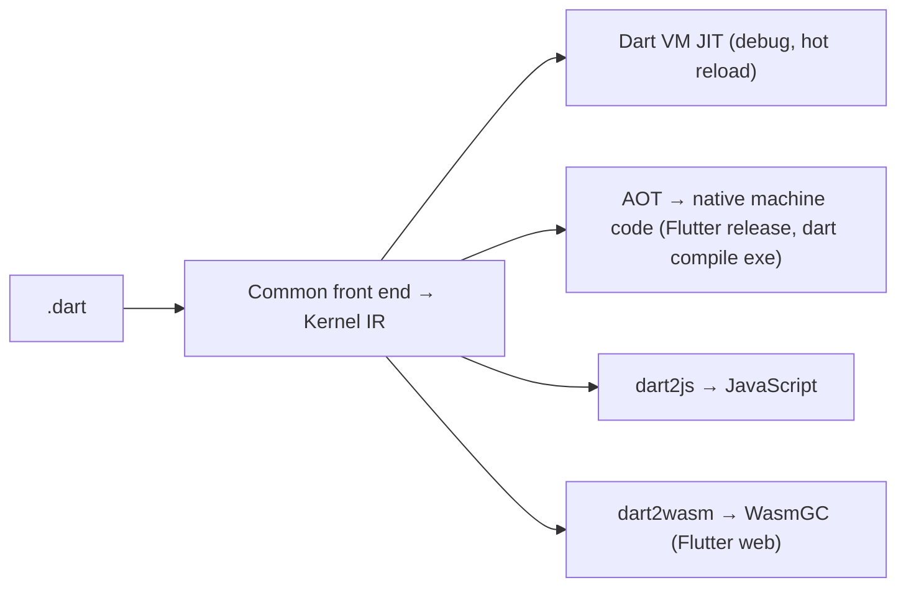

# Dart

> [!abstract] TL;DR
> Dart is Google's client-optimized, statically typed language with **sound null safety**, compiling to **native code (AOT)**, **JIT with hot reload** for development, **JavaScript** and **WebAssembly**. It exists mainly to power [[Flutter]], and it's pleasant: class-based OOP with records, patterns, sealed classes, extension types, async/await and isolates. Learn it well enough to write idiomatic Flutter. The language features that make Flutter code maintainable are null safety, sealed classes + switch expressions, and immutability via `freezed` or records. Dart on the server exists (Serverpod, Dart Frog) but is niche.

## Introduction
- Announced by Google in 2011 (Lars Bak, Kasper Lund), originally intended to replace JavaScript in browsers. It was reborn as Flutter's language. BSD-3 license.
- **Dart 3.0 (May 2023)** made null safety mandatory and added records, patterns and class modifiers.
- **Release cadence**: tied to Flutter's quarterly stable releases in 2026 (3.11 Feb, 3.12 May, 3.13 Aug). The macros feature was cancelled in Jan 2025, and the focus moved to build_runner improvements and augmentations.
- Where it sits: Flutter apps (mobile, web, desktop), CLI tools (`dart compile exe`), some backends (Serverpod, Dart Frog, Shelf).

## Core Concepts

### Sound null safety & types
```dart
String greet(String? name) => 'Hi ${name ?? 'there'}';   // String? may be null; String may not
late final Database db;                                     // initialized before first use (runtime-checked)
final ids = <int>[1, 2, 3];                                 // type inference with generic literal
```
- Non-nullable by default. The compiler guarantees no null dereference on non-nullable types (soundness), which also enables optimizations.

### Records, patterns & sealed classes
```dart
sealed class PaymentResult {}
class Paid extends PaymentResult { Paid(this.receiptUrl); final String receiptUrl; }
class Failed extends PaymentResult { Failed(this.reason); final String reason; }
class Pending extends PaymentResult {}

String label(PaymentResult r) => switch (r) {              // exhaustive: compiler errors if a subclass is unhandled
  Paid(:final receiptUrl) => 'Paid ($receiptUrl)',
  Failed(:final reason)   => 'Failed: $reason',
  Pending()               => 'Pending',
};

(int, String) parse(String s) => (int.parse(s.split(':')[0]), s.split(':')[1]);   // records
final (code, msg) = parse('404:Not found');                                       // destructuring
```

### Class modifiers & extension types
- `final`, `base`, `interface`, `sealed`, `mixin class` control how classes can be extended or implemented outside their library.
- **Extension types** (3.3) are zero-cost wrappers for type safety (`extension type OrderId(String value) {}`), like TypeScript branded types.
- **Dot shorthands** (3.10): `Alignment.center` → `.center` where the type is known.

### Async & isolates
```dart
Future<List<Order>> loadOrders() async {
  final rows = await supabase.from('orders').select().limit(50);
  return rows.map(Order.fromJson).toList();
}

Stream<int> ticks() async* { var i = 0; while (true) { await Future.delayed(const Duration(seconds: 1)); yield i++; } }

final parsed = await Isolate.run(() => parseHugeJson(raw));   // CPU work off the UI isolate
```
- **Single-threaded event loop per isolate** (microtasks + events, like [[JavaScript - Event Loop & Async|JS]]). **Isolates** are separate memory heaps communicating by messages, which gives true parallelism without shared-state races.

## Architecture / How It Works



- **JIT for development** enables sub-second hot reload with state preserved. **AOT for release** gives fast startup and predictable performance (no JIT warm-up).
- **Memory**: generational GC per isolate (fast young-gen scavenges suit Flutter's many short-lived widget objects).
- **Packages**: `pubspec.yaml` + `pub get` from pub.dev (verified publishers, scores). `pubspec.lock` should be committed for apps.
- **Code generation** (build_runner) powers `freezed`, `json_serializable` and `riverpod_generator` (`dart run build_runner build -d`).

## Project Structure
```text
dart_cli/
├── pubspec.yaml            # name, sdk constraint (^3.13.0), dependencies
├── pubspec.lock
├── analysis_options.yaml   # include: package:lints/recommended.yaml (+ strict casts/inference)
├── bin/main.dart           # entrypoint → dart compile exe bin/main.dart
├── lib/src/…               # implementation
└── test/…                  # package:test
```
```yaml
# analysis_options.yaml — stricter defaults
include: package:very_good_analysis/analysis_options.yaml
analyzer:
  language: { strict-casts: true, strict-inference: true, strict-raw-types: true }
```

## Use Cases
| Use case | Why it fits |
|---|---|
| [[Flutter]] apps | The only first-class language for Flutter |
| CLI tools | `dart compile exe` produces single native binaries |
| Shared models between Flutter app and Dart backend | Serverpod / Dart Frog share types end to end |
| Web via Flutter (Wasm) | Same code for app + web dashboard (non-SEO) |

## Pros & Cons
| Pros | Cons |
|---|---|
| Sound null safety, modern pattern matching, sealed types | Small ecosystem outside Flutter |
| JIT hot reload + AOT performance | Codegen (build_runner) adds friction since macros were cancelled |
| Familiar syntax (Java/C#/TS developers adapt quickly) | Server-side Dart is niche: fewer libraries, small hiring pool |
| Excellent tooling (analyzer, formatter, DevTools) | Google-dependent roadmap |

## Alternatives & Peers
| Alternative | Strength vs Dart | Weakness vs Dart | Pick it when… |
|---|---|---|---|
| [[TypeScript]] | Huge ecosystem, web-native, React Native | Unsound types, runtime erasure | Web-first teams, RN apps |
| [[Kotlin]] | Android-native, KMP, JVM ecosystem | iOS story via KMP still maturing | Android-centric products |
| [[Swift]] | iOS-native, best Apple integration | Apple platforms only (mostly) | iOS-only apps |
| [[Go]] | Server/CLI performance, simple concurrency | No UI framework | Backend services alongside a Flutter app |

## Tips & Reminders
> [!tip]
> - Model state and results with **sealed classes + switch expressions**, so the compiler catches unhandled cases (great for API result and UI state types).
> - Use extension types for IDs (`OrderId`, `TenantId`) to avoid mixing strings.
> - Prefer `final` everywhere, and immutable models (`freezed` or plain classes with `const` constructors and `copyWith`).
> - Money: integer sen (`int`), never `double`.
> - **In ZP's stack**: generate Dart models from your [[Supabase]] schema, or share JSON Schema/OpenAPI with the Next.js side to keep contracts aligned. Keep business rules server-side (RLS / Edge Functions), not only in Dart.

## Versions & Breaking Changes
| Version | Released | Key changes | Breaking / migration notes |
|---|---|---|---|
| 2.12 | 2021-03 | Sound null safety (opt-in) | Migration tool |
| **3.0** | 2023-05 | Null safety mandatory, records, patterns, class modifiers | Non-null-safe code no longer compiles |
| 3.3 | 2024-02 | Extension types, Wasm (dart2wasm) | — |
| 3.6–3.8 | 2024-12 → 2025-05 | Digit separators, wildcard `_` variables, new formatter (tall style), null-aware elements | Formatter output changes (run `dart format`) |
| 3.10 | 2025-11 | Dot shorthands | — |
| 3.11 → **3.13** | 2026-02 → 2026-08 | Quarterly releases with Flutter 3.41 → 3.47 | Check the per-release changelog |

> [!warning] Unverified — check before relying on this
> The language features added in 3.11–3.13 weren't verified this run. See https://dart.dev/resources/language/evolution and the SDK changelog.

## Critical Issues & Gotchas
> [!danger] pub.dev supply chain
> Typosquatted or abandoned packages and compromised maintainer accounts are risks, as on npm and PyPI. Prefer verified publishers and well-scored packages. Pin via the committed `pubspec.lock`, review native code in plugins (Kotlin/Swift side), and avoid packages pulling unnecessary permissions.

> [!warning] Gotchas
> - `late` variables throw at runtime if read before assignment, so they defeat null safety when overused.
> - `==` on classes is identity by default. Implement `==`/`hashCode` (or use records/freezed) for value equality.
> - Futures not awaited swallow errors silently (lint: `unawaited_futures`, `discarded_futures`).
> - `dynamic` from `jsonDecode` spreads untyped data. Parse into typed models immediately.
> - Isolates can't share mutable objects. Large data copies between isolates cost time (use `TransferableTypedData`).

## Deep Dives
- [[Dart - Async, Streams & Isolates]]
- (planned) [[Dart - Type System, Null Safety & Mixins]]
- (planned) [[Dart - VM, Compilation & Garbage Collection]]
- Interview prep: [[Flutter - Interview Questions]]

## Related
- [[Flutter]] — primary use of Dart
- [[TypeScript]] · [[Kotlin]] · [[Swift]] — peer client languages
- [[JavaScript - Event Loop & Async]] — similar event-loop model

## References
- Dart docs: https://dart.dev/guides
- Language evolution: https://dart.dev/resources/language/evolution
- Patterns & sealed classes: https://dart.dev/language/patterns
- Dart 3.10 announcement (with Flutter 3.38): https://blog.flutter.dev/announcing-flutter-3-38-dart-3-10-building-the-future-of-apps-503429eeb685
