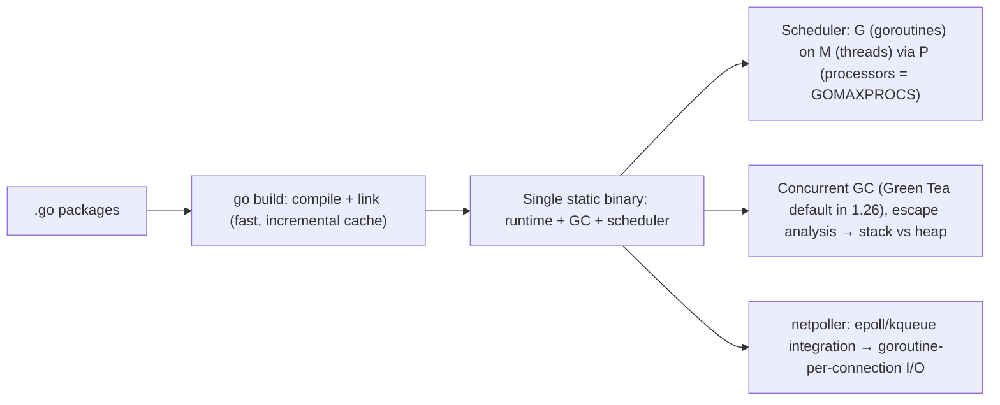

# Go

> [!abstract] TL;DR
> Go is a small, statically typed, garbage-collected language from Google, built for **network services and infrastructure tooling**. Its hallmarks:
> - fast compiles,
> - a **single static binary**,
> - **goroutines + channels** for cheap concurrency,
> - a strong standard library (`net/http`, `crypto`, `encoding/json`),
> - a strict compatibility promise (Go 1).
>
> Much of the cloud-native stack is written in it: [[Docker]], [[Kubernetes]], [[Traefik]], Terraform, Prometheus, Coolify's Sentinel agent. Pick it for APIs, workers, proxies and CLIs where predictable performance, low memory and simple deployment matter more than expressiveness.

## Introduction
- Designed by Robert Griesemer, Rob Pike and Ken Thompson at Google. Public in 2009, Go 1.0 in 2012. BSD-3 license.
- **Go 1 compatibility promise**: code written for Go 1.x keeps compiling. Toolchain management (`go` + `toolchain` lines in `go.mod`, 1.21+) handles upgrades.
- **Release cadence**: twice a year (Feb, Aug). The two most recent releases are supported.
- Where it sits: backend services and infra. It's the language of DevOps tooling, increasingly used for AI infrastructure (gateways, proxies, vector DB components), with a growing set of LLM SDKs (official Anthropic and OpenAI Go SDKs).

## Core Concepts

### Language essentials
```go
type Order struct {
    ID       string `json:"id"`
    TotalSen int64  `json:"total_sen"`
    Status   string `json:"status"`
}

type OrderStore interface {                 // implicit interfaces: any type with these methods satisfies it
    Get(ctx context.Context, id string) (Order, error)
}

func PaidTotal(orders []Order) (sum int64) {
    for _, o := range orders {
        if o.Status == "paid" { sum += o.TotalSen }
    }
    return
}

func Map[T, U any](xs []T, f func(T) U) []U { // generics (1.18+)
    out := make([]U, 0, len(xs))
    for _, x := range xs { out = append(out, f(x)) }
    return out
}
```
- **Errors are values**: `if err != nil { return fmt.Errorf("load order %s: %w", id, err) }`. Use `errors.Is/As` (and the generic `errors.AsType`, 1.26) to inspect wrapped errors.
- **Composition over inheritance**: struct embedding, small interfaces (`io.Reader`).
- **Zero values** are usable (`var mu sync.Mutex`, empty slices/maps semantics). `nil` maps panic on write.
- **Iterators**: range-over-func (1.23) for custom sequences (`iter.Seq[T]`).

### Concurrency
```go
func FetchAll(ctx context.Context, ids []string, s OrderStore) ([]Order, error) {
    g, ctx := errgroup.WithContext(ctx)
    g.SetLimit(10)                                   // bounded concurrency
    out := make([]Order, len(ids))
    for i, id := range ids {
        g.Go(func() error {                          // per-iteration loop vars (1.22+)
            o, err := s.Get(ctx, id)
            out[i] = o
            return err
        })
    }
    return out, g.Wait()                             // first error cancels ctx for the rest
}
```
- **Goroutines**: ~2 KB initial stacks, M:N scheduled onto OS threads (`GOMAXPROCS`, container-aware since 1.25). Hundreds of thousands are fine.
- **Channels** for communication/pipelines. **`sync`** (Mutex, WaitGroup, Once) for shared state. **`context.Context`** for cancellation/deadlines, passed as the first argument everywhere.

## Architecture / How It Works



- **Compilation**: ahead-of-time to native code. Cross-compile with `GOOS=linux GOARCH=arm64 go build`. `CGO_ENABLED=0` gives fully static binaries for `scratch`/distroless images.
- **GC**: concurrent, low-latency (sub-millisecond pauses). Tune with `GOGC` and `GOMEMLIMIT` (a soft memory limit, important in containers). The **Green Tea** GC (default in 1.26) improves throughput for allocation-heavy workloads.
- **Escape analysis** keeps values on the stack when possible. Fewer heap allocations means less GC work (`go build -gcflags=-m` shows the decisions).
- **Modules**: `go.mod` / `go.sum`, fetched via the module proxy (`proxy.golang.org`) and checked against the checksum DB (`sum.golang.org`).

## Project Structure
```text
orders-api/
├── go.mod                 # module path, go version, toolchain, tool directives (1.24+)
├── go.sum
├── cmd/api/main.go        # wiring: config, DB pool, router, graceful shutdown
├── internal/              # not importable by other modules
│   ├── orders/            # domain: handlers, service, store (pgx)
│   └── platform/          # db, http middleware, logging (slog)
├── migrations/
└── Dockerfile             # multi-stage → distroless/static
```
```go
// Graceful shutdown pattern
srv := &http.Server{Addr: ":8080", Handler: mux, ReadHeaderTimeout: 5 * time.Second}
go func() { _ = srv.ListenAndServe() }()
ctx, stop := signal.NotifyContext(context.Background(), os.Interrupt, syscall.SIGTERM)
defer stop(); <-ctx.Done()
shutdownCtx, cancel := context.WithTimeout(context.Background(), 20*time.Second); defer cancel()
_ = srv.Shutdown(shutdownCtx)
```

## Use Cases
| Use case | Why it fits |
|---|---|
| HTTP/gRPC APIs and microservices | Stdlib `net/http` (pattern routing since 1.22), low latency, low memory |
| Infra tooling, CLIs, agents | Single binary, cross-compilation, fast startup |
| Proxies, gateways, webhooks fan-in | Goroutine-per-connection model + netpoller |
| Background workers / queue consumers | Simple concurrency with context cancellation |
| Kubernetes operators/controllers | client-go, controller-runtime ecosystem |
| WhatsApp/webhook ingestion at high volume | Cheap concurrency, predictable memory |

## Pros & Cons
| Pros | Cons |
|---|---|
| Simple language, fast to learn and read | Verbose error handling, less expressive than TS/Python/Rust |
| Single static binary, tiny containers (~10–30 MB) | Smaller AI/data ecosystem than Python |
| Excellent concurrency primitives + stdlib | Generics are limited compared with TS/Rust |
| Fast compiles, great tooling (`go test`, `go vet`, pprof, race detector) | GC (though low-latency) vs Rust's zero-cost memory |
| Strong backward compatibility | Nil pointer/map panics, interface nil gotchas |

## Alternatives & Peers
| Alternative | Strength vs Go | Weakness vs Go | Pick it when… |
|---|---|---|---|
| [[TypeScript]] ([[Node.js]]) | Shared language with the frontend, huge npm ecosystem | Single-threaded, higher memory, `node_modules` | Full-stack Next.js teams |
| [[Python]] | AI/data ecosystem, faster prototyping | Slower, GIL/async complexity, heavier deploys | AI agents, data pipelines |
| [[Rust]] | No GC, max performance, stronger type system | Steep learning curve, slower compiles | Latency-critical, embedded, systems code |
| [[Java]] / [[Kotlin]] | Mature enterprise ecosystem, powerful JIT | Heavier runtime, more ceremony | Large enterprise backends |
| Elixir | Fault tolerance (BEAM), real-time | Smaller hiring pool | Massive concurrent connections, soft real-time |

## Tips & Reminders
> [!tip] Defaults that age well
> - `context.Context` first arg on every I/O function. Respect cancellation. Set timeouts on HTTP clients and servers (`ReadHeaderTimeout`).
> - Run `go vet`, `staticcheck`/`golangci-lint`, `govulncheck` and `go test -race` in CI.
> - Structured logging with `log/slog` (stdlib since 1.21).
> - Set `GOMEMLIMIT` to ~80–90% of the container memory limit to avoid OOM kills.
> - Postgres: `pgx` (pool via `pgxpool`). Redis: `go-redis`. HTTP routing: stdlib `http.ServeMux` patterns (1.22+) cover most needs.

> [!tip] In ZP's stack
> - Go is a good fit for a **high-throughput WhatsApp webhook gateway** or a custom **Chatwoot replacement core** (WebSocket fan-out + Redis Streams). That's where Node's single thread or Python's overhead would hurt.
> - Builds produce a ~15 MB distroless image that deploys fast on [[Coolify]].
> - Keep AI agent logic in Python/TS (better SDK/framework support) and let Go handle transport, routing and fan-out.

## Versions & Breaking Changes
| Version | Released | Key changes | Breaking / migration notes |
|---|---|---|---|
| 1.18 | 2022-03 | Generics, fuzzing, workspaces | — |
| 1.21 | 2023-08 | `min/max/clear` builtins, `log/slog`, `slices`/`maps`, toolchain management | — |
| 1.22 | 2024-02 | **Per-iteration loop variables**, range over int, `ServeMux` method/wildcard patterns | Loop-variable semantics change (fixes the closure bug). Gated by `go.mod` version |
| 1.23 | 2024-08 | Range-over-func iterators, `iter` package, timer changes | Timer/Ticker GC and channel semantics changed |
| 1.24 | 2025-02 | Generic type aliases, Swiss-table maps, `tool` directives in `go.mod`, `os.Root`, FIPS 140-3 mode | — |
| 1.25 | 2025-08 | Container-aware `GOMAXPROCS`, Green Tea GC (experiment), `encoding/json/v2` (experiment), `testing/synctest` | Containers may get a lower default `GOMAXPROCS` than before |
| 1.26 | 2026-02 | `new(expr)`, self-referential generic types, **Green Tea GC default**, `errors.AsType`, `slog.MultiHandler` | GC behaviour change. Benchmark memory-sensitive services |
| **1.27** | 2026-08-19 | Generic methods, `crypto/mldsa` (FIPS 204 PQ signatures), `encoding/json/v2` without a flag, allocator speedups | Review json/v2 behaviour differences before switching |

> [!warning] Unverified — check before relying on this
> The Go 1.27 feature list comes from secondary sources (news and blog posts). Confirm against the official release notes at https://go.dev/doc/go1.27 before relying on generic methods or json/v2 defaults.

## Critical Issues & Gotchas
> [!danger] Module supply-chain attacks
> - **Typosquatted `boltdb-go`** (Socket, Feb 2025): a backdoored module stayed available for ~3 years, because the module proxy caches content permanently.
> - Malicious modules delivering disk wipers and loaders were found later in 2025.
>
> Verify module paths carefully, pin versions, run `govulncheck`, and prefer well-known maintainers.

> [!danger] Goroutine leaks
> Goroutines blocked forever on a channel or network call, with no context cancellation, leak memory until OOM. Every goroutine needs a clear exit path (context, closed channel, timeout). Watch `runtime.NumGoroutine` and pprof goroutine dumps.

> [!warning] Footguns
> - Writing to a `nil` map panics. A data race on maps crashes the process (`concurrent map writes`). Use `sync.Mutex`/`sync.Map`.
> - An interface holding a typed nil pointer is **not** `== nil`.
> - `defer` inside loops accumulates until the function returns (file handle exhaustion).
> - Default `http.Client` has **no timeout**. Always set `Timeout` or use context deadlines.
> - Slices share backing arrays: `append` after slicing can overwrite the caller's data.

## Deep Dives
- (planned) [[Go - Concurrency]]

## Related
- [[Python]] · [[TypeScript]] — peer languages
- [[Docker]] · [[Kubernetes]] · [[Traefik]] — Go-based infrastructure
- [[WebSocket]] · [[Redis]] — high-concurrency services in Go
- [[PostgreSQL]] — `pgx` driver

## References
- Docs: https://go.dev/doc/
- Release history: https://go.dev/doc/devel/release
- Go 1.26 release notes: https://go.dev/doc/go1.26
- Go 1.27 overview (JetBrains): https://blog.jetbrains.com/go/2026/08/20/ready-for-go-1-27-on-day-one/
- Effective Go: https://go.dev/doc/effective_go
- govulncheck: https://go.dev/doc/security/vuln/
