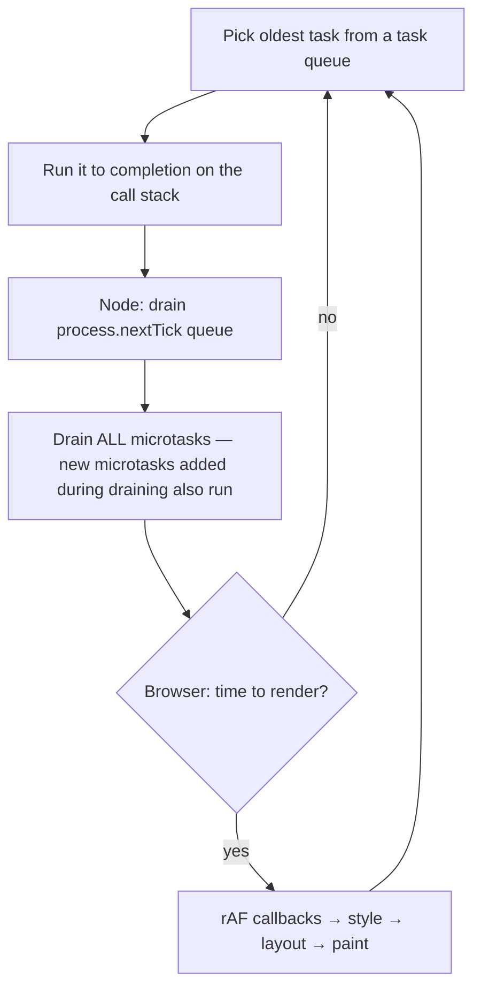

# JavaScript - Event Loop & Async

> [!info] Deep dive of [[JavaScript]]

> [!abstract] TL;DR
> JS runs your code on **one thread per realm**. Concurrency comes from the host (browser or Node/libuv) doing I/O in the background and queueing callbacks. The loop runs: one **task** → drain **all microtasks** (promise reactions, `await` continuations) → (browser) render → next task. Remember: **microtasks always run before the next timer, I/O callback or paint**, so a promise chain that keeps scheduling microtasks can starve everything else, and any CPU-heavy synchronous work blocks every request or frame.

## Concept
- **Call stack**: synchronous execution. Only one frame runs at a time.
- **Task (macrotask) queue(s)**: timers, I/O completion, UI events, `MessageChannel`, `setImmediate` (Node). One task per loop iteration.
- **Microtask queue**: `Promise.then/catch/finally` reactions, `await` resumptions, `queueMicrotask`, `MutationObserver`. **Drained completely** after each task (and after each callback in Node).
- **Node extra**: the `process.nextTick` queue runs **before** promise microtasks, after each callback.
- **Rendering (browser)**: `requestAnimationFrame` callbacks → style → layout → paint, typically every ~16.7 ms if the main thread is free.
- **Web Workers / `worker_threads`**: true parallelism with separate heaps. Communication via message passing (structured clone) or `SharedArrayBuffer` + `Atomics`.

## How It Works



**Node.js event loop phases (libuv)**:
1. **timers** (`setTimeout`/`setInterval` due)
2. **pending callbacks** (some deferred system errors)
3. **poll** (retrieve I/O events and run their callbacks; may block waiting for I/O)
4. **check** (`setImmediate`)
5. **close callbacks** (`socket.on("close")`)

Between every callback: `nextTick` queue, then microtasks. File system, DNS lookup, crypto and zlib run on the **libuv thread pool** (default 4 threads, `UV_THREADPOOL_SIZE`). Network sockets use OS async I/O (epoll/kqueue/IOCP).

**`await` desugaring**: `await x` = `Promise.resolve(x).then(resume)`. The rest of the async function becomes a microtask continuation. Code before the first `await` runs synchronously.

## Practical Usage

### Ordering puzzle
```js
console.log("1 sync");
setTimeout(() => console.log("6 timeout"), 0);
setImmediate?.(() => console.log("7 immediate"));       // Node only
Promise.resolve().then(() => console.log("4 promise"));
process.nextTick?.(() => console.log("3 nextTick"));    // Node only
(async () => { console.log("2 async start"); await null; console.log("5 after await"); })();
// Node: 1, 2, 3, 4, 5, 6/7 (timeout vs immediate order varies in main module; inside an I/O callback immediate wins)
```

### Concurrency patterns
```ts
// ✅ Parallel independent I/O
const [user, orders] = await Promise.all([getUser(id), getOrders(id)]);

// ✅ Partial failure tolerated
const results = await Promise.allSettled(urls.map(u => fetch(u, { signal: AbortSignal.timeout(5000) })));

// ✅ Bounded concurrency (don't fire 10k requests at once)
async function mapLimit<T, R>(items: T[], limit: number, fn: (t: T) => Promise<R>) {
  const out: R[] = new Array(items.length); let i = 0;
  await Promise.all(Array.from({ length: limit }, async () => {
    while (i < items.length) { const idx = i++; out[idx] = await fn(items[idx]); }
  }));
  return out;
}

// ❌ Sequential by accident
for (const id of ids) await sendWhatsApp(id);      // fine only if ordering/rate limits require it

// ❌ forEach doesn't await
ids.forEach(async id => await save(id));            // returns immediately; errors unhandled
```

### Cancellation & timeouts
```ts
const ac = new AbortController();
const t = setTimeout(() => ac.abort(new Error("timeout")), 8000);
try { const res = await fetch(url, { signal: ac.signal }); } finally { clearTimeout(t); }
// or simply: fetch(url, { signal: AbortSignal.timeout(8000) })
// combine: AbortSignal.any([userSignal, AbortSignal.timeout(8000)])
```

### Yielding to keep UIs and servers responsive
```ts
for (const chunk of chunks(bigArray, 500)) {
  process(chunk);
  await scheduler?.yield?.() ?? new Promise(r => setTimeout(r, 0));   // let input/paint/other requests run
}
```

### Errors
- Unhandled promise rejections **terminate Node** (default since v15). Always `await` or `.catch`. Add `process.on("unhandledRejection")` logging as a last resort, not as flow control.
- `try/catch` around an `await` catches the rejection. Around a promise that isn't awaited, it catches nothing.

## Patterns & Anti-patterns
| Pattern | When | Anti-pattern to avoid |
|---|---|---|
| `Promise.all` for independent I/O | Fetching multiple resources | Sequential `await` in a loop for independent calls |
| Bounded concurrency (`p-limit`, mapLimit) | Bulk API calls with rate limits | `Promise.all(10_000 requests)` → 429s, socket exhaustion |
| `AbortSignal.timeout` on every external call | Any network I/O | Hanging requests that hold resources forever |
| Offload CPU work to `worker_threads`/Web Workers | Image processing, PDF parsing, crypto | Big `JSON.parse`/sort on the main thread of a busy API |
| Queue + worker (BullMQ/[[Redis]]) | Slow or retryable jobs | Doing slow work inside the HTTP request |
| `for await…of` with async iterators/streams | Streaming large data | Buffering entire files/responses in memory |

## Performance & Trade-offs
- **Event loop lag** is the key Node health metric. Measure it with `perf_hooks.monitorEventLoopDelay()`. p99 > 50–100 ms means something is blocking.
- One CPU-bound request (e.g. 200 ms of sync JSON transform) delays **every** concurrent request by 200 ms.
- Microtasks are cheap, but deep promise chains allocate. Usually irrelevant compared with I/O.
- A libuv thread pool of 4 limits parallel `fs`/`crypto.pbkdf2`/`dns.lookup`. Raise `UV_THREADPOOL_SIZE` for heavy file/crypto workloads.
- Browser: tasks > 50 ms are "long tasks" that hurt **INP**. Break them up with `scheduler.yield()` or move them to workers.

## Tips & Reminders
> [!tip]
> - Mental model: "promises are microtasks, timers/I/O are tasks, and microtasks always cut the line."
> - `setTimeout(fn, 0)` is ≥ 1 ms, clamped to ≥ 4 ms after nesting in browsers, and throttled heavily in background tabs.
> - Use `structuredClone` / `postMessage` costs consciously when moving data to workers. Transfer `ArrayBuffer`s instead of copying.
> - **In ZP's stack**: [[n8n]] Code nodes run in task runners, but heavy loops there still delay that runner. Push bulk work to batch nodes or a worker service. In [[Next.js]] route handlers, never do CPU-heavy work inline. Enqueue it.

## Version Notes
| Version | Change |
|---|---|
| ES2015 | Promises standardized (job queue = microtasks) |
| ES2017 | `async/await` |
| ES2018 / ES2020 | `for await…of`, `Promise.allSettled` |
| ES2021 / ES2024 / ES2025 | `Promise.any`; `Promise.withResolvers`; `Promise.try` |
| ES2026 | `using` / `await using` (explicit resource management) for deterministic cleanup |
| Node 15 | Unhandled rejections crash the process by default |
| Node 18–22 | Global `fetch`, `AbortSignal.timeout`, `AbortSignal.any`, global `WebSocket` client (22) |
| Browsers 2024–25 | `scheduler.yield()` shipping (Chromium) |

## Critical Issues & Gotchas
> [!danger] Blocking the event loop = DoS
> ReDoS regexes, synchronous crypto (`pbkdf2Sync`), giant `JSON.parse` and sync FS calls in request handlers can freeze a Node server for every user. Cloudflare's 2019 outage was a regex hogging CPU at the edge. Use linear-time regexes, async APIs, input size limits and workers.

> [!danger] Lost errors and zombie work
> Fire-and-forget promises (`doThing();` without await) swallow errors or crash the process later. In serverless/edge runtimes, work scheduled after the response may never run unless you use `waitUntil`/`after()`.

> [!warning] Gotchas
> - Microtask starvation: a recursive `queueMicrotask`/promise loop never yields, so timers and rendering stop.
> - `await` inside `Array.prototype.map` returns an array of promises. You need `Promise.all`.
> - `async` functions always return promises: `if (isValid())` on an async function is always truthy.
> - `setInterval` drift and overlap: async work longer than the interval stacks up. Use recursive `setTimeout` after completion.

## Related
- [[JavaScript]]
- [[Node.js]] — libuv, worker_threads, streams
- [[React]] — concurrent rendering, transitions (scheduler)
- [[Browser & Web Fundamentals]] — rendering pipeline, INP
- [[Redis]] — offloading work to queues

## References
- HTML spec, event loops: https://html.spec.whatwg.org/multipage/webappapis.html#event-loops
- Node.js event loop guide: https://nodejs.org/en/learn/asynchronous-work/event-loop-timers-and-nexttick
- Jake Archibald, "Tasks, microtasks, queues and schedules": https://jakearchibald.com/2015/tasks-microtasks-queues-and-schedules/
- MDN `scheduler.yield()`: https://developer.mozilla.org/en-US/docs/Web/API/Scheduler/yield
