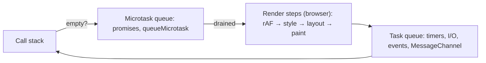

# JavaScript

> [!abstract] TL;DR
> JavaScript is the only language every browser runs natively and, through [[Node.js]]/Bun/Deno, a mainstream server language. It's dynamically typed, prototype-based, single-threaded per realm with an **event loop**, and standardized yearly as ECMAScript. ES2026 (Jun 2026) finally ships **Temporal** to replace `Date`. Write modern ESM, use [[TypeScript]] for anything non-trivial, and understand the event loop, because most production JS bugs are async-ordering or type-coercion bugs.

## Introduction
- Created by Brendan Eich at Netscape in 10 days (May 1995). Standardized by **Ecma TC39** as ECMA-262. Since ES2015 (ES6) there's a new edition every June.
- **TC39 process**: proposals move through Stage 0 → 1 → 2 → 2.7 → 3 → 4. Stage 4 means "ships in the next June edition". Engines often ship at Stage 3.
- **Engines**: V8 (Chrome, Node, Deno, Edge), SpiderMonkey (Firefox), JavaScriptCore (Safari, Bun).
- Where it sits: browser UI ([[React]], [[Next.js]]), servers and workers (Node), edge runtimes (Cloudflare Workers, Vercel Edge), automation ([[n8n]] Code node), mobile (React Native) and desktop (Electron).

## Core Concepts

### Types & coercion
- 7 primitives (`string`, `number`, `bigint`, `boolean`, `undefined`, `null`, `symbol`) + `object`. `typeof null === "object"` (legacy bug).
- `number` is IEEE-754 double. Integers are safe only to `2^53 - 1` (`Number.MAX_SAFE_INTEGER`). Use `bigint` for IDs/money in minor units beyond that, or strings.
- Always use `===`. `==` coerces (`"" == 0`, `null == undefined`, `[] == false` are all `true`).
- Money: never float math (`0.1 + 0.2 !== 0.3`). Store integer sen/cents, or use a decimal library.

### Scope, closures, `this`
```js
const counters = [];
for (let i = 0; i < 3; i++) counters.push(() => i);   // let: new binding per iteration → 0,1,2
// with var → 3,3,3 (single function-scoped binding)

const obj = { n: 1, m() { return () => this.n; } };    // arrow captures lexical this
obj.m()();                                             // 1
const f = obj.m; f();                                  // this is undefined in strict/ESM → TypeError on .n
```
- `let`/`const` are block-scoped with a TDZ. `var` is function-scoped and hoisted. ESM modules are always strict mode.
- `this` is decided by the **call site** (method call, `new`, `call/apply/bind`, arrow = lexical).

### Prototypes & classes
- `class` is syntax over prototype chains. `#private` fields are truly private (ES2022). Static blocks exist (ES2022).
- Property lookup walks `obj → Proto → Object.prototype → null`. Never mutate built-in prototypes in app code.

### Async model
```js
console.log("A");
setTimeout(() => console.log("timeout"), 0);
Promise.resolve().then(() => console.log("microtask"));
queueMicrotask(() => console.log("microtask 2"));
console.log("B");
// A, B, microtask, microtask 2, timeout
```
- **Microtasks** (promise reactions, `queueMicrotask`, `await` continuations) drain completely before the next **macrotask** (timers, I/O, messages).
- `async/await` is sugar over promises. Unhandled rejections crash Node (default since v15).
- Concurrency helpers: `Promise.all` (fail-fast), `allSettled`, `any`, `race`, `Promise.withResolvers` (ES2024), `Promise.try` (ES2025).

### Modules
```js
// ESM (standard) — static, async, strict, top-level await allowed
import { readFile } from "node:fs/promises";
import config from "./config.json" with { type: "json" };   // import attributes (ES2025)
export const load = async () => JSON.parse(await readFile("x.json", "utf8"));
```
- CommonJS (`require`) is Node legacy. Since Node 22.12/20.19, `require(esm)` works for synchronous ESM graphs, which ends most dual-package pain.

### Modern built-ins worth knowing
| Feature | Edition |
|---|---|
| `structuredClone`, `Array.prototype.at`, `Object.hasOwn` | ES2022 / platform |
| `toSorted`, `toReversed`, `toSpliced`, `with` (non-mutating arrays) | ES2023 |
| `Object.groupBy`, `Map.groupBy`, `Promise.withResolvers` | ES2024 |
| Iterator helpers (`.map/.filter/.take/.drop/.toArray` on iterators), Set methods (`union`, `intersection`, `difference`…), `RegExp.escape`, `Promise.try`, `Float16Array`, JSON modules | ES2025 |
| **Temporal**, `using`/`await using` (explicit resource management), `Error.isError`, `Math.sumPrecise`, `Uint8Array` base64/hex, `Array.fromAsync` | ES2026 (see warning below) |

```js
// Temporal — immutable, time-zone aware
const kch = Temporal.Now.zonedDateTimeISO("Asia/Kuching");
const due = kch.add({ months: 1 }).with({ day: 1 }).startOfDay();
due.toString();   // 2026-11-01T00:00:00+08:00[Asia/Kuching]
```

## Architecture / How It Works



- **Engine pipeline (V8)**: parse → **Ignition** bytecode interpreter → **Sparkplug** baseline → **Maglev** mid-tier → **TurboFan** optimizing JIT. Optimizations assume stable **hidden classes (shapes)**. Adding properties in different orders or `delete obj.x` deoptimizes hot code.
- **GC**: generational (young-gen scavenger, old-gen mark-compact, concurrent/incremental). Leaks are almost always reachable references: closures, global caches, listeners, timers.
- **Node**: V8 + **libuv** (event loop phases: timers → pending → poll → check (`setImmediate`) → close). File system, DNS and crypto run on a 4-thread pool (`UV_THREADPOOL_SIZE`). CPU-heavy work blocks every request, so offload to `worker_threads` or a queue.
- **Browser**: one main thread shared by JS, layout and paint. Long tasks (>50 ms) hurt INP. Use Web Workers / `scheduler.yield()`.

## Project Structure
```text
my-lib/
├── package.json        # "type": "module", "exports", "engines": { "node": ">=22" }
├── src/index.js
├── test/index.test.js  # node --test (built-in runner) or vitest
├── eslint.config.js    # flat config (ESLint 9+)
└── .nvmrc              # 24
```
```json
{
  "name": "my-lib",
  "type": "module",
  "exports": { ".": { "import": "./src/index.js", "types": "./dist/index.d.ts" } },
  "scripts": { "test": "node --test", "lint": "eslint ." },
  "engines": { "node": ">=22" }
}
```

## Use Cases
| Use case | Why it fits |
|---|---|
| Browser UI | Only native language of the web platform (with WASM as a complement) |
| APIs & real-time servers ([[Node.js]]) | Non-blocking I/O, huge npm ecosystem, shared code with the frontend |
| Edge functions (Cloudflare Workers) | V8 isolates start in ~ms with no cold container |
| Automation scripting ([[n8n]] Code node) | Inline data transforms between workflow nodes |
| Cross-platform apps (React Native, Electron) | One language across web, mobile and desktop |
| Tooling (bundlers, linters) | Now mostly rewritten in Rust/Go, but configured in JS |

## Pros & Cons
| Pros | Cons |
|---|---|
| Runs everywhere: browser, server, edge, mobile | Weak dynamic typing and coercion. Needs TS or discipline at scale |
| Largest package ecosystem (npm) | npm supply-chain attacks are frequent and severe |
| Excellent async I/O model | Single-threaded: CPU-bound work blocks the loop |
| Yearly, backward-compatible evolution ("don't break the web") | Legacy warts can never be removed (`typeof null`, `==`, `Date` months 0-based) |
| Fast JITs, good enough for most backends | Number model (doubles) is painful for money/IDs |

## Alternatives & Peers
| Alternative | Strength vs JavaScript | Weakness vs JavaScript | Pick it when… |
|---|---|---|---|
| [[TypeScript]] | Static types, tooling, refactors | Build/type-check step, type complexity | Basically any project > 1 file |
| [[Python]] | Data/ML ecosystem, readability | Not in the browser, GIL (relaxing in 3.13+ free-threaded) | ML, data pipelines, LangChain-first agents |
| [[Go]] | Real parallelism, single binary, low memory | No browser, less expressive | CPU/concurrency-heavy services |
| [[Dart]] | Sound types, AOT, Flutter | Web ecosystem small | Flutter apps |
| WebAssembly (Rust/C++) | Near-native compute in the browser | No direct DOM, toolchain cost | Hot compute paths (image, crypto, codecs) |

## Tips & Reminders
> [!tip] Habits that prevent most bugs
> - `const` by default, `===` always, no `var`.
> - Never leave a promise floating. `await` it or `.catch` it (`no-floating-promises` lint).
> - Use `AbortController` + `AbortSignal.timeout(ms)` on every `fetch` to external services.
> - Use non-mutating array methods (`toSorted`, `with`) in [[React]] state code.
> - Dates: `Temporal` where available (polyfill otherwise). Never parse ambiguous strings with `new Date("2026-10-02")`, which is parsed as UTC midnight and is the previous day in some zones.

> [!tip] In ZP's stack
> - **[[n8n]] Code node** runs JS in a sandboxed task runner (Node). Keep it pure data transforms, and use HTTP Request nodes for I/O so retries and credentials stay visible.
> - **Malaysia time**: always store UTC/`timestamptz` in [[PostgreSQL]] and render with `Asia/Kuala_Lumpur` / `Asia/Kuching` (both UTC+8, no DST).
> - Pin the Node major in Dockerfiles (`node:24-alpine`) and in [[Coolify]] build settings. Floating `node:latest` breaks builds on a major bump.

## Versions & Breaking Changes
| Version | Released | Key changes | Breaking / migration notes |
|---|---|---|---|
| ES5 | 2009-12 | Strict mode, JSON, `Array.prototype.forEach/map` | — |
| ES2015 (ES6) | 2015-06 | `let/const`, classes, modules, promises, arrows, Map/Set | Start of yearly cadence |
| ES2017 | 2017-06 | `async/await` | — |
| ES2020 | 2020-06 | `?.`, `??`, BigInt, `Promise.allSettled`, `globalThis` | — |
| ES2022 | 2022-06 | Top-level await, `#private`, `.at()`, `Error.cause` | — |
| ES2023 / 2024 | 2023-06 / 2024-06 | Change-array-by-copy, `groupBy`, `withResolvers`, `/v` regex flag | — |
| ES2025 | 2025-06 | Iterator helpers, Set methods, import attributes + JSON modules, `RegExp.escape`, `Promise.try`, `Float16Array` | `assert {}` import syntax → `with {}` |
| **ES2026** | 2026-06-30 | **Temporal**, explicit resource management, `Error.isError`, `Math.sumPrecise`, base64 on `Uint8Array` | `Date` stays (never removed). Migrate new code to Temporal |
| Node.js 24 LTS / 26 | 2025-10 / 2026-04 | Active LTS 24. 20.x EOL 2026-04 | Upgrade Node 20 services now |

> [!warning] Unverified — check before relying on this
> Secondary sources disagree on which features landed in ES2025 vs ES2026. Confirm against the ECMA-262 2026 spec and TC39 "finished proposals" before quoting edition numbers. Browser support for Temporal (Safari especially) should be checked on caniuse.

## Critical Issues & Gotchas
> [!danger] npm supply-chain compromises
> - **Sep 2025**: phished maintainer → malicious versions of `chalk`, `debug` and ~16 others (~2B weekly downloads) with a crypto-wallet hijacker.
> - **Sep 2025 "Shai-Hulud"** worm: stole npm/GitHub tokens via postinstall and self-republished 500+ packages. A second wave followed in Nov 2025.
>
> **Mitigation**: lockfile + `npm ci`, `--ignore-scripts` where feasible, pnpm `minimumReleaseAge`/delayed updates, npm trusted publishing, 2FA on publish, and scanning (Socket, `npm audit signatures`).

> [!danger] Prototype pollution
> Merging untrusted JSON into objects (`Object.assign`, deep-merge libs, query parsers) with `__proto__`/`constructor.prototype` keys alters every object and can escalate to RCE in template engines or child-process options. Use `Object.create(null)`/`Map` for dictionaries, validate input with a schema, and freeze prototypes in sensitive services (`--disable-proto=throw` in Node).

> [!warning] Classic footguns
> - `parseInt("08")` is fine now, but `parseInt(0.0000005) === 5`. Use `Number()` + validation.
> - `arr.sort()` sorts numbers **lexicographically** (`[10, 9, 1].sort()` → `[1, 10, 9]`).
> - `for…in` iterates inherited enumerable keys. Use `for…of`/`Object.entries`.
> - `JSON.stringify` drops `undefined`, functions and `Symbol`s, and throws on `BigInt` and cycles.
> - `forEach` with an `async` callback doesn't await. Use `for…of` or `Promise.all(arr.map(...))`.
> - Floating timers/listeners keep Node processes and serverless functions alive or leaking.

## Deep Dives
- [[JavaScript - Event Loop & Async]]

## Related
- [[TypeScript]] — typed superset, the default for serious JS
- [[Node.js]] — server runtime
- [[React]] · [[Next.js]] — primary UI stack
- [[Browser & Web Fundamentals]] — DOM, rendering pipeline, Web APIs
- [[n8n]] — Code node scripting

## References
- ECMA-262 (latest): https://tc39.es/ecma262/
- TC39 finished proposals: https://github.com/tc39/proposals/blob/main/finished-proposals.md
- MDN JavaScript: https://developer.mozilla.org/en-US/docs/Web/JavaScript
- Node.js releases: https://nodejs.org/en/about/previous-releases
- ES2026 overview: https://en.wikipedia.org/wiki/ECMAScript_version_history
