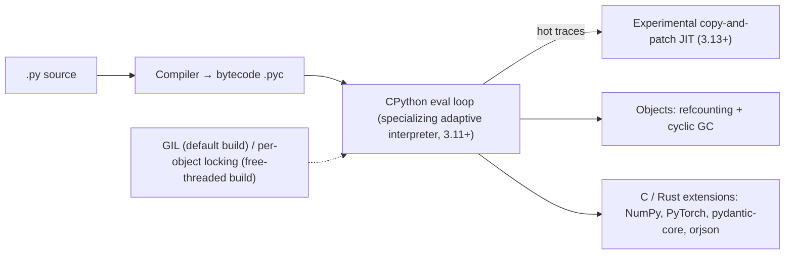

# Python

> [!abstract] TL;DR
> Python is the dominant language for **AI/ML, data, scripting and automation**, and a solid backend choice (FastAPI, Django). It's readable, has batteries included, and has the largest scientific/AI ecosystem. Performance-critical work runs in C/Rust extensions underneath (NumPy, PyTorch, Pydantic core, Polars). 2024–26 changed the runtime story: an experimental **JIT**, an officially supported **free-threaded (no-GIL) build** (3.14), and **lazy imports** (3.15). Tooling consolidated around **uv** + **ruff**. Use it for AI agents/RAG pipelines, data work and glue. Use TypeScript/Go when you need one language across the web stack or a single static binary.

## Introduction
- Created by Guido van Rossum (first release 1991). Governed by the Python Software Foundation and an elected **Steering Council** (PEP 13). PSF License.
- **Annual releases** each October (PEP 602): 2 years of bugfix releases, then security fixes, for a **5-year lifecycle** total. 3.9 reached EOL in Oct 2025, and 3.10 reaches it in Oct 2026.
- **Implementations**: CPython (reference, ~all usage), PyPy (JIT), plus MicroPython and others for embedded. "Python" here means CPython.
- Where it sits: LLM/agent backends ([[LangChain & LangGraph]], provider SDKs), RAG ingestion, data pipelines, ML training/inference, automation scripts, ops tooling and APIs.

## Core Concepts

### Language essentials
```python
from dataclasses import dataclass
from typing import Literal

@dataclass(frozen=True, slots=True)
class Order:
    id: str
    total_sen: int
    status: Literal["pending", "paid", "void"] = "pending"

def paid_total(orders: list[Order]) -> int:
    return sum(o.total_sen for o in orders if o.status == "paid")   # generator expression

match event:                                                          # structural pattern matching (3.10+)
    case {"type": "order.paid", "order_id": str(oid)}: handle_paid(oid)
    case {"type": "order.void", **rest}: handle_void(rest)
    case _: log.warning("unknown event %s", event)
```
- **Everything is an object**. Names are references. Mutability matters (`list` default args are shared, so use `None` + create).
- **Duck typing + gradual typing**: type hints are not enforced at runtime. Check them with **mypy/pyright/ty**, and validate data with **Pydantic**.
- **Iterators/generators** (`yield`), comprehensions, context managers (`with`), decorators, f-strings, and t-strings (3.14 template strings for safe interpolation).

### Concurrency model
| Tool | Best for | Notes |
|---|---|---|
| `asyncio` | Many concurrent I/O tasks (HTTP, DB, LLM calls) | Single thread, cooperative. One blocking call stalls everything |
| Threads | Blocking I/O libraries | GIL limits CPU parallelism on the default build |
| Free-threaded build (`python3.14t`) | CPU-parallel pure-Python threads | Officially supported since 3.14. Extension compatibility still maturing |
| `multiprocessing` / `concurrent.futures.ProcessPoolExecutor` | CPU-bound work | Process overhead, pickling costs |
| Subinterpreters (`concurrent.interpreters`, 3.14) | Isolated parallelism in one process | New, limited sharing |

### Packaging & tooling (2026 defaults)
| Need | Tool |
|---|---|
| Python versions, venvs, deps, lockfile, scripts | **uv** (Astral): `uv init`, `uv add`, `uv run`, `uv.lock` |
| Lint + format | **ruff** (replaces flake8, isort, black) |
| Type check | pyright / mypy, or ty (Astral, newer) |
| Tests | pytest |
| Project metadata | `pyproject.toml` (PEP 621) |
| Data validation / settings | Pydantic v2, pydantic-settings |

## Architecture / How It Works



- **Bytecode interpreter** with a specializing adaptive interpreter (3.11+, the "Faster CPython" project, roughly 1.25–1.6× over 3.10), plus an opt-in JIT that's improving each release.
- **Memory**: reference counting (immediate frees) + a cyclic garbage collector. The incremental GC landed in 3.14.
- **GIL**: on the default build only one thread executes Python bytecode at a time, but C extensions release it during heavy work (NumPy, I/O). Free-threaded builds remove the GIL at some single-thread cost.
- **Imports** execute module code. Import-time side effects and slow imports hurt CLI and serverless cold starts. 3.15's **lazy imports** (PEP 810) defer the cost.

## Project Structure
```text
agent-service/
├── pyproject.toml          # deps, tool config (ruff, pytest, pyright)
├── uv.lock                 # committed lockfile
├── .python-version         # e.g. 3.14
├── src/agent_service/
│   ├── __init__.py
│   ├── main.py             # FastAPI app / entrypoint
│   ├── settings.py         # pydantic-settings (env vars)
│   ├── graph.py            # LangGraph / agent logic
│   └── tools/
├── tests/
└── Dockerfile              # uv sync --frozen --no-dev in builder stage
```
```toml
[project]
name = "agent-service"
requires-python = ">=3.13"
dependencies = ["fastapi>=0.115", "pydantic>=2.9", "langgraph>=1.2", "psycopg[binary,pool]>=3.2"]

[tool.ruff]
line-length = 110
lint.select = ["E", "F", "I", "B", "UP", "ASYNC", "S"]   # includes bandit-style security rules
```

## Use Cases
| Use case | Why it fits |
|---|---|
| LLM agents, RAG pipelines | First-class SDKs (Anthropic, OpenAI), LangGraph, LlamaIndex, eval tooling |
| Data processing / ETL | pandas, Polars, DuckDB, SQLAlchemy |
| ML training & inference | PyTorch, scikit-learn, Hugging Face, vLLM |
| APIs & admin backends | FastAPI (async, typed), Django (batteries-included admin) |
| Automation / scripting | Readable, huge stdlib, `uv run script.py` with inline deps (PEP 723) |
| Document processing (PDF, OCR) | pypdf, PyMuPDF, docling, unstructured |

## Pros & Cons
| Pros | Cons |
|---|---|
| Unmatched AI/data ecosystem | Slower than Go/Rust/JVM for CPU-bound pure-Python code |
| Readable, fast to write, great for prototypes → production | Packaging history was messy (mostly fixed by uv) |
| Rich typing + Pydantic validation | Types not enforced at runtime. Large codebases need discipline |
| asyncio for high-concurrency I/O | Async/sync split ("function colouring") and blocking-call footguns |
| Free-threading + JIT improving performance | GIL-free ecosystem still maturing. Native-extension compatibility varies |

## Alternatives & Peers
| Alternative | Strength vs Python | Weakness vs Python | Pick it when… |
|---|---|---|---|
| [[TypeScript]] / [[JavaScript]] | One language for web front + back, strong async | Smaller ML/data ecosystem | Full-stack web apps, Next.js-centric products |
| [[Go]] | Fast, static binary, simple concurrency, low memory | Less expressive, smaller AI ecosystem | Network services, CLIs, infra tooling |
| [[Rust]] | Max performance + safety | Steep learning curve, slower iteration | Performance-critical libraries (often exposed to Python via PyO3) |
| [[Java]] / [[Kotlin]] | JVM performance, enterprise ecosystem | Verbosity, heavier runtime | Large enterprise backends |
| Julia / R | Numerics / statistics niches | Smaller general ecosystem | Scientific computing / stats teams |

## Tips & Reminders
> [!tip] Defaults that age well
> - Use `uv` for everything (versions, venvs, locks, running scripts). Commit `uv.lock`.
> - Type-hint public functions, run pyright/mypy in CI, and use Pydantic at I/O boundaries.
> - Async code: never call blocking libraries (`requests`, `time.sleep`, sync DB drivers) inside `async def`. Use `httpx.AsyncClient`, `asyncio.sleep`, `psycopg` async, or `asyncio.to_thread`.
> - Pin the major.minor runtime in Docker (`python:3.14-slim`) and test the next version in CI before upgrading.
> - Use `decimal.Decimal` or integer sen for money, never `float`.

> [!tip] In ZP's stack
> - Python is the natural home for **LangGraph agents, RAG ingestion and document AI**. Deploy them as a FastAPI service in Docker on [[Coolify]], with [[PostgreSQL]] (psycopg 3 + pgvector) and [[Redis]].
> - Keep [[n8n]] as the orchestrator. Call Python services via HTTP for heavy AI or data work instead of stuffing logic into Code nodes (n8n's Python Code node runs in task runners with limited packages).
> - Use the provider's official SDK (e.g. `anthropic`) directly for simple LLM calls. Add frameworks only when you need graphs, checkpoints or HITL.

## Versions & Breaking Changes
| Version | Released | Key changes | Breaking / migration notes |
|---|---|---|---|
| 3.10 | 2021-10 | Pattern matching, `X \| Y` unions | **EOL 2026-10** |
| 3.11 | 2022-10 | 1.25× faster (specializing interpreter), exception groups, `tomllib` | — |
| 3.12 | 2023-10 | PEP 695 generics syntax (`def f[T]`), f-string grammar, per-interpreter GIL | `distutils` removed |
| 3.13 | 2024-10 | New REPL, experimental free-threaded build (PEP 703) + JIT (PEP 744), `locals()` semantics | Dead batteries removed (PEP 594: `cgi`, `telnetlib`, …) |
| 3.14 | 2025-10-07 | Free-threading officially supported (PEP 779), t-strings (PEP 750), deferred annotations (PEP 649/749), `concurrent.interpreters`, `compression.zstd`, remote debugging attach | Annotations evaluated lazily: code reading `__annotations__` directly may break. Use `annotationlib`. Sigstore replaces PGP signatures |
| 3.14.8 | 2026-09-30 | Expedited security release | Upgrade |
| **3.15** | 2026-10-01 (scheduled) | Lazy imports (`lazy import`, PEP 810), UTF-8 mode by default (PEP 686), sampling profiler, `frozendict`, upgraded JIT | UTF-8 default changes text I/O on Windows/legacy locales. Test file encodings |

> [!warning] Unverified — check before relying on this
> 3.15's final feature list (e.g. `frozendict`, sentinel objects) and its exact release date come from previews and secondary sources. Confirm with the official "What's New in Python 3.15" before targeting it.

## Critical Issues & Gotchas
> [!danger] PyPI supply-chain attacks
> - **Ultralytics (Dec 2024)**: a GitHub Actions cache-poisoning attack published crypto-miner releases of a top ML package (60M+ downloads).
> - **PyPI phishing (Jul 2025)**: `pypj.org` look-alike domain stole maintainer tokens.
> - Typosquats of popular AI libraries keep appearing.
>
> **Mitigation**: lockfiles with hashes (`uv.lock`), trusted publishing, minimal dependencies, scanning (pip-audit, OSV), and pinned GitHub Actions.

> [!danger] Unsafe deserialization and extraction
> - `pickle`, `yaml.load` (not `safe_load`), `torch.load` on untrusted files and `eval` are all RCE vectors.
> - **tarfile** extraction-filter bypasses (CVE-2025-4517 and related, Jun 2025) allowed writing outside the target dir even with the 3.12+ `filter="data"` safeguard until patched.
>
> Use safe formats (JSON, safetensors), and keep Python patched.

> [!warning] Footguns
> - Mutable default arguments (`def f(x=[])`) are shared across calls.
> - A blocking call inside `async def` freezes the whole event loop.
> - Floating-point money, naive `datetime` (no tzinfo), and `datetime.utcnow()` (deprecated). Use `datetime.now(UTC)`.
> - The system Python on Linux distros is for the OS. Never `sudo pip install` into it. Use uv-managed Pythons/venvs.
> - Free-threaded builds: C extensions without free-threading support re-enable the GIL (with a warning). Check before relying on parallel speedups.

## Deep Dives
- (planned) [[Python - Async & Concurrency]]

## Related
- [[LangChain & LangGraph]] · [[RAG]] · [[AI Agents]] — primary AI workloads
- [[PostgreSQL]] · [[Redis]] — data stores from Python services
- [[TypeScript]] · [[Go]] — peer languages in ZP's stack
- [[Docker]] — packaging services

## References
- Docs: https://docs.python.org/3/
- Release status & schedule: https://devguide.python.org/versions/
- What's New in Python 3.14: https://docs.python.org/3/whatsnew/3.14.html
- Python 3.14.8 release: https://www.python.org/downloads/latest/python3.14/
- uv: https://docs.astral.sh/uv/
- Python 3.15 overview (Real Python): https://realpython.com/courses/whats-new-in-python-315/
