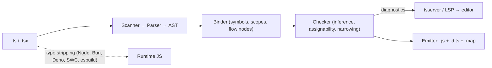

# TypeScript

> [!abstract] TL;DR
> TypeScript is [[JavaScript]] plus a **structural, erased** static type system. It catches whole classes of bugs at compile time and powers the editor experience for the entire JS ecosystem. Types disappear at runtime, so you still validate external data. **2026 is a platform shift**: 6.0 (Mar) was the last JS-based compiler and flipped defaults (`strict` on, `types: []`). **7.0 (Jul) is a Go-native compiler with ~8–12× faster builds.** Plan the tooling migration, not just the version bump.

## Introduction
- Created by Microsoft (Anders Hejlsberg), first released Oct 2012. Apache-2.0, developed on GitHub. It's a **superset of JS**: valid JS is (mostly) valid TS.
- It solves the problem of large JS codebases being unrefactorable without types. It's now the default for [[React]], [[Next.js]], Angular, Vue, NestJS, [[Supabase]] clients and Deno/Bun.
- **Two jobs**: a type checker (`tsc --noEmit`) and a transpiler. Most modern stacks only use the checker. Transpiling is done by SWC (Next.js), esbuild (Vite), Bun/Deno, or [[Node.js]] **type stripping**, which is unflagged since Node 23.6 / 22.18.
- **Project Corsa** is the Go port, shipped as TypeScript 7.0. The old JS codebase ("Strada") is frozen at 6.x.

## Core Concepts

### Structural typing
```ts
interface Point { x: number; y: number }
const p = { x: 1, y: 2, label: "a" };
const q: Point = p;                 // OK — shape matches (extra props allowed when not a fresh literal)
const r: Point = { x: 1, y: 2, label: "a" }; // Error — excess property check on fresh object literal
```
- Compatibility is by **shape**, not by name. Use **branded types** for nominal-ish IDs: `type UserId = string & { readonly __brand: "UserId" }`.

### Inference, narrowing & control flow
```ts
function area(s: { kind: "circle"; r: number } | { kind: "rect"; w: number; h: number }) {
  switch (s.kind) {                 // discriminated union narrowing
    case "circle": return Math.PI * s.r ** 2;
    case "rect":   return s.w * s.h;
    default: { const _exhaustive: never = s; return _exhaustive; }   // compile error if a case is added
  }
}
```
- Narrowing via `typeof`, `instanceof`, `in`, equality, truthiness, user-defined guards (`x is T`), assertion functions (`asserts x is T`) and **inferred type predicates** (5.5+: `arr.filter(x => x !== null)` narrows).

### Generics & constraints
```ts
function pluck<T, K extends keyof T>(items: T[], key: K): T[K][] { return items.map(i => i[key]); }
function first<const T extends readonly unknown[]>(xs: T): T[0] { return xs[0]; }   // const type param (5.0)
```

### Type-level programming (the 20% used 80% of the time)
| Tool | Example |
|---|---|
| Union / intersection | `A \| B`, `A & B` |
| `keyof`, indexed access | `keyof User`, `User["email"]` |
| Mapped types | `{ readonly [K in keyof T]?: T[K] }` |
| Conditional + `infer` | `T extends Promise<infer U> ? U : T` |
| Template literal types | `` `on${Capitalize<E>}` `` |
| Utility types | `Partial`, `Required`, `Pick`, `Omit`, `Record`, `ReturnType`, `Awaited`, `NoInfer` (5.4) |

### `satisfies` vs annotation vs `as`
```ts
const routes = { home: "/", order: "/orders/:id" } satisfies Record<string, `/${string}`>;
routes.order;                       // keeps literal type "/orders/:id" AND is checked
const bad = JSON.parse(body) as User; // ❌ assertion: no check at all — lies to the compiler
```

### `any` vs `unknown` vs `never`
- `any` disables checking and **spreads** silently. `unknown` forces narrowing before use. `never` is the empty type (exhaustiveness, impossible branches).

### Modules & declaration files
- ESM `import/export`, plus `import type` for type-only imports. With `verbatimModuleSyntax`, imports are emitted as written, which is required for correct ESM and type stripping.
- `.d.ts` files describe JS without implementations. `@types/*` (DefinitelyTyped) covers untyped packages. `isolatedDeclarations` (5.5) lets tools emit `.d.ts` without the full checker.

## Architecture / How It Works



- **Erasure**: types are removed with no runtime representation. Exceptions that *generate* code are `enum`, `namespace`, parameter properties and legacy decorators metadata. `--erasableSyntaxOnly` (5.8) forbids them so the code works under Node's type stripping.
- **Checker cost** grows with type complexity. Deep conditional types, huge unions (>100k members are capped) and recursive generics dominate build time. `tsc --extendedDiagnostics` and `--generateTrace` profile it.
- **Project references** (`composite: true`, `tsc -b`) split monorepos into incremental build units with `.tsbuildinfo` caches.
- **TS 7 (Corsa)**: the same type system semantics, re-implemented in Go with shared-memory parallelism for parsing/checking. The editor runs on an **LSP**-based language server instead of the old `tsserver` protocol. The JS programmatic API ("Strada API") isn't preserved one-to-one, so tooling that imports `typescript` as a library must migrate.

## Project Structure
```text
my-app/
├── package.json            # "type": "module", "typescript": "^7.0.0" (or 6.x for tooling compat)
├── tsconfig.json           # app config
├── tsconfig.build.json     # optional: emit config for libraries
├── src/
│   ├── index.ts
│   └── types/              # shared domain types, branded IDs, zod schemas
└── types/                  # ambient .d.ts (env vars, untyped modules)
```
```jsonc
// tsconfig.json — modern app (Next.js / Vite / Node 22+)
{
  "compilerOptions": {
    "target": "es2024",
    "module": "esnext",                 // "nodenext" for Node libraries
    "moduleResolution": "bundler",      // "nodenext" for Node libraries
    "strict": true,                     // default in 6.0+, keep explicit
    "noUncheckedIndexedAccess": true,   // arr[i] is T | undefined — catches real bugs
    "exactOptionalPropertyTypes": true,
    "verbatimModuleSyntax": true,
    "isolatedModules": true,
    "skipLibCheck": true,
    "types": ["node"],                  // 6.0+: [] by default — list globals explicitly
    "paths": { "@/*": ["./src/*"] },    // no baseUrl (deprecated in 6.0)
    "noEmit": true
  },
  "include": ["src", "types"]
}
```

## Use Cases
| Use case | Why it fits |
|---|---|
| [[Next.js]] / [[React]] apps | First-class TSX, typed props, server actions, route types |
| Node APIs & workers ([[Node.js]], BullMQ) | Shared types between API, queue payloads and DB rows |
| [[Supabase]] clients | `supabase gen types typescript` → fully typed queries from the Postgres schema |
| Libraries / SDKs | `.d.ts` is the contract, and consumers get autocomplete |
| Infra-as-code (Pulumi, CDK) | Typed cloud resources |
| [[n8n]] custom nodes / Code node | n8n nodes are written in TS. Code node supports JS with TS-style typing hints |
| AI agents ([[LangChain & LangGraph]] JS, Vercel AI SDK, Mastra) | Typed tool schemas via Zod |

## Pros & Cons
| Pros | Cons |
|---|---|
| Catches null, typo, shape and refactor errors before runtime | Types are erased. No runtime safety at I/O boundaries without a validator |
| Best-in-class editor tooling (rename, go-to-def, autocomplete) | Type-level code can become unreadable and slow to compile |
| Gradual adoption (`allowJs`, `checkJs`, JSDoc types) | Not semver: minor releases routinely add new errors |
| Huge ecosystem: every major framework ships types | `any` from untyped deps leaks silently |
| 7.0 native compiler: large codebases check in seconds | 2026 migration: 6.0 default flips + 7.0 API break for tooling |

## Alternatives & Peers
| Alternative | Strength vs TypeScript | Weakness vs TypeScript | Pick it when… |
|---|---|---|---|
| [[JavaScript]] + JSDoc (`checkJs`) | No build step, same checker | Verbose types, weaker generics ergonomics | Small libs/scripts, or a no-build policy |
| Flow (Meta) | Sound-er in places | Ecosystem has largely left. Few third-party types | Legacy Meta-style codebases only |
| ReScript / Elm | Sound types, no `any`, fast compiler | Separate language, small ecosystem, interop cost | Teams wanting soundness over ecosystem |
| [[Dart]] | Sound null safety, AOT, Flutter | Not the web ecosystem | Flutter apps (ZP's mobile stack) |
| [[Kotlin]] / [[Go]] for backend | Runtime types, performance, single binary | Separate language from the frontend | CPU-bound services, shared types not needed |

## Tips & Reminders
> [!tip] Validate at the boundary, trust inside
> Parse every external input (HTTP body, webhooks, env, LLM JSON, `localStorage`) with **Zod / Valibot / ArkType** and derive types from schemas: `type Order = z.infer<typeof Order>`. One schema gives both the runtime check and the static type.

> [!tip] Strictness worth turning on
> `strict`, `noUncheckedIndexedAccess`, `exactOptionalPropertyTypes`, `noImplicitOverride`, `useUnknownInCatchVariables` (in `strict`). Ban `any` via typescript-eslint (`no-explicit-any`, `no-unsafe-*`).

> [!tip] In ZP's stack
> - Generate DB types from [[Supabase]] (`supabase gen types typescript --project-id … > src/types/db.ts`) in CI, so schema drift breaks the build, not prod.
> - Share Zod schemas between Next.js server actions, BullMQ job payloads and n8n webhook contracts.
> - Next.js uses SWC for transpiling and runs `tsc` only for type checking. On TS 7, `next build`'s type-check step gets the speedup. Verify the Next.js version supports TS 7 before bumping.
> - [[Flutter]] isn't TS. Share contracts via OpenAPI/JSON Schema rather than hand-copied types.

> [!tip] Performance
> Run `tsc --noEmit --incremental` in CI with a cached `.tsbuildinfo`. Prefer interfaces over large intersections for hot types. Annotate exported function return types (faster checks, required by `isolatedDeclarations`).

## Versions & Breaking Changes
| Version | Released | Key changes | Breaking / migration notes |
|---|---|---|---|
| 5.0 | 2023-03 | Standard (TC39) decorators, `const` type params, `--moduleResolution bundler` | Legacy decorators behind `experimentalDecorators` |
| 5.2 | 2023-08 | `using` / explicit resource management | — |
| 5.4 | 2024-03 | `NoInfer<T>`, better closure narrowing | — |
| 5.5 | 2024-06 | Inferred type predicates, `isolatedDeclarations`, regex syntax checking | New errors from stricter checks |
| 5.8 | 2025-02 | `--erasableSyntaxOnly`, `require(esm)` under `nodenext` | — |
| 5.9 | 2025-08 | `import defer`, `--module node20`, leaner `tsc --init` | — |
| **6.0** | 2026-03-23 | Last JS-based compiler. Bridge release that deprecates everything 7.0 removes | Defaults: `strict: true`, `types: []`, `rootDir` = tsconfig dir. Deprecated: `baseUrl`, `moduleResolution node`/`node10`/`classic`, `target es5`, AMD/UMD/System, `outFile`. Silence with `"ignoreDeprecations": "6.0"`. Codemod: `ts5to6` |
| **7.0** | 2026-07-08 | Go-native compiler + LSP language server. ~8–12× faster full builds, lower memory | 6.0 deprecations **removed** (no `ignoreDeprecations`). JS programmatic API not drop-in. Tools built on it (typescript-eslint typed rules, ts-morph, custom transformers, LS plugins) need updated versions or must keep 6.x side by side |

> [!warning] Unverified — check before relying on this
> The full lists of 6.0 deprecations/default changes and 7.0 API-compat gaps came from secondary sources (the official release notes were unreachable this run). Read the official 6.0 and 7.0 release notes before migrating a client project.

## Critical Issues & Gotchas
> [!danger] Runtime type lies
> `as`, `!`, `any`, `JSON.parse(): any` and unvalidated `fetch().json()` produce code that type-checks and then crashes or corrupts data in prod. The type system can't protect anything it didn't see. Validate all I/O.

> [!danger] npm supply chain (affects every TS project)
> Sep 2025: the **chalk/debug** maintainer compromise (crypto-stealer injected into packages with ~2B weekly downloads) and the self-replicating **"Shai-Hulud"** worm (stole npm/GitHub tokens, republished 500+ packages). Mitigate: lockfiles + `npm ci`, pin versions, `--ignore-scripts` in CI where possible, npm trusted publishing/provenance, and a short-delay policy before adopting new versions (e.g. pnpm `minimumReleaseAge`).

> [!warning] 2026 migration traps
> - 6.0's `types: []` drops implicit globals. `describe`/`it`/`process` suddenly become "Cannot find name" errors, so add `"types": ["node", "vitest/globals"]`.
> - The `rootDir` default change nests output (`dist/src/...`) and breaks `main`/`exports` paths.
> - Bumping to 7.0 while typescript-eslint/ts-morph/Angular still need the JS API breaks lint/codegen, not the build. Pin `typescript@6` for tooling if needed.

> [!warning] Language footguns
> - `enum` emits runtime code and numeric enums accept any number. Prefer `as const` objects + union types (and they work with `erasableSyntaxOnly`).
> - Object index access returns `T`, not `T | undefined`, unless `noUncheckedIndexedAccess` is on.
> - Function parameter **bivariance** for method syntax (`method(x: T)`) is unsound. Use property syntax (`method: (x: T) => void`) for strictness.
> - `@types/*` versions drift from the runtime library. Mismatches cause phantom APIs.

## Deep Dives
- [[TypeScript - Advanced Types]]

## Related
- [[JavaScript]] — runtime semantics TS compiles to
- [[Node.js]] — type stripping, `nodenext` resolution
- [[React]] · [[Next.js]] — primary consumers in ZP's stack
- [[Supabase]] — generated DB types
- [[LangChain & LangGraph]] — JS/TS SDKs with Zod-typed tools

## References
- Official docs: https://www.typescriptlang.org/docs/
- TS 6.0 release notes: https://www.typescriptlang.org/docs/handbook/release-notes/typescript-6-0.html
- Native port (typescript-go): https://github.com/microsoft/typescript-go
- TS 6.0 deprecations overview: https://pas7.com.ua/blog/en/typescript-6-explained-2026
- TS 7.0 overview: https://morello.dev/blog/typescript-7-is-here
- TSConfig reference: https://www.typescriptlang.org/tsconfig
