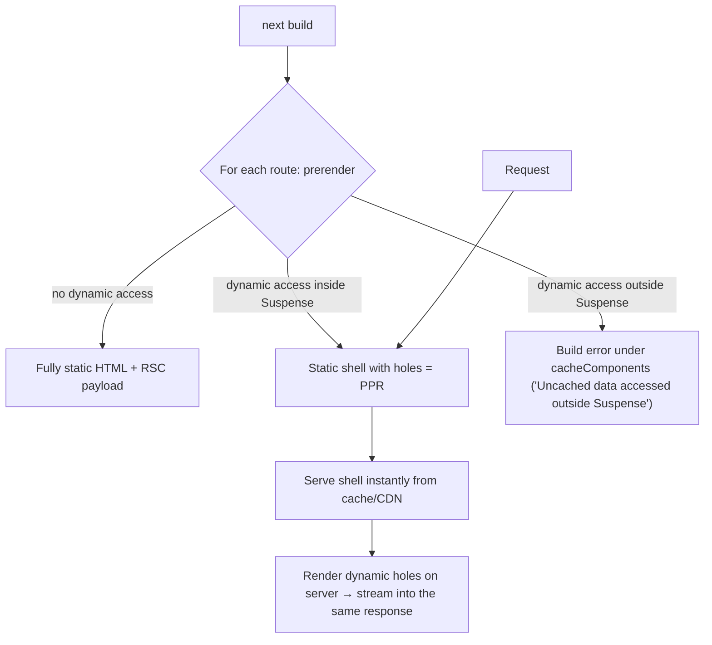

# Next.js - App Router & Rendering Strategies

> [!info] Deep dive of [[Next.js]]

> [!abstract] TL;DR
> The App Router maps folders in `app/` to URL segments, and each segment can have its own layout, loading state, error boundary and data. Rendering is decided **per component tree, not per page**: with **Cache Components** (Next 16) everything is **dynamic by default**, `"use cache"` marks what can be prerendered, and **Partial Prerendering (PPR)** serves a static shell instantly while dynamic parts stream in through `<Suspense>`. Remember: **reading request data (`cookies()`, `headers()`, `searchParams`, uncached fetch) makes that subtree dynamic. Isolate it behind Suspense so the rest stays static.**

## Concept
| Strategy | When HTML is produced | Next 16 mechanism | Typical use |
|---|---|---|---|
| **Static (SSG)** | Build time | Components with no dynamic data / inside `"use cache"` | Marketing, docs |
| **ISR / revalidated static** | Build, then refreshed after `cacheLife` or on `revalidateTag` | `"use cache"` + `cacheLife("hours")` + `cacheTag` | Product pages, blogs, catalogues |
| **Dynamic (SSR)** | Every request | Request APIs / uncached data (default) | Dashboards, per-user pages |
| **PPR** | Static shell at build + dynamic holes per request | Cache Components + `<Suspense>` around dynamic parts | Mixed pages (product + personalized cart) |
| **Streaming** | Progressive chunks | `loading.tsx` / `<Suspense>` | Slow data sources |
| **Client-side rendering** | Browser | `"use client"` + client fetching | Highly interactive widgets |

- **Routing primitives**:
  - Dynamic `[id]` and catch-all `[...slug]` / `[[...slug]]` segments.
  - Route groups `(marketing)`.
  - Parallel routes `@modal` and intercepting routes `(.)photo`.
  - Private folders `_components`.
- **Layouts persist** across navigations (state preserved, no re-render). `template.tsx` re-mounts on each navigation.
- **Special files**: `page`, `layout`, `loading`, `error`, `not-found`, `forbidden`, `unauthorized`, `route`, `default`, `template`, plus metadata files (`opengraph-image`, `sitemap`, `robots`).

## How It Works



- With `cacheComponents: true`, Next **forces you to be explicit**: uncached data access must be wrapped in `<Suspense>` (dynamic) or marked `"use cache"` (cached). Otherwise the build fails. This replaces the old segment-level `dynamic = "force-static"` guessing.
- **Navigation**: client router fetches the RSC payload for changed segments only. `<Link>` prefetches static parts of visible links. Shared layouts aren't re-fetched.
- **Request APIs** (`cookies()`, `headers()`, `params`, `searchParams`, `connection()`) are async (15+) and mark the calling scope dynamic.
- **`generateStaticParams`** prerenders a known set of dynamic paths. Others render on demand and are cached if they're cacheable.

## Practical Usage

### PPR page: static shell + dynamic hole
```tsx
// app/products/[slug]/page.tsx
import { Suspense } from "react";
import { cacheLife, cacheTag } from "next/cache";

async function Product({ slug }: { slug: string }) {
  "use cache";
  cacheLife("hours");
  cacheTag(`product:${slug}`);
  const p = await db.product.findUnique({ where: { slug } });
  return <ProductView product={p} />;
}

async function CartBadge() {
  const session = (await cookies()).get("sid")?.value;   // dynamic → must be inside Suspense
  const count = await getCartCount(session);
  return <span>{count}</span>;
}

export default async function Page({ params }: PageProps<"/products/[slug]">) {
  const { slug } = await params;
  return (
    <>
      <Product slug={slug} />                                  {/* in static shell */}
      <Suspense fallback={<span>…</span>}><CartBadge /></Suspense>  {/* streamed per request */}
    </>
  );
}

export async function generateStaticParams() {
  return (await db.product.findMany({ select: { slug: true }, take: 500 })).map(p => ({ slug: p.slug }));
}
```

### Layout-level auth shell
```tsx
// app/(app)/layout.tsx
export default async function AppLayout({ children }: { children: React.ReactNode }) {
  return (
    <Shell>
      <Suspense fallback={<SidebarSkeleton />}><UserSidebar /></Suspense>   {/* reads session */}
      {children}
    </Shell>
  );
}
// Authorization still happens in each page/data function — layouts don't re-run on every navigation.
```

### Parallel + intercepting routes (modal pattern)
```text
app/
├── @modal/(.)orders/[id]/page.tsx   # shows order in a modal when navigated from the list
├── @modal/default.tsx               # returns null
├── orders/[id]/page.tsx             # full page on direct load / refresh
└── layout.tsx                       # renders {children} and {modal}
```

### Route handlers vs Server Actions
| Need | Use |
|---|---|
| Form/mutation from your own UI | Server Action (`"use server"`) |
| Webhooks (WhatsApp, Stripe), public API, non-React clients (Flutter) | `app/api/**/route.ts` |
| File downloads, streaming responses, custom headers | `route.ts` |

## Patterns & Anti-patterns
| Pattern | When | Anti-pattern to avoid |
|---|---|---|
| Push dynamic access down into small Suspense-wrapped components | Mixed pages | Calling `cookies()` in the root layout → whole app dynamic |
| `loading.tsx` per slow segment | Data-heavy routes | One global spinner for everything |
| `generateStaticParams` for popular paths + on-demand for the long tail | Catalogues | Prerendering 100k pages at build time |
| Auth check in data access layer (DAL) | Every protected read/write | Relying on layouts or `proxy.ts` alone for authorization |
| Route groups for different layouts | Marketing vs app shells | Conditional layout logic based on pathname |

## Performance & Trade-offs
- **Static shell from CDN** gives the best TTFB. Dynamic holes add server time but don't block first paint.
- Each `"use cache"` boundary adds cache storage and invalidation complexity. Cache coarse, stable data.
- Deep Suspense trees cause layout shift. Use dimension-matched skeletons.
- Self-hosting: PPR and static shells work with `output: "standalone"`. Multi-instance needs a shared cache handler (see [[Next.js - Caching]]).
- Build time grows with `generateStaticParams` volume. Cap it and let the rest render on demand.

## Tips & Reminders
> [!tip]
> - Start new apps with `cacheComponents: true`, so the build errors tell you exactly where dynamic data leaks.
> - Use typed routes (`typedRoutes: true`) and the generated `PageProps<"/path">`/`LayoutProps` helpers.
> - `redirect()`, `notFound()`, `forbidden()` throw. Don't swallow them in `try/catch`.
> - **In ZP's stack**: marketing pages static/ISR on [[Coolify]] behind [[Cloudflare]] cache. App routes dynamic with Supabase session reads isolated in Suspense. Webhooks in `route.ts` with signature verification.

## Version Notes
| Version | Change |
|---|---|
| 13 / 13.4 | App Router introduced / stable. RSC, layouts, streaming |
| 14 | Server Actions stable. PPR experimental |
| 15 | Async request APIs. Fetch uncached by default. `after()` |
| 16 (2025-10) | **Cache Components** (`cacheComponents`, `"use cache"`, `cacheLife`, `cacheTag`) replace experimental PPR flags + segment configs. `proxy.ts`. Turbopack default |
| 16.x (2026) | Refinements + security fixes. Run ≥ 16.3.8 |

> [!warning] Unverified — check before relying on this
> Exact error wording and some Cache Components APIs evolved across 16.x minors. Confirm against the docs for your installed version.

## Critical Issues & Gotchas
> [!danger] Static rendering of per-user data
> If user-specific data ends up inside a cached/static scope (e.g. a `"use cache"` function that reads a user ID from a global), one user's data can be served to others. Never read session data inside cached scopes. Pass identifiers as arguments, or keep those parts dynamic.

> [!warning] Gotchas
> - Layouts don't re-render on navigation, so auth checks only in layouts miss client-side navigations to sibling pages.
> - `searchParams` usage makes a page dynamic. Isolate filters in a Suspense-wrapped client/server component.
> - Parallel routes need `default.tsx`, or hard refreshes 404.
> - `generateStaticParams` + `dynamicParams = false` returns 404 for unknown params. That's intended, but often surprising.

## Related
- [[Next.js]]
- [[Next.js - Caching]] — `"use cache"`, invalidation, cache handlers
- [[React - Server Components]] — the rendering model underneath
- [[React]] · [[Supabase]]

## References
- App Router docs: https://nextjs.org/docs/app
- Cache Components: https://nextjs.org/docs/app/getting-started/cache-components
- Next.js 16 announcement: https://nextjs.org/blog/next-16
- Routing (parallel & intercepting routes): https://nextjs.org/docs/app/api-reference/file-conventions/parallel-routes
