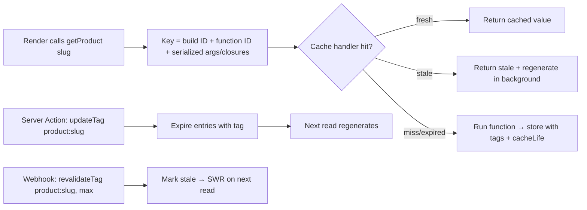

# Next.js - Caching

> [!info] Deep dive of [[Next.js]]

> [!abstract] TL;DR
> Next.js caching went from implicit (13–14, "everything cached, surprise") to uncached-by-default (15) to **explicit Cache Components** (16): mark functions or components with **`"use cache"`**, set a lifetime with **`cacheLife`**, label entries with **`cacheTag`**, and invalidate with **`revalidateTag`** (stale-while-revalidate), **`updateTag`** (read-your-writes in Server Actions) or **`revalidatePath`**. Cache keys include the function's **arguments and closed-over values**. Remember: **never cache user-specific data without the user in the key, and self-hosted multi-instance setups need a shared cache handler.**

## Concept
| Layer | Where | What | Lifetime | Control |
|---|---|---|---|---|
| Request memoization | Server, one render | Dedupes identical `fetch`/`React.cache` calls in one request | Request | `React.cache(fn)` |
| **`"use cache"` entries** (data/component cache) | Server cache handler (memory/disk/custom) | Return values / RSC output of cached functions & components | `cacheLife` profile | `cacheTag`, `revalidateTag`, `updateTag` |
| Full route / static shell | Build output + cache handler + CDN | Prerendered HTML + RSC payload | Until revalidated/redeployed | Derived from `"use cache"` usage |
| Client Router Cache | Browser memory | RSC payloads of visited/prefetched segments | Session (staleTimes) | `router.refresh()`, `refresh()`, revalidation from actions |
| HTTP/CDN cache | Cloudflare/Vercel edge | Responses with `Cache-Control` | Header-driven | Headers, purge API |

### `cacheLife` profiles (built-in)
| Profile | Use for |
|---|---|
| `seconds` / `minutes` | Fast-changing public data (stock levels, prices) |
| `hours` / `days` | Catalogue, blog, CMS content |
| `weeks` / `max` | Rarely-changing reference data |
| Custom (`cacheLife({ stale, revalidate, expire })`) | Fine-tuned per domain |

- `stale`: how long the client may use it without checking. `revalidate`: after this, serve stale and refresh in the background. `expire`: hard limit, after which the next request waits for fresh data.

## How It Works



- **Keys** are derived automatically: the function's identity + serialized arguments + captured variables. Non-serializable arguments (class instances) can't be keys. Pass IDs, not objects.
- **Inside `"use cache"` you can't read request APIs** (`cookies()`, `headers()`, `searchParams`). Read them outside and pass the values in (which makes the value part of the key).
- **Variants**: `"use cache: remote"` uses a remote/shared handler for data shared across instances. `"use cache: private"` allows per-user caching that may read cookies, kept in the browser's memory only (not shared).
- **Nested caches**: an outer cached component that includes an inner cached function gets the shorter of the lifetimes.
- **Build ID** changes on deploy, so deploys effectively start with a cold server cache unless the handler persists across builds.

## Practical Usage

### Cached data function with tags
```ts
// lib/data/products.ts
import { cacheLife, cacheTag } from "next/cache";

export async function getProduct(slug: string) {
  "use cache";
  cacheLife("hours");
  cacheTag("products", `product:${slug}`);
  return db.product.findUnique({ where: { slug }, select: { id: true, name: true, price: true } });
}
```

### Invalidate after a mutation (read-your-writes)
```ts
"use server";
import { updateTag } from "next/cache";

export async function updatePrice(slug: string, price: number) {
  await requireAdmin();
  await db.product.update({ where: { slug }, data: { price } });
  updateTag(`product:${slug}`);        // admin sees the new price immediately after the action
}
```

### Invalidate from an external system (CMS, n8n, Supabase webhook)
```ts
// app/api/revalidate/route.ts
import { revalidateTag } from "next/cache";
export async function POST(req: Request) {
  if (req.headers.get("x-signature") !== sign(await req.clone().text())) return new Response("Forbidden", { status: 403 });
  const { tag } = await req.json();
  revalidateTag(tag, "max");           // stale-while-revalidate; second arg = cacheLife profile (required in 16)
  return Response.json({ ok: true });
}
```

### Per-user data: don't share it
```ts
export async function getMyOrders() {
  const uid = await currentUserId();                  // reads cookies — outside any cache
  return getOrdersForUser(uid);
}
async function getOrdersForUser(uid: string) {
  "use cache: private";                               // or no cache at all; never plain "use cache" without uid in args
  cacheLife("minutes");
  return db.order.findMany({ where: { userId: uid } });
}
```

### Self-hosting with multiple instances
```js
// next.config.ts → cacheHandlers: { default: require.resolve("./cache-handler.mjs") }
// cache-handler.mjs: implement get/set/refreshTags/expireTags against Redis
```
- Without a shared handler, each replica has its own cache. After `revalidateTag` hits replica A, replica B keeps serving stale data.

## Patterns & Anti-patterns
| Pattern | When | Anti-pattern to avoid |
|---|---|---|
| Tag by entity (`product:{id}`) + collection (`products`) | Precise invalidation | `revalidatePath("/")` nuking everything |
| `updateTag` in Server Actions | Admin edits needing immediate reflection | `revalidateTag` and wondering why the admin sees stale data |
| Signed revalidation webhook | CMS/DB-driven content | Unauthenticated `/api/revalidate` (cache-busting DoS) |
| Pass primitive IDs into cached functions | Clean, small keys | Passing whole objects/requests |
| Shared cache handler (Redis) | ≥ 2 instances | Per-instance file cache behind a load balancer |
| Cache-Control `private` for personalized responses | Anything per-user at the CDN | Letting Cloudflare cache HTML with user data |

## Performance & Trade-offs
- The biggest wins come from caching **expensive, shared, slowly-changing** reads (catalogues, CMS, aggregates). Per-user data rarely benefits from server caching.
- Shorter `revalidate` = fresher data, more DB load. SWR hides latency but serves stale data once.
- Cache storage grows with key cardinality (e.g. caching by free-text search query). Avoid high-cardinality keys.
- The Router Cache reduces navigation requests but can show stale UI after mutations made elsewhere. Call `router.refresh()`/`refresh()` or rely on action revalidation.

## Tips & Reminders
> [!tip]
> - Debug: `NEXT_PRIVATE_DEBUG_CACHE=1` logs hits and misses. Check response headers (`x-nextjs-cache`) when self-hosting.
> - Name tags consistently (`entity:id`) and centralize them in one module.
> - Remember the CDN layer: Cloudflare may cache what Next marks as static. Purge or respect `Cache-Control`.
> - **In ZP's stack**: [[Supabase]] database webhooks or [[n8n]] → signed `/api/revalidate` with tags. [[Coolify]] with > 1 replica → [[Redis]] cache handler, otherwise pin to one replica.

## Version Notes
| Version | Change |
|---|---|
| 13–14 | Aggressive implicit caching (`fetch` cached by default, Router Cache 30 s/5 min) → widespread confusion |
| 15 (2024-10) | `fetch` and GET route handlers **uncached by default**. Router Cache `staleTimes` dynamic = 0 |
| 15.x | `"use cache"` + `dynamicIO` experimental |
| 16 (2025-10) | **Cache Components** stable (`cacheComponents: true`), `cacheLife`/`cacheTag` stable. `revalidateTag(tag, profile)` signature. `updateTag`, `refresh` added |
| 16.3.8 (2026-09) | Security release fixing **cache-poisoning and cross-user content substitution** issues. Upgrade |

> [!warning] Unverified — check before relying on this
> `"use cache: private"` / `"use cache: remote"` semantics and cache handler interfaces were still evolving in 16.x. Verify against your installed version's docs.

## Critical Issues & Gotchas
> [!danger] Cross-user data leaks via caching
> Caching per-user data under a shared key, or CDN-caching personalized HTML, serves one customer's data to another, which is a PDPA breach. Next.js itself shipped fixes for cache poisoning (CVE-2024-46982) and **cross-user content substitution / Draft Mode leakage (Sep 2026 security release, 16.3.8 / 15.5.27)**. Keep user-specific reads uncached or keyed by user, set `Cache-Control: private`, and stay patched.

> [!warning] Gotchas
> - Calling `cookies()` inside `"use cache"` throws. Move it outside.
> - Forgetting the second argument to `revalidateTag` in 16 → type error / deprecated behaviour.
> - Date/time inside cached functions freezes ("Updated 3 hours ago" stuck). Compute relative times on the client.
> - Deploys reset the in-memory cache, causing DB load spikes. Warm critical paths after deploy.
> - Unsigned revalidation endpoints are a DoS vector.

## Related
- [[Next.js]]
- [[Next.js - App Router & Rendering Strategies]] — PPR and static shells
- [[React - Server Components]] — `React.cache`, request memoization
- [[Redis]] — shared cache handler
- [[HTTP & HTTPS]] — `Cache-Control` and CDN semantics

## References
- Caching overview: https://nextjs.org/docs/app/guides/caching
- `use cache` directive: https://nextjs.org/docs/app/api-reference/directives/use-cache
- `cacheLife` / `cacheTag`: https://nextjs.org/docs/app/api-reference/functions/cacheLife
- Self-hosting & cache handlers: https://nextjs.org/docs/app/guides/self-hosting
- Next.js security advisories: https://github.com/vercel/next.js/security/advisories
