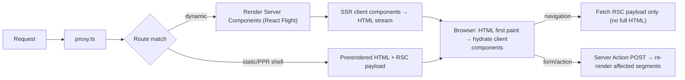

# Next.js

> [!abstract] TL;DR
> Next.js is Vercel's full-stack [[React]] framework: file-system routing, Server Components, Server Actions, streaming SSR, static/ISR, image/font optimization, and a Turbopack (Rust) bundler. **Next 16** (Oct 2025) made Turbopack the default, replaced implicit caching with explicit **Cache Components** (`"use cache"`), and renamed `middleware.ts` → **`proxy.ts`**. Use it for SEO-relevant, data-driven web apps. Self-host with `output: "standalone"` on Docker/[[Coolify]]. **Patch aggressively**: 2025–26 brought several critical CVEs.

## Introduction
- Created by Vercel (Guillermo Rauch, Tim Neutkens) in Oct 2016. MIT license. Vercel employs much of the React core team, so Next.js is where new React features (RSC, Actions, PPR) ship first.
- It solves the hard parts of production React: routing, SSR/SSG/streaming, code splitting, data fetching, caching, bundling, image optimization and API endpoints in one framework.
- Two routers: **App Router** (`app/`, RSC-based, the default since 13.4) and **Pages Router** (`pages/`, legacy, still supported). New projects use the App Router only.
- **Support policy (2026)**: 16.x = Active LTS, 15.5.x = Maintenance LTS (security fixes only). Older lines get no fixes.

## Core Concepts

### App Router file conventions
| File | Role |
|---|---|
| `layout.tsx` | Shared UI that persists across navigations (doesn't re-render) |
| `page.tsx` | Route UI. Makes the segment publicly routable |
| `loading.tsx` | Suspense fallback for the segment (streaming) |
| `error.tsx` / `global-error.tsx` | Error boundary (client component) |
| `not-found.tsx`, `forbidden.tsx`, `unauthorized.tsx` | `notFound()`, `forbidden()`, `unauthorized()` UIs |
| `route.ts` | HTTP handler (`GET`, `POST`…), a Web `Request`/`Response` API |
| `template.tsx` | Like layout but re-mounts per navigation |
| `default.tsx` | Parallel-route fallback |
| `proxy.ts` (root) | Request interception before routing (was `middleware.ts`) |
| `instrumentation.ts` | OpenTelemetry / startup hooks, `onRequestError` |

- Folders = URL segments. `[id]` is dynamic, `[...slug]` catch-all, `(group)` organizes without affecting the URL, `@slot` is a parallel route, `(.)photo` an intercepting route, `_private` is excluded.

### Request APIs are async (15+)
```tsx
// app/orders/[id]/page.tsx
export default async function Page({ params, searchParams }: PageProps<"/orders/[id]">) {
  const { id } = await params;                    // params/searchParams are Promises
  const session = (await cookies()).get("sb-access-token");
  const order = await getOrder(id);
  if (!order) notFound();
  return <OrderView order={order} />;
}
```

### Server Actions (Server Functions)
```ts
// app/orders/actions.ts
"use server";
import { z } from "zod";
import { updateTag } from "next/cache";

const Rename = z.object({ id: z.string().uuid(), name: z.string().min(1).max(80) });

export async function renameOrder(_: unknown, fd: FormData) {
  const user = await requireUser();                              // authn in EVERY action
  const input = Rename.parse(Object.fromEntries(fd));           // validate
  await db.order.update({ where: { id: input.id, ownerId: user.id }, data: { name: input.name } }); // authz
  updateTag(`order:${input.id}`);                               // read-your-writes cache invalidation (16)
  return { ok: true };
}
```

### Rendering & caching model (16 with Cache Components)
- **Dynamic by default**: with `cacheComponents: true`, every route renders at request time unless you opt into caching.
- **`"use cache"`** at file/component/function level caches the output, keyed by its arguments. Tune it with `cacheLife("hours")` and `cacheTag("orders")`.
- **Partial Pre-Rendering (PPR)** is built in: a static shell is prerendered, and dynamic holes stream in through `<Suspense>`.
- Invalidation APIs:
  - `revalidateTag(tag, "max")` serves stale content while revalidating in the background.
  - `updateTag(tag)` expires immediately, for read-your-own-writes inside Actions.
  - `refresh()` refreshes uncached data on the client router.
  - `revalidatePath(path)`.
- Legacy (no `cacheComponents`): segment config `export const revalidate = 60`, `dynamic = "force-static"`, `fetch(url, { next: { revalidate, tags } })`.

| Cache layer | Where | Scope |
|---|---|---|
| Request memoization (`React.cache`, `fetch` dedupe) | Server | One render pass |
| Data / `"use cache"` | Server (cache handler) | Across requests/deploys |
| Full route cache (prerendered HTML + RSC payload) | Server | Static/ISR routes |
| Client router cache | Browser | Session, back/forward |

### `proxy.ts` (formerly middleware)
```ts
// proxy.ts — runs on Node runtime in 16
import { NextResponse, type NextRequest } from "next/server";
export function proxy(req: NextRequest) {
  if (!req.cookies.has("session") && req.nextUrl.pathname.startsWith("/app"))
    return NextResponse.redirect(new URL("/login", req.url));
}
export const config = { matcher: ["/app/:path*"] };
```
- Use it for redirects, rewrites, headers and coarse auth gating. **Never treat it as the only authorization check**, because data access must re-check (see CVE-2025-29927).

## Architecture / How It Works



- **Build**: Turbopack (default in 16, Rust, incremental with a persistent filesystem cache) compiles separate server, client and edge graphs. `next build` prerenders everything static and emits the PPR shells.
- **Navigation** fetches only the RSC payload for changed segments. Layouts are preserved. `<Link>` prefetches visible links (static shell/loading state).
- **Runtimes**: Node.js (default, full APIs) and Edge (Web APIs subset). Next 16 moved `proxy` to Node, and Edge is now niche.
- **Self-hosting**: `output: "standalone"` produces a minimal `server.js` + traced `node_modules`. ISR/`use cache` entries live on **local disk per instance** by default, so multi-replica setups need a shared `cacheHandler` (Redis) or they serve inconsistent data. A **Build Adapters API** (16) lets platforms customize output.

## Project Structure
```text
my-app/
├── app/
│   ├── layout.tsx               # <html>, fonts, providers
│   ├── page.tsx
│   ├── (marketing)/pricing/page.tsx
│   ├── (app)/dashboard/
│   │   ├── layout.tsx           # auth-gated shell
│   │   ├── page.tsx
│   │   └── actions.ts           # "use server"
│   └── api/webhooks/whatsapp/route.ts
├── components/                  # ui/ (shadcn), feature components
├── lib/                         # supabase/server.ts, supabase/client.ts, db, zod schemas
├── proxy.ts
├── instrumentation.ts
├── next.config.ts
├── Dockerfile
└── tsconfig.json
```
```ts
// next.config.ts
import type { NextConfig } from "next";
const config: NextConfig = {
  output: "standalone",
  cacheComponents: true,
  reactCompiler: true,
  typedRoutes: true,
  images: { remotePatterns: [{ protocol: "https", hostname: "*.supabase.co" }] },
};
export default config;
```
```dockerfile
FROM node:24-alpine AS build
WORKDIR /app
COPY package.json pnpm-lock.yaml ./
RUN corepack enable && pnpm install --frozen-lockfile
COPY . .
RUN pnpm build

FROM node:24-alpine
WORKDIR /app
ENV NODE_ENV=production PORT=3000 HOSTNAME=0.0.0.0
COPY --from=build /app/.next/standalone ./
COPY --from=build /app/.next/static ./.next/static
COPY --from=build /app/public ./public
USER node
CMD ["node", "server.js"]
```

## Use Cases
| Use case | Why it fits |
|---|---|
| SaaS app + marketing site in one codebase | Static/PPR marketing pages + dynamic, auth-gated app routes |
| SEO-critical content / e-commerce | SSR/ISR, metadata API, image optimization, sitemaps |
| Client portals over [[Supabase]] | RSC data access with RLS, Server Actions for mutations |
| Webhook receivers / BFF | `route.ts` handlers (WhatsApp, Stripe, n8n callbacks) next to the UI |
| AI chat apps | Streaming RSC, AI SDK, `after()` for post-response logging |

## Pros & Cons
| Pros | Cons |
|---|---|
| First to ship React features (RSC, Actions, PPR) | High churn: caching semantics changed in 13, 15 and 16 |
| One framework for UI + API + rendering strategies | Complexity: server/client boundaries, 4 cache layers |
| Turbopack: fast dev + builds | Best DX/features on Vercel. Self-hosting needs more work (ISR cache, image opt) |
| Huge ecosystem, templates, hiring pool | Frequent critical CVEs (2025–26) demand fast patching |
| Self-hostable via standalone output/Docker | Heavier runtime than Astro/SvelteKit for content sites |

## Alternatives & Peers
| Alternative | Strength vs Next.js | Weakness vs Next.js | Pick it when… |
|---|---|---|---|
| React Router v7 (Remix) | Simpler loaders/actions model, web-standard, platform-agnostic | RSC support newer, smaller ecosystem | You want React SSR without Vercel-shaped abstractions |
| TanStack Start | Type-safe routing, explicit server functions, Vite-based | Younger, smaller community | Type-safety-first SPA-ish apps |
| [[Astro]] | Zero-JS by default, islands, content collections | Not for app-heavy UIs | Marketing, docs, blogs |
| SvelteKit / Nuxt | Smaller runtime / Vue ecosystem | Not React | Teams on Svelte/Vue |
| Vite + React SPA | Simplest mental model, static hosting | No SSR/SEO, client data fetching | Internal dashboards behind login |

## Tips & Reminders
> [!tip] Security baseline
> - Authenticate + authorize **inside every Server Action and route handler**, not only in `proxy.ts`/layouts.
> - Use `import "server-only"` in modules with secrets. Only `NEXT_PUBLIC_*` env vars reach the client, so never prefix secrets.
> - Subscribe to Next.js security releases and patch within days.

> [!tip] Caching sanity
> Turn on `cacheComponents`, keep everything dynamic, then add `"use cache"` deliberately with explicit `cacheTag`s. Log cache behavior with `NEXT_PRIVATE_DEBUG_CACHE=1` when debugging stale data.

> [!tip] In ZP's stack
> - **[[Coolify]]**: build with the Dockerfile above (or Nixpacks), set `HOSTNAME=0.0.0.0`, health-check `/api/health`. With >1 replica, configure a Redis `cacheHandler` or pin to 1 replica.
> - **[[Traefik]]/[[Cloudflare]] in front**: forward `X-Forwarded-*` correctly. Strip any incoming `x-middleware-subrequest` header at the proxy (CVE-2025-29927 defense in depth).
> - **[[Supabase]]**: `@supabase/ssr` with `createServerClient` per request (cookies). Refresh the session in `proxy.ts`, and verify with `getClaims()`/`getUser()` in server code before data access.
> - Image optimization uses `sharp` and CPU on the KVM. Cap with `images.minimumCacheTTL` or offload to Cloudflare Images/R2 for heavy galleries.

## Versions & Breaking Changes
| Version | Released | Key changes | Breaking / migration notes |
|---|---|---|---|
| 13 / 13.4 | 2022-10 / 2023-05 | App Router (stable 13.4), RSC, Turbopack alpha | New router alongside Pages |
| 14 | 2023-10 | Server Actions stable, PPR preview | Node ≥ 18.17 |
| 15 | 2024-10 | React 19, async `params`/`cookies()`/`headers()`, Turbopack dev stable, `after()` | `fetch` and GET route handlers **no longer cached by default**. Codemod `npx @next/codemod@canary upgrade latest` |
| 15.5 | 2025-08 | Turbopack builds beta, typed routes, `next lint` deprecated | Becomes Maintenance LTS |
| **16** | 2025-10-21 | Turbopack default (dev + build), Cache Components (`"use cache"`, PPR), `proxy.ts`, React Compiler stable, `updateTag`/`refresh`, Build Adapters alpha, React 19.2 | Sync access to async APIs removed. `middleware` → `proxy` (deprecated name). `revalidateTag` needs a `cacheLife` profile arg. `next lint` removed. AMP removed. Node ≥ 20.9. Image defaults changed |
| 16.1–16.3 | 2026 | Incremental features + security fixes | 16.x = Active LTS |
| **16.3.8 / 15.5.27** | 2026-09 | September security release | Upgrade now (see below) |

> [!warning] Unverified — check before relying on this
> The feature content of 16.1–16.3 wasn't verified this run, because nextjs.org was unreachable. Check https://nextjs.org/blog before planning upgrades.

## Critical Issues & Gotchas
> [!danger] CVE-2025-29927 — middleware authorization bypass (CVSS 9.1, Mar 2025)
> Sending the internal header `x-middleware-subrequest` made Next.js **skip middleware entirely**, which bypassed auth gates implemented there. Fixed in 15.2.3 / 14.2.25 / 13.5.9 / 12.3.5. Lesson: middleware/proxy is not an authorization layer. Strip the header at the edge.

> [!danger] React2Shell — CVE-2025-55182 / CVE-2025-66478 (CVSS 10.0, Dec 2025)
> Pre-auth RCE through the RSC Flight deserializer in every App Router app on vulnerable React 19.x. Mass-exploited within hours. Required patched Next.js 15.x/16.0.x releases, with DoS/source-exposure follow-ups after that. See [[React]].

> [!danger] CVE-2026-94545 — `next/og` RCE (CVSS 9.5, Sep 2026)
> Improper escaping in Satori's SVG output inside `ImageResponse` could chain to RCE. Affects ≥ 16.2.0 < 16.3.6. Fixed in 16.3.6 / 15.5.26. The **Sep 2026 security release (16.3.8 / 15.5.27)** then fixed a high-severity **SSRF in Image Optimization** plus cache-poisoning, cross-user content substitution and Draft Mode leakage. Upgrade to ≥ 16.3.8.

> [!danger] Cache poisoning / data leaks via caching
> Older issues (CVE-2024-46982, 2024) and the 2026 fixes show that cached responses can leak across users. Never cache per-user data with `"use cache"` without the user id in the key. Mark auth-dependent routes dynamic and set `Cache-Control: private`.

> [!warning] Footguns
> - Calling `cookies()`/`headers()` inside a `"use cache"` scope is an error. Read them outside and pass the values in as arguments.
> - `redirect()`/`notFound()` throw. Don't wrap them in `try/catch` without rethrowing.
> - Large `"use client"` trees around the layout ship your whole app as client JS.
> - Self-hosted multi-instance ISR without a shared cache handler serves stale or divergent pages.
> - Vercel-only features (e.g. some image/ISR optimizations, Edge Config) silently differ when self-hosted. Test on your actual runtime.

## Deep Dives
- [[Next.js - App Router & Rendering Strategies]]
- [[Next.js - Caching]]

## Related
- [[React]] — RSC, Actions, compiler
- [[TypeScript]] — typed routes, `PageProps` helpers
- [[Supabase]] — auth + data in RSC/Server Actions
- [[Docker]] · [[Coolify]] · [[Traefik]] — self-hosting path
- [[OAuth 2.0 & OIDC]] — BFF auth pattern

## References
- Docs: https://nextjs.org/docs
- Next.js 16 announcement: https://nextjs.org/blog/next-16
- Security advisories: https://github.com/vercel/next.js/security/advisories
- Sep 2026 security update (upstream issue): https://nextjs.org/blog/nextjs-security-update-september-22-2026
- CVE-2026-94545 write-up: https://securityonline.info/nextjs-rce-vulnerability-cve-2026-94545/
- React2Shell (Unit 42): https://unit42.paloaltonetworks.com/cve-2025-55182-react-and-cve-2025-66478-next/
- Self-hosting guide: https://nextjs.org/docs/app/guides/self-hosting
