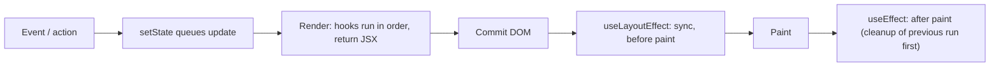

# React - Hooks

> [!info] Deep dive of [[React]]

> [!abstract] TL;DR
> Hooks are functions that let components hold state, sync with external systems and reuse stateful logic. They only run in **Client Components** (state/effects) and must follow the **Rules of Hooks**: call them at the top level of components or custom hooks, never conditionally. In 2026 the big shifts are: **React Compiler 1.0 auto-memoizes** (so `useMemo`/`useCallback` are mostly unnecessary), **Actions hooks** (`useActionState`, `useOptimistic`, `useFormStatus`) handle mutations, and `use()` reads promises and context. Remember: **effects are for synchronizing with things outside React, not for data flow.**

## Concept
- React stores hook state in a **linked list on the component's fiber**, indexed by call order. That's why hooks can't be conditional: the order must be identical every render.
- Each render is a **snapshot**: props, state and handlers capture the values of that render (closures). Updates schedule a new render. They don't mutate the current one.
- Hook categories:
  - **State**: `useState`, `useReducer`.
  - **Context**: `useContext`, `use(Context)`.
  - **Refs**: `useRef`, `useImperativeHandle`.
  - **Effects**: `useEffect`, `useLayoutEffect`, `useInsertionEffect`, `useEffectEvent`.
  - **Performance**: `useMemo`, `useCallback`, `useTransition`, `useDeferredValue`.
  - **Actions**: `useActionState`, `useOptimistic`, `useFormStatus` (react-dom).
  - **Other**: `use`, `useId`, `useSyncExternalStore`, `useDebugValue`.

## How It Works



- `setState(x)` with `Object.is`-equal value → bail out (no re-render of children).
- Updates inside events, timeouts and promises are **batched automatically** (React 18+).
- `useEffect(fn, deps)`: runs after paint when deps changed (`Object.is` comparison). Cleanup runs before the next effect run and on unmount. **StrictMode in dev** mounts → unmounts → remounts to expose missing cleanups.
- **React Compiler** analyses components at build time and memoizes values, JSX and callbacks automatically. It relies on components following the Rules of React (pure render, no mutation of props/state).

## Practical Usage

### State: derive, don't sync
```tsx
// ❌ Redundant state + effect
const [fullName, setFullName] = useState("");
useEffect(() => setFullName(`${first} ${last}`), [first, last]);

// ✅ Derive during render
const fullName = `${first} ${last}`;
```
```tsx
// Functional updates when next state depends on previous
setCount(c => c + 1);
// useReducer for related state transitions
const [state, dispatch] = useReducer(cartReducer, initialCart);
```

### Effects: only for external systems
```tsx
useEffect(() => {
  const ws = new WebSocket(url);
  ws.onmessage = e => onMessage(JSON.parse(e.data));
  return () => ws.close();                         // cleanup is mandatory
}, [url]);                                         // onMessage via useEffectEvent to avoid reconnects

const onMessage = useEffectEvent((msg: Msg) => {   // 19.2: reads latest props/state, not a dependency
  if (msg.room === currentRoom) addMessage(msg);
});
```
- **Data fetching**: prefer RSC/server loaders or TanStack Query. If you must fetch in an effect, handle races:
```tsx
useEffect(() => {
  let ignore = false;
  fetchOrders(tenant).then(d => { if (!ignore) setOrders(d); });
  return () => { ignore = true; };
}, [tenant]);
```

### Actions (React 19)
```tsx
"use client";
function Composer({ send }: { send: (text: string) => Promise<void> }) {
  const [messages, addOptimistic] = useOptimistic(initial, (list, text: string) => [...list, { text, pending: true }]);
  const [error, submit, isPending] = useActionState(async (_prev: string | null, fd: FormData) => {
    const text = String(fd.get("text"));
    addOptimistic(text);
    try { await send(text); return null; } catch (e) { return "Failed to send"; }
  }, null);
  return (
    <form action={submit}>
      <input name="text" disabled={isPending} />
      {error && <p role="alert">{error}</p>}
    </form>
  );
}
```

### `use()` for promises and context
```tsx
function OrderDetails({ orderPromise }: { orderPromise: Promise<Order> }) {
  const order = use(orderPromise);               // suspends until resolved; wrap in <Suspense>
  const theme = use(ThemeContext);               // can be called conditionally (unlike useContext)
  return <Card theme={theme}>{order.id}</Card>;
}
```

### Custom hooks: reuse logic, not state
```tsx
function useOnlineStatus() {
  return useSyncExternalStore(
    cb => { addEventListener("online", cb); addEventListener("offline", cb); return () => { removeEventListener("online", cb); removeEventListener("offline", cb); }; },
    () => navigator.onLine,
    () => true,                                   // server snapshot
  );
}
```
- Each component calling a custom hook gets its **own** state. Hooks share logic, not data (use context or stores for shared data).

### Transitions
```tsx
const [isPending, startTransition] = useTransition();
const onSearch = (q: string) => { setQuery(q); startTransition(() => setFilter(q)); };   // urgent input, non-urgent list
const deferredQuery = useDeferredValue(query);                                               // lagging value for heavy renders
```

## Patterns & Anti-patterns
| Pattern | When | Anti-pattern to avoid |
|---|---|---|
| Derive values during render | Computed data | `useEffect` + `setState` to mirror props/state |
| Event handlers for user-caused side effects | Submit, click → API call | Effects that react to state "because the user clicked" |
| Key to reset state (`<Form key={id}>`) | Switching entities | Effects that reset state when an id changes |
| `useEffectEvent` for latest values in effects | Subscriptions with changing callbacks | Disabling `exhaustive-deps` lint |
| Server data via RSC/TanStack Query | Fetching | Hand-rolled fetch effects without race/caching handling |
| Actions hooks for forms | Mutations with pending/optimistic UI | Multiple `useState` flags (`loading`, `error`, `success`) |
| Compiler + no manual memo | New code | `useCallback` everywhere "just in case" |

## Performance & Trade-offs
- A re-render of a parent re-renders children unless they're memoized (the Compiler does this automatically).
- Context: every consumer re-renders when the value identity changes. Split contexts by update frequency, or use a store with selectors (Zustand, `useSyncExternalStore`).
- `useLayoutEffect` blocks paint. Use it only for measurements, and avoid it in SSR paths (warnings).
- Transitions keep input responsive but can show stale UI. Show `isPending` indicators.

## Tips & Reminders
> [!tip]
> - Turn on `eslint-plugin-react-hooks` (v6+ includes compiler diagnostics). Never silence `exhaustive-deps`. Restructure instead.
> - If an effect has no external system in it, it's probably unnecessary.
> - Name custom hooks `useX` and keep them pure and composable.
> - **In ZP's stack**: Supabase Realtime subscriptions → `useEffect` with cleanup (`channel.unsubscribe()`). Form mutations in Next.js → Server Actions + `useActionState`. Avoid global stores for server data.

## Version Notes
| Version | Change |
|---|---|
| 16.8 (2019) | Hooks introduced |
| 18 (2022) | `useTransition`, `useDeferredValue`, `useId`, `useSyncExternalStore`, automatic batching. StrictMode double effects |
| 19.0 (2024-12) | `use`, `useActionState` (replaces `useFormState`), `useOptimistic`, `useFormStatus`. Ref as prop |
| 19.2 (2025-10) | `useEffectEvent` stable, `<Activity>` interplay with effects |
| Compiler 1.0 (2025-10) | Automatic memoization. Manual memo mostly unnecessary |

## Critical Issues & Gotchas
> [!danger] Stale closures
> Handlers and effects capture values from the render they were created in. Intervals or subscriptions created once (`[]` deps) read **stale state** forever. Use functional updates, refs, or `useEffectEvent`.

> [!warning] Gotchas
> - Infinite loops: an effect that sets state it depends on, or object/array deps recreated each render.
> - Missing cleanup → leaked listeners, sockets, timers (StrictMode shows it in dev).
> - Hooks in Server Components → error. Add `"use client"` to the component using them.
> - `useState(expensiveFn())` runs every render. Use lazy init `useState(() => expensiveFn())`.
> - Mutating state objects (`state.items.push(x); setState(state)`) → no re-render. Create new objects.

## Related
- [[React]]
- [[React - Server Components]] — where hooks don't run
- [[Next.js]] — Server Actions with Actions hooks
- [[JavaScript - Event Loop & Async]] — batching, transitions, async effects
- [[TypeScript]] — typing hooks and reducers

## References
- Hooks reference: https://react.dev/reference/react/hooks
- You Might Not Need an Effect: https://react.dev/learn/you-might-not-need-an-effect
- React 19 release: https://react.dev/blog/2024/12/05/react-19
- React Compiler: https://react.dev/learn/react-compiler
