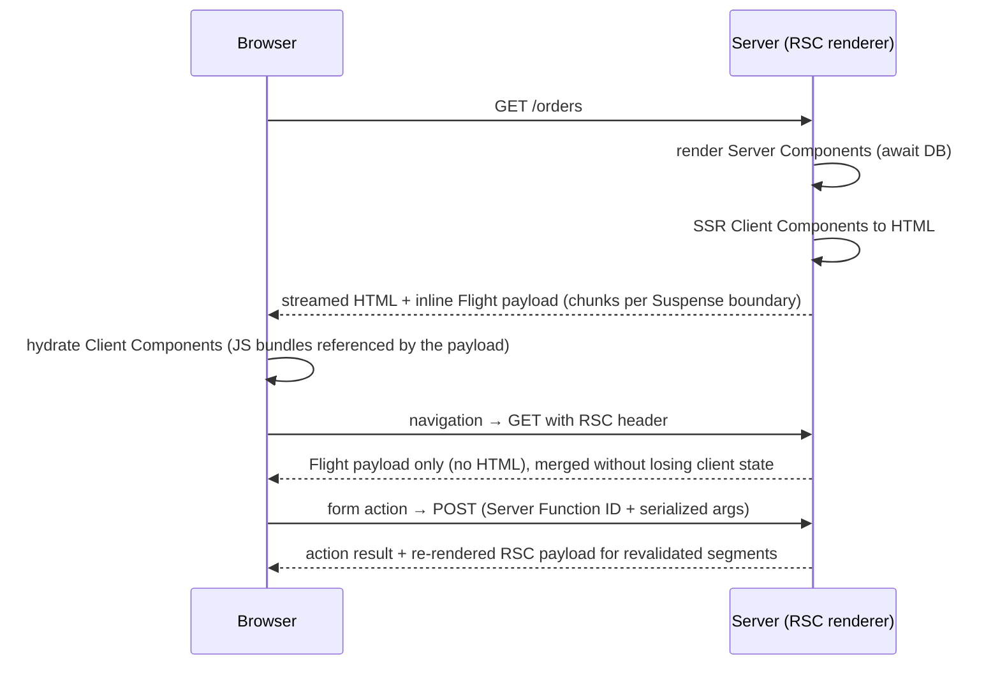

# React - Server Components

> [!info] Deep dive of [[React]]

> [!abstract] TL;DR
> React Server Components (RSC) render **only on the server** (at build or request time), can be `async`, can read databases and secrets directly, and ship **zero JS** to the browser. Their output is a serialized tree (the **Flight** payload) that the client merges with interactive **Client Components** (`"use client"`). **Server Functions** (`"use server"`) are the reverse direction: RPC from client to server. Remember: **the `"use client"` / `"use server"` directives are network boundaries.** Everything crossing them is serialized and, for Server Functions, publicly callable.

## Concept
| | Server Component | Client Component | Server Function |
|---|---|---|---|
| Directive | none (default in RSC frameworks) | `"use client"` at module top | `"use server"` (file or function) |
| Runs | Server only | Server (SSR) + browser | Server, invoked via HTTP POST from the client |
| Can | `async/await`, DB, secrets, heavy libs | State, effects, events, browser APIs | Mutations, revalidation, redirects |
| Can't | Hooks with state/effects, event handlers | Import server-only modules | Trust its arguments (they come from the user) |
| Ships JS | No | Yes | Only a reference ID |

- **Composition rule**: Server Components can render Client Components and pass them serializable props, including **other Server Components as `children`**. Client Components can't import Server Components, but can receive them as props/children.
- **Serializable props**: primitives, plain objects/arrays, `Date`, `Map`/`Set`, typed arrays, Promises (streamed), JSX, and Server Function references. **Not** class instances or arbitrary functions.

## How It Works



- **Flight payload**: a line-delimited stream that describes the element tree, references to client modules (`I` rows) and resolved/pending data. Suspense boundaries stream in as their promises resolve.
- **Bundling**: the bundler builds separate module graphs. `"use client"` marks an entry into the client graph, and `"use server"` exports become callable references with stable IDs.
- **Caching hooks**: `React.cache(fn)` dedupes calls within one request render. Frameworks layer persistent caching on top (`"use cache"` in [[Next.js - Caching]]).
- **Security-critical**: the server **deserializes** client-sent Flight data for Server Function calls. That decoder was the site of **React2Shell**.

## Practical Usage

### Server Component with direct data access
```tsx
// app/orders/page.tsx (Server Component)
import "server-only";
import { createClient } from "@/lib/supabase/server";
import { OrderTable } from "./order-table";            // client component

export default async function OrdersPage() {
  const supabase = await createClient();                // per-request, user session cookies
  const { data: orders } = await supabase.from("orders").select("id,total,status").limit(50);  // RLS applies
  return <OrderTable orders={orders ?? []} />;          // serializable props only
}
```

### Client island, kept small
```tsx
"use client";
export function OrderTable({ orders }: { orders: OrderRow[] }) {
  const [sort, setSort] = useState<"total" | "status">("total");
  // interactive sorting only — data came from the server
}
```

### Streaming with Suspense
```tsx
export default function Dashboard() {
  return (
    <>
      <Header />                                         {/* fast, static */}
      <Suspense fallback={<Skeleton />}>
        <RevenueChart />                                 {/* async server component, streams in later */}
      </Suspense>
    </>
  );
}
```

### Server Function: validate + authorize every call
```ts
"use server";
export async function archiveOrder(orderId: string) {
  const user = await requireUser();                                  // authn
  const id = z.string().uuid().parse(orderId);                       // validate
  const ok = await db.order.updateMany({ where: { id, tenantId: user.tenantId }, data: { archived: true } }); // authz in query
  if (!ok.count) throw new Error("Not found");
  revalidatePath("/orders");
}
```

### Passing Server Components through Client Components
```tsx
// layout (server)
<Sidebar>                     {/* client: collapsible state */}
  <ServerNavLinks />          {/* server: reads permissions from DB, rendered on server */}
</Sidebar>
```

## Patterns & Anti-patterns
| Pattern | When | Anti-pattern to avoid |
|---|---|---|
| Fetch in Server Components, close to where data is used | Page/segment data | Client-side fetch waterfalls in effects |
| `"use client"` at the leaves (buttons, inputs, charts) | Interactivity | `"use client"` on layouts → whole app becomes client JS |
| `Promise.all` / parallel async components | Independent data | Sequential awaits creating server waterfalls |
| `import "server-only"` in secret-touching modules | DB clients, API keys | Accidentally importing server code into client bundles |
| `taintObjectReference`/`taintUniqueValue` | Prevent passing secrets/user objects to client | Passing whole DB rows (with hashes/tokens) as props |
| Server Functions as thin, validated entry points | Mutations | Business logic trusting client-sent IDs/prices |

## Performance & Trade-offs
- **Bundle size**: server-only dependencies (markdown parsers, date libs, SDKs) cost zero client JS. The biggest RSC win.
- **TTFB vs streaming**: awaiting everything at the top delays the first byte. Wrap slow parts in Suspense so the shell streams immediately.
- **Payload size**: big props are serialized twice (HTML + Flight). Pass only needed fields.
- **Server load**: rendering moves CPU from clients to your servers. Cache wisely (see [[Next.js - Caching]]).
- **Waterfalls** shift to the server, where they're faster (DB nearby) but still additive. Parallelize.

## Tips & Reminders
> [!tip]
> - Default to Server Components. Add `"use client"` only when you need state, effects, event handlers or browser APIs.
> - Treat every Server Function as a **public POST endpoint**: authenticate, validate (Zod), authorize, rate-limit.
> - Keep secrets out of props. Anything passed to a Client Component is visible in page source.
> - **In ZP's stack**: [[Supabase]] → create the server client per request with cookies (`@supabase/ssr`). Never import the service-role client into a module reachable from a Client Component. Patch React/Next immediately on RSC advisories.

## Version Notes
| Version | Change |
|---|---|
| RFC (2020-12) | Server Components announced as experimental |
| Next.js 13.4 (2023-05) | First stable production RSC framework (App Router) |
| React 19.0 (2024-12) | RSC + Server Functions stable for frameworks. `use`, Actions |
| React 19.2 (2025-10) | `cacheSignal`, partial pre-rendering primitives |
| 19.0.1 / 19.1.2 / 19.2.1 (2025-12) | **React2Shell** fix + follow-up DoS/source-exposure fixes |
| 2025–26 | RSC support in React Router v7, Parcel, Vite plugins (expanding beyond Next.js) |

## Critical Issues & Gotchas
> [!danger] React2Shell — CVE-2025-55182 (CVSS 10.0)
> Unsafe deserialization in the Flight protocol's server-side decoder allowed **pre-auth RCE** with one HTTP request against any app exposing Server Functions/RSC endpoints. Mass-exploited from Dec 2025. Follow-ups: CVE-2025-55184 (DoS) and CVE-2025-55183 (Server Function source exposure). **Stay on the latest React/Next patch**, and treat RSC endpoints as internet-facing parsers.

> [!warning] Gotchas
> - Closures in Server Functions defined inline in Server Components capture values that are **encrypted and sent to the client** and back. Don't capture secrets.
> - Context providers must be Client Components. Wrap `children` in a small client provider.
> - `Date`, `Map` etc. serialize, but class instances (e.g. Decimal, ORM models) don't. Convert to plain data.
> - Hydration mismatches when Server and Client render differently (time, locale, random IDs).
> - "Server Component" ≠ "SSR": Client Components are also server-rendered to HTML, then hydrated.

## Related
- [[React]]
- [[React - Hooks]] — client-side counterpart
- [[Next.js]] · [[Next.js - App Router & Rendering Strategies]] · [[Next.js - Caching]]
- [[Supabase]] — server-side data access with RLS

## References
- Server Components reference: https://react.dev/reference/rsc/server-components
- Server Functions: https://react.dev/reference/rsc/server-functions
- Directives: https://react.dev/reference/rsc/directives
- React2Shell advisory: https://react.dev/blog/2025/12/03/critical-security-vulnerability-in-react-server-components
