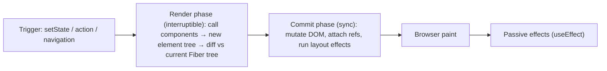

# React

> [!abstract] TL;DR
> React is a library for building UIs as a **pure function of state**: components return elements, and React reconciles changes onto the DOM (or native views). In 2026 React is a **client + server** model: Server Components render on the server with zero client JS, Client Components (`"use client"`) hydrate for interactivity, and Actions handle mutations. The **React Compiler 1.0** auto-memoizes, so manual `useMemo`/`useCallback` is mostly obsolete. Use it through a framework ([[Next.js]]). Don't hand-roll SSR/RSC.

## Introduction
- Created at Facebook by Jordan Walke, open-sourced May 2013, MIT license. Governance moved to the independent **React Foundation** (under the Linux Foundation) in late 2025, with Meta, Vercel, Microsoft and others as members.
- It solves the problem of keeping complex, changing UIs consistent with data through a declarative model, one-way data flow and a component model.
- Renderers: `react-dom` (web), `react-native` (iOS/Android), plus custom renderers (react-three-fiber, Ink).
- Where it sits: the view layer under meta-frameworks ([[Next.js]], React Router v7/Remix, TanStack Start, Expo). The React team recommends starting with a framework, and Create React App was deprecated in Feb 2025.

## Core Concepts

### Components, props, state
```tsx
type Props = { initial?: number };
export function Counter({ initial = 0 }: Props) {
  const [count, setCount] = useState(initial);
  return <button onClick={() => setCount(c => c + 1)}>Clicked {count}×</button>;
}
```
- Components must be **pure during render**: same props/state → same output, no side effects. StrictMode double-invokes render in dev to surface impurity.
- State is a **snapshot** per render. Use updater functions (`c => c + 1`) when the next state depends on the previous one. Updates are batched automatically (React 18+).

### Hooks (rules: top level only, only in components/hooks)
| Hook | Use |
|---|---|
| `useState` / `useReducer` | Local state |
| `useEffect` | Sync with **external systems** (subscriptions, DOM APIs). Not for derived data or event logic |
| `useLayoutEffect` | Measure DOM before paint |
| `useRef` | Mutable box / DOM handle, doesn't re-render |
| `useContext` / `use(Context)` | Read context |
| `useMemo` / `useCallback` / `memo` | Manual memoization. Mostly unnecessary with React Compiler |
| `useTransition` / `useDeferredValue` | Mark updates non-urgent (concurrent rendering) |
| `useActionState` / `useFormStatus` / `useOptimistic` | Actions, pending states, optimistic UI (19) |
| `use(promise)` | Suspend on a promise during render (19) |
| `useEffectEvent` | Non-reactive event logic inside effects (19.2) |
| `useId`, `useSyncExternalStore` | SSR-safe IDs, external store subscriptions |

### Server vs Client Components
| | Server Component (default in RSC frameworks) | Client Component (`"use client"`) |
|---|---|---|
| Runs | Server only (build or request time) | Server (SSR HTML) + browser (hydration) |
| Can | `async/await` data, read DB/secrets, import heavy libs at zero client cost | State, effects, event handlers, browser APIs |
| Cannot | Hooks with state/effects, event handlers | Access server-only resources directly |
| Ships JS | No | Yes |

```tsx
// app/orders/page.tsx — Server Component
export default async function Orders() {
  const orders = await db.order.findMany({ take: 20 });     // runs on server
  return <OrderTable orders={orders} />;                    // OrderTable may be a client component
}
```
- `"use client"` marks a **boundary**: that module and its imports become client code. Props crossing it must be serializable (no functions except Server Functions).
- **Server Functions** (`"use server"`) are RPC endpoints callable from the client (forms, Actions). Every one is a **public HTTP endpoint**: authenticate and validate inside it.

### Actions & forms (19)
```tsx
"use client";
export function RenameForm({ rename }: { rename: (prev: State, fd: FormData) => Promise<State> }) {
  const [state, action, pending] = useActionState(rename, { error: null });
  return (
    <form action={action}>
      <input name="name" disabled={pending} />
      {state.error && <p role="alert">{state.error}</p>}
    </form>
  );
}
```

### Other 19.x features
- `ref` is a regular prop (no `forwardRef`), ref cleanup functions, `<Context>` as provider.
- Document metadata (`<title>`, `<meta>`, `<link>`) hoists to `<head>`. Stylesheet precedence and preloading APIs (`preload`, `preinit`).
- `<Activity mode="hidden">` (19.2) keeps hidden UI state and defers its updates, which suits tabs and back-navigation.
- `<Suspense>` + streaming SSR. `cacheSignal` for RSC. Partial pre-rendering primitives in `react-dom` (19.2).

## Architecture / How It Works



- **Fiber**: each component instance is a fiber node. Rendering is split into units of work that can **pause, resume or be discarded** (concurrent rendering). Priorities come from **lanes** (sync input > transition > idle).
- **Reconciliation**: the same element type at the same position preserves state, and **`key`** identifies list items. Changing `key` deliberately resets a subtree.
- **Hydration**: the server sends HTML, then the client attaches listeners and checks markup. Selective hydration hydrates Suspense boundaries independently and prioritizes the ones the user interacts with.
- **RSC payload ("Flight")**: Server Components serialize to a streaming format describing the tree + client component references + props. The client merges it without losing client state. This deserializer was the site of **React2Shell** (see below).
- **React Compiler** (Babel/SWC plugin, 1.0 Oct 2025): it analyzes components and inserts fine-grained memoization at build time. It requires code that follows the Rules of React, and bails out per component when it detects violations (`eslint-plugin-react-hooks` reports them).

## Project Structure
```text
# Vite SPA (client-only React)
src/
├── main.tsx              # createRoot(document.getElementById("root")!).render(<App />)
├── App.tsx
├── components/           # presentational, reusable
├── features/<name>/      # feature folders: components + hooks + api + tests colocated
├── hooks/
└── lib/                  # api client, zod schemas, utils
```
- For SSR/RSC/routing, use [[Next.js]] (App Router) or React Router v7 framework mode. The folder conventions then come from the framework.
- Enable the compiler: `babel-plugin-react-compiler` (Vite) or `reactCompiler: true` (Next.js 16). Lint with `eslint-plugin-react-hooks` v6+ (includes compiler rules).

## Use Cases
| Use case | Why it fits |
|---|---|
| SaaS dashboards, admin panels | Component model + ecosystem (TanStack Query/Table, shadcn/ui) |
| Content + app hybrids (marketing + app) | RSC/SSR for SEO and speed, client islands for interactivity |
| Cross-platform mobile ([[React Native]]) | Same mental model and some shared logic |
| Embeddable widgets (chat, booking) | Small client bundles via Preact/React islands |
| AI chat UIs | Streaming RSC/Suspense, Vercel AI SDK `useChat` |

## Pros & Cons
| Pros | Cons |
|---|---|
| Biggest ecosystem and hiring pool in frontend | Framework coupling: RSC realistically means Next.js/Vercel-led tooling |
| Declarative model scales to large teams | Mental-model churn (classes → hooks → RSC → compiler) |
| RSC: zero-JS server rendering, direct data access | Server/client boundary bugs (serialization, accidental client bloat, secret leaks) |
| Compiler removes most memoization busywork | Larger runtime than Svelte/Solid. VDOM overhead on huge lists |
| Strong backward compatibility within majors | Effects are easy to misuse (fetch waterfalls, sync loops) |

## Alternatives & Peers
| Alternative | Strength vs React | Weakness vs React | Pick it when… |
|---|---|---|---|
| Vue 3 | Gentler learning curve, SFCs, Vapor mode (no VDOM) | Smaller ecosystem/hiring pool outside Asia | Teams preferring templates, Laravel shops |
| Svelte 5 / SvelteKit | Compiled, tiny bundles, runes reactivity | Smaller ecosystem | Performance-sensitive sites, small teams |
| SolidJS | Fine-grained signals, React-like JSX, very fast | Niche ecosystem | Perf-critical interactive UIs |
| Angular | Batteries-included, signals, enterprise conventions | Heavy, verbose | Large enterprise teams wanting one blessed way |
| [[Astro]] | Content-first, ships zero JS by default, islands (can host React) | Not for app-like UIs | Marketing/docs/blog sites |
| [[Flutter]] (web) | One codebase with mobile | Poor SEO, canvas rendering | Internal tools for Flutter-first teams |

## Tips & Reminders
> [!tip] Effects
> "You might not need an effect." Derive values during render, handle user events in handlers, and fetch with RSC / TanStack Query / framework loaders, not `useEffect` + `useState`. Use an effect only to sync with something outside React.

> [!tip] State placement
> Server data → RSC or TanStack Query (cache). URL state → search params. Form state → Actions / React Hook Form. Global client state → Zustand/Jotai only if needed. Don't put server data in global stores.

> [!tip] Performance
> Turn on React Compiler first, then measure with React DevTools Profiler + Performance Tracks (19.2). Virtualize long lists (TanStack Virtual). Keep `"use client"` boundaries as **leaves**.

> [!tip] In ZP's stack
> - [[Supabase]] in RSC: create a per-request server client (`@supabase/ssr`) and never share it across requests. RLS still applies, so pass the user's session, not the service key.
> - WhatsApp/agent dashboards: stream LLM output via Server Components + Suspense, or the AI SDK. Keep message lists virtualized.
> - Share Zod schemas between Server Functions and client forms.

## Versions & Breaking Changes
| Version | Released | Key changes | Breaking / migration notes |
|---|---|---|---|
| 16.8 | 2019-02 | Hooks | — |
| 17 | 2020-10 | New JSX transform, event delegation on root | No new features ("stepping stone") |
| 18 | 2022-03 | Concurrent rendering, automatic batching, `createRoot`, streaming SSR, `useTransition` | `ReactDOM.render` deprecated. StrictMode double effects in dev |
| 19.0 | 2024-12-05 | Actions, `use`, `useActionState`, `useOptimistic`, RSC stable, ref as prop, metadata | Removed: `propTypes`/`defaultProps` on functions, string refs, legacy context, `ReactDOM.render/hydrate`, UMD builds. Codemod: `npx codemod react/19/migration-recipe` |
| 19.1 | 2025-03 | Owner stacks, Suspense improvements | — |
| 19.2 | 2025-10-01 | `<Activity>`, `useEffectEvent`, `cacheSignal`, Performance Tracks, partial pre-rendering | `eslint-plugin-react-hooks` v6 flat config |
| Compiler 1.0 | 2025-10 | Stable automatic memoization | Opt-in per project |
| 19.0.1 / 19.1.2 / 19.2.1 | 2025-12-03 | React2Shell fix (see below) | **Mandatory** for any RSC app |
| **19.3** | 2026-09-09 | Current stable | — |

> [!warning] Unverified — check before relying on this
> 19.3's feature list wasn't verified this run. React 20 isn't released, and RFCs only discuss it. Check https://react.dev/versions.

## Critical Issues & Gotchas
> [!danger] React2Shell — CVE-2025-55182 (CVSS 10.0, Dec 2025)
> Pre-auth **RCE** via unsafe deserialization in the RSC Flight protocol (`react-server-dom-*`), reachable with a single crafted HTTP request to any app using Server Components/Functions (Next.js App Router included, tracked there as CVE-2025-66478). Exploited within hours by multiple actors, including China-nexus groups deploying Linux backdoors. Affected 19.0.0, 19.1.0–19.1.1 and 19.2.0. Fixed in 19.0.1 / 19.1.2 / 19.2.1. Follow-up DoS and source-code-exposure bugs (CVE-2025-55184, CVE-2025-55183, and an incomplete-fix CVE) required **further** patches, so stay on the latest patch.

> [!danger] Server Functions are public endpoints
> `"use server"` functions get stable IDs callable by anyone who can reach the site. Missing auth or validation inside them = IDOR or unauthorized writes. Closures over server values can leak into the client payload. Use `server-only` imports and the `taint` APIs for secrets.

> [!warning] Common footguns
> - `useEffect` fetch without cleanup → race conditions (stale response overwrites the newer one).
> - Using array index as `key` in reorderable lists → state attaches to the wrong row.
> - Object/array literals in context `value` re-render every consumer (less relevant with the compiler).
> - Hydration mismatch from `Date.now()`, `Math.random()`, `window` checks or locale formatting during render. Render it on the client after mount, or use `suppressHydrationWarning` sparingly.
> - Importing a heavy lib into a `"use client"` module ships it to every user. Check the bundle analyzer.

## Deep Dives
- (planned) [[React - Hooks]]
- (planned) [[React - Server Components]]

## Related
- [[Next.js]] — primary React framework in ZP's stack
- [[JavaScript]] · [[TypeScript]]
- [[React Native]] — mobile renderer
- [[Tailwind CSS]] — default styling pairing
- [[Supabase]] — data/auth from RSC and Server Functions

## References
- Docs: https://react.dev
- Versions: https://react.dev/versions
- React 19.2 release: https://react.dev/blog/2025/10/01/react-19-2
- React Compiler: https://react.dev/learn/react-compiler
- React2Shell advisory: https://react.dev/blog/2025/12/03/critical-security-vulnerability-in-react-server-components
- Google TI on React2Shell exploitation: https://cloud.google.com/blog/topics/threat-intelligence/threat-actors-exploit-react2shell-cve-2025-55182
