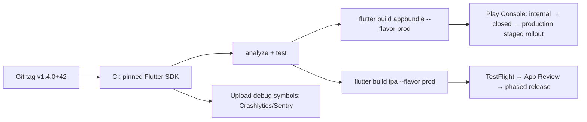

# Flutter - Build, Release & Store Compliance

> [!info] Deep dive of [[Flutter]]

> [!abstract] TL;DR
> Shipping a Flutter app takes four things:
> - **Reproducible builds**: pinned Flutter SDK, flavors, `--dart-define-from-file`.
> - **Correct signing**: Play App Signing + upload key; Apple certificates and profiles via automatic signing or fastlane match.
> - **Automated CI-CD to the stores**: TestFlight / Play internal track.
> - **Staying ahead of store rules**, which change yearly.
>
> 2026 hard gates:
> - **Google Play**: new apps and updates must target **API 36 (Android 16) from 2026-08-31** (extension to 2026-11-01 on request).
> - **App Store Connect**: uploads must be built with **Xcode 26 / iOS 26 SDK since 2026-04-28**.
>
> Missing a deadline doesn't break live apps, but it **blocks your next hotfix**.

## Concept

### Build pipeline


### Versioning
- `pubspec.yaml`: `version: 1.4.0+42` → `versionName`/`CFBundleShortVersionString` = `1.4.0`, `versionCode`/`CFBundleVersion` = `42`.
- The build number must **strictly increase** per store upload. Derive it from CI (`--build-number=$GITHUB_RUN_NUMBER`), not by hand.
- Override at build time: `flutter build appbundle --build-name=1.4.0 --build-number=42`.

### Flavors and environment config
| Concern | Mechanism |
|---|---|
| Separate app IDs (dev/staging/prod installed side by side) | Android `productFlavors` + iOS schemes/xcconfigs, `flutter build --flavor staging` |
| Per-environment config (API URL, Supabase anon key) | `--dart-define-from-file=env/staging.json` → `String.fromEnvironment('API_URL')` |
| Firebase per flavor | `flutterfire configure` per flavor, separate `google-services.json` / `GoogleService-Info.plist` |
| App name/icon per flavor | Flavor resources (`android/app/src/staging/res`), iOS asset catalogs per scheme, `flutter_launcher_icons` |

```json
// env/prod.json — public client config only; never service-role keys or secrets
{ "API_URL": "https://api.example.my", "SUPABASE_URL": "https://xyz.supabase.co", "SUPABASE_ANON_KEY": "eyJ..." }
```

> [!danger] Anything in the binary is public
> `--dart-define` values, assets, and `.env` files bundled in the app are extractable from any APK/IPA in minutes, and `--obfuscate` doesn't change that. Only ship publishable keys (e.g. the Supabase anon key protected by RLS). Secrets stay on the server ([[Supabase]] Edge Functions, [[n8n]] webhooks).

## How It Works

### Android signing
- **Play App Signing** (mandatory for AAB): Google holds the **app signing key**. You sign uploads with an **upload key**, and a lost upload key can be reset via Play support. A lost app signing key (pre-Play-App-Signing apps) means you can never update the app.
- `android/key.properties` (gitignored) → `signingConfigs.release` in `build.gradle.kts`. In CI, store the keystore base64-encoded as a secret.
- Output: an **AAB** (`flutter build appbundle`). Play generates per-ABI/density APKs. Use APKs only for sideload/enterprise distribution.

### iOS signing
- You need an **Apple Distribution certificate**, an **App Store provisioning profile** per bundle ID (and per extension, e.g. notification service), plus capabilities (push, associated domains) enabled on the App ID.
- Options:
  - **Xcode automatic signing**: fine for solo work.
  - **fastlane match**: certs/profiles encrypted in a private repo, ideal for CI.
  - **App Store Connect API key** (`.p8`): lets CI upload without 2FA.
- `flutter build ipa --export-options-plist=ios/ExportOptions.plist` → upload with `xcrun altool` / Transporter / fastlane `pilot`.

### Release channels
| Store | Testing tracks | Rollout |
|---|---|---|
| Google Play | Internal (≤100 testers, minutes), closed, open | **Staged rollout** % with halt; managed publishing to time releases |
| Apple | TestFlight internal (no review), external (beta review) | **Phased release** over 7 days (pausable), or manual release after approval |

> [!warning] New personal Play developer accounts
> Personal accounts created after 2023-11-13 must run a **closed test with ≥12 testers opted in for 14 consecutive days** before applying for production access. Plan this into client timelines, or publish under the client's **organization** account (requires a D-U-N-S number), which is exempt.

## Practical Usage

### Release commands
```bash
flutter build appbundle --release --flavor prod --dart-define-from-file=env/prod.json \
  --obfuscate --split-debug-info=build/symbols/android --build-number=$BUILD_NUMBER
flutter build ipa --release --flavor prod --dart-define-from-file=env/prod.json \
  --obfuscate --split-debug-info=build/symbols/ios --build-number=$BUILD_NUMBER
```

### GitHub Actions skeleton (Android)
```yaml
jobs:
  android:
    runs-on: ubuntu-latest
    steps:
      - uses: actions/checkout@v4
      - uses: subosito/flutter-action@v2
        with: { flutter-version: 3.47.x, channel: stable, cache: true }
      - run: flutter pub get && flutter analyze && flutter test
      - run: echo "$UPLOAD_KEYSTORE_B64" | base64 -d > android/app/upload.jks
        env: { UPLOAD_KEYSTORE_B64: "${{ secrets.UPLOAD_KEYSTORE_B64 }}" }
      - run: flutter build appbundle --release --flavor prod --dart-define-from-file=env/prod.json --build-number=${{ github.run_number }}
      - uses: r0adkll/upload-google-play@v1
        with: { serviceAccountJson: sa.json, packageName: my.example.app, releaseFiles: "build/app/outputs/bundle/prodRelease/*.aab", track: internal }
```
iOS needs a `macos-*` runner (or Codemagic / Xcode Cloud) and fastlane match + an App Store Connect API key.

### Store compliance checklist (2026)
| Requirement | Store | Notes |
|---|---|---|
| **Target API 36** for new apps/updates | Play | From 2026-08-31, extension to 2026-11-01. Existing apps below API 35 are hidden from new users on newer Android versions |
| **16 KB memory page size** support | Play | Required for apps targeting Android 15+ since 2025-11-01. Native libs (plugins, FFI `.so`) must be 16 KB aligned. Recent Flutter + NDK r28 handle the engine; check third-party plugins |
| **Xcode 26 / iOS 26 SDK** builds | Apple | Since 2026-04-28. Deployment target can stay lower |
| **Privacy manifest** (`PrivacyInfo.xcprivacy`) | Apple | Declare data collected and "required reason" APIs (UserDefaults, file timestamps, disk space). Commonly used SDKs must ship their own signed manifests |
| **Data safety form** | Play | Must match actual SDK behaviour (analytics, crash reporting, ads) |
| **In-app account deletion** + web deletion link | Both | Any app with account creation. Play requires a web URL too |
| **Sign in with Apple** | Apple | Required if offering third-party/social login, unless an exemption applies (guideline 4.8) |
| **App Tracking Transparency** prompt | Apple | Before cross-app tracking / IDFA |
| **IAP for digital goods** | Both | Physical goods/services (e-commerce, bookings) may use Stripe/Billplz/FPX. Digital content/subscriptions must use store billing (regional exceptions vary) |
| Minimum functionality (4.2) | Apple | Thin WebView wrappers get rejected. Add native value (push, offline, device features) |

## Patterns & Anti-patterns
| Pattern | When | Anti-pattern to avoid |
|---|---|---|
| Pin Flutter via FVM / `.fvmrc` or the CI action version | Every project | "Works on my machine" SDK drift |
| Flavors + `--dart-define-from-file` | Any app with staging | `if (kDebugMode) useStagingUrl` hacks |
| Internal/TestFlight build on every merge to main | Client projects | Manual builds from a laptop the night before release |
| Staged/phased rollout + crash monitoring | Production releases | 100% release on Friday evening |
| Track store-deadline dates in your project calendar | Maintenance retainers | Discovering the API-level block during an urgent hotfix |
| Client owns the developer accounts, you're added as a user | Client work | Publishing client apps under your own account (ownership/liability transfer pain) |

## Performance & Trade-offs
- **Codemagic / Xcode Cloud** remove macOS hardware needs but are paid beyond free minutes. **GitHub Actions macOS runners** cost ~10× Linux minutes. Self-hosted Mac mini is cheapest long term but is yours to maintain.
- **OTA code push (Shorebird)** patches Dart code without a store review, so it's fast for hotfixes. It's a third-party dependency, and native/plugin changes still need a store build. Apple allows it only if patches don't change the app's primary purpose.
- Obfuscation shrinks the binary slightly and deters casual reverse engineering, but adds symbol-management overhead for every release.

## Tips & Reminders
> [!tip]
> - Keep a `RELEASE.md` per client project: account owners, bundle IDs, keystore location, who holds 2FA, store deadlines.
> - Store `upload-keystore.jks` + passwords in a password manager **and** an offline backup. Losing it costs days of Play support back-and-forth.
> - Run `flutter build appbundle` locally after every Flutter/AGP/Kotlin upgrade, before CI does. Gradle breakage is the #1 upgrade failure.
> - **In ZP's stack**: build on GitHub Actions (Linux for Android, macOS runner or Codemagic for iOS). Inject Supabase URL/anon key per flavor. Upload symbols to Sentry/Crashlytics per build, and notify the client via [[n8n]] when a TestFlight/internal build is ready.

## Version Notes
| Date / Version | Change |
|---|---|
| 2021-08 | Play requires AAB for new apps |
| 2022-06 | Apple requires in-app account deletion |
| 2023-11 | Play: 12 testers × 14 days closed testing for new personal accounts |
| 2024-05 | Apple enforces privacy manifests / required-reason APIs |
| 2025-11-01 | Play: 16 KB page-size support for apps targeting Android 15+ |
| **2026-04-28** | Apple: Xcode 26 / iOS 26 SDK required for uploads |
| **2026-08-31** | Play: target API 36 for new apps and updates (extension to 2026-11-01) |

## Critical Issues & Gotchas
> [!danger] Store deadlines block hotfixes, not just features
> When a target-API or SDK deadline passes, the store rejects your next upload. If a production bug appears then, you must first upgrade Flutter, AGP, Gradle, Kotlin, Xcode and every plugin under time pressure. Bump the target **months before** the deadline in a calm maintenance release.

> [!danger] Account ownership and key custody
> Apps published under a freelancer's account can't simply be handed over (Play app transfer and Apple app transfer both have prerequisites, and Apple transfers fail with certain entitlements). A lost Play signing key on legacy apps or a departed developer holding the only Apple 2FA device can freeze a client's app. Define ownership in the contract and SOP.

> [!warning] Gotchas
> - The iOS build number must be unique per **version** in App Store Connect. Re-uploading the same `+42` fails at upload.
> - `--flavor` requires matching iOS schemes. A missing scheme fails with an obscure Xcode error.
> - Plugins with outdated native code (no 16 KB alignment, old AGP namespace, missing privacy manifest) block releases. Audit `pubspec.lock` before deadline seasons.
> - Android `minSdk` changes in new Flutter versions drop old devices. Check your user analytics before upgrading.
> - App Review rejections for missing demo credentials are common. Always provide a test account in review notes.

## Related
- [[Flutter]]
- [[Dart - VM, Compilation & Garbage Collection]] — AOT, obfuscation, debug symbols
- [[Flutter - Performance & DevTools]] — app size analysis
- [[Flutter - Testing]] — CI test gate before release
- [[CI-CD]] — pipelines in general
- [[Supabase]] — per-flavor backend config

## References
- Flutter Android deployment: https://docs.flutter.dev/deployment/android
- Flutter iOS deployment: https://docs.flutter.dev/deployment/ios
- Flutter flavors: https://docs.flutter.dev/deployment/flavors
- Play target API requirements: https://developer.android.com/google/play/requirements/target-sdk
- Play target API extension: https://support.google.com/googleplay/android-developer/answer/11926878
- Apple upcoming requirements: https://developer.apple.com/news/upcoming-requirements/
- Apple privacy manifest: https://developer.apple.com/documentation/bundleresources/privacy-manifest-files
- App Review Guidelines: https://developer.apple.com/app-store/review/guidelines/
