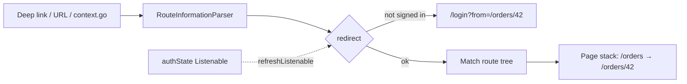

# Flutter - Navigation & Routing

> [!info] Deep dive of [[Flutter]]

> [!abstract] TL;DR
> Flutter has an imperative **Navigator** (push/pop a stack) and a declarative **Router** API that maps URLs to pages. Use **go_router** (Flutter team, now 18.x) as the default for apps. It gives you:
> - URL-based routes and nested routes
> - `redirect` for auth guards
> - `StatefulShellRoute` for bottom-nav tabs that keep their state
> - type-safe routes via `go_router_builder`
> - deep links and web URLs out of the box
>
> Key rules:
> - Drive auth redirects from **one auth state listenable**.
> - Pass **IDs in the path**, not objects in `extra`.
> - Verify **App Links / Universal Links** domain files. Firebase Dynamic Links is gone, shut down in 2025.

## Concept

### Navigator vs Router
| | Navigator 1.0 (imperative) | Router / Navigator 2.0 (declarative) |
|---|---|---|
| API | `Navigator.push(context, MaterialPageRoute(...))`, `pop` | `RouterConfig` → `Router` parses URL → page stack |
| URLs / deep links | Manual (`onGenerateRoute`) | First-class |
| Web back/forward | Poor | Correct |
| Use directly when | Dialogs, bottom sheets, one-off flows | Rarely by hand. Use a package (go_router, auto_route) |

### go_router navigation verbs
| Call | Effect on the stack | Use for |
|---|---|---|
| `context.go('/orders/42')` | **Replaces** the stack with the route's hierarchy (`/orders` → `/orders/42`) | Tab switches, post-login, deep-link-like jumps |
| `context.push('/orders/42')` | Pushes on top. Can return a result (`await push<T>()`) | Detail screens, pickers returning values |
| `context.pushReplacement` / `replace` | Swaps the top page | Wizard steps |
| `context.pop([result])` | Pops the top page | Close / return a value |
| `context.goNamed('order', pathParameters: {'id': '42'})` | Named variant | Avoid string-building paths |

### Package options
| Package | Strength | Weakness | Pick it when… |
|---|---|---|---|
| **go_router** | Official (flutter/packages), simple, web-friendly, `redirect`, shell routes | Some API churn between majors. `extra` isn't URL-serializable | Default for most apps |
| auto_route | Codegen, strongly typed args, guards, nested routers | Codegen overhead, single maintainer org | Large apps wanting typed args everywhere |
| Plain Navigator | No deps | No deep links / web URLs | Tiny apps, prototypes |
| beamer / routemaster | Early Router 2.0 wrappers | Low maintenance activity | Avoid for new projects |

## How It Works

- The **route tree** maps path segments to builders. Nested `routes:` build the **stack** (parent pages under children), so the back button on `/orders/42` goes to `/orders`.
- `redirect` runs on every navigation **and** whenever `refreshListenable` notifies. Returning `null` means proceed. Returning a path means redirect. It can be async.
- **ShellRoute** wraps child routes in a persistent scaffold (bottom nav). **StatefulShellRoute.indexedStack** gives each tab its own Navigator, so each branch keeps its stack and scroll state when switching tabs.
- **Pop handling**: `PopScope(canPop: false, onPopInvokedWithResult: …)` replaces the deprecated `WillPopScope`. It's required for Android 14+ **predictive back** (the system needs to know in advance whether back is allowed).

## Practical Usage

### Router with auth redirect + tabs
```dart
final routerProvider = Provider<GoRouter>((ref) {
  final auth = ref.watch(authListenableProvider);        // ChangeNotifier fed by Supabase onAuthStateChange
  return GoRouter(
    initialLocation: '/orders',
    refreshListenable: auth,
    redirect: (context, state) {
      final signedIn = auth.session != null;
      final atLogin = state.matchedLocation == '/login';
      if (!signedIn) return atLogin ? null : '/login?from=${Uri.encodeComponent(state.uri.toString())}';
      if (atLogin) return state.uri.queryParameters['from'] ?? '/orders';
      return null;
    },
    routes: [
      GoRoute(path: '/login', builder: (_, __) => const LoginPage()),
      StatefulShellRoute.indexedStack(
        builder: (_, __, shell) => HomeScaffold(shell: shell),     // BottomNavigationBar → shell.goBranch(i)
        branches: [
          StatefulShellBranch(routes: [
            GoRoute(path: '/orders', builder: (_, __) => const OrdersPage(), routes: [
              GoRoute(path: ':id', builder: (_, s) => OrderDetailPage(id: s.pathParameters['id']!)),
            ]),
          ]),
          StatefulShellBranch(routes: [GoRoute(path: '/settings', builder: (_, __) => const SettingsPage())]),
        ],
      ),
    ],
    errorBuilder: (_, s) => NotFoundPage(uri: s.uri),
  );
});

// MaterialApp.router(routerConfig: ref.watch(routerProvider))
```

### Type-safe routes (go_router_builder)
```dart
@TypedGoRoute<OrderRoute>(path: '/orders/:id')
class OrderRoute extends GoRouteData with $OrderRoute {
  const OrderRoute({required this.id, this.tab = 'items'});
  final String id;
  final String tab;                                       // query param ?tab=
  @override
  Widget build(BuildContext context, GoRouterState state) => OrderDetailPage(id: id, tab: tab);
}
// const OrderRoute(id: '42').go(context);    → compile-checked params
```

### Deep links: domain verification files
```json
// https://app.example.my/.well-known/assetlinks.json  (Android App Links)
[{ "relation": ["delegate_permission/common.handle_all_urls"],
   "target": { "namespace": "android_app", "package_name": "my.example.app",
               "sha256_cert_fingerprints": ["<Play App Signing SHA-256, not your upload key>"] } }]
```
```json
// https://app.example.my/.well-known/apple-app-site-association  (no extension, application/json)
{ "applinks": { "details": [{ "appIDs": ["TEAMID.my.example.app"], "components": [{ "/": "/orders/*" }] }] } }
```
- Android: `<intent-filter android:autoVerify="true">` with `https` + host in `AndroidManifest.xml`. iOS: the Associated Domains capability `applinks:app.example.my`.
- Flutter handles incoming links via the router by default (`flutter_deeplinking_enabled` is on by default in recent versions). Test with `adb shell am start -a android.intent.action.VIEW -d "https://app.example.my/orders/42"` and `xcrun simctl openurl booted https://app.example.my/orders/42`.

## Patterns & Anti-patterns
| Pattern | When | Anti-pattern to avoid |
|---|---|---|
| IDs in path/query, load data by ID in the page | Every detail route | Passing model objects via `extra` (lost on deep link, web refresh, state restoration) |
| One auth `Listenable` → `refreshListenable` + `redirect` | Auth-gated apps | `Navigator.push(LoginPage)` from random widgets on 401 |
| `StatefulShellRoute.indexedStack` for tabs | Bottom-nav apps | Rebuilding tabs from scratch on every switch |
| `PopScope` for unsaved-changes guards | Forms | `WillPopScope` (deprecated, breaks predictive back) |
| Router as a provider, created once | Riverpod apps | Recreating `GoRouter` in `build()` (resets navigation state) |
| `errorBuilder` + logging unknown paths | All apps | Crashing / blank screen on unknown deep links |

## Performance & Trade-offs
- `indexedStack` keeps every visited tab alive. That's memory for state, which is usually fine for 3–5 tabs. Heavy tabs (maps, video) may need manual pausing.
- `redirect` runs on every navigation. Keep it synchronous and cheap (read cached auth state), and don't hit the network in it.
- Typed routes add build_runner time but remove string-path bugs. They're worth it in apps with > ~15 routes.
- On web, `usePathUrlStrategy()` gives clean URLs (no `#`) but requires the server to rewrite all paths to `index.html`.

## Tips & Reminders
> [!tip]
> - Log route changes via `GoRouter.routerDelegate.addListener` or a `NavigatorObserver` for analytics/Sentry breadcrumbs.
> - Dialogs and bottom sheets: use `showDialog`/`showModalBottomSheet` (imperative Navigator), not routes, unless they must be deep-linkable.
> - Test redirects as pure functions and navigation flows in widget tests with a real `GoRouter` + fake auth ([[Flutter - Testing]]).
> - **In ZP's stack**: [[Supabase]] magic-link / OAuth redirects come back as deep links (`io.supabase.app://login-callback` or an https App Link). Route them to a callback page that lets `supabase_flutter` finish the session, then let `redirect` move the user on. For marketing/SEO pages, keep them on [[Next.js]] and deep-link into the app.

## Version Notes
| Version | Change |
|---|---|
| go_router 5–7 (2022–23) | Moved to flutter/packages, `redirect` signature with `GoRouterState` |
| go_router 10–14 (2023–24) | `StatefulShellRoute`, `onExit` (14: takes `GoRouterState`) |
| Flutter 3.16+ | `PopScope` replaces `WillPopScope`. Android 14 predictive back |
| 2025-08-25 | **Firebase Dynamic Links shut down**. Migrate to App Links / Universal Links |
| go_router 16 (2025) | Typed-route (`GoRouteData`) breaking changes, case-sensitive path matching |
| go_router 17 | `onPopPage` deprecated → `onDidRemovePage`. Min Flutter 3.38 / Dart 3.10 |
| **go_router 18.0** (2026) | Current major. Read the 18.0 migration guide on pub.dev before upgrading |

> [!warning] Unverified — check before relying on this
> go_router 18's specific breaking changes weren't retrievable this run. Read https://pub.dev/packages/go_router/changelog before upgrading across majors.

## Critical Issues & Gotchas
> [!danger] Deep links can bypass your auth assumptions
> A link like `/orders/42` opens straight to the detail page on cold start. If the page assumes a loaded session or a tenant context set by earlier screens, it crashes or, worse, shows data with the wrong scope. Guard with `redirect` **and** enforce access server-side (Supabase RLS). Never trust route params for authorization.

> [!danger] Wrong certificate fingerprint = silently broken App Links
> `assetlinks.json` must contain the **Play App Signing** certificate SHA-256 (from Play Console), not just your upload key. Otherwise verified links open in the browser for store installs, while working fine in local debug builds.

> [!warning] Gotchas
> - Mixing `go` and `push` inconsistently gives confusing back-button behaviour. `go` rebuilds the stack from the URL hierarchy, `push` stacks on top.
> - `context.go` inside `build()` causes navigation loops. Navigate from callbacks or `ref.listen`.
> - `redirect` loops (`/login` → `/` → `/login`) throw "too many redirects". Always allow the target route through.
> - Path matching is **case-sensitive** since go_router 16. Normalize links you generate in emails/WhatsApp messages.
> - `extra` objects aren't restored after process death on Android. Data passed only via `extra` disappears.

## Related
- [[Flutter]]
- [[Flutter - State Management]] — auth state driving redirects
- [[Flutter - Testing]] — testing redirects and flows
- [[Supabase]] — auth callbacks via deep links, RLS as the real guard
- [[Next.js]] — web/SEO side that links into the app

## References
- Flutter navigation and routing: https://docs.flutter.dev/ui/navigation
- go_router: https://pub.dev/packages/go_router
- go_router changelog: https://pub.dev/packages/go_router/changelog
- Deep linking: https://docs.flutter.dev/ui/navigation/deep-linking
- Android App Links: https://developer.android.com/training/app-links
- Predictive back: https://docs.flutter.dev/release/breaking-changes/android-predictive-back
