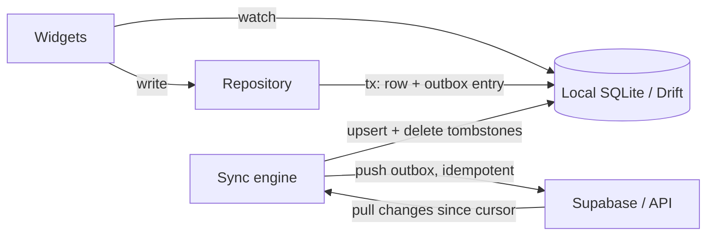

# Flutter - Offline Storage & Sync

> [!info] Deep dive of [[Flutter]]

> [!abstract] TL;DR
> Pick storage by data shape:
> - **flutter_secure_storage**: tokens and keys (Keychain/Keystore).
> - **shared_preferences**: small settings.
> - **Drift** (typed SQLite, reactive queries, migrations): app data. Drift is the default in 2026. **Isar's original project is dormant** and only lives on in community forks.
>
> Offline-first means the **local DB is the UI's source of truth**:
> - Writes go to local tables plus an **outbox**.
> - A sync engine pushes the outbox and pulls server changes by cursor (`updated_at`, soft deletes).
> - Conflicts resolve by an explicit rule (server-wins / last-write-wins / field merge).
>
> For [[Supabase]], hand-rolled sync is fine for simple apps. Use **PowerSync** (Postgres → client SQLite replication) when sync rules get complex.

## Concept

### Storage options
| Option | Model | Strengths | Weaknesses | Pick it when… |
|---|---|---|---|---|
| `shared_preferences` (`SharedPreferencesAsync`/`WithCache`) | Key-value, platform prefs | Simple | Not for large or structured data. Not encrypted | Theme, locale, onboarding flags |
| **flutter_secure_storage** | Key-value in Keychain / Android Keystore-backed | Encrypted at rest | Slow, small values only. iOS Keychain survives uninstall | Refresh tokens, DB encryption keys |
| **Drift** | Typed SQLite (Dart or `.drift` SQL), codegen | Reactive `watch()` queries, migrations + schema tests, joins, FTS5, web (wasm), isolates | build_runner. SQL knowledge needed | **Default for relational app data** |
| sqflite | Raw SQLite | Minimal, mature | Untyped maps, manual migrations, no web | Small apps, legacy |
| Hive (`hive_ce` fork) | Key-value boxes | Very fast, pure Dart | Original Hive abandoned. No queries/relations | Caches, simple object storage |
| Isar (`isar_community` / forks) | NoSQL with indexes | Fast queries | Original abandoned (last release 2023). Fork health varies | Existing Isar apps only |
| ObjectBox | Object DB + optional sync (paid) | Very fast, vector search | Vendor product. Sync is commercial | Edge/IoT, on-device vectors |
| **PowerSync** | SQLite + sync service from Postgres | Real offline-first sync, sync rules, Supabase integration | Extra service (cloud or self-hosted). Writes still go through your API | Multi-device, field apps, complex sync |

### Offline-first vs cache-first
| | Cache-first (online-first) | Offline-first |
|---|---|---|
| Source of truth for UI | Network, cache as fallback | **Local DB** |
| Writes offline | Fail / blocked | Queued in outbox, applied locally immediately |
| Complexity | Low | High (sync, conflicts, migrations on two sides) |
| Fit | Dashboards, mostly-online SME admin apps | Field sales, delivery, POS, inspections with poor connectivity |

## How It Works

- **Write path**: in one local transaction, update the row (optimistic) **and** insert an outbox record `{id: uuid, op, table, payload, created_at}`. The UI updates instantly via `watch()` streams.
- **Push**: the sync engine sends outbox items in order with **client-generated UUIDs / idempotency keys**, so retries never duplicate. On success it deletes the outbox row. On a 4xx (validation/RLS) it marks the item failed for the user to resolve, and never retries forever.
- **Pull**: the server keeps `updated_at` (trigger-maintained) and **soft deletes** (`deleted_at`). The client requests rows with `updated_at > last_cursor` per table, upserts them, removes tombstoned rows, and stores the new cursor.
- **Conflicts**:
  - **Server-wins**: the simplest; local pending changes get rebased.
  - **Last-write-wins** by timestamp: beware clock skew, so use server time.
  - **Field-level merge**.
  - **Domain rules**, e.g. stock can't go negative, so the server rejects.
  - CRDTs only for collaborative editing.
- **Triggers for sync**: app start/resume, connectivity regained, after local writes (debounced), and periodic foreground timers. Background sync via `workmanager` (Android) / `BGTaskScheduler` (iOS) is **best-effort**: iOS decides when, if ever.

## Practical Usage

### Drift table, reactive query, outbox in one transaction
```dart
class Orders extends Table {
  TextColumn get id => text()();                                   // client-generated UUID v7
  TextColumn get tenantId => text()();
  IntColumn get totalSen => integer()();
  TextColumn get status => textEnum<OrderStatus>()();
  DateTimeColumn get updatedAt => dateTime()();
  @override
  Set<Column> get primaryKey => {id};
}

class Outbox extends Table {
  TextColumn get id => text()();
  TextColumn get entity => text()();
  TextColumn get op => text()();                                    // upsert | delete
  TextColumn get payload => text()();                               // JSON
  IntColumn get attempts => integer().withDefault(const Constant(0))();
  @override
  Set<Column> get primaryKey => {id};
}

@DriftDatabase(tables: [Orders, Outbox])
class AppDb extends _$AppDb {
  AppDb() : super(driftDatabase(name: 'app'));                      // drift_flutter: runs on a background isolate
  @override
  int get schemaVersion => 3;

  Stream<List<Order>> watchOrders(String tenantId) =>
      (select(orders)..where((o) => o.tenantId.equals(tenantId))
                     ..orderBy([(o) => OrderingTerm.desc(o.updatedAt)])).watch();

  Future<void> markPaid(String id) => transaction(() async {
    await (update(orders)..where((o) => o.id.equals(id)))
        .write(OrdersCompanion(status: const Value(OrderStatus.paid), updatedAt: Value(DateTime.now().toUtc())));
    await into(outbox).insert(OutboxCompanion.insert(
        id: const Uuid().v7(), entity: 'orders', op: 'upsert', payload: jsonEncode({'id': id, 'status': 'paid'})));
  });
}
```

### Push and pull against Supabase
```dart
Future<void> push() async {
  for (final item in await db.select(db.outbox).get()) {          // ordered by insertion
    try {
      await supabase.from(item.entity).upsert(jsonDecode(item.payload));   // idempotent by PK
      await (db.delete(db.outbox)..where((o) => o.id.equals(item.id))).go();
    } on PostgrestException catch (e) {
      if (e.code?.startsWith('4') ?? false) { await markFailed(item, e); continue; }   // RLS/validation: surface to user
      rethrow;                                                     // network/5xx: stop, retry later with backoff
    }
  }
}

Future<void> pullOrders(String tenantId) async {
  final since = await cursors.get('orders') ?? DateTime.utc(2000);
  final rows = await supabase.from('orders').select()
      .eq('tenant_id', tenantId).gt('updated_at', since.toIso8601String()).order('updated_at').limit(500);
  await db.batch((b) {
    for (final r in rows) {
      r['deleted_at'] != null
          ? b.deleteWhere(db.orders, (o) => o.id.equals(r['id']))
          : b.insert(db.orders, Order.fromJson(r), mode: InsertMode.insertOrReplace);
    }
  });
  if (rows.isNotEmpty) await cursors.set('orders', DateTime.parse(rows.last['updated_at']));
  if (rows.length == 500) await pullOrders(tenantId);              // page until caught up
}
```
Server side ([[PostgreSQL]]): a `BEFORE UPDATE` trigger sets `updated_at = now()`, an index on `(tenant_id, updated_at)`, soft deletes instead of `DELETE`, and RLS on every synced table.

### Migrations
```dart
@override
MigrationStrategy get migration => MigrationStrategy(
  onUpgrade: stepByStep(                                            // generated by drift_dev make-migrations
    from1To2: (m, schema) async => m.addColumn(schema.orders, schema.orders.status),
    from2To3: (m, schema) async => m.createTable(schema.outbox),
  ),
  beforeOpen: (details) async => customStatement('PRAGMA foreign_keys = ON'),
);
```
Run `dart run drift_dev make-migrations` to snapshot schemas and generate migration tests. Old app versions in the wild will upgrade from **any** previous schema.

## Patterns & Anti-patterns
| Pattern | When | Anti-pattern to avoid |
|---|---|---|
| Local DB as UI source of truth + `watch()` | Offline-first screens | UI reading from network and cache with ad-hoc merging |
| Client UUIDs (v7) + idempotent upserts | All synced writes | Server-generated serial IDs (can't create offline, retries duplicate) |
| Soft deletes + `updated_at` cursors | Every synced table | Hard deletes (clients never learn about them) |
| Outbox in the same transaction as the write | Offline writes | Fire-and-forget HTTP calls that silently fail offline |
| Bounded retries + surfaced failures | Push loop | Infinite retry of a request RLS will always reject |
| Secure storage for keys, SQLCipher for sensitive DBs | Personal/financial data | Tokens in `shared_preferences` |

## Performance & Trade-offs
- SQLite on mobile handles 100k+ rows fine with proper indexes. Batch inserts in transactions (`db.batch`), which is 10–100× faster than row-by-row.
- `drift_flutter`'s `driftDatabase()` runs queries on a background isolate, so heavy sync upserts don't jank the UI.
- Pulling with `select()` of full rows is simple but chatty. For large datasets, use RPC endpoints returning only changed columns, or PowerSync's replication stream.
- Offline-first roughly **doubles** data-layer work (schema on two sides, migrations, conflict UX). Use it only where connectivity genuinely fails users.

## Tips & Reminders
> [!tip]
> - `connectivity_plus` reports the network interface, not internet reachability. Treat it as a hint and let real request failures drive retry/backoff.
> - Show sync state in the UI (pending count, last synced, failed items). Users trust offline apps only when they can see this.
> - Logout must clear the local DB, outbox and secure storage. Leftover rows leak to the next user (PDPA).
> - **In ZP's stack**: for typical SME admin apps, cache-first (Riverpod + Supabase + a small Drift cache) is enough. For field/POS apps in areas with patchy coverage (rural Sarawak), go offline-first: Drift + outbox + `updated_at` pull, or PowerSync (self-hostable) when you need partial replication per user/tenant.

## Version Notes
| Version | Change |
|---|---|
| Isar 3.1 (2023-04) | Last original release. Project dormant, community forks (`isar_community`, `isar_plus`) since |
| Hive 2.x | Original effectively unmaintained → `hive_ce` community edition |
| shared_preferences 2.3 (2024) | `SharedPreferencesAsync` / `SharedPreferencesWithCache` replace the legacy synchronous API |
| drift 2.32 | Moves to `sqlite3` 3.x (web users must update `sqlite3.wasm`) |
| **drift 2.34** (2026) | Current |

> [!warning] Unverified — check before relying on this
> The search summary I used says Supabase is changing the default for tables in `public`: new tables are not exposed to the Data API automatically (new projects from 2026-05-30, existing projects from 2026-10-30). This comes from an aggregated search summary, not a primary Supabase source. Confirm in the Supabase changelog and add explicit `GRANT`s for synced tables if it applies.

## Critical Issues & Gotchas
> [!danger] Sync bugs are data-loss bugs
> - **Duplicates**: a non-idempotent push (e.g. `insert` with a server-generated ID) retried after a timeout creates duplicate orders.
> - **Lost updates**: a pull that overwrites rows with pending outbox changes silently discards the user's offline edits. Skip or rebase rows that have pending outbox entries.
> - **Lost data on migration**: a failed migration on app update can brick the app or wipe data.
>
> Test sync under airplane mode, app kill mid-sync, and upgrade-from-old-version paths before shipping.

> [!danger] Unmaintained storage engines
> Apps built on original Isar/Hive now depend on community forks or dead code with native binaries that must keep up with 16 KB pages, new Xcode and new Android versions ([[Flutter - Build, Release & Store Compliance]]). Plan migration to Drift/SQLite rather than waiting for a store deadline to force it.

> [!warning] Gotchas
> - iOS Keychain items persist after uninstall, so a reinstall may "remember" a stale token. Clear on first launch using a prefs flag.
> - `flutter_secure_storage` on Android can lose data on some OEM devices after backup/restore. Handle read failures by re-authenticating.
> - Timestamps: store UTC everywhere. Device clocks drift, so use server `updated_at` for cursors, never device time.
> - Large JSON blobs in SQLite columns can't be queried efficiently. Normalize the fields you filter on.
> - Drift `watch()` streams re-run on every write to the watched tables. Narrow queries and avoid watching huge joins on hot screens.

## Related
- [[Flutter]]
- [[Supabase]] — backend, RLS, realtime vs pull sync
- [[PostgreSQL]] — `updated_at` triggers, soft deletes, indexes
- [[Flutter - State Management]] — exposing DB streams through providers
- [[Dart - Async, Streams & Isolates]] — background isolates, streams
- [[Flutter - Build, Release & Store Compliance]] — native lib maintenance

## References
- Drift docs: https://drift.simonbinder.eu/
- drift changelog: https://pub.dev/packages/drift/changelog
- Flutter persistence cookbook: https://docs.flutter.dev/cookbook/persistence
- flutter_secure_storage: https://pub.dev/packages/flutter_secure_storage
- PowerSync + Supabase: https://docs.powersync.com/integrations/supabase
- isar_community: https://pub.dev/packages/isar_community
