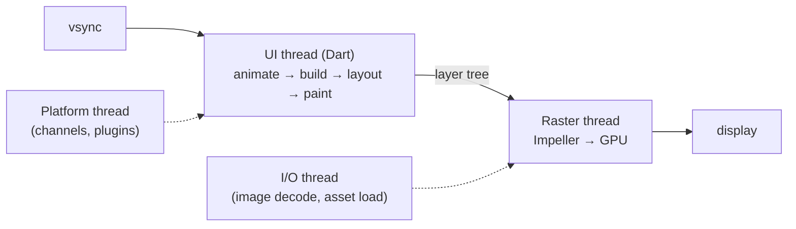

# Flutter - Performance & DevTools

> [!info] Deep dive of [[Flutter]]

> [!abstract] TL;DR
> - **Frame budget**: a 60 Hz display gives each frame **16.7 ms**, 90 Hz gives 11.1 ms, 120 Hz gives 8.3 ms. That time is split between the **UI thread** (build/layout/paint → layer tree) and the **raster thread** (Impeller → GPU). Jank means either thread overran.
> - **Workflow**: reproduce on a **real low-end device in `--profile`**, open the **DevTools Performance** view, find which thread is red, then fix one of four things:
>   - Rebuild scope too wide.
>   - Expensive layout (intrinsics, unbounded lists).
>   - Expensive paint/raster (`saveLayer`, opacity, clips, huge images).
>   - Synchronous CPU work on the UI isolate.
> - **Memory**: diff heap snapshots and run leak_tracker. Don't guess.

## Concept

### Where frame time goes


| Symptom in DevTools | Thread | Usual causes |
|---|---|---|
| UI bar red, raster green | UI | Huge `build()`, rebuilding the whole screen per tick, intrinsic layout, sync JSON parsing, regex/date formatting in lists |
| Raster bar red, UI green | Raster | `saveLayer` (Opacity, ShaderMask, ColorFilter on subtrees), clips with anti-alias, large blurs (`BackdropFilter`), oversized images, many platform views |
| Both fine, still stutters | Platform/I/O or GC | Slow plugin channel calls, image decode bursts, GC pauses from allocation storms |
| First run only | Raster | Shader compilation (Skia era). Mostly solved by Impeller |

### Performance budget checklist
| Area | Target |
|---|---|
| Frame build (UI) | < 8 ms on 120 Hz devices, < 16 ms on 60 Hz |
| Cold start to first frame | < 2 s on mid-range Android |
| Scrolling lists | Lazy (`ListView.builder`), fixed `itemExtent`/`prototypeItem` when possible |
| Image memory | Decode at display size (`cacheWidth`/`cacheHeight`) |
| APK/IPA download size | Track per release (`--analyze-size`) |

## How It Works

### DevTools views that matter
| View | Answers | Key features |
|---|---|---|
| **Performance** | Which frames janked and why | Frame bar chart (UI vs raster), timeline events, "Enhance tracing" (track widget builds, layouts, paints), shader-compilation flags |
| **CPU Profiler** | Which Dart functions burn CPU | Bottom-up / call tree / flame chart, filter by package |
| **Memory** | Heap growth, leaks, allocation hot spots | Heap chart with GC markers, snapshot **diff**, class allocation tracing, retaining paths |
| **Widget Inspector** | Tree structure, rebuild counts | "Track widget rebuilds" counts, layout explorer for overflow/flex issues |
| **Network** | HTTP timing and payloads | Works for `dart:io` HttpClient-based clients |
| **App Size** | What's in the binary | Treemap from `--analyze-size` JSON, diff two builds |
| **Deep links / Logging** | Routing, logs | — |

### Debug flags (debug/profile builds)
```dart
import 'package:flutter/rendering.dart';
void main() {
  debugRepaintRainbowEnabled = true;        // rotating colours on repainted areas
  debugProfileBuildsEnabled = true;          // build events in the timeline
  debugProfileLayoutsEnabled = true;
  debugProfilePaintsEnabled = true;
  runApp(const App());
}
// MaterialApp(showPerformanceOverlay: true) → on-device UI/raster graphs
```

## Practical Usage

### 1. Narrow rebuilds
```dart
// Bad: whole page rebuilds every animation tick
AnimatedBuilder(animation: _ctrl, builder: (_, __) => Scaffold(body: HugePage(progress: _ctrl.value)));

// Good: only the moving part rebuilds; static child built once and passed through
AnimatedBuilder(
  animation: _ctrl,
  child: const HugeStaticContent(),
  builder: (_, child) => Transform.rotate(angle: _ctrl.value * 6.28, child: child),
);

// Riverpod: rebuild only when the total changes
final total = ref.watch(cartProvider.select((c) => c.totalSen));
```
- Extract widgets into classes (not helper methods) so Flutter can skip them, and mark them `const`.
- Push `setState` down: put state in the smallest `StatefulWidget` that needs it, or use `ValueListenableBuilder`.

### 2. Lists and layout
```dart
ListView.builder(
  itemCount: orders.length,
  itemExtent: 72,                                  // skips per-item layout measurement
  itemBuilder: (_, i) => OrderTile(key: ValueKey(orders[i].id), order: orders[i]),
);
```
- Avoid `shrinkWrap: true` + `NeverScrollableScrollPhysics` inside another scrollable for long lists. It builds **every** item. Use `CustomScrollView` with slivers (`SliverList.builder`) instead.
- Avoid `IntrinsicHeight`/`IntrinsicWidth` in repeated items: they lay out children twice (O(n²) in nested cases).

### 3. Paint and raster
| Expensive | Cheaper alternative |
|---|---|
| `Opacity` widget over a subtree | `FadeTransition`/`AnimatedOpacity`, or set alpha on the color/image directly |
| `ClipRRect` with `Clip.antiAliasWithSaveLayer` | `Clip.antiAlias` or `Clip.hardEdge`; `borderRadius` on `DecoratedBox` |
| `BackdropFilter` blur over large areas | Pre-blurred image asset, smaller blur region |
| Animating `boxShadow` | Static shadow + animate transform |
| Repainting static content beside an animation | Wrap the animation in `RepaintBoundary` (check that the raster cache actually helps) |

### 4. Heavy CPU off the UI isolate
```dart
final orders = await Isolate.run(() => (jsonDecode(body) as List).map((e) => Order.fromJson(e)).toList());
// rule of thumb: anything > ~8 ms on a low-end device belongs in an isolate
```
See [[Dart - Async, Streams & Isolates]].

### 5. Images
```dart
Image.network(url, cacheWidth: (64 * MediaQuery.devicePixelRatioOf(context)).round());   // decode thumbnail, not 4000px original
```
Precache hero/above-the-fold images with `precacheImage` in `didChangeDependencies`.

### 6. App size and startup
```bash
flutter build apk --release --analyze-size --target-platform android-arm64
flutter build appbundle --release --obfuscate --split-debug-info=build/symbols   # Play splits per ABI
flutter run --profile --trace-startup                                            # writes start_up_info.json
```
- Defer rarely used features with **deferred components** (Android) / `deferred as` imports (web).
- Trim fonts (`--tree-shake-icons` is on by default for release), compress assets, and remove unused plugins (each brings native code).

### 7. Measuring in CI
```dart
// integration_test/scroll_perf_test.dart
final binding = IntegrationTestWidgetsFlutterBinding.ensureInitialized();
testWidgets('order list scroll', (tester) async {
  app.main();
  await tester.pumpAndSettle();
  await binding.traceAction(() async {
    await tester.fling(find.byType(ListView), const Offset(0, -800), 3000);
    await tester.pumpAndSettle();
  }, reportKey: 'order_list_scroll');   // frame timings → JSON summary (p90/p99 build & raster)
});
```
Run with `flutter drive --profile --driver=test_driver/perf_driver.dart --target=integration_test/scroll_perf_test.dart` on a device farm or a reference phone.

## Patterns & Anti-patterns
| Pattern | When | Anti-pattern to avoid |
|---|---|---|
| Profile mode on a real low-end Android | Every perf investigation | Simulator / debug mode numbers |
| `const` + extracted widget classes | All UI | `Widget _buildHeader()` helper methods everywhere |
| `select` / `BlocSelector` / `child:` param of builders | Animations, large states | Rebuilding the full screen per tick |
| Slivers + builders, fixed extents | Long or nested lists | `shrinkWrap: true` lists with hundreds of items |
| `Isolate.run` for parsing/crypto/image work | > ~8 ms CPU | Sync heavy work in `build()` or `initState` |
| Diff heap snapshots after leaving a screen | Leak hunting | Reading RSS in the OS task manager |

## Performance & Trade-offs
- `RepaintBoundary` trades memory (an extra layer and raster cache) for less repaint. Use it around frequently animating regions, not everywhere.
- `itemExtent` / `prototypeItem` are big wins for scroll performance but force uniform heights.
- Impeller removes runtime shader-compile jank but can differ from Skia in blending/blur cost and edge cases. Test custom shaders and heavy blur on both iOS and Android.
- Moving work to isolates costs a message copy. For small payloads (< ~50 KB JSON) staying on the main isolate is often faster overall.

## Tips & Reminders
> [!tip]
> - Keep one cheap reference phone (e.g. a 4 GB RAM Android) for profiling. Malaysian SME users skew toward mid/low-end Android, so a flagship hides most jank.
> - Turn on "Track widget rebuilds" in the Inspector: any widget rebuilding hundreds of times per second is the first suspect.
> - Use `Timeline.startSync('parseOrders')` / `finishSync()` (from `dart:developer`) to label your own work in the Performance timeline.
> - **In ZP's stack**: [[Supabase]] realtime streams pushing frequent row updates can rebuild entire lists. Map to immutable models, key items with `ValueKey(id)`, and `select` narrow slices in Riverpod ([[Flutter - State Management]]). Paginate with `.range()` instead of loading whole tables.

## Version Notes
| Version | Change |
|---|---|
| 3.10 (2023-05) | Impeller default on iOS |
| 3.16 (2023-11) | Impeller preview on Android (Vulkan) |
| 3.27 (2024-12) | Impeller default on modern Android (Vulkan; OpenGL fallback) |
| 3.29 (2025-02) | Merged UI/platform threads on iOS/Android by default, which makes synchronous platform interop possible and changes some thread-attribution in traces |
| 3.47 | Current stable (2026-10) |

> [!warning] Unverified — check before relying on this
> Thread-merging and Impeller fallback rules change across releases and device GPUs. Check https://docs.flutter.dev/perf/impeller and the release notes for your target version.

## Critical Issues & Gotchas
> [!danger] Debug-mode numbers mislead decisions
> Teams have rewritten whole screens to "fix" jank that only existed in debug (JIT + asserts) or on emulators with software rendering. Always confirm in `--profile` on a physical device before changing architecture.

> [!danger] Image memory crashes on low-end Android
> Decoding full-resolution camera photos (12–50 MP) in a grid can allocate hundreds of MB of native memory per screen, leading to OOM kills that crash reports show only as native signals. Always set `cacheWidth`/`cacheHeight` or resize server-side (e.g. Supabase Storage image transformations).

> [!warning] Gotchas
> - `Opacity(opacity: 0)` still lays out (and in some cases paints) the child. Use `Visibility` or remove it from the tree.
> - `MediaQuery.of(context)` subscribes to **all** media changes (keyboard insets → rebuild on every keyboard frame). Use `MediaQuery.sizeOf`, `paddingOf`, etc.
> - `GlobalKey` lookups and reparenting are expensive. Don't create keys inside `build()`.
> - Profile builds strip the Widget Inspector's rebuild tracking in some versions, so verify rebuild counts in debug, then timings in profile.
> - Platform views (Google Maps, WebView) add composition cost on Android (Hybrid Composition). Avoid placing them inside scrolling lists.

## Related
- [[Flutter]]
- [[Flutter - Rendering & Widget Lifecycle]] — the pipeline being profiled
- [[Flutter - State Management]] — rebuild scope
- [[Dart - VM, Compilation & Garbage Collection]] — build modes, GC, memory tooling
- [[Dart - Async, Streams & Isolates]] — moving work off the UI isolate
- [[Flutter - Interview Questions]] — const, rebuild scope, jank, leaks

## References
- Performance best practices: https://docs.flutter.dev/perf/best-practices
- DevTools overview: https://docs.flutter.dev/tools/devtools
- Performance view: https://docs.flutter.dev/tools/devtools/performance
- Impeller: https://docs.flutter.dev/perf/impeller
- App size: https://docs.flutter.dev/perf/app-size
- Integration test perf: https://docs.flutter.dev/cookbook/testing/integration/profiling
