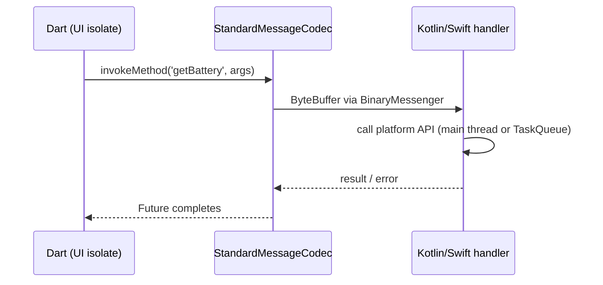

# Flutter - Platform Channels & FFI

> [!info] Deep dive of [[Flutter]]

> [!abstract] TL;DR
> Flutter reaches native code in three ways:
> - **Platform channels** (`MethodChannel`/`EventChannel`): async message passing to [[Kotlin]]/[[Swift]], with values serialized by a codec. Wrap them with **Pigeon** for type-safe generated code.
> - **`dart:ffi`**: direct, synchronous calls into C ABI libraries (Rust, C, C++, Go via cgo), with no serialization. Generate bindings with **ffigen** and bundle the native code with **build hooks** (native assets).
> - **Direct native bindings**: **jnigen** (Java/Kotlin via JNI) and **swiftgen/ffigen** for Objective-C/Swift. These call platform APIs from Dart without hand-written channel code.
>
> Rule of thumb: Pigeon for app-specific platform features, FFI for C/Rust libraries and hot paths, and an existing plugin before either.

## Concept

### Options compared
| Approach | Call style | Overhead | Type safety | Pick it when… |
|---|---|---|---|---|
| Existing plugin (pub.dev) | Async | Varies | Package API | A maintained, verified-publisher plugin exists |
| `MethodChannel` | Async request/response | Codec serialization + thread hop | None (strings + dynamic maps) | One or two quick calls, prototypes |
| `EventChannel` | Native → Dart stream | Same | None | Sensors, location, native callbacks |
| **Pigeon** | Async (or sync on merged threads), generated | Same as channels | **Generated Dart/Kotlin/Swift/C++ types** | App-specific native features, plugins you maintain |
| **`dart:ffi`** + ffigen | **Sync** C calls (async via isolates/callbacks) | Near zero for primitives | Generated bindings | C/C++/Rust libs: crypto, codecs, SQLite, image processing |
| **jnigen** / swiftgen | Sync calls into JVM / Obj-C/Swift APIs | JNI / Obj-C runtime cost | Generated | Wide use of platform SDK APIs without channel boilerplate |
| flutter_rust_bridge | Generated FFI for Rust | Low | Generated, async support | Rust core shared with server/desktop |

### Threads
- Channel handlers on the native side run on the **platform main thread** by default. Long work there freezes the native UI and stalls Flutter. Use a background `TaskQueue` (`BinaryMessenger.makeBackgroundTaskQueue()`) or dispatch off-main.
- Since Flutter 3.29 the UI and platform threads are **merged** on iOS/Android. That enables synchronous FFI calls into platform APIs, but it also means slow native work on the main thread now blocks Dart frames directly.
- FFI calls run on the calling Dart isolate's thread. Long C calls block that isolate, so run them in `Isolate.run` ([[Dart - Async, Streams & Isolates]]).

## How It Works

### Platform channel round trip

- **Codecs**: `StandardMessageCodec` supports null, bool, int, double, String, `Uint8List`/typed lists, List, Map. `JSONMessageCodec`, `StringCodec` and `BinaryCodec` exist too. Pigeon generates custom codecs for its classes.
- Channel names are global strings. Collisions between plugins are possible, so prefix them with your package ID.
- Errors cross as `PlatformException(code, message, details)`. `MissingPluginException` means no handler is registered (wrong name, plugin not registered, or a hot restart without a native rebuild).

### FFI
- `DynamicLibrary.open('libfoo.so')` (manual) or `@Native` external functions resolved from bundled **native assets**.
- Memory: Dart-allocated objects are GC-managed, but C memory isn't. Use `malloc`/`calloc` from `package:ffi` + `free`, `using((arena) { … })` for scoped allocations, and `NativeFinalizer` to free handles tied to Dart objects.
- Callbacks from C: `NativeCallable.isolateLocal` (sync, same thread) or `NativeCallable.listener` (from any thread, delivered async).
- **Build hooks** (`hook/build.dart`, the native assets feature): the package compiles or downloads its C/Rust library during `flutter build`, and Flutter bundles it per platform/ABI. No more manual `CMakeLists`/podspec plumbing for pure-FFI packages.

## Practical Usage

### Pigeon: define once, generate three sides
```dart
// pigeons/device.dart
import 'package:pigeon/pigeon.dart';

@ConfigurePigeon(PigeonOptions(
  dartOut: 'lib/src/device.g.dart',
  kotlinOut: 'android/app/src/main/kotlin/my/app/Device.g.kt',
  swiftOut: 'ios/Runner/Device.g.swift',
))
class DeviceInfo { DeviceInfo({required this.model, required this.batteryPct}); String model; int batteryPct; }

@HostApi()
abstract class DeviceApi {
  @async
  DeviceInfo getInfo();
}
```
```bash
dart run pigeon --input pigeons/device.dart
```
```kotlin
// Android: implement the generated interface
class DeviceApiImpl(private val ctx: Context) : DeviceApi {
  override fun getInfo(callback: (Result<DeviceInfo>) -> Unit) {
    val bm = ctx.getSystemService(Context.BATTERY_SERVICE) as BatteryManager
    callback(Result.success(DeviceInfo(Build.MODEL, bm.getIntProperty(BatteryManager.BATTERY_PROPERTY_CAPACITY).toLong())))
  }
}
// MainActivity.configureFlutterEngine: DeviceApi.setUp(flutterEngine.dartExecutor.binaryMessenger, DeviceApiImpl(this))
```
```dart
final info = await DeviceApi().getInfo();   // typed, no string method names
```

### EventChannel stream (native → Dart)
```dart
const _events = EventChannel('my.app/connectivity');
Stream<bool> get online => _events.receiveBroadcastStream().map((e) => e as bool);
// cancel the subscription → native onCancel → unregister the listener (otherwise native leaks)
```

### FFI with ffigen
```yaml
# ffigen.yaml
output: lib/src/sodium_bindings.g.dart
headers: { entry-points: [third_party/libsodium/include/sodium.h] }
functions: { include: [crypto_generichash, sodium_init] }
```
```dart
final hashOut = calloc<Uint8>(32);
try {
  bindings.crypto_generichash(hashOut, 32, inputPtr, inputLen, nullptr, 0);
  return Uint8List.fromList(hashOut.asTypedList(32));
} finally {
  calloc.free(hashOut);   // C memory is never garbage-collected
}
```

## Patterns & Anti-patterns
| Pattern | When | Anti-pattern to avoid |
|---|---|---|
| Wrap native calls behind a Dart interface + fake for tests | All interop | Calling `MethodChannel` directly from widgets |
| Pigeon for any channel with > 2 methods | App-specific native code | Stringly typed `invokeMethod('doThing', {'a': 1})` sprawl |
| Background `TaskQueue` / coroutines for slow native work | File I/O, crypto, SDK calls | Blocking the platform main thread |
| `Isolate.run` around long FFI calls | Heavy C/Rust compute | Sync FFI on the UI isolate for > ~8 ms |
| `try/finally` + `free` / arenas / `NativeFinalizer` | All FFI allocations | Leaking `malloc`'d buffers per call |
| Prefer verified-publisher, actively maintained plugins | Payments, maps, auth | Abandoned plugins pinned forever |

## Performance & Trade-offs
- Channels cost roughly tens to hundreds of µs per call (serialization + thread hop). That's fine for occasional calls, but bad for per-frame or per-item loops. Batch them.
- FFI calls with primitives are near-native speed. Copying large buffers (`Uint8List` ↔ `Pointer<Uint8>`) dominates, so reuse buffers or use `asTypedList` views.
- jnigen avoids channel boilerplate, but JNI references must be released (`release()`/arenas). Leaks show up as native memory growth and the JNI global ref limit.
- Writing your own plugin means owning its native maintenance (Gradle/AGP bumps, privacy manifests, 16 KB alignment). See [[Flutter - Build, Release & Store Compliance]].

## Tips & Reminders
> [!tip]
> - Need a platform API once? Check `pub.dev` (flutter.dev/flutter-community/verified publishers) first, then Pigeon in the app's `android/` and `ios/` folders. Don't create a separate plugin package until you reuse it.
> - Mock channels in tests with `TestDefaultBinaryMessengerBinding.instance.defaultBinaryMessenger.setMockMethodCallHandler`.
> - Native SDKs delivered only as Android AAR / iOS XCFramework (payment terminals, eKYC SDKs) → Pigeon wrapper + an `EventChannel` for callbacks.
> - **In ZP's stack**: Malaysian eKYC/payment SDKs (e.g. bank or e-wallet SDKs) typically ship native-only. Wrap them via Pigeon, keep secrets server-side ([[Supabase]] Edge Functions), and pass only short-lived session tokens through the channel.

## Version Notes
| Version | Change |
|---|---|
| Flutter 2.x | Pigeon introduced; `dart:ffi` stable (Dart 2.12) |
| Dart 3.1–3.2 | `NativeCallable.listener` / `isolateLocal` for C callbacks |
| Flutter 3.29 (2025-02) | Merged UI + platform threads on iOS/Android → sync platform interop via FFI/jnigen possible |
| Dart 3.10 (2025-11) | **Build hooks** (native assets) stable for Dart and Flutter packages |
| 2026 | `jni` (jnigen runtime) 1.0. swiftgen still evolving |

> [!warning] Unverified — check before relying on this
> The build-hooks stability milestone and swiftgen maturity are inconsistently reported. Check the `hooks`/`code_assets` changelogs and https://dart.dev/tools/hooks before building a production package on them.

## Critical Issues & Gotchas
> [!danger] Main-thread blocking freezes the whole app
> With merged threads, a slow synchronous native call (disk I/O, SDK init, network in a channel handler) blocks both native UI and Flutter frames, which can trigger Android ANR dialogs (5 s input timeout) and Play Console vitals penalties. Always offload slow work.

> [!danger] Native crashes bypass Dart error handling
> A segfault in FFI code or an uncaught Kotlin/Swift exception kills the process. `runZonedGuarded`/`FlutterError.onError` won't see it. Use Crashlytics/Sentry native crash reporting and validate pointer lifetimes carefully.

> [!warning] Gotchas
> - Hot reload doesn't reload native code. Changing Kotlin/Swift needs a full rebuild (`flutter run` again).
> - `int` on the Dart side is 64-bit, while Pigeon/Kotlin may expect `Long` and Swift `Int64`. Mismatches in hand-written codecs cause silent truncation.
> - Plugins registered only in the main engine aren't available in background isolates / headless engines (FCM background handlers, WorkManager) unless initialized there (`BackgroundIsolateBinaryMessenger.ensureInitialized`).
> - `EventChannel` without cancelling the Dart subscription leaves the native listener (location, sensors) running, draining battery.
> - iOS: each plugin pulls CocoaPods or Swift Package Manager dependencies. Mixed SPM/CocoaPods setups during the migration period cause duplicate-symbol build errors.

## Related
- [[Flutter]]
- [[Dart - Async, Streams & Isolates]] — isolates for long FFI calls, stream cancellation
- [[Dart - VM, Compilation & Garbage Collection]] — native memory vs Dart heap, finalizers
- [[Flutter - Build, Release & Store Compliance]] — plugin native maintenance
- [[Kotlin]] · [[Swift]] — host-side languages
- [[Rust]] — common FFI library language

## References
- Platform channels: https://docs.flutter.dev/platform-integration/platform-channels
- Pigeon: https://pub.dev/packages/pigeon
- C interop (dart:ffi): https://dart.dev/interop/c-interop
- Java/Kotlin interop (jnigen): https://dart.dev/interop/java-interop
- Objective-C/Swift interop: https://dart.dev/interop/objective-c-interop
- Build hooks: https://dart.dev/tools/hooks
