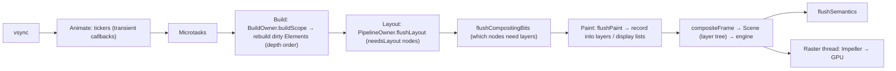

# Flutter - Rendering & Widget Lifecycle

> [!info] Deep dive of [[Flutter]]

> [!abstract] TL;DR
> Flutter turns **immutable widgets** into long-lived **Elements**, which own **RenderObjects** that do layout and paint into **layers**. Each frame (vsync) runs **build → layout → compositing bits → paint → composite**, then the raster thread (Impeller) draws it. `setState` only marks an Element dirty. The real work is reconciliation: an Element is reused when `runtimeType` and `key` match, so the existing RenderObject is patched instead of recreated. Remember: **constraints go down, sizes go up, the parent sets position**, and **State lives in the Element, not the Widget**.

## Concept

### The three trees
| Tree | Class examples | Responsibility | Lifetime / cost |
|---|---|---|---|
| **Widget** | `Text`, `Padding`, `MyPage` | Immutable configuration. Describes what the UI should look like | Recreated on every build. Cheap |
| **Element** | `StatelessElement`, `StatefulElement`, `RenderObjectElement` | Instance in the tree: parent/children links, holds `State`, is the `BuildContext`, tracks inherited dependencies | Long-lived. Reused across rebuilds |
| **RenderObject** | `RenderBox`, `RenderFlex`, `RenderParagraph` | Layout, painting, hit-testing, semantics | Long-lived. Expensive. Only for `RenderObjectWidget`s |

- Most widgets you write (`StatelessWidget`/`StatefulWidget`) are **compositional**. They have no RenderObject, just build other widgets. Leaf/structural widgets (`Padding`, `Row`, `RichText`, `DecoratedBox`) create RenderObjects.
- `BuildContext` **is** the Element. `Theme.of(context)` walks up the Element tree, and registering an inherited dependency makes the Element rebuild when that `InheritedWidget` changes.

### StatefulWidget / State lifecycle
| Phase | Called when | Do | Don't |
|---|---|---|---|
| `createState` | Element created | Return a new State | Put logic here |
| `initState` | Once, after insertion | Init controllers, subscriptions, listeners | Read inherited widgets (`Theme.of`) |
| `didChangeDependencies` | After `initState`, and whenever an inherited dependency changes | Read `InheritedWidget`s / providers. Start work that depends on them | Heavy work on every call without guarding |
| `build` | Every rebuild (can be every frame) | Pure description of UI from state | Side effects, network calls, creating streams |
| `didUpdateWidget(old)` | Parent rebuilt with a new widget config (same runtimeType + key) | React to changed config (re-subscribe if a stream/ID changed) | Forget to compare `old.x != widget.x` |
| `setState(fn)` | You change state | Mutate synchronously inside `fn` | Call after `dispose` / during build |
| `deactivate` | Removed from the tree (may be re-inserted via GlobalKey in the same frame) | Rarely needed | Release resources (use `dispose`) |
| `activate` | Re-inserted after `deactivate` | Rare | — |
| `dispose` | Permanently removed | Cancel subscriptions, dispose controllers, remove listeners | Call `setState` or use `context` |
| `reassemble` | Hot reload (debug only) | Debug-only resets | Production logic |

## How It Works

### Frame pipeline

- **UI thread** (Dart): animate, build, layout, paint (records commands). **Raster thread**: executes the layer tree on the GPU. Both must finish within the frame budget (16.7 ms at 60 Hz, 8.3 ms at 120 Hz).
- **Dirty tracking** makes work proportional to change: only dirty Elements rebuild, only `needsLayout` RenderObjects relayout, and only `needsPaint` regions repaint (bounded by `RepaintBoundary` layers).

### Reconciliation (`Element.updateChild`)
1. `setState` → `markNeedsBuild()` → Element added to `BuildOwner`'s dirty list → `SchedulerBinding.scheduleFrame()`.
2. On build, the dirty Element calls `build()` and gets new child widget(s).
3. For each child slot:
   - **Same instance** (`identical`, e.g. a `const` widget) → skip. The subtree isn't touched.
   - **`Widget.canUpdate(old, new)`** (same `runtimeType` and `key`) → keep the Element, `element.update(newWidget)`. For RenderObjectElements, `updateRenderObject()` sets changed properties, and setters call `markNeedsLayout`/`markNeedsPaint` only if the value changed.
   - Otherwise → `deactivateChild(old)` (State disposed at the end of the frame unless reparented) and `inflateWidget(new)` (new Element, State and RenderObject).
4. **Lists** (`MultiChildRenderObjectElement.updateChildren`) match from the top and bottom, then by **key** for the middle section. Without keys, matching is positional.

### Keys
| Key | Use |
|---|---|
| `ValueKey(id)` / `ObjectKey(obj)` | Reorderable/insertable list items. Keeps each item's State with its data |
| `UniqueKey()` | Force a new Element/State every build (reset) |
| `GlobalKey` | Access `State`/`RenderObject` from outside. Reparent a subtree keeping its state (expensive, use sparingly) |
| `PageStorageKey` | Persist scroll offsets across rebuilds/tabs |

### Layout protocol (RenderBox)
- The parent calls `child.layout(constraints, parentUsesSize: bool)`. The child must choose `size` within `BoxConstraints(minW, maxW, minH, maxH)`. The parent then sets the child's offset in `parentData`.
- **Tight**: min == max (`SizedBox(w,h)`, `Expanded` in the main axis, root view). **Loose**: min = 0 (`Center`, `Align`). **Unbounded**: max = ∞ (scrollables' main axis, `Row`/`Column` main axis for non-flex children).
- **Relayout boundary**: a RenderObject whose size doesn't affect its parent (tight constraints, `sizedByParent`, or `parentUsesSize: false`) stops layout invalidation propagating up.
- **Flex** (`Row`/`Column`): lays out non-flexible children with unbounded main-axis constraints, then divides the remaining space among `Expanded`/`Flexible` by flex factor.
- **Intrinsics** (`IntrinsicHeight`, `getMinIntrinsicWidth`) are speculative extra layouts. They're expensive and can become O(n²) when nested.

### Painting & layers
- `paint(context, offset)` records into a `PictureLayer`. Widgets like `Opacity`, `ClipRRect`, `Transform`, `ShaderMask` and `BackdropFilter` may push new layers or `saveLayer` operations (costly on the raster thread).
- `RepaintBoundary` gives a subtree its own layer, so its repaints don't repaint siblings. Good for frequently animating parts, bad if overused (memory, compositing cost).
- **Impeller** (default on iOS and modern Android) precompiles shaders at build time, which removes Skia's first-run shader jank. Platform views (maps, webviews) still add compositing overhead.

## Practical Usage

### Correct lifecycle handling
```dart
class OrderDetail extends StatefulWidget {
  const OrderDetail({super.key, required this.orderId});
  final String orderId;
  @override
  State<OrderDetail> createState() => _OrderDetailState();
}

class _OrderDetailState extends State<OrderDetail> {
  late final ScrollController _scroll = ScrollController();
  StreamSubscription<Order>? _sub;

  @override
  void initState() { super.initState(); _subscribe(); }

  @override
  void didUpdateWidget(covariant OrderDetail old) {
    super.didUpdateWidget(old);
    if (old.orderId != widget.orderId) { _sub?.cancel(); _subscribe(); }   // config changed → re-subscribe
  }

  void _subscribe() => _sub = repo.watch(widget.orderId).listen((o) => setState(() => _order = o));
  Order? _order;

  @override
  void dispose() { _sub?.cancel(); _scroll.dispose(); super.dispose(); }

  @override
  Widget build(BuildContext context) => _order == null
      ? const Center(child: CircularProgressIndicator())          // const → skipped on rebuild
      : ListView(controller: _scroll, children: [OrderHeader(order: _order!)]);
}
```

### Keys in reorderable lists
```dart
ReorderableListView(
  onReorder: _move,
  children: [for (final t in tasks) TaskTile(key: ValueKey(t.id), task: t)],   // without key: checkbox state jumps between rows
)
```

### Fixing common layout errors
```dart
// ❌ "Vertical viewport was given unbounded height": ListView inside Column
Column(children: [Header(), ListView(children: items)]);
// ✅ give it bounded height
Column(children: [Header(), Expanded(child: ListView(children: items))]);

// ❌ RenderFlex overflowed: long text in Row
Row(children: [Icon(Icons.store), Text(longName)]);
// ✅ let it flex
Row(children: [const Icon(Icons.store), Expanded(child: Text(longName, overflow: TextOverflow.ellipsis))]);
```

## Patterns & Anti-patterns
| Pattern | When | Anti-pattern to avoid |
|---|---|---|
| Split big `build` methods into small widgets (classes, not helper methods) | Any non-trivial screen | Helper methods returning widgets (no Element boundary, so everything rebuilds together) |
| `const` constructors and instances | Static subtrees | Recreating identical widgets each build |
| Push `setState` down to the smallest stateful widget | Local interactions | `setState` at the page root for a checkbox |
| Keys on list items with identity | Reorder/insert/delete lists | Index-based keys (`ValueKey(index)`) |
| `RepaintBoundary` around independently animating areas | Tickers, video, charts | Wrapping everything |
| Read inherited data in `didChangeDependencies`/`build` | Theme, MediaQuery, providers | Reading them in `initState` |

## Performance & Trade-offs
- Build cost scales with the number of rebuilt Elements. Layout cost with `needsLayout` nodes. Paint cost with dirty layers. Raster cost with layer complexity (`saveLayer`, clips, shadows, blurs).
- `MediaQuery.of(context)` subscribes to **all** MediaQuery changes (keyboard insets rebuild the widget). Use the aspect-specific APIs (`MediaQuery.sizeOf(context)`, `paddingOf`) to rebuild only on what you use.
- `GlobalKey` lookups and reparenting are expensive. Animations via `AnimatedBuilder`/`TweenAnimationBuilder` limit rebuilds to the animated subtree.

## Tips & Reminders
> [!tip]
> - Debug flags: `debugPrintRebuildDirtyWidgets`, DevTools "Track widget rebuilds", `debugRepaintRainbowEnabled`, and the performance overlay (UI vs raster bars).
> - `Widget.canUpdate` = `runtimeType` + `key`. Changing the widget *type* at a position (e.g. swapping `Container` ↔ `Padding`) discards the subtree's state.
> - Use `LayoutBuilder` to read constraints during layout, and `MediaQuery.sizeOf` for screen size. Don't measure via `GlobalKey` after build unless necessary.
> - **In ZP's stack**: Supabase realtime lists → keyed list items (`ValueKey(row.id)`) + a stream created once in state/provider. Long chat/order lists → `ListView.builder` with `itemExtent`/`prototypeItem` for cheaper layout.

## Version Notes
| Version | Change |
|---|---|
| Flutter 1.x | Skia renderer, shader-compilation jank common |
| 3.10 (2023) | Impeller default on iOS |
| 3.27 (2024-12) | Impeller default on Android (Vulkan, with OpenGL fallback) |
| 3.29 (2025) | Web HTML renderer removed (CanvasKit/Skwasm only) |
| 3.3x–3.47 | Ongoing Impeller and platform-view improvements. Core build/layout/paint model unchanged |

## Critical Issues & Gotchas
> [!danger] Side effects in `build`
> `build` can run many times per second (animations, MediaQuery changes, parent rebuilds). Network calls, stream creation, analytics events or `setState` inside `build` cause request storms, infinite rebuild loops and duplicate subscriptions. Keep `build` pure, and move effects to `initState`/`didUpdateWidget`/providers.

> [!warning] Gotchas
> - `setState() called after dispose()`: async work finishing after the page closed. Cancel it, or check `mounted`.
> - Using `BuildContext` across an `await` (the widget may be gone). Lint: `use_build_context_synchronously`.
> - `Expanded` outside `Row`/`Column`/`Flex` → "Incorrect use of ParentDataWidget".
> - Swapping widget types conditionally (`cond ? A() : B()`) resets State. Keep the same type and change properties, or use keys deliberately.
> - Unbounded constraints + widgets that try to be infinite → layout exceptions. Read the constraints in the error message.

## Related
- [[Flutter]]
- [[Flutter - Interview Questions]] — Q9–Q12 outlines
- [[Flutter - Performance & DevTools]] — measuring build/layout/raster costs
- [[Flutter - State Management]] — scoping rebuilds
- [[Dart - Async, Streams & Isolates]] — subscriptions in lifecycle methods

## References
- Flutter architectural overview: https://docs.flutter.dev/resources/architectural-overview
- Inside Flutter: https://docs.flutter.dev/resources/inside-flutter
- Understanding constraints: https://docs.flutter.dev/ui/layout/constraints
- `State` class lifecycle: https://api.flutter.dev/flutter/widgets/State-class.html
- Keys (Flutter docs/video): https://api.flutter.dev/flutter/foundation/Key-class.html
