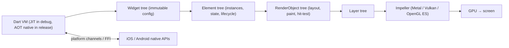

# Flutter

> [!abstract] TL;DR
> Flutter is Google's UI toolkit for building **natively compiled apps for iOS, Android, web, desktop and embedded from one [[Dart]] codebase**. Unlike React Native it **draws every pixel itself** with its own rendering engine (**Impeller**) instead of wrapping native widgets, which gives pixel-identical UI across platforms and smooth animations. It's ZP's mobile stack. Strengths: one team/codebase, fast iteration (hot reload), strong performance. Watch-outs: app-store policy deadlines (Android 16 KB pages, iOS SDK requirements, CocoaPods → Swift Package Manager), plugin quality, and web/SEO limits.

## Introduction
- Released by Google (1.0 in Dec 2018). BSD-3 license. **Quarterly stable releases** in 2026 (Feb, May, Aug, Nov), each paired with a Dart release.
- Used by Google (Pay, Ads, Earth), BMW, Alibaba, ByteDance, Nubank and many SMEs. Google cut some Flutter/Dart staff in 2024, and a community fork ("Flock") exists, but the main project stays active.
- It solves maintaining two native codebases (Swift/Kotlin) for one product, and inconsistent UI across platforms.
- Where it sits: the client app layer. It talks to [[Supabase]], REST/GraphQL APIs, Firebase (FCM push) and native SDKs through platform channels/FFI.

## Core Concepts

### Everything is a widget
```dart
class OrderTile extends StatelessWidget {
  const OrderTile({super.key, required this.order, this.onTap});
  final Order order;
  final VoidCallback? onTap;

  @override
  Widget build(BuildContext context) => ListTile(
        title: Text('Order ${order.id}'),
        subtitle: Text(order.status.label),
        trailing: Text(formatRM(order.totalSen)),
        onTap: onTap,
      );
}
```
- **StatelessWidget** (pure function of inputs) vs **StatefulWidget** (holds a `State` object with `setState`).
- **Composition** over inheritance: layout is nested widgets (`Row`, `Column`, `Stack`, `Padding`, `Expanded`).
- **BuildContext** = position in the tree. Used for theme, navigation, inherited data (`Theme.of(context)`).
- **Keys** preserve state when widgets move or reorder in lists.

### State management (pick one, consistently)
| Approach | Good for |
|---|---|
| `setState` / `ValueNotifier` | Local widget state |
| **Riverpod** (3.x) | Most apps: compile-safe DI + async state, testable |
| **Bloc / Cubit** | Teams wanting explicit events → states, strict architecture |
| Provider | Legacy/simple apps (Riverpod is its successor) |
| Signals / MobX / GetX | Niche. GetX is discouraged for maintainability |

### Platform integration
- **Platform channels** (MethodChannel/Pigeon for type-safe codegen) to call Swift/Kotlin. **FFI** (`dart:ffi`, `ffigen`/`jnigen`) for C/Java/Obj-C APIs directly.
- **Plugins/packages** from pub.dev (camera, maps, payments, push). Check "Flutter Favorite", verified publisher and platform support.

## Architecture / How It Works



- **Three trees**:
  - Widgets are cheap, immutable descriptions.
  - Elements reconcile them and keep state.
  - RenderObjects do layout ("constraints go down, sizes go up, parent sets position") and painting.
- **Rendering**: **Impeller** precompiles shaders, which removes the shader-compilation jank of the old Skia backend. It's the default on iOS and on modern Android.
- **Compilation**: debug mode = JIT with hot reload. Release = **AOT** native ARM/x64 code. Web = JavaScript or **WebAssembly** (CanvasKit/Skwasm renderers; the HTML renderer was removed).
- **Threads**: UI isolate (Dart code), raster thread, platform thread, I/O. Heavy Dart work goes to `Isolate.run` / `compute` to avoid dropped frames.

## Project Structure
```text
my_app/
├── pubspec.yaml               # deps, assets, fonts, version (1.4.0+42)
├── analysis_options.yaml      # flutter_lints / very_good_analysis
├── lib/
│   ├── main.dart              # bootstrap: Supabase.initialize, ProviderScope, router
│   ├── app/router.dart        # go_router routes + auth redirects
│   ├── features/
│   │   └── orders/
│   │       ├── data/          # repositories (Supabase queries), DTOs (freezed/json_serializable)
│   │       ├── application/   # Riverpod providers / notifiers
│   │       └── presentation/  # screens + widgets
│   └── core/                  # theme, l10n (ms/en/zh), utils, error handling
├── test/ · integration_test/
├── android/ · ios/            # native projects (signing, permissions, Info.plist, Gradle)
└── l10n.yaml
```

## Use Cases
| Use case | Why it fits |
|---|---|
| SME customer apps (ordering, booking, loyalty) | One codebase for iOS + Android, fast delivery |
| Internal field/staff apps (Android tablets, scanners) | Consistent UI, offline storage (Drift/Isar), hardware plugins |
| Branded, animation-heavy UIs | Pixel-perfect custom design, 60–120 fps |
| Companion apps for web SaaS | Shares the Supabase backend with the Next.js web app |
| Kiosk / embedded displays | Flutter on Linux/embedded targets |

## Pros & Cons
| Pros | Cons |
|---|---|
| Single codebase, identical UI across platforms | Not native widgets: platform look-and-feel must be emulated (Cupertino/Material) |
| Hot reload. Fast iteration and strong tooling (DevTools) | App size larger than native (~5–10 MB baseline) |
| High performance (AOT + Impeller) | Plugin ecosystem quality varies. Native SDK features lag |
| Strong typing and null safety via Dart | Web: poor SEO, larger bundles. Not for content sites |
| Google-backed, large community | Dependency on Google's priorities (2024 layoffs raised concerns) |

## Alternatives & Peers
| Alternative | Strength vs Flutter | Weakness vs Flutter | Pick it when… |
|---|---|---|---|
| [[React Native]] (+ Expo) | Native widgets, JS/TS + React skills reuse, OTA updates via EAS | Bridge/JSI complexity, more native module churn | Team is React/TS-first, wants web code sharing |
| Native (Swift/SwiftUI, Kotlin/Compose) | Best platform fidelity, day-one APIs | Two codebases, two teams | Platform-heavy apps (AR, watch, deep OS integration) |
| Kotlin Multiplatform (+ Compose Multiplatform) | Shared logic with native UI option, Kotlin ecosystem | Younger iOS UI story | Android-heavy teams wanting gradual sharing |
| PWA / Capacitor | Reuse the web app, no store for PWA | Limited native APIs, iOS PWA restrictions | Simple apps, internal tools |
| .NET MAUI | C#/.NET shops | Smaller community, rough edges | Existing .NET enterprises |

## Tips & Reminders
> [!tip] Engineering defaults
> - Riverpod + go_router + freezed/json_serializable + Drift (offline) is a solid, maintainable stack.
> - Keep build methods pure and cheap. Use `const` constructors, and split big widgets so rebuilds stay local.
> - Run `flutter analyze` + tests in CI. Build signed releases in CI (Codemagic, GitHub Actions + fastlane), never from a laptop.
> - Store secrets server-side. Anything in the app binary (API keys, Supabase secret keys) can be extracted. Use only the **publishable** Supabase key in the app.
> - Localize from day one (`flutter gen-l10n`) for BM/EN/ZH.

> [!tip] In ZP's stack
> - [[Supabase]] via `supabase_flutter`: auth deep links (`io.supabase.app://login-callback`), RLS-protected queries, Realtime for live order status.
> - Push notifications via FCM (Android + iOS APNs through Firebase) triggered from [[n8n]] or Edge Functions.
> - Distribute internal builds via Firebase App Distribution or TestFlight. Production via the Play Console / App Store Connect under the **client's** developer accounts (ownership and liability stay with the client).
> - Quote store-compliance maintenance (yearly SDK/target-API bumps) as a recurring service in contracts.

## Versions & Breaking Changes
| Version | Released | Key changes | Breaking / migration notes |
|---|---|---|---|
| 3.0 / Dart 2.17 | 2022-05 | Stable macOS/Linux, Material 3 start | — |
| 3.10 / Dart 3.0 | 2023-05 | 100% sound null safety, records & patterns, Impeller default on iOS | Non-null-safe packages unsupported |
| 3.27 / Dart 3.6 | 2024-12 | Impeller default on Android (Vulkan), Cupertino updates | Test on low-end Android devices |
| 3.29 / Dart 3.7 | 2025-02 | Web HTML renderer removed, new Dart formatter | Web apps must use CanvasKit/Skwasm |
| 3.38 / Dart 3.10 | 2025-11-12 | iOS 26 / Xcode 26 support, dot shorthands | — |
| 3.41 / Dart 3.11 | 2026-02-11 | Quarterly-release cadence begins | — |
| **3.47 / Dart 3.13** | 2026-08-19 | Latest stable | Check the breaking-changes page before upgrading |

> [!warning] Unverified — check before relying on this
> The exact feature lists of 3.41–3.47 and current store deadlines weren't verified this run. Check https://docs.flutter.dev/release/breaking-changes and Play/App Store policy pages.

## Critical Issues & Gotchas
> [!danger] App-store compliance deadlines break releases
> - **Google Play: 16 KB memory page size** support is required for apps targeting Android 15+ (from Nov 2025). Old native libraries/plugins without 16 KB alignment block uploads.
> - Annual **target API level** bumps, and Apple's **minimum Xcode/iOS SDK** requirements for submissions.
> - **CocoaPods trunk goes read-only (announced for Dec 2026)**. Flutter is migrating iOS plugins to **Swift Package Manager**, so plugins that never migrate become a liability.
>
> Keep Flutter, plugins and native toolchains current, and budget for it.

> [!warning] Gotchas
> - Hardcoded secrets in Dart code are trivially extractable from APKs/IPAs.
> - `setState` after `dispose` / using `BuildContext` across async gaps → crashes. Check `mounted` (lint: `use_build_context_synchronously`).
> - Large images without `cacheWidth`/`cacheHeight` → memory spikes on low-end Android.
> - Plugin version conflicts (Gradle/AGP/Kotlin versions) after upgrades. Upgrade incrementally and read migration guides.
> - Flutter Web for SEO-critical marketing pages is a poor fit. Use [[Next.js]] for the web, Flutter for apps.

## Deep Dives
- [[Flutter - Interview Questions]] — 12 core Dart/Flutter interview questions with verified answers (reference)
- [[Flutter - Rendering & Widget Lifecycle]]
- [[Flutter - State Management]]
- [[Flutter - Performance & DevTools]]
- (planned) [[Flutter - Build, Release & Store Compliance]]
- (planned) [[Flutter - Platform Channels & FFI]]
- (planned) [[Flutter - Testing]]
- (planned) [[Flutter - Navigation & Routing]]
- (planned) [[Flutter - Offline Storage & Sync]]

## Related
- [[Dart]] — the language
- [[Dart - Async, Streams & Isolates]] — event loop, stream subscriptions, isolates
- [[React Native]] — main cross-platform peer
- [[Supabase]] — backend in ZP's stack
- [[React]] — declarative UI ideas Flutter shares

## References
- Docs: https://docs.flutter.dev/
- What's new in Flutter 3.41: https://blog.flutter.dev/whats-new-in-flutter-3-41-302ec140e632
- Flutter 3.38 & Dart 3.10: https://blog.flutter.dev/announcing-flutter-3-38-dart-3-10-building-the-future-of-apps-503429eeb685
- Breaking changes: https://docs.flutter.dev/release/breaking-changes
- Flutter versions (latest stable): https://flutterreleases.com/flutter-versions/
- Android 16 KB page size: https://developer.android.com/guide/practices/page-sizes
