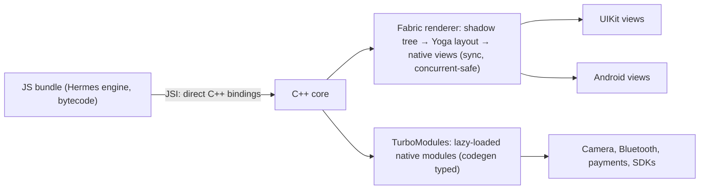

# React Native

> [!abstract] TL;DR
> React Native (RN) lets you build iOS and Android apps with [[React]] and TypeScript, rendering **real native views** (`UIView`, `android.view`) instead of a canvas. Since **0.82 (Oct 2025) the New Architecture is the only architecture**:
> - **JSI** for direct JS↔native calls,
> - **Fabric** renderer,
> - **TurboModules**,
> - Hermes as the JS engine.
>
> In practice you use it through **Expo**: managed builds (EAS), OTA updates, Expo Router, config plugins. Pick it when your team is React/TS-first or wants code sharing with a [[Next.js]] web app. Pick [[Flutter]] when pixel-perfect, consistent custom UI matters more.

## Introduction
- Open-sourced by Meta in 2015, MIT license. Used by Meta (Facebook, Instagram parts, Ads Manager), Microsoft (Office, Teams parts), Shopify (all mobile apps), Discord, Coinbase.
- **Expo** (Expo, Inc.) is the recommended framework by the React Native team: SDK of native modules, `expo-router` (file-based routing), **EAS Build/Submit/Update** (cloud builds, store submission, OTA updates), dev clients.
- Release cadence: roughly every 2 months (0.82 Oct 2025, 0.83 Dec 2025, 0.84 Feb 2026, 0.85 ~May 2026). Expo SDKs follow (SDK 55 = RN 0.83, SDK 56 = RN 0.85).
- Where it sits: the client layer, sharing TypeScript types, validation (Zod) and sometimes business logic with [[Next.js]]/Node backends and [[Supabase]].

## Core Concepts
```tsx
import { useState } from "react";
import { FlatList, Pressable, Text, View } from "react-native";

export function OrderList({ orders }: { orders: Order[] }) {
  const [selected, setSelected] = useState<string | null>(null);
  return (
    <FlatList
      data={orders}
      keyExtractor={o => o.id}
      renderItem={({ item }) => (
        <Pressable onPress={() => setSelected(item.id)} style={{ padding: 12 }}>
          <Text style={{ fontWeight: item.id === selected ? "700" : "400" }}>Order {item.id}</Text>
        </Pressable>
      )}
    />
  );
}
```
- **Core components** map to native views: `View`, `Text`, `Image`, `ScrollView`, `FlatList`/`FlashList` (virtualized lists), `TextInput`, `Pressable`.
- **Styling**: `StyleSheet` / inline objects with Flexbox (Yoga layout engine). Libraries like NativeWind (Tailwind) and Tamagui.
- **Navigation**: `expo-router` (file-based, built on React Navigation) or React Navigation directly.
- **Native modules**: Expo Modules API (Swift/Kotlin) or TurboModules (codegen from TS specs) for custom native code.
- **React features**: hooks, Suspense, concurrent rendering (via Fabric), React 19.x.

## Architecture / How It Works



- **Old architecture (removed in 0.82)**: an async JSON **bridge** serialized every call between JS and native, which caused jank and limited synchronous APIs.
- **New Architecture**:
  - **JSI** lets JS hold references to C++ host objects and call them synchronously.
  - **Fabric** renders through a C++ shadow tree with Yoga layout and supports React concurrent features.
  - **TurboModules** load lazily with type-safe codegen.
  - **Bridgeless** mode is the default.
- **Hermes**: a JS engine optimized for mobile (AOT bytecode, fast startup, lower memory). It's the default engine.
- **OTA updates** (EAS Update / CodePush successors) ship new JS bundles without store review, as long as native code and permissions are unchanged and store rules are respected.

## Project Structure
```text
my-app/                       # create-expo-app (TypeScript)
├── app.config.ts             # Expo config: name, bundle IDs, plugins, runtimeVersion
├── eas.json                  # build profiles (development / preview / production)
├── app/                      # expo-router routes
│   ├── _layout.tsx
│   ├── (auth)/login.tsx
│   └── (tabs)/orders/[id].tsx
├── src/
│   ├── lib/supabase.ts       # createClient with AsyncStorage/SecureStore session persistence
│   ├── features/…            # screens, hooks, components
│   └── shared/schemas.ts     # zod schemas shared with web
├── modules/                  # local Expo native modules (Swift/Kotlin) if needed
└── package.json
```
```bash
npx create-expo-app@latest my-app --template
npx expo start                      # dev server + Expo Go / dev client
eas build -p android --profile preview
eas update --branch production --message "fix: order total rounding"
```

## Use Cases
| Use case | Why it fits |
|---|---|
| Apps by React/Next.js teams | Reuse React skills, TS types, validation, API clients |
| Apps needing native look-and-feel | Real platform views and controls |
| Frequent JS-only fixes | OTA updates via EAS Update |
| E-commerce / content apps | Shopify-proven, good list performance with FlashList |
| Brownfield (adding RN screens to native apps) | Expo brownfield tooling, incremental adoption |

## Pros & Cons
| Pros | Cons |
|---|---|
| React + TypeScript: huge talent pool, shared web knowledge | Native module/version churn across RN upgrades |
| Native views, platform-correct behaviour | UI differs subtly per platform, needing more QA |
| Expo removes most native tooling pain (EAS, config plugins) | Expo/EAS cloud services add vendor dependency (EAS pricing) |
| OTA updates for JS fixes | Heavy animations/graphics need Reanimated/Skia expertise |
| New Architecture removed the bridge bottleneck | Some community libraries lag New Architecture support |

## Alternatives & Peers
| Alternative | Strength vs React Native | Weakness vs React Native | Pick it when… |
|---|---|---|---|
| [[Flutter]] | Pixel-identical custom UI, strong performance, single toolkit | Dart instead of TS, non-native widgets | Design-heavy apps. ZP's existing Flutter expertise |
| Native (SwiftUI / Jetpack Compose) | Best fidelity and newest APIs | Two codebases | Platform-specific, performance-critical apps |
| Kotlin Multiplatform | Shared logic + native UI | Smaller mobile-UI ecosystem on iOS | Kotlin teams |
| Capacitor / Ionic | Reuse a web app as-is | WebView performance/feel | Simple internal apps |
| PWA | No store, instant updates | iOS limits (push, background) | Lightweight tools |

## Tips & Reminders
> [!tip] Defaults that age well
> - Start with **Expo** (prebuild/CNG). Eject only if a native requirement truly needs it, and usually a config plugin or local Expo module is enough.
> - Upgrade RN/Expo every SDK release, not every two years. Skipping versions multiplies migration pain.
> - Use FlashList for long lists, Reanimated for animations, and Expo Image for images.
> - Store tokens in `expo-secure-store` (Keychain/Keystore), not AsyncStorage.
> - OTA updates: tie them to a `runtimeVersion`, never ship native-incompatible JS, and keep updates within store policies (no changing app purpose).

> [!tip] In ZP's stack
> - ZP's default mobile stack is [[Flutter]]. Choose RN when a client's team is React/Next.js-based and will maintain the app, or when significant TS code sharing with a [[Next.js]] web app is a requirement.
> - With [[Supabase]], use `@supabase/supabase-js` with SecureStore-backed session storage and deep links for OAuth/magic links.

## Versions & Breaking Changes
| Version | Released | Key changes | Breaking / migration notes |
|---|---|---|---|
| 0.68 | 2022-03 | New Architecture opt-in | — |
| 0.74 | 2024-04 | Yoga 3, bridgeless default for New Arch | — |
| 0.76 | 2024-10 | **New Architecture enabled by default** | Libraries without New Arch support use interop layers |
| 0.79–0.81 | 2025 | Faster Metro, JSC moved to community package, precompiled iOS builds | — |
| **0.82** | 2025-10-08 | **Legacy Architecture removed**: New Architecture only | `newArchEnabled=false` ignored. Upgrade or replace legacy-only libraries |
| 0.83 / 0.84 | 2025-12-10 / 2026-02-09 | React 19.2, DevTools and performance improvements | Expo SDK 55 (RN 0.83) drops the legacy arch entirely |
| 0.85 | ~2026-05 | Ships with Expo SDK 56 (2026-05-21) | — |

> [!warning] Unverified — check before relying on this
> RN releases after 0.85 and the current Expo SDK as of Oct 2026 weren't verified this run. Check https://reactnative.dev/versions and https://expo.dev/changelog.

## Critical Issues & Gotchas
> [!danger] CVE-2025-11953 — Metro dev server command injection (CVSS 9.8, Nov 2025)
> The React Native CLI's Metro development server bound to external interfaces by default, and an endpoint allowed **unauthenticated OS command execution** (full RCE on Windows) from anyone on the network. Fixed in `@react-native-community/cli-server-api` 20.0.0. Update the CLI, and never run dev servers on untrusted networks such as cafés or co-working spaces.

> [!danger] React2Shell exposure via shared React server code
> RN apps themselves don't run React Server Components, but RN + Expo Router server functions / API routes or a shared Next.js backend do. Keep the server side patched against CVE-2025-55182 (see [[React]]).

> [!warning] Gotchas
> - Native dependency upgrades (Gradle/AGP, Xcode, CocoaPods → SPM changes) cause the most breakage. Read Expo/RN upgrade helpers for every bump.
> - Store compliance deadlines (Android 16 KB page size, target API levels, iOS SDK minimums) apply to RN too. Old native libraries block releases.
> - Secrets in JS bundles are extractable. Hermes bytecode isn't encryption.
> - Large re-renders of lists (unstable `renderItem`/keys) cause jank. Memoize, or let the React Compiler help.
> - OTA updates that change native-dependent behaviour crash old binaries. Use runtime versions and staged rollouts.

## Deep Dives
- (planned) [[React Native - New Architecture]]

## Related
- [[React]] — the UI library underneath
- [[Flutter]] — main cross-platform alternative
- [[TypeScript]] — language
- [[Supabase]] — backend option
- [[Next.js]] — web counterpart for code sharing

## References
- Docs: https://reactnative.dev/docs/getting-started
- React Native versions: https://reactnative.dev/versions
- Expo SDK 55 changelog: https://expo.dev/changelog/sdk-55
- Expo SDK 56 changelog: https://expo.dev/changelog/sdk-56
- New Architecture (Expo): https://docs.expo.dev/guides/new-architecture/
- RN 0.82–0.84 overview (React Native Radio): https://infinite.red/react-native-radio/rnr-357-react-native-082084-expo-55
