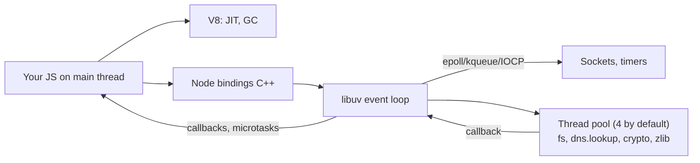

# Node.js

> [!abstract] TL;DR
> Node.js runs [[JavaScript]] on V8 with **libuv**: one thread executes your JS, and I/O is non-blocking. That makes it excellent for I/O-bound APIs, BFFs, realtime and tooling, and poor for CPU-heavy work unless you move it to worker threads.
> - **Versions to run**: **24 LTS** today, **26** once it becomes LTS (October 2026).
> - **Release model change**: from Node 27 (2027) there is **one major per year, and every major becomes LTS**.
> - **Biggest real risks**: npm supply chain (2025 worm attacks), event-loop blocking, and unhandled async errors.

## Introduction
- **What**: a server-side JavaScript runtime (Ryan Dahl, 2009). It's now governed by the OpenJS Foundation, with releases by the Node.js Release WG.
- **Problem it solved**: thread-per-connection servers wasted memory waiting on I/O. Node multiplexes thousands of connections on one event loop.
- **Where it sits**: under [[Next.js]], [[n8n]], most build tooling (Vite, ESLint, TypeScript), API servers (Fastify, NestJS, Express), and workers ([[Redis]]-backed queues like BullMQ). Peers Deno and Bun compete on DX and speed.

## Core Concepts

### Modules: ESM vs CommonJS
| | CommonJS | ES Modules |
|---|---|---|
| Syntax | `require()`, `module.exports` | `import`/`export`, top-level `await` |
| Selection | `.cjs`, or `.js` without `"type": "module"` | `.mjs`, or `.js` with `"type": "module"` |
| Loading | Synchronous | Async graph (static analysis) |
| Interop | Can `require()` ESM since 22.12/20.19 (`require(esm)`, no top-level await) | Can `import` CJS (default export = `module.exports`) |

- New code should use **ESM** with `"type": "module"`. `require(esm)` ended most dual-package pain.
- `package.json` `"exports"` controls the public entry points (conditional `import`/`require`/`types`). Deep imports not listed there fail.

### Built-ins worth knowing (no dependency needed)
| Need | Built-in |
|---|---|
| HTTP client | Global `fetch` (undici), `WebSocket` client (22+) |
| Tests | `node:test` + `node --test` (watch, coverage, mocking, snapshots) |
| Env files | `node --env-file=.env` / `process.loadEnvFile()` |
| TypeScript | **Type stripping** (`node app.ts`, erasable syntax only; default since 23.6/22.18) |
| Watch mode | `node --watch` |
| Task runner | `node --run <script>` (faster than `npm run`) |
| SQLite | `node:sqlite` (`DatabaseSync`; experimental → release candidate) |
| Permissions | `--permission` with `--allow-fs-read`, `--allow-net` … (stable in 24) |
| Context propagation | `AsyncLocalStorage` (request IDs, tracing) |
| Parallel CPU | `node:worker_threads`, `node:cluster` |

### Async model
```ts
import { setTimeout as sleep } from 'node:timers/promises';
const ac = new AbortController();
const res = await fetch('https://api.example.my/orders', { signal: AbortSignal.timeout(5_000) });   // always bound I/O
for await (const chunk of res.body!) process.stdout.write(chunk);                                  // streams are async iterables
```
- **Order**: sync code → `process.nextTick` queue → promise microtasks → event loop phases (timers → pending → poll → check (`setImmediate`) → close). Details are in [[JavaScript - Event Loop & Async]].
- **Streams + backpressure**: use `stream.pipeline()` (promise version from `node:stream/promises`), never manual `.pipe()` chains without error handling.

## Architecture / How It Works

- **Single JS thread per isolate**: anything synchronous and slow (JSON.parse of 50 MB, bcrypt sync, a big regex, a loop over 1M rows) blocks **every** request.
- **libuv thread pool** (`UV_THREADPOOL_SIZE`, default 4, max 1024) handles fs, `dns.lookup`, `crypto.pbkdf2/scrypt`, and zlib. Saturating it stalls unrelated fs/DNS work.
- **Network I/O** uses OS async primitives (epoll/kqueue/IOCP), not the pool.
- **Memory**: the V8 heap limit is set by `--max-old-space-size` (it defaults from available memory but **doesn't respect container limits** consistently on older versions). Set it explicitly in [[Docker]] to ~75% of the container memory.
- **Scaling across cores**: run N processes (cluster, PM2, multiple containers behind [[Traefik]]) or worker threads for CPU tasks.

## Project Structure
```text
api/
├── package.json          # "type": "module", "engines": { "node": ">=24" }, scripts
├── package-lock.json     # or pnpm-lock.yaml — always commit
├── tsconfig.json         # "module": "nodenext", "erasableSyntaxOnly": true if using type stripping
├── src/
│   ├── server.ts         # Fastify/Express bootstrap, graceful shutdown
│   ├── routes/           # HTTP layer only
│   ├── services/         # business logic
│   ├── db/               # pg/Drizzle/Prisma, migrations
│   └── jobs/             # BullMQ workers
├── test/                 # node:test or Vitest
├── .env.example
└── Dockerfile            # multi-stage, node:24-slim, non-root USER node
```
```ts
// graceful shutdown: required behind Docker/Coolify rolling deploys
const server = app.listen({ port: 3000, host: '0.0.0.0' });
for (const sig of ['SIGTERM', 'SIGINT']) process.on(sig, async () => {
  await app.close();               // stop accepting, finish in-flight
  await pool.end();                // close DB pools
  process.exit(0);
});
```

## Use Cases
| Use case | Why it fits |
|---|---|
| REST/GraphQL APIs, BFF for web/mobile | Non-blocking I/O, huge ecosystem, shared TS types with the frontend |
| Realtime (WebSocket, SSE, chat) | Many idle connections per process |
| SSR / full-stack frameworks | [[Next.js]], Remix, Nuxt, Astro run on Node |
| Queue workers, webhooks, integrations | BullMQ on [[Redis]], cheap concurrency for HTTP-heavy jobs |
| Automation platforms | [[n8n]] is a Node.js app (custom nodes in TS) |
| CLIs and build tooling | npm distribution, fast startup |
| CPU-heavy compute, ML inference | **Poor fit**. Use worker threads, a native addon, or [[Go]]/[[Python]] services |

## Pros & Cons
| Pros | Cons |
|---|---|
| One language (TS) across frontend, backend and tooling | Single-threaded JS: CPU work blocks everything |
| Massive npm ecosystem | npm supply-chain risk, dependency sprawl |
| Excellent I/O concurrency, low memory per connection | Callback/promise error handling footguns (unhandled rejections crash) |
| Fast startup, good for serverless/containers | ESM/CJS and tooling churn (bundlers, test runners, TS setups) |
| Batteries now included (fetch, test, watch, env, TS stripping) | Dynamic typing at runtime: TS types vanish at the boundary |
| Predictable LTS cadence | Frequent security releases you must actually apply |

## Alternatives & Peers
| Alternative | Strength vs Node.js | Weakness vs Node.js | Pick it when… |
|---|---|---|---|
| Bun | Faster startup/install, built-in bundler/test/SQL, TS native | Younger, Node-compat gaps in edge cases, acquired by Anthropic (2025) so roadmap is vendor-led | Tooling speed matters, greenfield scripts |
| Deno | Secure-by-default permissions, TS native, std lib, Deno Deploy | Smaller ecosystem (npm compat good but not total) | Edge/serverless with strict permissions |
| [[Go]] | Real parallelism, single static binary, low memory | Less shared code with a TS frontend | CPU-heavy or very high-throughput services |
| [[Python]] (FastAPI) | AI/ML ecosystem | Slower async ecosystem, GIL (free-threaded builds still maturing) | AI-heavy backends |
| [[Spring Boot]] (Java/Kotlin) | Enterprise tooling, virtual threads | Heavier, slower dev loop | Enterprise/bank integrations |
| Cloudflare Workers | Edge runtime, zero ops | Limited Node APIs, CPU time limits | Edge APIs, lightweight webhooks |

## Tips & Reminders
> [!tip]
> - Pin the runtime: `.nvmrc`/`.node-version` + `"engines"` + an exact Docker tag (`node:24.x-slim`). Upgrade LTS lines deliberately.
> - Use **Fastify** (schema validation, faster) or **Hono** for new APIs. Express 5 is fine for existing code.
> - Validate every boundary (request bodies, env vars, webhook payloads) with Zod/Valibot. TS types don't exist at runtime.
> - `process.on('unhandledRejection')` → log and **exit** (let the orchestrator restart). Don't keep running in an unknown state.
> - Monitor event-loop delay (`perf_hooks.monitorEventLoopDelay`) and heap. p99 loop lag > 100 ms means something is blocking.
> - Use `npm ci` in CI/Docker, enable `ignore-scripts` where possible, and review lockfile diffs.
> - **In ZP's stack**: run Node 24 LTS (move to 26 after it turns LTS in late October 2026) in multi-stage Docker images on [[Coolify]]. Set `--max-old-space-size` to fit the container, handle `SIGTERM` for zero-downtime deploys, and put BullMQ workers in a separate service from the API. Note that [[n8n]] pins its own Node version inside its image.

## Versions & Breaking Changes
| Version | Released | Key changes | Breaking / migration notes |
|---|---|---|---|
| 20 | 2023-04 | Permission model (experimental), stable test runner | **EOL 2026-04-30**. Upgrade now |
| 22 LTS | 2024-04 | `require(esm)`, WebSocket client, `node --run`, glob, type stripping (flag, later default) | Maintenance LTS until 2027-04 |
| 23 | 2024-10 | Type stripping on by default (23.6), `require(esm)` unflagged | Odd line, EOL |
| **24 LTS** | 2025-05 | V8 13.6, npm 11, `URLPattern` global, permission model stable, `using` (explicit resource management), AsyncLocalStorage on AsyncContextFrame | Active LTS until 2026-10, then maintenance to 2028-04. `url.parse()` deprecation warnings, legacy APIs removed |
| 25 | 2025-10 | V8 14.x, Web Storage on by default, more legacy removals | Odd line, EOL mid-2026 |
| **26** | 2026-04 | Last release under the old two-majors-a-year model | Becomes **LTS in 2026-10**, EOL ~2029-04 |
| 27+ | 2027-04 | **New model**: one major per year, alpha (Oct–Mar) → current (Apr–Oct) → LTS (30 months). Every release is LTS | No more odd/even split. Version = calendar year of release |

> [!warning] Unverified — check before relying on this
> Exact Node 26 feature list and LTS promotion date weren't confirmed in this run. See https://nodejs.org/en/about/previous-releases and the Node 26 release post.

## Critical Issues & Gotchas
> [!danger] npm supply-chain attacks (2025)
> - **September 2025**: maintainer phishing led to malware in `chalk`, `debug` and ~18 related packages (billions of weekly downloads). The payload was a crypto-wallet hijacker in browser bundles.
> - **September and November 2025**: the self-propagating **Shai-Hulud** worm stole npm/GitHub/cloud tokens via `postinstall` scripts and republished infected versions of hundreds of packages.
>
> Mitigation:
> - `npm ci` with a committed lockfile, and pin versions.
> - `ignore-scripts=true` (or pnpm's default of not running dependency build scripts).
> - Delay adopting new versions (pnpm `minimumReleaseAge`, Renovate's `minimumReleaseAge`).
> - npm **trusted publishing** + 2FA for your own packages, and scoped short-lived CI tokens.

> [!danger] Event-loop blocking = full outage
> One synchronous hot path (bcrypt sync, `fs.readFileSync` in a handler, catastrophic-backtracking regex = ReDoS, `JSON.parse` of a huge body) stalls every request in the process. Health checks then fail and the orchestrator restarts the container, which looks like random downtime. Set body size limits, use async crypto/fs, test regexes, and offload CPU work to `worker_threads` or a queue.

> [!danger] Regular security releases (e.g. January 2026)
> Node ships coordinated security releases several times a year. Recent ones covered HTTP/2 and request-parsing crashes (remote DoS), permission-model bypasses, and an `async_hooks`/AsyncLocalStorage stack-overflow DoS that affected frameworks and APM agents. Subscribe to nodejs-sec announcements and rebuild images on each patch release.

> [!warning] Gotchas
> - Unhandled promise rejections **terminate the process** (since 15). Always `await` or `.catch()`.
> - `dns.lookup` (used by `http`/`fetch` by default) runs on the thread pool. Heavy outbound traffic plus fs work can starve it. Raise `UV_THREADPOOL_SIZE` or use connection pooling (undici `Agent`).
> - The default `fetch` has **no timeout**. Pass `AbortSignal.timeout()`.
> - `process.env` values are strings. `"false"` is truthy.
> - Container memory: without `--max-old-space-size`, Node can exceed the cgroup limit and get OOM-killed instead of throwing.
> - Type stripping doesn't type-check, and doesn't support `enum`/`namespace`/parameter properties (non-erasable syntax). Run `tsc --noEmit` in CI.

## Deep Dives
N/A — no deep dives planned yet. Candidates: event loop & performance diagnostics, streams & backpressure, npm supply-chain hardening.

## Related
- [[JavaScript]] · [[TypeScript]] — the language
- [[JavaScript - Event Loop & Async]] — microtasks, phases, ordering
- [[Next.js]] — framework running on Node
- [[n8n]] — Node-based automation platform
- [[Redis]] — BullMQ queues, caching
- [[Docker]] · [[Coolify]] — packaging and deployment
- [[Go]] — language peer (Bun, Deno: runtime peers, no notes planned)

## References
- Official docs: https://nodejs.org/docs/latest/api/
- Release schedule: https://github.com/nodejs/release#release-schedule
- Previous releases / EOL: https://nodejs.org/en/about/previous-releases
- Evolving the release schedule (2026): https://nodejs.org/en/blog/announcements/evolving-the-nodejs-release-schedule
- Security releases: https://nodejs.org/en/blog/vulnerability
- Node.js best practices: https://github.com/goldbergyoni/nodebestpractices
