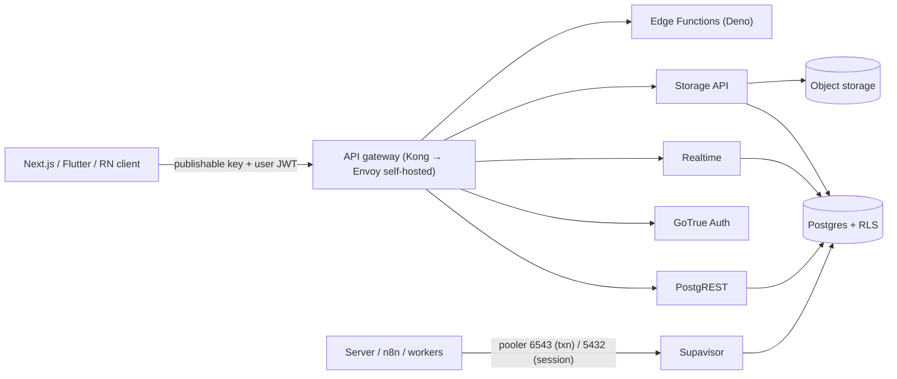

# Supabase

> [!abstract] TL;DR
> Supabase is an open-source **Postgres development platform**: a dedicated [[PostgreSQL]] database plus Auth (GoTrue), an auto-generated REST API (PostgREST), Realtime, Storage (S3-compatible), Edge Functions (Deno), pgvector, Cron and Queues. All of it is secured by **Row Level Security (RLS)**, so clients can query the database directly. It's ZP's default backend for Next.js and Flutter apps. In 2025–26 the platform switched to **publishable/secret API keys** and **asymmetric JWT signing keys**, and the **legacy `anon`/`service_role` keys are being removed in late 2026**, so migrate now. The #1 risk is still **missing or wrong RLS**.

## Introduction
- Founded in 2020 (Paul Copplestone, Ant Wilson). The components are open source (Apache-2.0/MIT, Postgres License). Supabase Cloud is the managed offering, and self-hosting runs via Docker Compose.
- Positioned as the "Postgres alternative to Firebase": real SQL, extensions, no proprietary query language, and you can leave with `pg_dump`.
- Regions include **ap-southeast-1 (Singapore)**, which is the low-latency choice for Malaysia (~20–40 ms from KL/Kuching).
- Where it sits: the backend for [[Next.js]] (via `@supabase/ssr`), [[Flutter]] (`supabase_flutter`), and React Native/Expo. It's often paired with [[n8n]] for automations and Edge Functions or Next.js route handlers for custom logic.

## Core Concepts
| Component | What it is | Notes |
|---|---|---|
| **Database** | Dedicated Postgres (17 on new projects) with extensions | `pgvector`, `pg_cron`, `pgmq`, `pg_net`, PostGIS, `pg_graphql` |
| **Auth** | GoTrue: email/password, magic link, OTP (SMS/WhatsApp), OAuth providers, SAML SSO, MFA, anonymous users | Issues JWTs. `auth.users` table. Hooks for custom claims |
| **Data API** | PostgREST (REST) + pg_graphql | Auto-generated from schema. RLS enforced per request |
| **Realtime** | Postgres Changes, Broadcast, Presence over WebSocket | Postgres Changes respects RLS |
| **Storage** | S3-compatible object storage with RLS policies on `storage.objects` | Image transformations, resumable uploads (TUS) |
| **Edge Functions** | Deno (TypeScript) serverless functions | Webhooks, third-party calls, secret-holding logic |
| **Supavisor** | Connection pooler | Transaction mode **6543**, session mode **5432** |
| **Branching** | Preview databases per Git branch | Migrations + seed per PR |
| **Cron / Queues** | `pg_cron`, `pgmq`-based queues | Scheduled jobs and durable queues in Postgres |

### API keys & JWTs (2026 model)
| Key | Prefix | Use | Notes |
|---|---|---|---|
| **Publishable** | `sb_publishable_…` | Browser/mobile clients | Replaces legacy `anon`. Safe to ship **only with RLS on** |
| **Secret** | `sb_secret_…` | Server-only (bypasses RLS) | Multiple, individually revocable. Auto-revoked if found on public GitHub |
| Legacy `anon` / `service_role` | JWT strings | Old projects | **Being removed late 2026**, so migrate |
| **JWT signing keys** | ES256/RS256, JWKS endpoint | User session tokens | Verify locally with `getClaims()`. Rotate without downtime |

### RLS in one example
```sql
alter table orders enable row level security;

create policy "members read own tenant orders" on orders
for select to authenticated
using ( tenant_id = (select (auth.jwt() -> 'app_metadata' ->> 'tenant_id')::uuid) );

create policy "members insert into own tenant" on orders
for insert to authenticated
with check ( tenant_id = (select (auth.jwt() -> 'app_metadata' ->> 'tenant_id')::uuid) );
```
- Use `app_metadata` (server-controlled) for authorization claims, never `user_metadata` (user-editable).
- `(select auth.jwt())` / `(select auth.uid())` wrappers let Postgres evaluate them once per query (big performance win).

## Architecture / How It Works



- **Request flow**: the client sends the publishable key + the user's access token → the gateway validates → PostgREST runs the query as role `authenticated` with JWT claims available via `auth.jwt()` → RLS policies filter rows.
- **Roles**: `anon` (no session), `authenticated` (valid user JWT), `service_role` (secret key, bypasses RLS). Postgres `GRANT`s still apply under RLS.
- **Realtime Postgres Changes** reads WAL via logical replication and checks RLS per subscriber. Broadcast/Presence don't touch the DB (authorization via Realtime policies).
- **Self-hosting**: Docker Compose stack (Postgres 17, Envoy gateway replacing Kong, Studio, GoTrue, PostgREST, Realtime, Storage, imgproxy, Edge runtime). You own backups, upgrades and security.

## Project Structure
```text
app/
├── supabase/
│   ├── config.toml               # local stack config (supabase start)
│   ├── migrations/               # timestamped SQL (supabase db diff / migration new)
│   ├── seed.sql
│   ├── functions/
│   │   └── wa-webhook/index.ts   # Edge Function (Deno)
│   └── tests/                    # pgTAP RLS tests (supabase test db)
├── src/lib/supabase/
│   ├── server.ts                 # createServerClient (cookies) — per request
│   ├── client.ts                 # createBrowserClient — publishable key
│   └── database.types.ts         # supabase gen types typescript
└── .env                          # NEXT_PUBLIC_SUPABASE_URL, NEXT_PUBLIC_SUPABASE_PUBLISHABLE_KEY, SUPABASE_SECRET_KEY (server only)
```
```bash
supabase start                      # local Postgres + services in Docker
supabase migration new add_orders   # write SQL
supabase db diff -f add_orders      # or generate from Studio changes
supabase gen types typescript --local > src/lib/supabase/database.types.ts
supabase test db                    # pgTAP: assert RLS policies
supabase db push                    # apply to linked project (CI)
```

## Use Cases
| Use case | Why it fits |
|---|---|
| SME SaaS / client portals (Next.js) | Auth + RLS + REST in hours, real Postgres underneath |
| Flutter / mobile apps | `supabase_flutter`: auth, realtime, storage, offline-friendly patterns |
| Internal tools & dashboards | Studio + PostgREST + RLS per role |
| AI apps (RAG, agents) | pgvector + Edge Functions + Queues, all in one DB |
| Real-time features (chat inbox, live orders) | Realtime Postgres Changes / Broadcast |
| n8n-backed automations | n8n Supabase/Postgres nodes against the same DB |

## Pros & Cons
| Pros | Cons |
|---|---|
| Real Postgres: SQL, extensions, `pg_dump` exit path | RLS mistakes = data exposure. Easy to get wrong |
| Very fast to build (Auth, API, Storage, Realtime included) | Platform conventions (`auth` schema, PostgREST limits) shape your design |
| Generous free tier, predictable Pro pricing | Free projects pause after inactivity. Compute add-ons get costly |
| Open source, self-hostable | Self-hosting is a lot to operate (many services, upgrades, backups) |
| Singapore region for MY latency | Vendor platform changes (API keys, JWT) force migrations |

## Alternatives & Peers
| Alternative | Strength vs Supabase | Weakness vs Supabase | Pick it when… |
|---|---|---|---|
| Firebase | Mature mobile SDKs, offline sync, FCM | NoSQL (Firestore), lock-in, query limits | Offline-first mobile, Google ecosystem |
| Neon / plain managed Postgres + own backend | Serverless Postgres, branching, full control of API layer | You build auth/API/storage yourself | Custom backend with Prisma/Drizzle |
| Appwrite / PocketBase | Simpler self-hosting (PocketBase single binary) | Smaller ecosystem. PocketBase = SQLite | Tiny apps, self-host simplicity |
| Convex | Reactive TS backend, transactions, great DX | Proprietary model, not SQL | Real-time TS apps |
| Custom NestJS/Spring + Postgres | Full control, complex domains | Much more build time | Large teams/complex business logic |

## Tips & Reminders
> [!tip] Security checklist (every project)
> - **RLS on every table in exposed schemas.** Run the Security Advisor/linter in the dashboard. Keep sensitive tables out of `public` or revoke grants.
> - **Secret keys only on servers** (Next.js server, Edge Functions, n8n credentials), never in Flutter/React bundles.
> - Authorize with `app_metadata` claims or membership tables, never `user_metadata`.
> - Test policies with pgTAP or SQL that switches roles (`set local role authenticated; set local request.jwt.claims = '…'`).
> - Enable MFA for dashboard users, set the Network Restrictions allowlist, and turn on PITR backups for production.

> [!tip] In ZP's stack
> - **Migrate client projects to publishable/secret keys + JWT signing keys now.** The legacy `anon`/`service_role` keys are being removed in late 2026, and apps still using them will break.
> - [[Next.js]]: `@supabase/ssr` with per-request server clients. Verify sessions with `getClaims()` (local JWKS verification) rather than trusting cookies.
> - [[n8n]]: connect via the **session pooler/direct connection (5432)** for long-lived workers, or **6543** for short queries with `prepare_threshold` off. Use a dedicated DB role, not `postgres`.
> - Region: Singapore. Document data location in the client's PDPA notice and DPA.
> - AI tooling: if you use the Supabase MCP server with coding agents, connect it **read-only and project-scoped**, never against production with secret keys.

## Versions & Breaking Changes
| Change | When | Impact | Migration notes |
|---|---|---|---|
| Supavisor replaces PgBouncer | 2024 | Pooler connection strings changed | Use 6543 (txn) / 5432 (session) |
| JWT signing keys (asymmetric) | 2025-07 | JWKS-based verification, rotation | Move off the shared JWT secret. Use `getClaims()` |
| Publishable / secret API keys | 2025 | Revocable, scoped keys. GitHub secret scanning auto-revocation | Replace `anon`/`service_role` in all apps and envs |
| Postgres 17 for new projects / self-host image | 2025–26 | Newer PG features | Upgrade older projects via dashboard (downtime window) |
| Self-hosted gateway Kong → Envoy | 2026 | Config-as-code routing | Review custom Kong configs |
| **Legacy `anon`/`service_role` keys removed** | Late 2026 | Old keys stop working | **Deadline: migrate before removal** |

> [!warning] Unverified — check before relying on this
> The exact removal date for legacy keys and per-plan pricing weren't verified this run. Check https://supabase.com/docs/guides/getting-started/api-keys and the changelog.

## Critical Issues & Gotchas
> [!danger] Missing RLS → public data exposure
> **CVE-2025-48757 (May 2025)**: 170+ apps built with AI app builders (Lovable) exposed user data, because tables were created without RLS while the anon key sat in the frontend. Anyone could query PII and API keys directly via PostgREST. The anon/publishable key is **public by design**, so RLS is the only barrier.

> [!danger] Prompt injection via the Supabase MCP server (Jul 2025)
> Researchers showed that an AI coding agent connected to Supabase MCP with `service_role` could be tricked by a support-ticket message into reading and exfiltrating private tables. Mitigate with read-only mode, project scoping, no production access for agents, and human review of tool calls.

> [!warning] Gotchas
> - The transaction pooler (6543) breaks prepared statements, session `SET`s and `LISTEN/NOTIFY`. Use 5432 for those.
> - `service_role`/secret-key clients bypass RLS, including in Edge Functions. Re-check authorization in code.
> - RLS policies using non-wrapped `auth.uid()` per row on large tables make queries slow. Wrap them in `(select …)` and index the policy columns.
> - Storage policies are separate from table policies. Buckets are private by default, and public buckets are world-readable.
> - Free-tier projects pause after a week of inactivity, which is bad for client demos left idle.
> - `auth.users` is in a managed schema. Mirror the needed fields into your own `profiles` table via trigger rather than querying `auth` from clients.

## Deep Dives
- (planned) [[Supabase - Row Level Security]]

## Related
- [[PostgreSQL]] — the database underneath
- [[Next.js]] · [[Flutter]] · [[React Native]] — client SDKs
- [[JWT]] · [[OAuth 2.0 & OIDC]] — auth model
- [[RAG]] — pgvector on Supabase
- [[n8n]] — automations against Supabase

## References
- Docs: https://supabase.com/docs
- API keys (publishable/secret): https://supabase.com/docs/guides/getting-started/api-keys
- Migrating to new API keys: https://supabase.com/docs/guides/getting-started/migrating-to-new-api-keys
- JWT signing keys: https://supabase.com/blog/jwt-signing-keys
- Supabase Security Retro 2025: https://supabase.com/blog/supabase-security-2025-retro
- RLS guide: https://supabase.com/docs/guides/database/postgres/row-level-security
