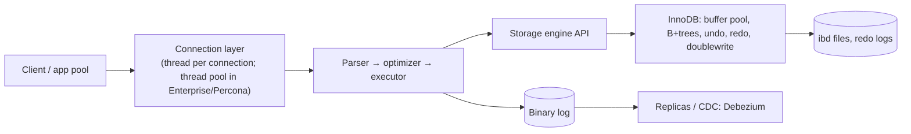

# MySQL

> [!abstract] TL;DR
> MySQL is the most widely deployed open-source relational database: the M in LAMP, the default for WordPress/Laravel/most shared hosting. It runs on **InnoDB** (ACID, MVCC, clustered primary keys).
> - **Strengths**: simple to run, fast primary-key OLTP, mature replication, and massive horizontal-sharding precedent (Vitess at YouTube, PlanetScale).
> - **Gaps vs [[PostgreSQL]]**: weaker SQL features, extensions and types.
> - **2026 lines**: **8.4 LTS** and **9.7 LTS** (GA 2026-04-21). 8.0 is at end of life.
>
> For new projects in ZP's stack, PostgreSQL is the default. You meet MySQL when maintaining client systems (WordPress, legacy PHP/Laravel, ERP/POS software).

## Introduction
- **History**: created by MySQL AB (1995), acquired by Sun (2008), then Oracle (2010). That led to forks: **MariaDB** (Monty Widenius, 2009) and **Percona Server** (drop-in with extra instrumentation).
- **License**: the Community Edition is GPLv2. Enterprise Edition (Oracle) adds a thread pool, audit, encryption key management, data masking and support. HeatWave is Oracle Cloud's managed analytics/ML variant.
- **Where it sits**: web/PHP stacks, SaaS OLTP at scale (Shopify, GitHub, Uber on MySQL/Vitess), managed offerings (AWS RDS/Aurora MySQL, Google Cloud SQL, Azure, PlanetScale, TiDB as a MySQL-compatible distributed SQL database).

## Core Concepts

### InnoDB essentials
| Concept | What to know |
|---|---|
| **Clustered index** | Table rows are stored **in primary-key order** in a B+tree. Secondary indexes store the PK, so a secondary lookup is two B-tree traversals |
| Primary key choice | Use monotonically increasing PKs (`BIGINT AUTO_INCREMENT`, UUIDv7 as `BINARY(16)`). Random UUIDv4 PKs cause page splits and bloat |
| MVCC | Undo logs hold old row versions. Long transactions keep the history list growing ("purge lag") |
| Isolation default | **REPEATABLE READ** (Postgres defaults to READ COMMITTED). Uses gap/next-key locks to prevent phantoms, which means more deadlocks |
| Redo log + doublewrite | Crash safety. `innodb_flush_log_at_trx_commit=1` for durability |
| Buffer pool | Main cache. Set `innodb_buffer_pool_size` to ~60–75% of RAM on a dedicated host |

### SQL features (8.0+)
- CTEs (incl. recursive), window functions, `JSON` type + functions + multi-valued indexes, `CHECK` constraints (enforced since 8.0.16), invisible indexes, descending indexes, functional indexes, `LATERAL`, `INSERT ... ON DUPLICATE KEY UPDATE`.
- **9.x**: `VECTOR` type (storage only in Community; distance functions in HeatWave/Enterprise), JavaScript stored programs (Enterprise), and more Enterprise features moving to Community in 9.7.

```sql
-- character set: always utf8mb4 (MySQL's "utf8" is a 3-byte alias that can't store emoji)
CREATE TABLE orders (
  id          BIGINT UNSIGNED AUTO_INCREMENT PRIMARY KEY,
  tenant_id   BIGINT UNSIGNED NOT NULL,
  status      ENUM('pending','paid','cancelled') NOT NULL DEFAULT 'pending',
  total_sen   INT UNSIGNED NOT NULL,
  meta        JSON NULL,
  created_at  DATETIME(3) NOT NULL DEFAULT CURRENT_TIMESTAMP(3),
  INDEX idx_tenant_created (tenant_id, created_at),
  CHECK (total_sen >= 0)
) ENGINE=InnoDB DEFAULT CHARSET=utf8mb4 COLLATE=utf8mb4_0900_ai_ci;

EXPLAIN ANALYZE SELECT * FROM orders WHERE tenant_id = 42 ORDER BY created_at DESC LIMIT 20;
```

### Replication and HA
| Option | Model | Notes |
|---|---|---|
| Async replication (binlog, GTID) | Primary → replicas | Default. Replica lag. Failover needs tooling (Orchestrator, MySQL Router) |
| Semi-sync | Primary waits for ≥1 replica ACK | Less data loss on failover |
| **Group Replication / InnoDB Cluster** | Paxos-based, single- or multi-primary | Built-in automatic failover with MySQL Shell + Router |
| InnoDB ClusterSet / ReplicaSet | DR across regions / simpler async sets | Managed via MySQL Shell |
| Vitess | Sharding + connection pooling proxy layer | Horizontal scale. Used by PlanetScale, Slack, GitHub |

## Architecture / How It Works

- **Pluggable storage engines**: InnoDB is the default and the only sane choice. MyISAM isn't transactional or crash-safe. MEMORY and ARCHIVE are niche.
- **Two logs**: InnoDB redo (crash recovery) vs **binlog** (replication, point-in-time recovery, CDC). Use `binlog_format=ROW` (default) for correctness.
- **Thread per connection**: thousands of connections hurt. Use app-side pooling or ProxySQL/MySQL Router. Default `max_connections` is 151.
- **Optimizer**: cost-based, with histograms (8.0+), hash joins (8.0.18+) and hints. Weaker than Postgres on complex queries and subquery decorrelation in some versions.
- **Online DDL**: `ALGORITHM=INSTANT` (add/drop columns, 8.0.29+), `INPLACE`, `COPY`. For big tables use gh-ost or pt-online-schema-change to avoid locks and replica lag.

## Project Structure
N/A for the DB itself. Typical self-hosted setup:
```yaml
# docker-compose.yml (dev / small prod)
services:
  mysql:
    image: mysql:8.4                  # LTS; pin the minor in production (e.g. 8.4.x)
    environment:
      MYSQL_ROOT_PASSWORD_FILE: /run/secrets/mysql_root
      MYSQL_DATABASE: app
    command: ["--innodb-buffer-pool-size=1G", "--binlog-expire-logs-seconds=604800", "--max-connections=300"]
    volumes: ["mysql-data:/var/lib/mysql"]
    networks: [data]                  # no published port; see Network Security
    secrets: [mysql_root]
volumes: { mysql-data: {} }
```
```bash
mysqldump --single-transaction --routines --triggers --set-gtid-purged=OFF app | gzip > app.sql.gz   # logical, small DBs
xtrabackup --backup --target-dir=/backups/$(date +%F)                                                # physical, hot (Percona)
mysqlsh -- util dump-instance /backups/full --threads=8                                               # parallel logical dump
```

## Use Cases
| Use case | Why it fits |
|---|---|
| WordPress, WooCommerce, Laravel/PHP apps | Default target, every host supports it |
| High-volume simple OLTP (PK lookups, short txs) | Clustered PK, predictable performance |
| Horizontally sharded SaaS | Vitess/PlanetScale/TiDB precedent |
| Legacy ERP/POS/accounting packages in Malaysian SMEs | Many vendors ship MySQL/MariaDB |
| Read-heavy with many replicas | Mature async replication |
| Complex analytics, geospatial, extension-heavy workloads | **Weaker fit**. Prefer [[PostgreSQL]] (PostGIS, pgvector, richer SQL) or a columnar store |

## Pros & Cons
| Pros | Cons |
|---|---|
| Simple to operate, ubiquitous hosting and managed options | Oracle stewardship: features move to Enterprise/HeatWave, slower community engagement |
| Fast PK lookups, clustered storage | Weaker SQL feature set, types and extension ecosystem than Postgres |
| Battle-tested replication and sharding (Vitess) | REPEATABLE READ + gap locks → more deadlocks under contention |
| Instant DDL for many column changes | Historical footguns: `utf8` ≠ UTF-8, silent truncation outside strict mode |
| Huge talent pool (PHP/web) | `VECTOR` search not available in Community (no ANN index) |
| GPL forks (MariaDB, Percona) reduce lock-in | MariaDB has diverged: not a drop-in for MySQL 8+ features (JSON, GTID differ) |

## Alternatives & Peers
| Alternative | Strength vs MySQL | Weakness vs MySQL | Pick it when… |
|---|---|---|---|
| [[PostgreSQL]] | Richer SQL, extensions (PostGIS, pgvector), RLS, better optimizer for complex queries | Process-per-connection (needs pooling), VACUUM tuning | **Default for new projects** (and [[Supabase]]) |
| MariaDB | Community-governed fork, Galera cluster, some extra features | Diverged from MySQL 8/9 compatibility | Distro defaults, Galera multi-primary |
| Percona Server | Drop-in MySQL with thread pool, audit, backups (XtraBackup) | Follows Oracle's lead | Self-hosting MySQL in production |
| TiDB / PlanetScale (Vitess) | Horizontal scale, MySQL wire protocol | Distributed-SQL constraints, cost | Outgrowing a single primary |
| SQLite | Embedded, zero ops | Single writer | Local/edge, small apps |

## Tips & Reminders
> [!tip]
> - Ensure `sql_mode` includes `STRICT_TRANS_TABLES` (the default since 5.7). Never run permissive mode, which silently truncates and zero-dates data.
> - `utf8mb4` + `utf8mb4_0900_ai_ci` everywhere (database, tables, connection `charset=utf8mb4`).
> - Keep transactions short. Monitor `information_schema.innodb_trx` and history list length.
> - Use the slow query log + `pt-query-digest`, `performance_schema` and `sys` schema views (`sys.statements_with_full_table_scans`).
> - Test restores, not just backups. Enable binlogs for point-in-time recovery.
> - **In ZP's stack**: build new products on [[PostgreSQL]]/[[Supabase]]. For client WordPress/Laravel sites on [[Coolify]], run MySQL 8.4 LTS in a container on an internal network with nightly `mysqldump`/XtraBackup to Cloudflare R2. Plan the 8.4 → 9.7 LTS upgrade during a maintenance window, and pull data into Postgres/[[n8n]] via read replicas or CDC rather than querying production directly.

## Versions & Breaking Changes
| Version | Released | Key changes | Breaking / migration notes |
|---|---|---|---|
| 5.7 | 2015-10 | JSON type, generated columns, strict mode default | **EOL 2023-10** |
| 8.0 | 2018-04 | Data dictionary, CTEs, window functions, `caching_sha2_password` default, roles, instant ADD COLUMN | **EOL April 2026**. Must upgrade to 8.4 |
| **8.4 LTS** | 2024-04 | First LTS under the new model. `mysql_native_password` disabled by default | Old clients/drivers using native password fail. Many replication terms renamed (source/replica) |
| 9.0–9.6 Innovation | 2024-07 → 2026 | `VECTOR` type, JS stored programs (Enterprise), `mysql_native_password` removed (9.0) | Innovation releases: ~quarterly, short support |
| **9.7 LTS** | 2026-04-21 | New LTS line. Enterprise observability features (replication applier metrics, GR flow-control stats, telemetry) moved to Community. Dynamic data masking (Enterprise) | Upgrade path 8.4 → 9.7. Test auth plugins and removed deprecated syntax |

> [!warning] Unverified — check before relying on this
> The exact 8.0 EOL date and 8.4/9.7 support windows weren't confirmed against Oracle's lifecycle page this run. Check https://dev.mysql.com/doc/refman/9.7/en/mysql-releases.html and Oracle's Lifetime Support Policy.

## Critical Issues & Gotchas
> [!danger] Open MySQL ports get ransomed
> Internet-exposed MySQL instances with weak or default credentials are routinely wiped and replaced with a ransom note table (automated campaigns since 2017). With [[Docker]], `-p 3306:3306` bypasses UFW. Never publish 3306; access via an internal network, SSH tunnel or Tailscale.

> [!danger] Vendor stewardship risk
> Oracle controls MySQL's roadmap. Features increasingly land in Enterprise/HeatWave first, and in 2025 there were reports of significant cuts to the MySQL engineering team, raising community concern about Community Edition velocity. Mitigation: avoid Enterprise-only features in client designs, keep MariaDB/Percona/Postgres as exit options, and prefer PostgreSQL for new builds.

> [!danger] 8.0 end of life
> MySQL 8.0 reached end of life in April 2026: no more security fixes. Upgrade to 8.4 LTS (in-place supported), and check for `mysql_native_password` users, removed syntax, and replication command renames first. Many shared hosts and old client apps still run 5.7/8.0.

> [!warning] Gotchas
> - `utf8` = `utf8mb3`: emoji and some CJK characters fail or get truncated.
> - `ONLY_FULL_GROUP_BY` breaks legacy queries that relied on arbitrary values. Fix the queries, don't disable the mode.
> - Deadlocks from gap locks under REPEATABLE READ (e.g. concurrent `INSERT ... SELECT`, range updates). Retry deadlocked transactions in the app, or use READ COMMITTED where safe.
> - `AUTO_INCREMENT` gaps and (pre-8.0) counter reset on restart. Never rely on contiguous IDs.
> - Large `DELETE`/`UPDATE` in one transaction causes replica lag and undo bloat. Batch in chunks of 1–10k rows.
> - `TIMESTAMP` columns overflow in 2038 (`DATETIME` doesn't). Use `DATETIME(3)` with UTC handling in the app.

## Deep Dives
N/A — no deep dives planned yet. Candidates: InnoDB internals & tuning, replication & InnoDB Cluster.

## Related
- [[PostgreSQL]] — preferred relational DB in ZP's stack; feature comparison
- [[PostgreSQL - Transactions & MVCC]] — contrast with InnoDB isolation and locking
- [[Redis]] — cache in front of MySQL
- [[NoSQL]] — when a relational DB isn't the right model
- [[Docker]] · [[Coolify]] — self-hosted deployment
- [[Network Security]] — never expose 3306

## References
- MySQL 9.7 reference manual: https://dev.mysql.com/doc/refman/9.7/en/
- MySQL 9.7 LTS announcement: https://blogs.oracle.com/mysql/mysql-9-7-0-lts-is-now-available-expanded-community-capabilities-and-dynamic-data-masking-for-enterprise
- InfoQ on 9.7 LTS: https://infoq.com/news/2026/05/mysql-97-lts/
- Release model (LTS vs Innovation): https://dev.mysql.com/doc/refman/8.4/en/mysql-releases.html
- Percona Toolkit / XtraBackup: https://docs.percona.com/
- Vitess: https://vitess.io/docs/
