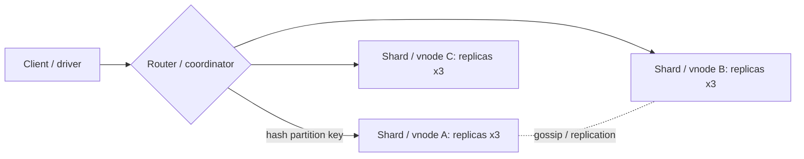

# NoSQL

> [!abstract] TL;DR
> "NoSQL" is an umbrella for non-relational databases that trade joins, rigid schemas and (often) strong consistency for **flexible data models, horizontal scale, or specialized access patterns**. The main families:
> - **Key-value**: [[Redis]], DynamoDB.
> - **Document**: MongoDB, Firestore.
> - **Wide-column**: Cassandra, ScyllaDB.
> - **Graph**: Neo4j.
> - **Time-series and search** (InfluxDB, Elasticsearch/OpenSearch).
>
> The rule: **model for your queries, not your entities**. In 2026, [[PostgreSQL]] with JSONB covers most "we need flexible documents" cases, so pick a NoSQL store when you need its specific scaling or access-pattern strengths.

## Introduction
- **Origin**: web-scale pressure in the late 2000s. Google Bigtable (2006) and Amazon Dynamo (2007) papers led to Cassandra, HBase, DynamoDB, Riak. MongoDB (2009) popularized document stores for developer velocity.
- **Problem**: single-node relational databases struggled with write scale, global distribution, and schema churn. Sharding MySQL by hand was painful.
- **Where it sits now**: alongside a relational system of record as caches ([[Redis]]), event/time-series stores, search indexes, mobile sync backends (Firestore), and planet-scale key-value workloads (DynamoDB). Relational databases absorbed many NoSQL features (JSON, horizontal scale via Citus/Vitess/distributed SQL), so the "SQL vs NoSQL" divide has blurred.

## Core Concepts

### Families
| Family | Data model | Query style | Examples | Sweet spot |
|---|---|---|---|---|
| **Key-value** | Opaque value per key | GET/PUT by key | [[Redis]], DynamoDB, etcd, Valkey | Sessions, caches, counters, config |
| **Document** | JSON/BSON documents, nested | Field queries, secondary indexes, aggregation pipelines | MongoDB, Firestore, Couchbase | Variable-shape entities, content, catalogs |
| **Wide-column** | Partition key → sorted rows of columns | By partition + clustering key | Cassandra, ScyllaDB, Bigtable, HBase | Massive write throughput, time-ordered data |
| **Graph** | Nodes + edges with properties | Traversals (Cypher, Gremlin) | Neo4j, Memgraph, Neptune | Relationships: fraud rings, recommendations |
| **Time-series** | Timestamped measurements | Range + downsampling | InfluxDB, TimescaleDB (Postgres), VictoriaMetrics | Metrics, IoT, monitoring |
| **Search** | Inverted index over documents | Full-text, aggregations | Elasticsearch, OpenSearch, Meilisearch, Typesense | Search, log analytics |
| **Vector** | Embeddings + metadata | ANN similarity | See [[Vector Databases]] | RAG, semantic search |

### CAP and PACELC
- **CAP**: during a network **P**artition, choose **C**onsistency (reject some requests) or **A**vailability (serve possibly stale data).
- **PACELC** adds: **E**lse, under normal operation, trade **L**atency vs **C**onsistency.
  - DynamoDB/Cassandra default to PA/EL (tunable).
  - MongoDB with majority writes/reads leans PC/EC.
  - Spanner-style distributed SQL is PC/EC with clock tricks.

### Consistency knobs
| System | Knob | Example |
|---|---|---|
| Cassandra | Per-query consistency level | `QUORUM` writes + `QUORUM` reads → read-your-writes when `R + W > RF` |
| MongoDB | `writeConcern` / `readConcern` / `readPreference` | `w: "majority"`, `readConcern: "majority"`, causal sessions |
| DynamoDB | `ConsistentRead`, transactions | Eventually consistent reads are half the cost |
| Firestore | Strong per document, transactions | Realtime listeners |

### Data modeling: query-first
```js
// MongoDB: embed what you read together, reference what grows unbounded
{
  _id: ObjectId("..."),
  tenantId: "t_42",
  number: "INV-2026-0012",
  customer: { id: "c_9", name: "Kedai Ali", phone: "+60..." },    // embedded snapshot (denormalized)
  lines: [ { sku: "A1", qty: 2, priceSen: 1500 } ],                // bounded array → embed
  totalSen: 3000,
  status: "paid",
  createdAt: ISODate("2026-10-10T03:00:00Z")
}
db.invoices.createIndex({ tenantId: 1, createdAt: -1 })             // ESR rule: Equality, Sort, Range
```
```sql
-- Cassandra: one table per query, partition key bounds the data per node
CREATE TABLE sensor_readings_by_device_day (
  device_id text, day date, ts timestamp, temp_c float,
  PRIMARY KEY ((device_id, day), ts)
) WITH CLUSTERING ORDER BY (ts DESC);
```
- DynamoDB **single-table design**: overloaded keys (`PK=TENANT#42`, `SK=ORDER#2026-10-10#123`) + GSIs serve all access patterns from one table.

## Architecture / How It Works

- **Partitioning**: consistent hashing (Cassandra, DynamoDB) or range/hashed shard keys (MongoDB). **The partition key decides scalability**: hot keys mean a hot node.
- **Replication**:
  - Leader-based: MongoDB replica sets elect one primary per shard, with an oplog.
  - Leaderless: Cassandra/Dynamo-style, quorum reads/writes, hinted handoff, read repair, anti-entropy (Merkle trees).
- **Storage engines**: LSM trees (Cassandra, ScyllaDB, RocksDB) are optimized for writes, with compaction costs. B-trees (MongoDB WiredTiger) are better for read-heavy mixed workloads.
- **Secondary indexes** are local per partition in most distributed stores, so global queries scatter-gather to every node. Design so hot queries hit one partition.
- **Transactions**: MongoDB has multi-document ACID (since 4.0, with performance cost). DynamoDB transactions are limited to 100 items. Cassandra has lightweight transactions (Paxos), with ACID transactions via Accord in development.

## Project Structure
N/A — a database category. A typical MongoDB dev setup and access-pattern doc:
```yaml
services:
  mongo:
    image: mongo:8.0
    command: ["--replSet", "rs0", "--bind_ip_all", "--networkMessageCompressors", "snappy,zstd"]   # replica set enables transactions/change streams; no zlib (MongoBleed)
    volumes: ["mongo-data:/data/db"]
    networks: [data]
```
```text
docs/data-model.md
  ## Access patterns
  | # | Query                         | Key / index                | Freq    |
  | 1 | Invoices by tenant, newest    | {tenantId:1, createdAt:-1} | 500/min |
  | 2 | Invoice by number             | {tenantId:1, number:1} uniq| 50/min  |
```

## Use Cases
| Use case | Pick | Why it fits |
|---|---|---|
| Cache, sessions, rate limiting, queues | [[Redis]] / Valkey | Sub-ms in-memory ops |
| Serverless app with predictable access patterns at any scale | DynamoDB | Pay-per-request, no ops, single-digit-ms |
| Mobile app with offline sync + realtime | Firestore | SDK-level offline cache and listeners |
| Catalog/CMS with highly variable attributes | MongoDB (or Postgres JSONB) | Flexible documents, rich queries |
| Write-heavy telemetry, IoT, messaging history | Cassandra / ScyllaDB | Linear write scaling, multi-DC |
| Fraud/relationship analysis | Neo4j | Multi-hop traversals in ms |
| Full-text and log search | OpenSearch / Elasticsearch / Meilisearch | Inverted indexes, relevance |
| Financial ledger, multi-entity invariants, reporting joins | **Poor fit**. Use [[PostgreSQL]] | Joins, constraints, ACID across entities |

## Pros & Cons
| Pros | Cons |
|---|---|
| Horizontal scale for writes and storage | Joins/ad-hoc queries are weak or absent. Analytics needs ETL |
| Flexible schemas speed early iteration | Schema-less turns into "schema in every client". Data quality drifts |
| Tunable consistency and multi-region replication | Eventual consistency bugs are subtle (stale reads, lost updates) |
| Purpose-built performance for specific patterns | Data modeling must be decided up front per query. Changing access patterns is expensive |
| Managed serverless options (DynamoDB, Firestore, Atlas) | Vendor lock-in (proprietary APIs), surprising costs at scale |
| Built-in sharding and replication | **Licensing churn**: SSPL/BSL/source-available relicensing |

## Alternatives & Peers
| Alternative | Strength vs NoSQL | Weakness vs NoSQL | Pick it when… |
|---|---|---|---|
| [[PostgreSQL]] + JSONB | One DB for relational + documents, GIN indexes, transactions, RLS | Single-primary write scaling | Most SaaS/SME apps (ZP's default) |
| [[MySQL]] (+ JSON, Vitess) | Familiar SQL, sharding precedent | Weaker JSON querying than Postgres | Existing MySQL estates |
| Distributed SQL (CockroachDB, YugabyteDB, TiDB, Spanner) | SQL + horizontal scale + strong consistency | Higher latency per write, cost, complexity | Global scale with relational semantics |
| Postgres extensions (TimescaleDB, Citus, pgvector, Apache AGE) | Specialized workloads without a new DB | Not as specialized as the dedicated engine | Avoiding operational sprawl |

## Tips & Reminders
> [!tip]
> - Write down access patterns before choosing a store. If you can't list them, you probably want relational.
> - Pick partition keys with high cardinality and even load (tenant + time bucket, not just `status` or `country`).
> - Use schema validation even in "schemaless" stores: MongoDB `$jsonSchema` validators, Zod at the app boundary.
> - Back up and test restores: `mongodump`/Atlas snapshots, Cassandra `nodetool snapshot`, DynamoDB PITR.
> - Polyglot persistence costs ops time. Each extra database is another backup, upgrade and security surface for a solo founder.
> - **In ZP's stack**: [[PostgreSQL]]/[[Supabase]] (JSONB for flexible fields) + [[Redis]] (cache/queues) covers nearly every client project. Consider MongoDB only for client systems already on it, Firestore for Firebase-based mobile apps, and a search engine (Meilisearch/OpenSearch) only when Postgres full-text search stops being enough.

## Versions & Breaking Changes
| Product / event | Released | Key changes | Breaking / migration notes |
|---|---|---|---|
| MongoDB → **SSPL** | 2018-10 | License change from AGPL | Cloud providers can't offer it as a service. Not OSI open source |
| Elasticsearch → SSPL/Elastic License | 2021-01 | Relicensing → AWS forks **OpenSearch** | Later re-added **AGPL** option (2024-08) |
| Redis → RSAL/SSPL | 2024-03 | Source-available | **Valkey** fork (Linux Foundation). Redis 8 (2025-05) adds AGPLv3 option |
| ScyllaDB source-available | 2024-12 | Open-source edition discontinued | Community users move to source-available license or Cassandra |
| Cassandra 5.0 | 2024-09 | Storage-attached indexes (SAI), vector search, trie memtables, JDK 17 | Upgrade from 4.x. Accord transactions still pending |
| MongoDB 8.0 / 8.2 | 2024-10 / 2025 | Major performance gains, queryable encryption range queries, 8.2 minor features | Check driver compatibility. Rapid releases on Atlas only |

> [!warning] Unverified — check before relying on this
> Current MongoDB and Cassandra release lines weren't confirmed this run. Check MongoDB's release notes and https://cassandra.apache.org/_/download.html.

## Critical Issues & Gotchas
> [!danger] MongoBleed (CVE-2025-14847): pre-auth memory leak, exploited in the wild
> Disclosed 2025-12-19: a flaw in MongoDB's **zlib network compression** leaked server memory (credentials, data) to **unauthenticated** attackers. CVSS 8.7, added to CISA KEV, and present in code for ~8 years. Atlas was patched. Self-hosted instances must upgrade, or disable zlib compression (use zstd/snappy). Also never expose 27017 publicly.

> [!danger] Exposed NoSQL databases get wiped
> Since 2017, automated campaigns have scanned for open MongoDB, Elasticsearch, Redis and CouchDB instances (no auth by default in old versions), deleted the data and left ransom notes, affecting tens of thousands of instances. Enable auth, bind to private networks, and remember [[Docker]] port publishing bypasses UFW.

> [!danger] Licensing and vendor risk
> MongoDB (SSPL), Elasticsearch, Redis and ScyllaDB have all relicensed, which forces forks (OpenSearch, Valkey) and legal reviews for SaaS offerings. Managed-only features (DynamoDB, Firestore, Atlas Search) create lock-in. For client projects, document the license and exit path.

> [!warning] Gotchas
> - MongoDB unbounded arrays (e.g. comments embedded in a post) hit the 16 MB document limit and slow updates. Reference instead.
> - Cassandra tombstones from deletes/TTLs cause slow reads and `TombstoneOverwhelmingException`. Model deletes deliberately.
> - DynamoDB hot partitions throttle even with spare table capacity. Scans are expensive. GSIs are eventually consistent.
> - Firestore cost scales with document reads. A naive realtime listener on a big collection can create surprise bills.
> - "Eventual" can mean seconds under load: read-your-writes isn't guaranteed unless configured.

## Deep Dives
N/A — no deep dives planned yet. Candidates: MongoDB data modeling, DynamoDB single-table design.

## Related
- [[PostgreSQL]] — relational default, JSONB as a document store
- [[Redis]] — key-value/in-memory NoSQL in ZP's stack
- [[MySQL]] — relational peer
- [[Vector Databases]] — specialized NoSQL for embeddings
- [[System Design]] — partitioning, replication, CAP trade-offs
- [[Kafka]] — event streams feeding NoSQL stores

## References
- Designing Data-Intensive Applications (Kleppmann), chapters 2, 5–9
- MongoDB data modeling: https://www.mongodb.com/docs/manual/data-modeling/
- Cassandra docs: https://cassandra.apache.org/doc/latest/
- DynamoDB best practices: https://docs.aws.amazon.com/amazondynamodb/latest/developerguide/best-practices.html
- MongoBleed analysis: https://unit42.paloaltonetworks.com/mongobleed-cve-2025-14847/
- InfoQ on MongoBleed: https://www.infoq.com/news/2026/01/mongodb-mongobleed-vulnerability
