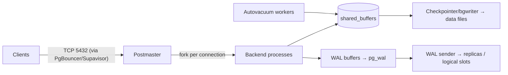

# PostgreSQL

> [!abstract] TL;DR
> PostgreSQL is the default open-source relational database: ACID, MVCC, a rich type system (JSONB, arrays, ranges, enums), extensibility (pgvector, PostGIS, TimescaleDB), and a strict standards-first culture. It backs [[Supabase]] and most modern SaaS. Reach for it first. Learn **indexing, MVCC/VACUUM, connection pooling and backups**, because those four cause almost every production Postgres incident.

## Introduction
- Descends from POSTGRES (UC Berkeley, Michael Stonebraker, 1986). It has been PostgreSQL since 1996. It's run by the PostgreSQL Global Development Group under the permissive **PostgreSQL License**, with no single-vendor control and no relicensing risk.
- **Cadence**: one major release per year (Sep/Oct) and quarterly minor (security/bugfix) releases. Each major is supported for **5 years**.
- It solves general-purpose transactional storage with strong correctness, plus "Postgres for everything" via extensions: queues (`pgmq`), search (FTS, `pg_trgm`), vectors (`pgvector`), time series, geo.
- Where it sits: the system of record under app backends ([[Supabase]], Prisma/Drizzle apps), [[n8n]]'s own DB, LangGraph checkpointers, analytics (via replicas/CDC).

## Core Concepts

### Data model & types
- Tables, schemas (namespaces), roles. Rich types: `jsonb`, `uuid` (`uuidv7()` in 18), `timestamptz` (always use it over `timestamp`), `numeric`, arrays, ranges (`tstzrange`), `enum`, `citext` (ext), `vector` (pgvector).
- Constraints are the cheapest data-quality tool: `NOT NULL`, `CHECK`, `UNIQUE`, `FOREIGN KEY`, `EXCLUDE` (no overlapping bookings), and temporal `WITHOUT OVERLAPS` (18).

### Indexes
| Type | Good for |
|---|---|
| B-tree (default) | Equality/range, `ORDER BY`, uniqueness. Multicolumn: leftmost prefix (18 adds **skip scan**) |
| GIN | `jsonb` containment (`@>`), arrays, full-text, `pg_trgm` `ILIKE '%x%'` |
| GiST / SP-GiST | Ranges, geo (PostGIS), exclusion constraints, nearest-neighbour |
| BRIN | Huge append-only tables ordered by time (tiny index) |
| HNSW / IVFFlat (pgvector) | Approximate vector similarity search |

```sql
CREATE INDEX CONCURRENTLY idx_orders_tenant_created ON orders (tenant_id, created_at DESC) WHERE status <> 'void';  -- partial
CREATE INDEX idx_events_payload ON events USING gin (payload jsonb_path_ops);
CREATE INDEX idx_docs_embedding ON docs USING hnsw (embedding vector_cosine_ops);
```

### Transactions & isolation
- Default isolation is **READ COMMITTED**. `REPEATABLE READ` = snapshot isolation. `SERIALIZABLE` = SSI, so be ready to retry on `40001`.
- Row locks: `SELECT … FOR UPDATE [SKIP LOCKED | NOWAIT]`. `SKIP LOCKED` is the basis of DB-backed job queues.
- Advisory locks (`pg_advisory_xact_lock(key)`) give cross-process mutexes without a table.

### Querying power features
```sql
-- Upsert
INSERT INTO contacts (tenant_id, wa_id, name) VALUES ($1, $2, $3)
ON CONFLICT (tenant_id, wa_id) DO UPDATE SET name = EXCLUDED.name, updated_at = now()
RETURNING id, (xmax = 0) AS inserted;

-- Window + CTE
WITH ranked AS (
  SELECT o.*, row_number() OVER (PARTITION BY customer_id ORDER BY created_at DESC) AS rn FROM orders o
) SELECT * FROM ranked WHERE rn = 1;

-- MERGE (15+, RETURNING in 17), JSON_TABLE (17), OLD/NEW in RETURNING (18)
```

### Security model
- Roles with `LOGIN`, `GRANT`/`REVOKE` on schema/table/column, **Row Level Security** (`ALTER TABLE … ENABLE ROW LEVEL SECURITY` + `CREATE POLICY`). This is the foundation of Supabase's auth model.
- `pg_hba.conf` controls who may connect from where with which auth method. `scram-sha-256` is the default. MD5 passwords are deprecated in 18. OAuth/OIDC authentication arrived in 18.

## Architecture / How It Works



- **Process-per-connection**: each connection is an OS process (~5–10 MB+). Thousands of direct connections exhaust RAM, so put a **pooler** in front (PgBouncer, Supavisor, pgcat).
- **MVCC**: `UPDATE` = new row version + old version marked dead (`xmax`). Readers never block writers. Dead tuples are reclaimed by **VACUUM**. Long-running transactions and abandoned replication slots stop cleanup → **bloat**.
- **Transaction ID wraparound**: 32-bit XIDs. Autovacuum must **freeze** old rows before ~2 billion transactions, or Postgres forces read-only "emergency" mode.
- **WAL** (write-ahead log): durability + crash recovery + replication. Physical streaming replication (byte-identical standbys) vs **logical replication** (per-table change streams, CDC, cross-version upgrades).
- **Planner**: cost-based, driven by `ANALYZE` statistics. `EXPLAIN (ANALYZE, BUFFERS)` is the tool. Since 18, `pg_upgrade` keeps statistics.
- **Async I/O (18)**: `io_method = worker | io_uring` speeds sequential scans, bitmap heap scans and vacuum. 19 auto-scales I/O workers.

## Project Structure
```text
db/
├── migrations/                 # ordered, forward-only SQL (supabase/migrations, drizzle, sqitch, dbmate)
│   ├── 20261003101500_create_orders.sql
│   └── 20261003103000_orders_rls.sql
├── seed.sql
└── tests/                      # pgTAP or app-level integration tests
```
```ini
# postgresql.conf — starting points for a 4 vCPU / 16 GB KVM (tune with measurements)
shared_buffers = 4GB                 # ~25% RAM
effective_cache_size = 12GB          # ~75% RAM (planner hint)
work_mem = 32MB                      # per sort/hash node per query — multiply by concurrency!
maintenance_work_mem = 1GB
max_connections = 200                # keep low; pool in front
wal_compression = zstd
random_page_cost = 1.1               # SSD/NVMe
log_min_duration_statement = 500ms
shared_preload_libraries = 'pg_stat_statements'
```

## Use Cases
| Use case | Why it fits |
|---|---|
| SaaS system of record (multi-tenant) | ACID, FKs, RLS per tenant, mature tooling |
| Backend for [[Supabase]] apps | Auth, REST (PostgREST), realtime and storage all built on Postgres |
| JSON document storage | `jsonb` + GIN indexes cover most "we need Mongo" cases |
| RAG / semantic search | `pgvector` HNSW next to relational filters ([[Vector Databases]]) |
| Job queues & outbox | `FOR UPDATE SKIP LOCKED`, `LISTEN/NOTIFY`, `pgmq` |
| Analytics on moderate data | Window functions, materialized views, BRIN. Beyond that, CDC → ClickHouse/DuckDB |
| Workflow engines | [[n8n]], Temporal, LangGraph checkpointers persist here |

## Pros & Cons
| Pros | Cons |
|---|---|
| Correctness and standards compliance, transactional DDL | Process-per-connection: a pooler is mandatory at scale |
| Extensions: vectors, geo, time series, queues | VACUUM/bloat/wraparound need monitoring |
| Permissive license, multi-vendor ecosystem, no lock-in | Write scaling is vertical. Sharding needs Citus or app logic |
| Huge managed options (Supabase, Neon, RDS, Cloud SQL) | Major upgrades need `pg_upgrade` or logical replication (planned downtime) |
| RLS enables secure direct-from-client access | Planner surprises on skewed data. No built-in query hints (19's `pg_plan_advice` helps) |

## Alternatives & Peers
| Alternative | Strength vs PostgreSQL | Weakness vs PostgreSQL | Pick it when… |
|---|---|---|---|
| [[MySQL]] / MariaDB | Simpler replication story, huge legacy hosting base | Weaker types, CTE/JSON/extensions lag, Oracle stewardship | Existing PHP/WordPress/Laravel stacks |
| SQLite / libSQL (Turso) | Zero-ops, embedded, edge replicas | Single writer | Mobile/edge apps, small tools |
| MongoDB | Flexible documents, built-in sharding | Weaker relational integrity, SSPL license | Truly schemaless high-write documents |
| CockroachDB / YugabyteDB | Distributed SQL, multi-region writes | Latency, cost, license changes (Cockroach went proprietary in 2024) | Global multi-region active-active |
| [[Redis]] | Sub-ms in-memory ops | Not a system of record | Cache, rate limits, queues next to PG |
| ClickHouse / DuckDB | Columnar analytics, 10–100× faster aggregates | Not OLTP | Event analytics, reporting |

## Tips & Reminders
> [!tip] Daily-driver habits
> - `timestamptz` + UTC everywhere. Render in `Asia/Kuching` at the edge.
> - Always `CREATE INDEX CONCURRENTLY` on live tables. Index every FK used in joins or deletes.
> - Enable `pg_stat_statements`. Review the top queries by `total_exec_time` weekly.
> - Set `statement_timeout` and `idle_in_transaction_session_timeout` per role (e.g. 30 s / 60 s for app roles).
> - Migrations: expand → migrate → contract. Avoid long `ACCESS EXCLUSIVE` locks (`ALTER TABLE … ADD COLUMN … DEFAULT` is fast since 11, but adding `NOT NULL` validation scans the table).

> [!tip] In ZP's stack
> - **[[Supabase]]**: use the **transaction pooler (6543)** for serverless/Next.js and the **session pooler or direct connection (5432)** for migrations, `LISTEN/NOTIFY`, prepared statements and LangGraph checkpointers.
> - **Self-hosted on [[Coolify]]/Hostinger KVM**: don't expose 5432 publicly. Use the Docker network or a Cloudflare Tunnel. Schedule `pg_dump`/WAL-G backups to Cloudflare R2 and **test restores**.
> - **[[n8n]]** on Postgres: set `EXECUTIONS_DATA_PRUNE=true` + `EXECUTIONS_DATA_MAX_AGE`, or `execution_entity`/`execution_data` will bloat into tens of GB.

## Versions & Breaking Changes
| Version | Released | Key changes | Breaking / migration notes |
|---|---|---|---|
| 14 | 2021-09 | Pipeline mode, multirange types | EOL 2026-11 |
| 15 | 2022-10 | `MERGE`, zstd/lz4 WAL compression, logical replication filters | `public` schema no longer world-writable `CREATE` |
| 16 | 2023-09 | Logical replication from standbys, `pg_stat_io`, SQL/JSON constructors | — |
| 17 | 2024-09 | Incremental backup, `JSON_TABLE`, `MERGE … RETURNING`, faster vacuum memory | — |
| **18** | 2025-09-25 | Async I/O, `uuidv7()`, virtual generated columns, B-tree skip scan, OAuth auth, stats kept on `pg_upgrade`, `OLD/NEW` in `RETURNING`, temporal `WITHOUT OVERLAPS` | Data checksums on by default in `initdb`. MD5 auth deprecated. Generated columns default to virtual |
| 19 | Beta (2026-06+) | `REPACK [CONCURRENTLY]` (replaces `VACUUM FULL`/`CLUSTER`), `pg_plan_advice`, parallel index autovacuum + priority scoring, `WAIT` for read-your-writes on standbys | Six features (incl. SQL/PGQ graph queries) pulled in beta 4 (2026-09-24). Not GA yet |

> [!warning] Unverified — check before relying on this
> The current 18.x minor and the 19 GA date weren't confirmed this run. Check https://www.postgresql.org/support/versioning/.

## Critical Issues & Gotchas
> [!danger] CVE-2025-1094 — psql quoting SQL injection (Feb 2025)
> Invalid UTF-8 handling in libpq escaping functions enabled SQL injection → `psql` meta-command execution. It was chained with a BeyondTrust zero-day in the US Treasury breach. Fixed in 17.3/16.7/15.11/14.16/13.19. Also: **CVE-2025-8714/8715** (Aug 2025), where a malicious superuser could inject code into `pg_dump` output that runs on restore. Restore only dumps from trusted sources.

> [!danger] Transaction ID wraparound
> Real outages: Sentry (2015), Mailchimp/Mandrill (2019). Blocked autovacuum (long transactions, stale replication slots, `idle in transaction`) leads to forced shutdown and hours of single-user VACUUM. Monitor `age(datfrozenxid)` and alert at ~1 B.

> [!danger] Backups you never restored
> GitLab (Jan 2017) deleted the primary's data dir, and 5 backup methods turned out to be broken. ~6 h of data was lost. Automate restore tests and keep PITR (WAL archiving), not just nightly dumps.

> [!warning] Footguns
> - Abandoned **logical replication slots** retain WAL until the disk fills (check `pg_replication_slots`). Set `max_slot_wal_keep_size`.
> - `work_mem` is per node per query. 200 connections × several sorts × 64 MB → OOM-killer on a small VPS.
> - `NOT IN (subquery)` with a `NULL` returns no rows. Use `NOT EXISTS`.
> - Offset pagination on big tables gets slow. Use keyset pagination (`WHERE (created_at, id) < ($1, $2)`).
> - Supabase RLS: a table without RLS enabled is **world-readable via the anon key**. The Supabase linter flags this. Enable RLS on every exposed table.
> - Docker volume + `docker compose down -v` = database deleted.

## Deep Dives
- [[PostgreSQL - Indexing]]
- [[PostgreSQL - Transactions & MVCC]]
- (planned) [[PostgreSQL - Query Planning & EXPLAIN]]

## Related
- [[Supabase]] — managed Postgres + Auth + RLS-first APIs
- [[Redis]] — cache/queue companion
- [[MySQL]] · [[Vector Databases]]
- [[n8n]] — Postgres as workflow DB
- [[LangChain & LangGraph - Persistence, Memory & Human-in-the-Loop]] — Postgres checkpointer

## References
- Docs: https://www.postgresql.org/docs/current/
- Versioning policy: https://www.postgresql.org/support/versioning/
- PostgreSQL 19 Beta 1: https://www.postgresql.org/about/news/postgresql-19-beta-1-released-3313/
- PG 19 features overview: https://neon.com/postgresql/postgresql-19-new-features
- Security advisories: https://www.postgresql.org/support/security/
