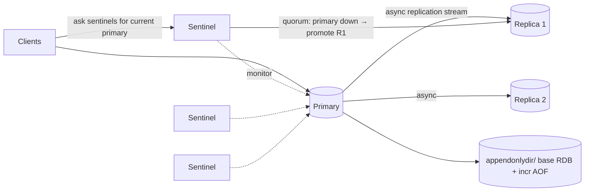

# Redis - Persistence & High Availability

> [!info] Deep dive of [[Redis]]

> [!abstract] TL;DR
> Redis keeps data in RAM and persists optionally via **RDB snapshots** (compact point-in-time files) and/or the **AOF** (append-only log of writes, fsync'd per `appendfsync`). Availability comes from **asynchronous replication** + **Sentinel** (automatic failover for one primary) or **Redis Cluster** (sharding + failover across 16,384 slots). Remember: **replication is async, so failover can lose acknowledged writes.** Size the persistence mode to the data's role: a pure cache needs none, a job queue needs AOF `everysec` (or stronger) + backups.

## Concept
| Mechanism | What | Data loss window | Cost |
|---|---|---|---|
| **None** | Pure in-memory | Everything on restart | Fastest |
| **RDB** | Fork + write snapshot (`save 3600 1 300 100 60 10000`, `BGSAVE`) | Since last snapshot (minutes) | Fork copy-on-write memory spike. Compact, fast restarts |
| **AOF `everysec`** (recommended) | Log every write, fsync each second | ~1 s | More disk I/O. Rewrite (`BGREWRITEAOF`) compacts |
| **AOF `always`** | fsync per write | ~0 (single node) | Much lower throughput |
| **RDB + AOF** (hybrid) | AOF rewrite starts with an RDB preamble | ~1 s, fast restart | Best general default for state |
| **Replication** | Primary → replicas stream | Async: writes not yet replicated | Extra nodes. `WAIT`/`WAITAOF` for stronger guarantees |
| **Sentinel** | Monitors, elects, reconfigures | Same as replication | 3+ sentinels for quorum |
| **Cluster** | Sharding + per-shard replicas + failover | Same as replication | Multi-key limits (hash tags), client support needed |

## How It Works



- **AOF (7.0+ multi-part)**: an `appendonlydir/` containing a base file (RDB or AOF) + incremental AOF files + a manifest. Rewrite happens in the background without blocking.
- **RDB fork**: `fork()` uses copy-on-write. Under heavy writes, memory can approach 2× the dataset. Linux needs `vm.overcommit_memory = 1`, or `BGSAVE` fails with "Can't save in background".
- **Replication**: the replica does a full sync (RDB transfer) first, then a continuous stream. Partial resync uses the replication backlog (`repl-backlog-size`) after short disconnects.
- **Failover (Sentinel)**: sentinels agree (quorum) that the primary is down → elect a leader sentinel → promote the best replica → reconfigure others → clients discover the new primary via sentinel.
- **Split brain**: an isolated old primary may keep accepting writes, which are lost when it rejoins as a replica. Limit it with `min-replicas-to-write 1` + `min-replicas-max-lag 10`.
- **Cluster**: each shard is primary + replicas. Nodes gossip and fail over per shard. Clients follow `MOVED/ASK` redirects.

## Practical Usage

### Config for a queue/state Redis (n8n / BullMQ)
```conf
# redis.conf
appendonly yes
appendfsync everysec
aof-use-rdb-preamble yes
save 900 1 300 100            # keep RDB too for backups
maxmemory 2gb
maxmemory-policy noeviction   # never evict jobs; fail writes instead
requirepass ${REDIS_PASSWORD} # or ACL users
protected-mode yes
```

### Docker Compose (single node, persistent)
```yaml
services:
  redis:
    image: redis:8.10
    command: ["redis-server", "/usr/local/etc/redis/redis.conf"]
    volumes:
      - redis-data:/data
      - ./redis.conf:/usr/local/etc/redis/redis.conf:ro
    sysctls: { net.core.somaxconn: 1024 }
    healthcheck: { test: ["CMD", "redis-cli", "-a", "$$REDIS_PASSWORD", "ping"], interval: 10s }
    networks: [internal]              # no published port
volumes: { redis-data: {} }
```

### Backups
```bash
redis-cli -a "$REDIS_PASSWORD" BGSAVE
# wait until LASTSAVE changes, then copy /data/dump.rdb (and appendonlydir/) off-host, e.g. to Cloudflare R2
rclone copy /var/lib/docker/volumes/redis-data/_data/dump.rdb r2:backups/redis/$(date +%F)/
```
- Test restores: start a throwaway container with the RDB file in `/data` and check `DBSIZE` and key samples.

### Stronger write guarantees for critical ops
```bash
SET order:9812:status paid
WAIT 1 1000          # block until ≥1 replica acknowledged (or 1000 ms timeout)
WAITAOF 1 0 1000     # 7.2+: until local AOF fsync'd (and optionally replicas)
```

## Patterns & Anti-patterns
| Pattern | When | Anti-pattern to avoid |
|---|---|---|
| Separate instances per role (cache vs queue) | Mixed workloads | One Redis with `allkeys-lru` holding both cache and BullMQ jobs |
| AOF everysec + RDB backups off-host | Queues, sessions, rate-limit state | "Redis is a cache" assumption for data you can't regenerate |
| Sentinel with 3 sentinels on separate hosts | Need automatic failover, single shard | 2 sentinels (no quorum) or all on one VM |
| Managed Redis/Valkey for HA | No ops capacity | Hand-rolled cluster on one KVM (no real HA anyway) |
| `vm.overcommit_memory=1`, disable THP | Self-hosted Linux | Default kernel settings → fork failures, latency spikes |

## Performance & Trade-offs
- AOF `everysec` costs ~5–15% throughput vs no persistence. `always` can cost 10× or more on slow disks.
- RDB fork time grows with dataset size (~10–20 ms per GB on typical VMs), and the fork briefly blocks the main thread. Large instances see periodic latency spikes.
- Restart time: RDB loads fast. Pure AOF replay is slow for big logs (the hybrid preamble fixes most of this).
- Cluster adds client complexity and restricts multi-key ops. Use it only when one node's memory or CPU isn't enough.

## Tips & Reminders
> [!tip]
> - Check persistence health: `INFO persistence` (`rdb_last_bgsave_status`, `aof_last_write_status`, `aof_rewrite_in_progress`).
> - Put Redis data on SSD/NVMe. Network volumes with high fsync latency hurt AOF.
> - Plan memory: dataset + fork CoW headroom (up to 2×) + buffers. Set `maxmemory` ~60–70% of RAM on dedicated nodes.
> - **In ZP's stack**: a single Hostinger KVM can't give real HA. Make Redis **durable** (AOF + off-host backups) and recoverable fast rather than "highly available". For client SLAs needing HA, use a managed Redis/Valkey or a 3-node setup across hosts. [[Coolify]]'s Redis resource supports scheduled backups to S3/R2. Turn them on.

## Version Notes
| Version | Change |
|---|---|
| 4.0 | Hybrid RDB-preamble AOF, `UNLINK` |
| 5.0 | Replica naming, Streams persisted |
| 7.0 | Multi-part AOF (`appendonlydir/`), lower rewrite overhead |
| 7.2 | `WAITAOF` |
| 8.x | Performance improvements. Persistence semantics unchanged. New data types (JSON, vector sets) persisted in RDB, **not readable by 7.x** (no downgrade path) |

## Critical Issues & Gotchas
> [!danger] Exposed, unauthenticated Redis = compromise
> Internet-exposed Redis without a password gets hit by automated attacks within minutes: `CONFIG SET dir` + `SAVE` to write SSH keys or cron jobs, crypto-miners (e.g. the "P2PInfect" and "Migo" campaigns), plus the 2025 Lua RCE (CVE-2025-49844). Bind to private networks, require auth/ACLs, disable `CONFIG`/`MODULE` for app users, and patch.

> [!danger] Silent data loss on failover or eviction
> Async replication loses the last writes on failover. `allkeys-*` eviction silently drops queue or session keys under memory pressure. Use `noeviction` for state, and design consumers to be idempotent and recover (Streams + `XAUTOCLAIM`, BullMQ stalled job checks).

> [!warning] Gotchas
> - The Docker `redis` image without `appendonly yes` and a volume loses everything on container recreate.
> - Disk full → AOF write errors → Redis refuses writes (`MISCONF`). Monitor disk.
> - `FLUSHALL` replicates and is persisted. Backups are the only undo.
> - THP (Transparent Huge Pages) enabled → latency and memory spikes during fork. Set `echo never > /sys/kernel/mm/transparent_hugepage/enabled`.

## Related
- [[Redis]]
- [[Redis - Data Structures & Patterns]] — what you're persisting
- [[n8n]] — queue mode dependency
- [[Docker]] · [[Coolify]] — deployment and backups
- [[PostgreSQL - Transactions & MVCC]] — when durability must be transactional

## References
- Persistence: https://redis.io/docs/latest/operate/oss_and_stack/management/persistence/
- Replication: https://redis.io/docs/latest/operate/oss_and_stack/management/replication/
- Sentinel: https://redis.io/docs/latest/operate/oss_and_stack/management/sentinel/
- Cluster spec: https://redis.io/docs/latest/operate/oss_and_stack/reference/cluster-spec/
- Admin/latency checklist: https://redis.io/docs/latest/operate/oss_and_stack/management/admin/
