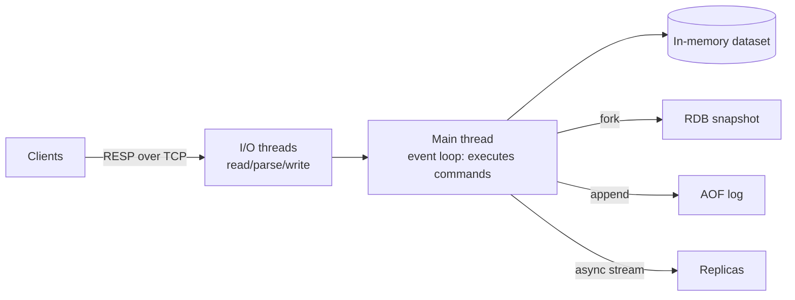

# Redis

> [!abstract] TL;DR
> In-memory data structure server with sub-millisecond latency. It's the default choice for cache, sessions, rate limiting, job queues (BullMQ / n8n queue mode), pub/sub, leaderboards and, since 8.0, JSON, search and vector sets.
> Command execution is single-threaded, so one slow command blocks everyone. The license changed twice in 2024–2025; [[Valkey]] is the BSD fork.

## Introduction
- **What**: a key → data-structure store held in RAM, with optional disk persistence. Created by Salvatore Sanfilippo ("antirez") in 2009; now maintained by Redis Ltd.
- **Problem solved**: sub-ms reads and writes for hot data that would otherwise hammer a primary DB like [[PostgreSQL]]. It also provides atomic primitives (INCR, SETNX, Lua) that are hard to get right in a relational DB under concurrency.
- **Positioning**: a secondary store. Treat it as a cache, a coordinator or an ephemeral queue, not as the system of record unless you've deliberately configured AOF persistence plus replication.
- **Where it sits**: between the app and the DB (cache-aside), behind workers (queues), and next to WebSocket servers (pub/sub fan-out; see [[WebSocket - Scaling & Reliability]]).

## Core Concepts

### Data types
| Type | Typical commands | Use for |
|---|---|---|
| String | `GET/SET/INCR/SETEX` | Cache blobs, counters, locks |
| Hash | `HSET/HGETALL/HINCRBY/HEXPIRE` | Objects, sessions, per-field TTL (7.4+) |
| List | `LPUSH/RPOP/BLMOVE` | Simple queues, recent-items |
| Set | `SADD/SISMEMBER/SINTER` | Tags, uniqueness, membership |
| Sorted Set | `ZADD/ZRANGE/ZINCRBY` | Leaderboards, sliding-window rate limits, delayed jobs |
| Stream | `XADD/XREADGROUP/XACK` | Durable-ish event log with consumer groups |
| Bitmap / HyperLogLog | `SETBIT/PFADD/PFCOUNT` | Feature flags, unique-visitor estimates (0.81% error, 12 KB) |
| Geo | `GEOADD/GEOSEARCH` | Nearby search |
| JSON, Query Engine, TimeSeries, Probabilistic | `JSON.SET`, `FT.SEARCH` | Built in since 8.0 (formerly Redis Stack modules) |
| Vector Set | `VADD/VSIM` | Vector similarity (8.0+); see [[Vector Databases]] |

### Keys & expiry
- Namespaced keys by convention: `app:user:42:session`. Keep them short, since millions of keys add up.
- TTL: `EXPIRE key 60`, `SET key v EX 60 NX`. Expiry is lazy (on access) plus active sampling, so expired keys can linger briefly in memory.
- `SCAN` over `KEYS`. `KEYS *` is O(N) and blocks the server.

### Atomicity
- Every single command is atomic.
- `MULTI/EXEC` queues commands and runs them atomically, with **no rollback**. Pair with `WATCH` for optimistic locking (CAS).
- Lua (`EVAL`) or Functions (`FUNCTION LOAD`, 7.0+) run server-side atomically, which is the go-to for rate limiters and lock release.

```lua
-- Safe lock release: delete only if we still own it
if redis.call("GET", KEYS[1]) == ARGV[1] then
  return redis.call("DEL", KEYS[1])
end
return 0
```

### Pub/Sub vs Streams
- **Pub/Sub**: fire-and-forget; if a subscriber is offline, the message is lost. Sharded pub/sub (`SPUBLISH`, 7.0+) scales in Cluster.
- **Streams**: persisted, replayable, with consumer groups and a pending entries list (PEL). Use them when you need at-least-once delivery without running [[Kafka]].

## Architecture / How It Works



- **Execution model**: one main thread runs every command sequentially, which is why commands are atomic without locks. I/O threads (`io-threads`) parallelise socket read/write and parsing only.
- **Protocol**: RESP2/RESP3 over TCP (default port `6379`). RESP3 adds typed replies and client-side caching push messages.
- **Memory**: `maxmemory` plus `maxmemory-policy` decide what happens when RAM is full: `noeviction`, `allkeys-lru`, `allkeys-lfu`, `volatile-lru`, `volatile-ttl`, `allkeys-random`, and so on.
- **Persistence** (details: [[Redis - Persistence & High Availability]]):
  - **RDB**: point-in-time snapshots from a `fork()`ed child (copy-on-write). Compact and fast to restore, but you lose writes since the last snapshot.
  - **AOF**: logs every write. `appendfsync everysec` (the default) loses at most about 1 s. Since 7.0 it's a multi-part AOF with rewrite in the background.
  - **Hybrid** (`aof-use-rdb-preamble yes`): an RDB base plus an AOF tail. This is the recommended setup when you need durability.
- **Replication**: asynchronous primary → replica. A replica can serve stale reads. `WAIT n ms` gives *best-effort* sync acknowledgement, not strong consistency.
- **High availability**:
  - **Sentinel**: monitors the primary, runs automatic failover and gives clients service discovery. Use it for a single-shard HA setup.
  - **Cluster**: 16,384 hash slots sharded across primaries. Multi-key operations only work when all keys share a slot; force that with hash tags such as `{user:42}:cart` and `{user:42}:profile`.

## Project Structure
Typical self-hosted setup (Docker / [[Coolify]]):

```yaml
# docker-compose.yml
services:
  redis:
    image: redis:8-alpine
    command: ["redis-server", "/usr/local/etc/redis/redis.conf"]
    volumes:
      - ./redis.conf:/usr/local/etc/redis/redis.conf:ro
      - redis-data:/data
    sysctls:
      net.core.somaxconn: 1024
    # no "ports:" → reachable only on the internal Docker network
volumes:
  redis-data:
```

```conf
# redis.conf essentials
bind 0.0.0.0              # inside a private network only
protected-mode yes
requirepass ${REDIS_PASSWORD}   # or ACL users (preferred)
maxmemory 512mb
maxmemory-policy noeviction     # REQUIRED for BullMQ / queues; use allkeys-lfu for pure cache
appendonly yes
appendfsync everysec
save 3600 1 300 100 60 10000
rename-command FLUSHALL ""      # optional hardening
```

- Host: `vm.overcommit_memory = 1` and disable Transparent Huge Pages; otherwise BGSAVE forks can fail or cause latency spikes.
- ACLs (6.0+): a least-privilege user per app, e.g. `ACL SETUSER worker on >pwd ~bull:* +@all -@dangerous`.

## Use Cases
| Use case | Why it fits |
|---|---|
| Cache-aside for DB queries / API responses | Sub-ms reads, TTL, eviction policies |
| Session store | Hash with TTL; shared across stateless app instances |
| Rate limiting | Atomic `INCR` + `EXPIRE` (fixed window) or ZSET / Lua (sliding window) |
| Job queues | BullMQ, Sidekiq, Celery, and [[n8n]] queue mode (Bull) |
| Distributed locks | `SET key token NX PX 30000` plus the Lua release above (single instance) |
| Real-time fan-out | Pub/sub between [[WebSocket]] nodes |
| Leaderboards / feeds | Sorted sets with O(log N) inserts |
| Idempotency keys | `SET NX EX` on the request ID |
| Semantic cache for LLM calls | Vector sets / Query Engine; see [[RAG]] |

## Pros & Cons
| Pros | Cons |
|---|---|
| Sub-ms latency, ~100k+ ops/s per core | Dataset bound by RAM (cost), and RAM plus fork headroom for persistence |
| Rich data structures remove app-side logic | Single-threaded execution: one slow command (`KEYS`, big `HGETALL`, heavy Lua) stalls all clients |
| Atomic primitives, Lua / Functions | `MULTI` has no rollback; replication is async, so failover can lose acknowledged writes |
| Huge ecosystem: every language, queue libraries | License churn (2024: RSAL/SSPL; 2025: AGPLv3 added) complicates redistribution |
| Simple ops for single node + replica | Cluster adds client complexity and cross-slot limits |
| JSON, search, vectors built in since 8.0 | Not a system of record; durability is weaker than an RDBMS |

## Alternatives & Peers
| Alternative | Strength vs Redis | Weakness vs Redis | Pick it when… |
|---|---|---|---|
| [[Valkey]] | BSD-3 license, Linux Foundation governance, drop-in for 7.2 API, strong multithreaded I/O, AWS/Google managed | Diverging from Redis 8 features (no built-in JSON/Query Engine, different vector story) | You want a truly open-source license or run on ElastiCache/Memorystore |
| Dragonfly | Multi-threaded shared-nothing design, high throughput per node, Redis/Memcached API | BSL license, smaller ecosystem, some command gaps | One huge node beats clustering for you |
| KeyDB | Multithreaded Redis fork | Development largely stalled | Legacy only; avoid for new projects |
| Memcached | Simple, multithreaded, very predictable cache | Strings only, no persistence or replication | Pure volatile cache at massive scale |
| Microsoft Garnet | MIT license, RESP-compatible, fast | Young, partial command coverage | You're on .NET or Azure and willing to experiment |
| [[PostgreSQL]] (UNLOGGED tables, `LISTEN/NOTIFY`, `SKIP LOCKED` queues) | One less service to run | Much higher latency, no TTL eviction | Low traffic, and you want to minimise infra |
| Upstash / managed Redis | Serverless, pay-per-request, HTTP API | Per-request cost at volume, vendor lock-in | Edge or serverless (Vercel, Cloudflare Workers) |
| [[Kafka]] | Real durable, replayable log at scale | Heavy ops | Event streaming with retention in days or weeks |

## Tips & Reminders
> [!tip] Operational
> - Always set `maxmemory`. Without it, Redis grows until the OOM killer takes it (or its neighbours).
> - Always set a TTL on cache keys. Add ±10% jitter so keys don't expire in synchronised waves (cache stampede).
> - Watch `INFO memory` (`used_memory`, `mem_fragmentation_ratio`), `INFO stats` (`evicted_keys`, `keyspace_misses`) and `SLOWLOG GET 20`.
> - Use `redis-cli --bigkeys` / `--memkeys` to find oversized keys. Delete large keys with `UNLINK` (async), not `DEL`.
> - Pipeline batched commands: it cuts round trips by 10–100×.

> [!tip] In ZP's stack
> - **[[n8n]] queue mode**: main and workers share Redis (Bull). Use `maxmemory-policy noeviction`, never an LRU policy, because evicted job keys mean silently lost executions. Enable AOF so queued jobs survive a restart.
> - **Coolify / Docker**: don't publish port 6379. Keep Redis on the internal network, and use separate DB indexes or ACL users for n8n, BullMQ and the app cache. Better still, run separate instances for queue and cache, since they need opposite eviction policies.
> - **Next.js**: a cache-aside helper plus `SET NX` for ISR/webhook idempotency. On the Vercel edge, reach for Upstash; on Coolify, use self-hosted Redis.

> [!warning] Cache invalidation
> Write to the DB, then **delete** the cache key. Don't update it in place: concurrent writers can leave stale data. For hot keys, add a short lock or "stale-while-revalidate" to prevent a thundering herd.

## Versions & Breaking Changes
| Version | Released | Key changes | Breaking / migration notes |
|---|---|---|---|
| 6.0 | 2020-04 | ACLs, TLS, RESP3, threaded I/O, client-side caching | `AUTH user pass` syntax. Default user still has no password unless set. |
| 7.0 | 2022-04 | Functions, multi-part AOF, sharded pub/sub, `listpack` replaces `ziplist` | AOF file layout changed (`appendonlydir/`). Some config names renamed (old aliases kept). |
| 7.2 | 2023-08 | Performance, `CLIENT NO-TOUCH`, `WAITAOF` | **Last BSD-3 release**; [[Valkey]] forked from 7.2.4. |
| 7.4 | 2024-07 | Hash field expiration (`HEXPIRE`, …) | **License changed to RSALv2 / SSPLv1** (announced 2024-03). Not OSI open source. |
| 8.0 | 2025-05 | Redis Stack modules merged in (JSON, Query Engine, TimeSeries, Probabilistic), Vector Sets (beta), `HGETEX/HSETEX/HGETDEL`, big I/O-threading gains; renamed "Redis Open Source" | **AGPLv3 added** as a third license option. Stack images superseded by `redis:8`. Check RDB compatibility before downgrading, since new types can't be read by 7.x. |
| 8.2 | 2025-08 | Performance and memory improvements, new stream and bitmap ops, vector set improvements | Minor. |
| 8.4 → 8.10 | 2025-11 → 2026 | Continued feature releases on a roughly quarterly cadence | > [!warning] Unverified — check the per-version release notes before relying on specific features |
| 8.10.2 | 2026-09-17 | Latest stable; security release shipped alongside 8.8.3 / 8.6.7 / 8.4.7 / 8.2.10 | Patch within your line; no breaking changes expected in patch releases. |

> [!info] Licensing today (8.x)
> Tri-licensed RSALv2 / SSPLv1 / **AGPLv3**. Self-hosting for your own SaaS is fine under any of the three. Offering Redis *as a managed service*, or modifying and redistributing it, is where RSAL/SSPL/AGPL obligations bite. If that matters, use [[Valkey]] (BSD-3).

## Critical Issues & Gotchas
> [!danger] Exposed Redis = compromised host
> An internet-facing Redis without auth is scanned and exploited within minutes. Attackers use `CONFIG SET dir` / `dbfilename` to write SSH keys or cron jobs, and deploy cryptominer and botnet campaigns (e.g. P2PInfect). Mitigate with no public port, `protected-mode yes`, a strong `requirepass` or ACLs, TLS if traffic crosses hosts, and by renaming or disabling `CONFIG`, `FLUSHALL` and `DEBUG`.

> [!danger] CVE-2025-49844 "RediShell" (CVSS 10.0)
> A use-after-free in the Lua interpreter allowed **remote code execution** by any authenticated user who could run `EVAL`. It affects essentially every version with Lua scripting and was disclosed in Oct 2025. Fixed in 8.2.2 / 8.0.4 / 7.4.6 / 7.2.11 / 6.2.20. Further Lua and memory-safety fixes kept shipping through 2026 (including the 2026-09-17 security releases). **Stay on the latest patch of your line** and restrict `@scripting` via ACLs for users that don't need it.

> [!danger] Eviction silently eating queue data
> With `allkeys-lru` / `allkeys-lfu`, BullMQ or n8n job keys get evicted under memory pressure, and jobs vanish with no error. Queue Redis must use `noeviction`. Alert on `used_memory` against `maxmemory`, so you see OOM write errors coming instead of discovering data loss.

> [!warning] Failover loses writes
> Replication is async. On failover, writes that the primary acknowledged but hadn't replicated are gone. Don't store money or ledger state only in Redis. Redlock across independent nodes is debated (Kleppmann vs antirez); for correctness-critical locks, use DB row locks or fencing tokens.

> [!warning] Fork and memory
> BGSAVE / AOF rewrite forks the process. Under heavy writes, copy-on-write can nearly double memory usage. Size RAM at roughly 2× the dataset for write-heavy workloads, or snapshot from a replica.

> [!warning] Latency footguns
> `KEYS`, `SMEMBERS` / `HGETALL` on huge collections, `FLUSHALL` without `ASYNC`, long Lua scripts and big `DEL`s all block the single thread. Use `SCAN`, `HSCAN`, `UNLINK` and `FLUSHALL ASYNC`, and keep collections bounded.

## Deep Dives
- (planned) [[Redis - Data Structures & Patterns]]
- (planned) [[Redis - Persistence & High Availability]]

## Related
- [[Valkey]] · [[Message Queues]] · [[Kafka]]
- [[n8n]] (queue mode) · [[PostgreSQL]] · [[NoSQL]] · [[Vector Databases]]
- [[Docker]] · [[Coolify]]

## References
- Official docs: https://redis.io/docs/latest/
- Release notes: https://github.com/redis/redis/releases
- Licensing FAQ: https://redis.io/legal/licenses/
- Valkey: https://valkey.io/
- CVE-2025-49844: https://nvd.nist.gov/vuln/detail/CVE-2025-49844
