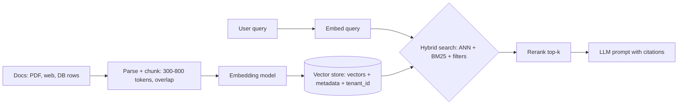

# Vector Databases

> [!abstract] TL;DR
> A vector database stores **embeddings** (dense float vectors from an embedding model) with metadata and answers **"find the k nearest neighbours"** fast, using approximate (ANN) indexes like **HNSW**. It's the retrieval layer behind [[RAG]], semantic search, recommendations and dedup.
> - **Up to ~5–10M vectors**: if you already run Postgres, **pgvector** (e.g. on [[Supabase]]) is usually enough and keeps data, auth and transactions in one place.
> - **Larger scale**: dedicated engines (**Qdrant**, Milvus, Pinecone) win on heavy filtering, multi-tenancy at scale, or hundreds of millions of vectors.
> - **Answer quality** depends far more on chunking, embedding model choice and hybrid search than on which database you pick.

## Introduction
- **Problem**: LLMs and ML models represent meaning as vectors, and exact nearest-neighbour search over millions of high-dimensional vectors is O(n·d) per query. That's too slow, so ANN indexes trade a little recall for orders-of-magnitude speed.
- **History**:
  - Libraries first: FAISS (Meta, 2017), Annoy, ScaNN.
  - Then dedicated databases: Milvus (2019), Pinecone, Weaviate, Qdrant (~2020–21).
  - The 2023 LLM/RAG boom made them mainstream.
  - General-purpose databases added vector support in response: pgvector, [[Redis]], Elasticsearch/OpenSearch, MongoDB Atlas, [[MySQL]] 9 (type only in Community), Cassandra 5.
- **Where it sits**: ingestion pipeline (parse → chunk → embed) → vector store → retriever (hybrid search + rerank) → [[LLM Fundamentals|LLM]] prompt. Often orchestrated with LangChain/LlamaIndex or [[n8n]] AI nodes.

## Core Concepts

### Embeddings and distance
| Metric | Formula idea | Use when | pgvector operator |
|---|---|---|---|
| Cosine distance | 1 − cos(θ) | Most text embeddings (normalized) | `<=>` |
| Inner product | −(a·b) | Normalized vectors (equivalent to cosine, faster) | `<#>` |
| Euclidean (L2) | ‖a − b‖ | Image/other embeddings trained for L2 | `<->` |
| Hamming / Jaccard | Bit differences | Binary-quantized vectors | `<~>` / `<%>` |

- **Dimensions**: 384 (small open models) to 1,536–3,072 (OpenAI `text-embedding-3-*`), with Matryoshka models allowing truncation. Higher dimensions mean more RAM and slower search.
- **The same model must embed documents and queries**. Changing the model means **re-embedding everything**.

### ANN index types
| Index | How it works | Strengths | Weaknesses |
|---|---|---|---|
| **HNSW** | Multi-layer proximity graph, greedy search | High recall at low latency, incremental inserts | RAM-hungry. Slow builds. Deletes degrade graph |
| IVF (IVFFlat, IVF-PQ) | Cluster centroids, search the nearest `nprobe` lists | Smaller, faster builds | Needs training data. Recall drops if data drifts |
| DiskANN / Vamana | SSD-resident graph | Billions of vectors on disk cheaply | More complex. Fewer implementations (pgvectorscale, Milvus) |
| Flat (exact) | Brute force | 100% recall | O(n). Only for small sets or re-scoring |

**Tuning knobs**: HNSW `m` (graph degree, 16 default), `ef_construction` (build quality, 64–200), `ef_search` (query-time recall vs latency). IVF `lists` / `probes`.

### Quantization
| Method | Memory saving | Notes |
|---|---|---|
| Scalar (float32 → int8 / float16 `halfvec`) | 2–4× | Small recall loss |
| Product quantization (PQ) | 8–64× | Larger recall loss. Re-score with full vectors |
| Binary quantization | 32× | Works well with some models (e.g. Cohere, OpenAI 3-large). Always oversample + re-rank |

### Hybrid search and filtering
- **Hybrid** = lexical (BM25 / full-text) + vector, merged with **Reciprocal Rank Fusion (RRF)**. It fixes the classic failure on exact terms, codes and names (SKU "A12-B", "PDPA s.30").
- **Filtering**:
  - **Pre-filtering** (filter, then ANN) is accurate, but may break graph connectivity.
  - **Post-filtering** (ANN, then filter) is fast, but may return fewer than k results.
  - Engines differ: Qdrant uses filterable HNSW with payload indexes. pgvector 0.8 has **iterative index scans**.
- **Reranking**: retrieve top 50–100, then rerank with a cross-encoder (Cohere Rerank, bge-reranker) to the top 5–10. That's often the biggest quality win.

## Architecture / How It Works

- Dedicated engines separate **storage** (segments on disk/object storage), **index** (HNSW per segment) and **query nodes**. Writes go to a WAL/mutable segment, then get sealed and indexed in the background, so freshly inserted vectors may be briefly searched by brute force.
- **pgvector** stores vectors as a column type. HNSW/IVFFlat are regular Postgres index access methods, so you get MVCC, joins, RLS and backups for free. The cost: indexes must fit in `shared_buffers`/RAM for speed, and builds use `maintenance_work_mem`.

## Project Structure
Supabase/pgvector RAG table + search function:
```sql
create extension if not exists vector;

create table documents (
  id bigint generated always as identity primary key,
  tenant_id uuid not null,
  source text not null,
  content text not null,
  embedding vector(1536) not null,                      -- or halfvec(1536) to halve memory
  fts tsvector generated always as (to_tsvector('simple', content)) stored
);
create index on documents using hnsw (embedding vector_cosine_ops) with (m = 16, ef_construction = 64);
create index on documents using gin (fts);
create index on documents (tenant_id);
alter table documents enable row level security;          -- tenant isolation applies to vector search too

-- hybrid search with RRF
create or replace function match_documents(q_emb vector(1536), q_text text, p_tenant uuid, k int default 10)
returns table (id bigint, content text, score float) language sql stable as $$
  with v as (select id, row_number() over (order by embedding <=> q_emb) r
             from documents where tenant_id = p_tenant order by embedding <=> q_emb limit 50),
       t as (select id, row_number() over (order by ts_rank(fts, websearch_to_tsquery('simple', q_text)) desc) r
             from documents where tenant_id = p_tenant and fts @@ websearch_to_tsquery('simple', q_text) limit 50)
  select d.id, d.content, coalesce(1.0/(60+v.r),0) + coalesce(1.0/(60+t.r),0) as score
  from documents d left join v on v.id = d.id left join t on t.id = d.id
  where v.id is not null or t.id is not null
  order by score desc limit k;
$$;
```
```sql
set hnsw.ef_search = 100;                -- recall vs latency per session
set hnsw.iterative_scan = relaxed_order; -- pgvector 0.8: keep scanning when filters drop results
```

## Use Cases
| Use case | Why it fits |
|---|---|
| RAG over company docs / SOPs / product catalogs | Semantic retrieval + citations for LLM answers |
| WhatsApp/chat support bots for SMEs | Retrieve FAQ/policy chunks per tenant |
| Semantic product search, "similar items" | Embedding similarity beats keyword matching for vague queries |
| Dedup / clustering of tickets, leads, documents | Near-duplicate detection via cosine threshold |
| Long-term memory for agents | Store and recall past interactions |
| Exact lookups, aggregations, transactions | **Poor fit**. Use [[PostgreSQL]] tables and indexes |

## Pros & Cons
| Pros | Cons |
|---|---|
| Millisecond semantic search over millions of items | Approximate: recall < 100%, tuning required |
| Language-agnostic matching (Malay/English/Chinese with multilingual models) | Results only as good as chunking + embedding model |
| pgvector keeps vectors next to relational data, RLS and transactions | HNSW is RAM-hungry. Large indexes need big instances |
| Dedicated engines scale to billions with quantization and disk indexes | Another system to run, secure and back up (if dedicated) |
| Hybrid + rerank gives strong retrieval quality | Re-embedding on model change is costly at scale |
| Managed options (Pinecone, Qdrant Cloud, Supabase) | Embeddings can leak information about source text (privacy) |

## Alternatives & Peers
| Option | Strength | Weakness | Pick it when… |
|---|---|---|---|
| **pgvector** (+ pgvectorscale) | One database, SQL joins, RLS, transactions, cheap | RAM-bound HNSW. Tuning filtered queries | Already on Postgres/[[Supabase]], < ~10M vectors (ZP default) |
| **Qdrant** | Rust, lean RAM, excellent filtering, quantization, easy self-host | Separate system. Sync with the primary DB | Heavy metadata filtering, self-hosted dedicated store |
| Milvus / Zilliz | Billion-scale, GPU/DiskANN, distributed | Heavy footprint (multiple processes, deps) | Hundreds of millions of vectors+ |
| Pinecone | Fully managed serverless, zero ops | Proprietary, cost at scale, data residency | Team without ops capacity, fast start |
| Weaviate | Built-in vectorizers/modules, hybrid search | Heavier, module complexity | Want embedding + search in one service |
| [[Redis]] / Valkey search | Very low latency, in-memory | RAM cost, licensing changes | Small, latency-critical sets (semantic cache) |
| Elasticsearch / OpenSearch kNN | Mature lexical + vector hybrid | JVM ops overhead | Already running ES/OS for search/logs |
| Chroma / LanceDB | Embedded, great for prototypes and local | Fewer production features | Notebooks, local tools, edge |

## Tips & Reminders
> [!tip]
> - Start with exact search (no index) under ~50k vectors. Add HNSW when latency demands it.
> - Store `embedding_model` + version per row, so you can re-embed incrementally when switching models.
> - Always filter by `tenant_id` (and enforce it with RLS). Cross-tenant leakage in RAG is a data breach.
> - Evaluate retrieval separately from generation: build a small labelled set (question → expected chunk ids) and track recall@k / MRR when changing chunking, models or indexes.
> - Use `halfvec` or quantization before buying bigger servers.
> - **In ZP's stack**: [[Supabase]] pgvector + hybrid RRF function + a reranker covers SME RAG bots. Generate embeddings in [[n8n]] or a Node worker with a queue ([[Redis]]/BullMQ) and keep chunking parameters versioned. Move to a self-hosted Qdrant on [[Coolify]] only if vectors reach tens of millions or filtered queries get slow.

## Versions & Breaking Changes
| Product / version | Released | Key changes | Breaking / migration notes |
|---|---|---|---|
| pgvector 0.5.0 | 2023-08 | **HNSW** index | Rebuild IVFFlat-only setups if switching |
| pgvector 0.7.0 | 2024-04 | `halfvec`, `bit` (binary), `sparsevec`, quantization via expression indexes | Up to 4,000 dims for `halfvec` indexes |
| pgvector 0.8.0 | 2024-10 | **Iterative index scans** (better filtered recall), improved cost estimates | Set `hnsw.iterative_scan` explicitly |
| Pinecone serverless | 2024 | Storage/compute separation, usage pricing | Pod-based indexes legacy |
| Cassandra 5.0 / MySQL 9 | 2024 | Vector types in general-purpose DBs | MySQL Community has no ANN index |
| Qdrant 1.x (1.17 in 2026) | Ongoing | Quantization options, multi-vector, GPU indexing, BM25/hybrid queries | Check snapshot compatibility on upgrades |

> [!warning] Unverified — check before relying on this
> Latest pgvector, Qdrant and Milvus versions weren't confirmed from primary sources this run. Check https://github.com/pgvector/pgvector/blob/master/CHANGELOG.md and https://github.com/qdrant/qdrant/releases.

## Critical Issues & Gotchas
> [!danger] Tenant leakage and prompt injection through retrieval
> A missing `tenant_id` filter, or a vector store without RLS, lets one client's bot retrieve another client's documents. Retrieved content can also contain **indirect prompt injection** ("ignore previous instructions…") that the LLM obeys. Enforce isolation in the database, sanitize/limit retrieved text, and never give the LLM tools with more privileges than the requesting user.

> [!danger] Embeddings are not anonymized data
> Embedding-inversion research shows text can be partially reconstructed from embeddings, especially short texts. Treat vectors with the same PDPA/GDPR sensitivity as the source text: deletion requests must delete vectors too, and sending data to hosted embedding APIs is a cross-border transfer to document.

> [!danger] Exposed vector DBs
> Dedicated vector databases often ship without authentication enabled by default (Qdrant API key, Milvus auth and Weaviate auth are opt-in). Internet-exposed instances leak whole knowledge bases. Enable API keys/TLS and keep them on private networks ([[Network Security]]).

> [!warning] Gotchas
> - Filtered HNSW queries can silently return fewer than k results, or low-recall results, when filters are selective. Use iterative scans (pgvector 0.8), payload indexes (Qdrant), or partition per tenant.
> - HNSW builds on millions of rows can take hours and need lots of `maintenance_work_mem`. Build after bulk load, and use `CREATE INDEX CONCURRENTLY` in production.
> - Mixing embedding models or dimensions in one column corrupts similarity. Enforce the dimension in the type (`vector(1536)`).
> - Chunking errors (tables split mid-row, missing headings) hurt more than index choice. Keep section titles in each chunk.
> - Cosine scores aren't calibrated across models. Don't hard-code similarity thresholds without evaluation.

## Deep Dives
N/A — no deep dives planned yet. Candidates: pgvector tuning & hybrid search, ANN index internals (HNSW/IVF/DiskANN).

## Related
- [[PostgreSQL]] — pgvector host, RLS, hybrid with full-text search
- [[Supabase]] — managed pgvector in ZP's stack
- [[RAG]] — the main application pattern
- [[LLM Fundamentals]] — consumers of retrieved context
- [[NoSQL]] — broader non-relational landscape
- [[Redis]] — semantic caching, vector search on small sets

## References
- pgvector: https://github.com/pgvector/pgvector
- Supabase AI & vectors: https://supabase.com/docs/guides/ai
- Qdrant docs: https://qdrant.tech/documentation/
- Milvus docs: https://milvus.io/docs
- HNSW paper (Malkov & Yashunin): https://arxiv.org/abs/1603.09320
- Vector DB comparison (2026 benchmark): https://computingforgeeks.com/qdrant-weaviate-milvus-pgvector/
- Vector DB decision guide (2026): https://dupple.com/learn/best-vector-databases
