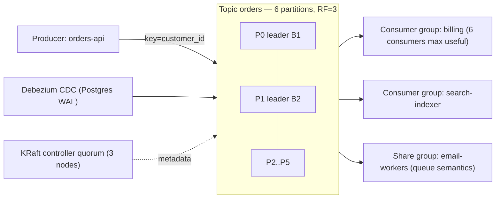

# Kafka

> [!abstract] TL;DR
> Apache Kafka is a **distributed, partitioned, replicated commit log**. Producers append records to topics, consumers read at their own pace by offset, and data is retained for days or forever, so many independent consumers can replay history. It's the backbone for event streaming, CDC, log aggregation and real-time pipelines at high throughput (MB/s–GB/s per cluster). **Kafka 4.x runs without ZooKeeper (KRaft only)** and 4.2 (Feb 2026) made **share groups (queue semantics)** production-ready. It's operationally heavy: for a solo founder's SME workloads, [[Redis]] Streams, Postgres queues or a managed service are usually the better first choice.

## Introduction
- Created at LinkedIn (Jay Kreps, Neha Narkhede, Jun Rao) in 2010, an Apache top-level project since 2012. Apache-2.0. Confluent (founded by the creators) sells Confluent Cloud/Platform.
- **Vendor landscape**:
  - Managed Kafka: Amazon MSK, Aiven, Redpanda Cloud (Kafka-API compatible, BSL), WarpStream (object-storage based, acquired by Confluent in 2024), AutoMQ.
  - **IBM agreed to acquire Confluent** (announced Dec 2025). Watch pricing and licensing of Confluent-specific components.
- It solves decoupling producers from many consumers, durable replayable event history, high-throughput ingestion and stream processing.
- Where it sits: between services/DBs (CDC via Debezium) and consumers (analytics, search indexes, microservices, ML features). Overkill below roughly 1k–10k msgs/s or a handful of services.

## Core Concepts
| Concept | Meaning |
|---|---|
| **Topic** | Named stream of records, split into **partitions** |
| **Partition** | Ordered, append-only log. **Ordering is guaranteed only within a partition** |
| **Record** | Key, value, headers, timestamp. The **key** decides the partition (hash), so same key = same partition = ordered |
| **Offset** | Position of a record in a partition. Consumers commit offsets to track progress |
| **Broker** | Server storing partitions. **Controllers** (KRaft) manage metadata |
| **Replication** | Each partition has a leader + followers. **ISR** (in-sync replicas) |
| **Consumer group** | Partitions are divided among group members, so parallelism ≤ partition count |
| **Share group** (4.x) | Queue semantics: multiple consumers per partition, per-record ack/release/reject, delivery counts |
| **Retention** | Time/size based (`retention.ms`), or **log compaction** (keep the latest value per key) |
| **Kafka Connect** | Framework for source/sink connectors (Debezium CDC, S3, Elasticsearch, JDBC) |
| **Kafka Streams** | Java library for stateful stream processing (joins, windows, aggregations) |

### Delivery semantics
| Setting | Guarantee |
|---|---|
| `acks=0` | Fire and forget (may lose) |
| `acks=1` | Leader persisted (may lose on leader failure) |
| `acks=all` + `min.insync.replicas=2` + RF=3 | Durable against one broker loss |
| `enable.idempotence=true` (default since 3.0) | No duplicates from producer retries per partition |
| Transactions (`transactional.id`) + `isolation.level=read_committed` | Exactly-once read-process-write within Kafka |
| Consumer side | At-least-once by default. **Downstream side effects need idempotency** |

## Architecture / How It Works



- **Storage**: each partition is a sequence of segment files on disk. Sequential appends + OS page cache + zero-copy `sendfile` give the high throughput. **Tiered storage** (KIP-405, GA in 3.9) offloads old segments to S3-compatible object storage.
- **Replication**: the leader handles reads/writes, and followers fetch. A record is committed when all ISR members have it. Unclean leader election (off by default) trades durability for availability.
- **KRaft**: metadata is stored in an internal Raft-replicated log on controller nodes (ZooKeeper was removed in 4.0). That means faster failover and millions of partitions.
- **Consumer rebalancing**: the next-gen consumer protocol (KIP-848, GA in 4.0) moves assignment to the broker, with incremental rebalances and far fewer stop-the-world pauses.
- **Share groups** (KIP-932): brokers track per-record acquisition locks and delivery counts, with no partition-count limit on parallelism. Good for work queues, though ordering isn't guaranteed.

## Project Structure
```text
events/
├── docker-compose.yml        # local single-node KRaft broker (apache/kafka:4.2)
├── schemas/                  # Avro / Protobuf / JSON Schema per topic (Schema Registry or repo-managed)
│   └── orders.v1.avsc
├── topics.yaml               # declarative topics: partitions, RF, retention, cleanup.policy
├── producers/orders-api/     # idempotent producer config
└── consumers/billing/        # consumer group, retry/DLQ topics, idempotent handlers
```
```yaml
# docker-compose.yml — single-node KRaft for dev only
services:
  kafka:
    image: apache/kafka:4.2.0
    ports: ["127.0.0.1:9092:9092"]
    environment:
      KAFKA_NODE_ID: 1
      KAFKA_PROCESS_ROLES: broker,controller
      KAFKA_LISTENERS: PLAINTEXT://:9092,CONTROLLER://:9093
      KAFKA_ADVERTISED_LISTENERS: PLAINTEXT://localhost:9092
      KAFKA_CONTROLLER_QUORUM_VOTERS: 1@localhost:9093
      KAFKA_CONTROLLER_LISTENER_NAMES: CONTROLLER
      KAFKA_OFFSETS_TOPIC_REPLICATION_FACTOR: 1
```

## Use Cases
| Use case | Why it fits |
|---|---|
| Event-driven microservices | Durable fan-out to many independent consumers |
| CDC pipelines (Postgres → search/analytics) | Debezium + Connect, ordered per key, replayable |
| Log/metrics/clickstream ingestion | Very high throughput, batching, compression |
| Stream processing (fraud, real-time aggregates) | Kafka Streams / Flink with exactly-once |
| Event sourcing / audit log | Immutable, retained, replayable history (compacted topics for state) |
| Work queues at scale (4.2+) | Share groups add queue semantics without separate infrastructure |

## Pros & Cons
| Pros | Cons |
|---|---|
| Massive throughput, horizontal scale via partitions | Operationally complex: sizing, partitions, rebalancing, upgrades, monitoring |
| Durable, replayable retention with multiple independent consumers | Heavy for small workloads (JVM, 3+ brokers for HA) |
| Huge ecosystem (Connect, Streams, Flink, Debezium, schema registries) | Ordering only per partition. Partition count is hard to change later |
| KRaft simplifies ops vs ZooKeeper | No built-in per-message delay/priority queues (share groups help with ack semantics) |
| Strong managed offerings | Managed pricing (Confluent Cloud, MSK) gets expensive. Vendor consolidation risk |

## Alternatives & Peers
| Alternative | Strength vs Kafka | Weakness vs Kafka | Pick it when… |
|---|---|---|---|
| [[Redis]] Streams | Tiny ops footprint, consumer groups, sub-ms | Memory-bound retention, single-node durability limits | SME-scale event streams, already running Redis |
| RabbitMQ | Rich routing, per-message ack/TTL/priority, simpler | Lower throughput, weaker replay (Streams plugin helps) | Task queues, RPC-style messaging |
| NATS JetStream | Lightweight Go binary, simple, fast | Smaller ecosystem for connectors | Edge/IoT, simple pub/sub + persistence |
| Redpanda | Kafka API, C++, no JVM, simpler ops | BSL license, smaller community | Want Kafka API with less ops |
| Postgres queue / outbox (`SKIP LOCKED`, pgmq) | Transactional with your data, zero new infra | Throughput limits, polling | Low/moderate volume, consistency with DB writes |
| Cloud (Pub/Sub, Kinesis, SQS/SNS) | Fully managed, pay per use | Lock-in, quotas, cost at scale | Cloud-native teams, bursty workloads |

## Tips & Reminders
> [!tip] Design rules
> - Choose the **key** for the ordering you need (`order_id`, `customer_id`). Hot keys create hot partitions.
> - Start with more partitions than consumers (e.g. 6–12) since increasing later reshuffles key→partition mapping.
> - Production defaults: RF=3, `min.insync.replicas=2`, `acks=all`, idempotent producers, `auto.create.topics.enable=false`.
> - Use a schema (Avro/Protobuf/JSON Schema) with compatibility rules. Never change event shape ad hoc.
> - Retry topics + a dead-letter topic for poison messages. Consumers must be idempotent.
> - Monitor consumer lag (Burrow, kafka-exporter + Grafana), under-replicated partitions and disk usage.

> [!tip] In ZP's stack
> - For WhatsApp/n8n-scale workloads (thousands to hundreds of thousands of events/day), **don't start with Kafka**. [[Redis]] Streams, BullMQ or a Postgres outbox cover it with far less ops.
> - Reach for Kafka (managed: Aiven, Confluent Cloud, Redpanda Cloud) when you need multi-consumer replayable streams, CDC into analytics, or sustained >5–10k msgs/s.
> - [[n8n]] has Kafka trigger/producer nodes: fine for integrating with a client's existing Kafka, but don't build your core event bus around n8n consumers.

## Versions & Breaking Changes
| Version | Released | Key changes | Breaking / migration notes |
|---|---|---|---|
| 2.8 | 2021-04 | KRaft early access | — |
| 3.3 | 2022-10 | KRaft production-ready (new clusters) | — |
| 3.9 | 2024-11 | Last ZooKeeper-compatible line, tiered storage GA, dynamic KRaft quorums | Bridge release for ZK → KRaft migration |
| **4.0** | 2025-03 | **ZooKeeper removed**, next-gen consumer rebalance protocol (KIP-848) GA, share groups early access | Must migrate to KRaft via 3.9 first. Java 17 for brokers, Java 11+ clients. Old message formats/APIs removed |
| 4.1 | 2025-09 | Share groups preview, Streams rebalance protocol (KIP-1071) | — |
| **4.2** | 2026-02-17 | **Share groups (queues) production-ready**: lock renewal, lag metrics, fetch limits | Review share-group configs before relying on them |

> [!warning] Unverified — check before relying on this
> Whether 4.3 has shipped (expected ~Sep 2026) and the IBM–Confluent deal's completion status weren't verified this run. Check https://kafka.apache.org/downloads.

## Critical Issues & Gotchas
> [!danger] Kafka client/Connect CVEs (2025)
> - **CVE-2025-27817**: SASL/OAUTHBEARER `sasl.oauthbearer.token.endpoint.url` / JWKS URL allowed arbitrary file read and SSRF.
> - **CVE-2025-27818 / CVE-2025-27819**: Kafka Connect configs abusing `LdapLoginModule`/JNDI led to RCE and DoS.
>
> Fixed in 3.9.1 / 4.0.0. Restrict who can create or alter connectors, upgrade, and set `org.apache.kafka.disallowed.login.modules`.

> [!danger] Data loss from weak durability settings
> `acks=1`, RF=1, `min.insync.replicas=1` or unclean leader election lose acknowledged messages on broker failure. Many "Kafka lost my data" incidents trace back to these defaults on self-managed clusters.

> [!warning] Gotchas
> - Consumer lag spikes from long processing → `max.poll.interval.ms` exceeded → rebalance storms.
> - Committing offsets before processing = at-most-once (loss). Committing after without idempotency = duplicates.
> - Increasing partitions breaks key ordering for existing keys.
> - Exposed brokers without auth (PLAINTEXT listener on public IP) leak all data. Use SASL/SCRAM or mTLS + ACLs.
> - Large messages (>1 MB default `message.max.bytes`) fail. Store blobs in object storage and send references.

## Deep Dives
- (planned) [[Kafka - Partitions, Consumer Groups & Delivery Semantics]]

## Related
- [[Message Queues]] — queue vs log semantics
- [[Redis]] — Streams as a lightweight alternative
- [[PostgreSQL]] — CDC source, outbox pattern
- [[System Design]] — event-driven architectures
- [[n8n]] — Kafka nodes for integration

## References
- Docs: https://kafka.apache.org/documentation/
- Kafka 4.2 upgrade notes: https://kafka.apache.org/42/getting-started/upgrade/
- Kafka 4.1 release (Factor House): https://factorhouse.io/articles/kafka-4-1-release-announcement/
- Share consumers GA (Confluent): https://www.confluent.io/blog/kafka-queue-semantics-share-consumer-ga/
- Kafka news 2026 (Gravitee): https://www.gravitee.io/blog/apache-kafka-news-2026_whats-next
- Apache Kafka CVE list: https://kafka.apache.org/cve-list
