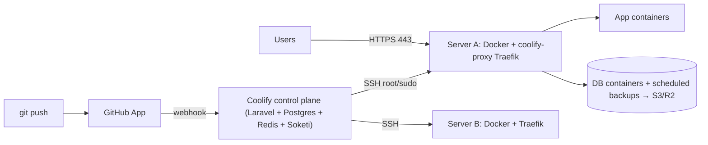

# Coolify

> [!abstract] TL;DR
> Coolify is an open-source, self-hosted PaaS (a "Heroku/Vercel/Netlify alternative") that deploys apps, databases and 200+ one-click services onto **your own servers over SSH**, using [[Docker]] and a [[Traefik]] (or Caddy) proxy with automatic Let's Encrypt. It's ZP's deployment layer on Hostinger KVM. It removes most ops toil, but **the Coolify dashboard is effectively root on every connected server**: after the 11 critical CVEs disclosed in Jan 2026, treat it like a production control plane and patch, isolate and back it up.

## Introduction
- Built by Andras Bacsai (coolLabs), Apache-2.0. It's a Laravel + Livewire app (PHP) with Postgres and Redis, running in Docker on the "Coolify host".
- **v4** was in beta for ~2 years (`4.0.0-beta.4xx`) and went **stable as 4.0.0 in 2026**, with 4.2.0 on 2026-07-21 and 4.3.x by Sep 2026.
- Offered as self-hosted (free, unlimited) or **Coolify Cloud** (they host the control plane, you bring the servers).
- It solves "I want git-push deploys, previews, SSL, DB backups and logs without Kubernetes or a PaaS bill" for solo devs and small teams.

## Core Concepts
| Concept | Meaning |
|---|---|
| **Server** | A Linux host Coolify manages over SSH (localhost or remote). Docker is installed by Coolify |
| **Project / Environment** | Grouping (e.g. `client-a` → `production`, `staging`) |
| **Resource** | Application, Database, Service (one-click template) or Docker Compose stack |
| **Build pack** | Nixpacks / Railpack (auto-detect), Dockerfile, Docker Compose, Static, or Docker image |
| **Proxy** | Traefik (default) or Caddy, configured automatically via container labels |
| **Destination** | Docker network on a server where resources run |
| **Sources** | GitHub App, GitLab, Bitbucket, Gitea or public repo. Webhooks trigger deploys |
| **Preview deployments** | Per-PR environments with their own URLs |
| **Scheduled backups** | DB dumps to local disk or S3-compatible storage (Cloudflare R2, Backblaze). Volume backups since 4.2 |
| **Sentinel** | Lightweight metrics/health agent on each server |

### Deploy flow for a typical app
```text
git push → GitHub App webhook → Coolify queues deployment
→ SSH to build server → clone → build image (Dockerfile / Nixpacks)
→ (optional) push to registry → start container with Traefik labels
→ health check → switch traffic → stop old container (rolling, single host)
```

## Architecture / How It Works



- The control plane stores **SSH private keys, env vars/secrets, Git tokens, S3 keys and DB passwords**. Compromising it compromises every managed server.
- Each managed server runs `coolify-proxy` (Traefik) on 80/443. Coolify writes Traefik labels/dynamic config per resource, and certificates come from Let's Encrypt (HTTP-01 or DNS-01 with Cloudflare).
- Builds run on the target server by default. Heavy Next.js builds on a small KVM can starve production. Use a dedicated build server or build in CI and deploy the image.
- Ports: dashboard `8000`, realtime `6001/6002`. Lock these down after setting a domain for the dashboard.
- Horizontal scaling is limited: Coolify is single-host per resource (Docker Swarm support is experimental). HA means multiple servers + an external LB/DNS, done manually.

## Project Structure
```text
# What Coolify needs from a repo (Dockerfile build pack — recommended over Nixpacks for prod)
app/
├── Dockerfile               # deterministic build; see Docker note
├── .dockerignore
├── compose.yaml             # optional: Coolify "Docker Compose" build pack (magic vars: SERVICE_FQDN_*, SERVICE_PASSWORD_*)
└── healthcheck route        # /api/health → used for zero-downtime switch
```
```yaml
# compose.yaml snippet using Coolify magic environment variables
services:
  web:
    build: .
    environment:
      - SERVICE_FQDN_WEB_3000          # Coolify generates the domain + Traefik rules for port 3000
      - DATABASE_URL=postgres://app:${SERVICE_PASSWORD_DB}@db:5432/app
  db:
    image: postgres:18
    environment:
      - POSTGRES_PASSWORD=${SERVICE_PASSWORD_DB}
    volumes: [pgdata:/var/lib/postgresql/data]
volumes: { pgdata: {} }
```

## Use Cases
| Use case | Why it fits |
|---|---|
| Hosting many small client apps on 1–3 KVMs | Projects/environments per client, one dashboard |
| Next.js / Node / Python APIs with git-push deploys | GitHub App + previews + automatic SSL |
| Self-hosting OSS ([[n8n]], Chatwoot, Plausible, Umami, Supabase) | One-click service templates |
| Managed-ish databases | Postgres/Redis/MySQL/Mongo with scheduled backups to R2 |
| Staging + preview environments | Per-PR deployments without a Vercel bill |

## Pros & Cons
| Pros | Cons |
|---|---|
| Free, open source, no per-seat/per-app pricing | Large blast radius: one dashboard holds root SSH to everything |
| Heroku-like UX on cheap VPSes (huge cost savings vs Vercel/Render) | Security track record: 11 critical CVEs (Jan 2026), more through 2026 |
| Plain Docker underneath. You can always fall back to `docker` CLI | Single-host per resource, no real autoscaling/HA |
| Automatic SSL, previews, backups, logs, notifications | Small core team, so a bus-factor and support risk for client production |
| Docker Compose support for complex stacks | Upgrades occasionally break proxy or compose behaviour. Test first |

## Alternatives & Peers
| Alternative | Strength vs Coolify | Weakness vs Coolify | Pick it when… |
|---|---|---|---|
| Dokploy | Similar UX, Docker Swarm multi-node, TS codebase | Younger, smaller template catalog | You want Swarm-based multi-node from day one |
| CapRover | Mature, Swarm-based, simple | Dated UI, slower development | Legacy setups already on it |
| Kamal (37signals) | Config-as-code deploys, zero control plane to attack | CLI only, no dashboard/DB management | Code-first deploys of a few apps |
| Plain Docker Compose + [[Traefik]] | Minimal attack surface, full control | No UI, previews or backup scheduling | Small fixed stacks you rarely change |
| Vercel / Render / Railway | Zero ops, global edge, autoscaling | Cost grows fast, data residency, vendor lock-in | Client wants managed SLA and pays for it |
| [[Kubernetes]] (k3s) | Real orchestration, HA, ecosystem | Ops complexity for a solo founder | Multi-node HA requirements |

## Tips & Reminders
> [!tip] Hardening checklist (do this on every install)
> - Put the dashboard on its own domain **behind Cloudflare Access / Tailscale**, and close ports 8000/6001/6002 publicly once the domain works.
> - Enable 2FA for all users and keep team members to a minimum.
> - Auto-update off for production. Update **deliberately and quickly** after reading release notes, and follow GitHub security advisories.
> - Separate the Coolify host from client workloads where possible: a small control-plane VPS managing worker servers.
> - Back up Coolify itself: `/data/coolify` (SSH keys, `.env` with `APP_KEY`) + its Postgres. Without `APP_KEY` the stored secrets can't be decrypted.

> [!tip] In ZP's stack
> - Hostinger KVM + Coolify + [[Cloudflare]] DNS (proxied) → Traefik with the DNS-01 challenge (Cloudflare API token scoped to Zone:DNS:Edit).
> - Remember [[Docker]] bypasses UFW. Don't publish DB ports, and use Coolify's "internal" networking.
> - Build heavy Next.js images in GitHub Actions → push to GHCR → deploy the image in Coolify. This saves KVM RAM during builds.
> - DB backups → Cloudflare R2 with lifecycle rules. Run a quarterly restore drill per client.
> - Contracts: state that hosting runs on infrastructure you manage, plus the patch SLA and backup RPO/RTO. This protects you when an upstream CVE hits.

## Versions & Breaking Changes
| Version | Released | Key changes | Breaking / migration notes |
|---|---|---|---|
| v3 | 2022 | Svelte/Node-based Coolify | End-of-life. v4 was a rewrite (no in-place migration) |
| v4 beta | 2023-11 → 2026 | Laravel rewrite, multi-server, Traefik/Caddy, compose, previews | ~470 beta releases. Security fixes landed in late betas (466, 471) |
| **4.0.0** | 2026 (spring) | First stable v4, rolling up the Jan 2026 critical CVE fixes | Upgrade from any beta |
| 4.2.0 | 2026-07-21 | Volume backup scheduling, expanded API, resource migration, registry config, tags, **audit logging** | Breaking changes to **team permissions and API endpoints**. Update API clients/scripts |
| 4.3.x | 2026-09 | Current line | Check release notes per patch |

> [!warning] Unverified — check before relying on this
> The 4.0.0 stable month and current 4.3.x patch number came from secondary sources. Check https://github.com/coollabsio/coolify/releases.

## Critical Issues & Gotchas
> [!danger] Jan 2026: 11 critical CVEs (several CVSS 10.0)
> Command injection, auth bypass and broken access control leading to **full server takeover** of every managed host. Examples:
> - **CVE-2026-34034**: Sentinel token command injection, fixed in beta.466.
> - **CVE-2026-34047**: terminal WebSocket missing auth, fixed in beta.471.
> - **CVE-2026-34592**: authentication bypass.
>
> Belgium's CCB issued a "patch immediately" advisory. Later in 2026:
> - **CVE-2026-15507**: authorization bypass in ≤ 4.1.1.
> - **CVE-2026-84694**: env-var key command injection over SSH, fixed in **4.2.0**.
>
> **Run ≥ 4.2.0 (latest 4.3.x)** and never expose the dashboard to the open internet.

> [!danger] Control-plane blast radius
> Coolify holds root-capable SSH keys to every server plus all app secrets. A compromised Coolify = all client environments compromised. Use separate Coolify instances per high-value client, or at least separate servers and least-privilege SSH users where supported.

> [!warning] Footguns
> - Deleting a resource can delete its volumes. Double-check "delete volumes" toggles.
> - Builds on the production server can OOM running apps. Add swap and memory limits, or build elsewhere.
> - Let's Encrypt rate limits (50 certs/registered domain/week) hit when recreating many preview deployments. Use wildcard DNS-01 certs.
> - Environment variables marked "build time" are baked into images. Don't mark secrets as build-time unless required (`NEXT_PUBLIC_*` only).
> - Coolify updates restart the proxy. Schedule them outside client business hours (MYT).

## Deep Dives
N/A — no deep dives planned yet. Candidates: hardening & multi-server topology, backup/restore drills.

## Related
- [[Docker]] — runtime underneath
- [[Kubernetes]] — next step when you outgrow single-node Coolify
- [[Traefik]] — default proxy and TLS
- [[Cloudflare]] — DNS, Tunnels, Access in front of the dashboard
- [[Linux Essentials]] — SSH, users, firewall on managed servers
- [[CI-CD]] — build in CI, deploy images
- [[n8n]] · [[PostgreSQL]] · [[Next.js]] — typical workloads

## References
- Docs: https://coolify.io/docs
- Releases: https://github.com/coollabsio/coolify/releases
- v4.2.0 release: https://github.com/coollabsio/coolify/releases/tag/v4.2.0
- Belgium CCB advisory: https://ccb.belgium.be/advisories/warning-critical-coolify-vulnerabilities-patch-immediately
- CVE overview 2025/2026: https://wz-it.com/en/blog/coolify-cve-security-vulnerabilities-update-2025-2026/
- heise on Coolify vulnerabilities: https://www.heise.de/en/news/Coolify-Critical-vulnerabilities-could-enable-remote-attacks-11354777.html
