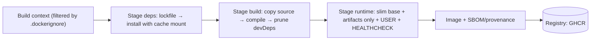

# Docker - Dockerfile & Image Best Practices

> [!info] Deep dive of [[Docker]]

> [!abstract] TL;DR
> A good image is **small, reproducible, non-root, secret-free and cache-efficient**. Use **multi-stage builds** (build tools stay out of the runtime image), order instructions from least to most frequently changing so **layer caching** works, use **BuildKit cache mounts and secret mounts**, pin base images, run as a non-root user with exec-form `CMD`, add a `HEALTHCHECK`, and **scan + rebuild regularly**. Remember: **every layer is permanent**. A secret copied in step 3 and deleted in step 4 still ships in the image.

## Concept
- **Image = ordered layers + config.** Each `RUN`, `COPY` and `ADD` creates a layer (filesystem diff). `ENV`, `CMD`, `USER`, `EXPOSE` only change metadata.
- **Build cache**: a layer is reused if its instruction and inputs (files for `COPY`, the parent layer) are unchanged. The first cache miss invalidates every layer after it.
- **Multi-stage**: multiple `FROM` stages. Only the final stage ships. Copy artifacts across with `COPY --from=build`.
- **BuildKit** (default builder): parallel stages, `--mount=type=cache` (persistent package caches), `--mount=type=secret` (never stored in layers), `--mount=type=ssh`, multi-platform builds via `buildx`, SBOM/provenance attestations.
- **Base image choices**:

| Base | Size | Pros | Cons |
|---|---|---|---|
| `debian:*-slim` / `node:*-slim` | ~70–200 MB | glibc compatibility, apt | Bigger, more CVEs |
| `alpine` / `node:*-alpine` | ~5–60 MB | Tiny | musl quirks (native modules, DNS, perf) |
| Distroless (`gcr.io/distroless/nodejs`) | Small | No shell or package manager, fewer CVEs | Harder debugging |
| Chainguard / Docker Hardened Images | Small | Minimal, frequently rebuilt, low CVE counts | Some are paid/restricted tags |
| `scratch` | 0 | Static binaries (Go, Rust) only | Nothing inside, not even CA certs unless copied |

## How It Works



- The **build context** is sent to the builder. Without a `.dockerignore`, `node_modules`, `.git` and `.env` get uploaded (slow builds, secret leakage).
- `COPY . .` early in the file means any source change invalidates dependency installation. Copy lockfiles first.
- **Reproducibility**: the same Dockerfile can produce different images over time (moving tags, unpinned apt/npm). Pin by digest and lockfiles for prod-critical images.

## Practical Usage

### Next.js standalone (pnpm), production-grade
```dockerfile
# syntax=docker/dockerfile:1.7
ARG NODE_VERSION=24
FROM node:${NODE_VERSION}-slim AS base
ENV PNPM_HOME=/pnpm PATH=/pnpm:$PATH
RUN corepack enable

FROM base AS deps
WORKDIR /app
COPY package.json pnpm-lock.yaml ./
RUN --mount=type=cache,id=pnpm,target=/pnpm/store pnpm install --frozen-lockfile

FROM deps AS build
COPY . .
ARG NEXT_PUBLIC_SUPABASE_URL                      # public build-time values only
RUN --mount=type=secret,id=sentry_token,env=SENTRY_AUTH_TOKEN pnpm build   # secret never in a layer

FROM node:${NODE_VERSION}-slim AS runtime
ENV NODE_ENV=production PORT=3000 HOSTNAME=0.0.0.0
WORKDIR /app
RUN groupadd -r app && useradd -r -g app app
COPY --from=build --chown=app:app /app/.next/standalone ./
COPY --from=build --chown=app:app /app/.next/static ./.next/static
COPY --from=build --chown=app:app /app/public ./public
USER app
EXPOSE 3000
HEALTHCHECK --interval=30s --timeout=3s --start-period=20s CMD node -e "fetch('http://127.0.0.1:3000/api/health').then(r=>process.exit(r.ok?0:1)).catch(()=>process.exit(1))"
CMD ["node", "server.js"]
```

### Go service on scratch/distroless
```dockerfile
FROM golang:1.25 AS build
WORKDIR /src
COPY go.mod go.sum ./
RUN --mount=type=cache,target=/go/pkg/mod go mod download
COPY . .
RUN --mount=type=cache,target=/root/.cache/go-build CGO_ENABLED=0 go build -trimpath -ldflags="-s -w" -o /out/api ./cmd/api

FROM gcr.io/distroless/static-debian12:nonroot
COPY --from=build /out/api /api
USER nonroot:nonroot
ENTRYPOINT ["/api"]
```

### `.dockerignore`
```text
.git
node_modules
.next
dist
coverage
.env*
!.env.example
*.log
Dockerfile*
docker-compose*.yml
```

### Build, scan, sign
```bash
docker buildx build --platform linux/amd64,linux/arm64 \
  --secret id=sentry_token,env=SENTRY_AUTH_TOKEN \
  --sbom=true --provenance=mode=max \
  -t ghcr.io/rarticle/web:1.8.0 -t ghcr.io/rarticle/web:sha-$(git rev-parse --short HEAD) --push .
trivy image --severity HIGH,CRITICAL --exit-code 1 ghcr.io/rarticle/web:1.8.0
docker scout cves ghcr.io/rarticle/web:1.8.0
```

## Patterns & Anti-patterns
| Pattern | When | Anti-pattern to avoid |
|---|---|---|
| Lockfile copy → install → source copy | Every language | `COPY . .` before dependency install |
| Multi-stage, runtime-only final image | Compiled/bundled apps | Shipping compilers, devDependencies, `.git` |
| `--mount=type=secret` | Private registries, build tokens | `ARG`/`ENV` secrets (visible in `docker history`) or `COPY .npmrc` |
| Non-root `USER`, read-only FS at runtime | Always | Default root user |
| Exec-form `CMD`/`ENTRYPOINT` (+ `init` for children) | Always | Shell form → app isn't PID 1, ignores SIGTERM → 10 s kill on stop |
| Pin base major.minor (digest for critical) | Prod images | `FROM node:latest` |
| Combine `apt-get update && install … && rm -rf /var/lib/apt/lists/*` in one `RUN` | Debian bases | Separate `update` layer (stale cache) or leftover apt lists |
| Immutable tags (semver + git SHA) | Deploys/rollbacks | Redeploying `:latest` (no rollback target) |

## Performance & Trade-offs
- Image size affects pull time (deploy speed, cold starts) and storage. Cutting 1.2 GB to 200 MB makes Coolify deploys and rollbacks much faster.
- Alpine saves MBs but can cost time debugging musl issues (Prisma engines, sharp, DNS `search` behaviour). `-slim` is the pragmatic default for Node.
- Cache mounts speed rebuilds a lot in CI only if the builder cache persists (GitHub Actions: `cache-from/cache-to type=gha` or registry cache).
- Distroless/scratch improves security posture but removes `sh` for debugging. Use `docker debug` or ephemeral debug containers.

## Tips & Reminders
> [!tip]
> - Lint Dockerfiles with **hadolint**. Check builds with `docker build --check` (BuildKit build checks).
> - Inspect layers with `dive` to find bloat.
> - Rebuild images on a schedule (weekly) even without code changes, so base-image security patches get picked up.
> - Add OCI labels (`org.opencontainers.image.source`, `.revision`, `.version`) for traceability.
> - **In ZP's stack**: build in GitHub Actions → push to GHCR → [[Coolify]] deploys the image tag. That keeps the KVM's RAM free for production. Only `NEXT_PUBLIC_*` values may be build args. Runtime secrets come from Coolify env vars.

## Version Notes
| Version | Change |
|---|---|
| Docker 17.05 | Multi-stage builds |
| 18.09 / 23.0 | BuildKit introduced / default builder on Linux |
| Dockerfile 1.4 | Heredocs (`RUN <<EOF`), `COPY --link` |
| Dockerfile 1.6–1.10 | Build checks, `--mount=type=secret,env=` to expose secrets as env vars, `--exclude` on COPY |
| Engine 29 (2025-11) | containerd image store default for new installs (better multi-platform/attestation support) |

> [!warning] Unverified — check before relying on this
> The exact Dockerfile frontend version that introduced each BuildKit flag wasn't checked this run. Pin `# syntax=docker/dockerfile:1` and consult https://docs.docker.com/build/buildkit/dockerfile-release-notes/.

## Critical Issues & Gotchas
> [!danger] Secrets baked into images
> Credentials copied into layers (`.env`, `.npmrc`, cloud keys) stay in the image even if deleted later, and get exposed when the image is pushed publicly or pulled by anyone with registry access. Scans of Docker Hub have repeatedly found thousands of images with live AWS keys and API tokens. Use secret mounts, `.dockerignore`, and scan images for secrets (Trivy secret scanning).

> [!danger] Malicious or compromised base images
> Typosquatted and backdoored images on Docker Hub (crypto-miners, credential stealers) and compromised build dependencies (npm supply-chain worms) end up in your runtime image. Use official/verified publishers, pin digests, generate SBOMs and scan on every build.

> [!warning] Gotchas
> - `ADD` auto-extracts archives and fetches URLs. Prefer `COPY` unless you need that.
> - `WORKDIR` creates directories as root. `--chown` on `COPY` avoids permission errors with non-root users.
> - Timezone and locale differ from your laptop. Set `TZ` explicitly only where needed.
> - `EXPOSE` doesn't publish ports. It's documentation only.
> - Building on Apple Silicon without `--platform linux/amd64` → `exec format error` on the x86 KVM.

## Related
- [[Docker]]
- [[Docker - Networking & Volumes]] — runtime side of the same images
- [[Coolify]] — deploying images
- [[CI-CD]] — build/scan/push pipelines
- [[Next.js]] — standalone output for small images

## References
- Dockerfile best practices: https://docs.docker.com/build/building/best-practices/
- Multi-stage builds: https://docs.docker.com/build/building/multi-stage/
- Build secrets: https://docs.docker.com/build/building/secrets/
- Dockerfile reference: https://docs.docker.com/reference/dockerfile/
- hadolint: https://github.com/hadolint/hadolint
