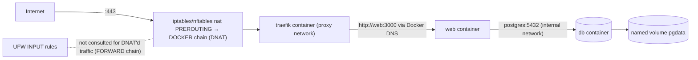

# Docker - Networking & Volumes

> [!info] Deep dive of [[Docker]]

> [!abstract] TL;DR
> Containers get isolated network namespaces joined to Docker networks: **user-defined bridges** give DNS by service name and should be your default. **Published ports** (`-p`) are implemented with iptables/nftables NAT rules that **bypass host firewalls like UFW**. Persistent data lives in **named volumes** (Docker-managed) or **bind mounts** (host paths). The container filesystem itself is ephemeral. Remember: **publish only what the reverse proxy needs (80/443), keep databases on internal networks, and back up volumes, because `docker compose down -v` deletes them.**

## Concept
| Network driver | What it does | Use for |
|---|---|---|
| `bridge` (default `docker0`) | NAT'd private subnet. **No DNS by name** on the default bridge | Nothing new. Legacy |
| **User-defined bridge** | Private subnet + embedded DNS (`127.0.0.11`), isolation per network | Default for Compose apps |
| `host` | Shares the host's network stack, no isolation, no port mapping | High-perf networking, some monitoring agents |
| `none` | Loopback only | Batch jobs with no network |
| `overlay` | Multi-host (Swarm) VXLAN network | Swarm / Coolify multi-server |
| `macvlan` / `ipvlan` | Container gets an IP on the LAN | Legacy apps needing L2 presence |

| Storage | Managed by | Location | Use for |
|---|---|---|---|
| **Named volume** | Docker | `/var/lib/docker/volumes/<name>/_data` | Databases, app state. Portable, backup-friendly |
| **Bind mount** | You | Any host path | Config files, dev hot reload, host logs |
| **tmpfs** | Kernel memory | RAM | Secrets at runtime, scratch space for read-only containers |
| Volume plugins / NFS | Driver | Remote | Shared storage across hosts (careful with DBs) |

## How It Works



- **Each container** has its own network namespace (interfaces, routes, iptables). Docker creates a veth pair: one end in the container, one on the bridge.
- **Embedded DNS** on user-defined networks resolves container names, service names and network aliases. Compose services on the same network reach each other at `http://<service>:<port>`. The default bridge has no name resolution.
- **Published ports**: `-p 5432:5432` adds DNAT rules in the `nat` table and accepts traffic in the `DOCKER`/`FORWARD` chains, so traffic never hits UFW's `INPUT` rules. `-p 127.0.0.1:5432:5432` binds to localhost only. Docker provides the `DOCKER-USER` chain for your own filtering rules.
- **Multiple networks**: a container can join several (e.g. `proxy` + `internal`). That's how a reverse proxy reaches an app while the database stays unreachable from the proxy network.
- **Volumes**: the image's content at the mount path is copied into a **new empty named volume** on first use (not for bind mounts). Volumes outlive containers, and are removed only explicitly (`docker volume rm`, `compose down -v`, `system prune --volumes`).
- **Permissions**: files are owned by UIDs, not names. A non-root container user (UID 1000) needs write access to the volume path. Mismatches cause `EACCES` errors.

## Practical Usage

### Compose: proxy + app + internal DB
```yaml
services:
  traefik:
    image: traefik:v3.6
    ports: ["80:80", "443:443"]                     # the ONLY published ports on the host
    networks: [proxy]
    volumes: ["/var/run/docker.sock:/var/run/docker.sock:ro"]
  web:
    image: ghcr.io/rarticle/web:1.8.0
    networks: [proxy, internal]
    labels: ["traefik.http.routers.web.rule=Host(`app.example.com`)"]
  db:
    image: postgres:18
    networks: [internal]                            # unreachable from traefik and the internet
    volumes: ["pgdata:/var/lib/postgresql/data"]
networks:
  proxy: { external: true }
  internal: { internal: true }                      # no outbound internet either
volumes:
  pgdata: {}
```

### Debugging connectivity
```bash
docker network ls && docker network inspect proxy | jq '.[0].Containers'
docker exec -it web getent hosts db                  # DNS resolution
docker run --rm -it --network container:web nicolaka/netshoot   # tcpdump, dig, curl inside web's namespace
sudo iptables -t nat -L DOCKER -n --line-numbers     # what's published
ss -tlnp | grep docker-proxy                         # host listeners
```

### Locking down published ports with `DOCKER-USER`
```bash
# Only allow 5432 from the office IP; drop everything else reaching containers on that port
iptables -I DOCKER-USER -p tcp --dport 5432 ! -s 203.0.113.10 -j DROP
# Persist with iptables-persistent / your firewall manager
```

### Volume backup & restore
```bash
# Backup a named volume to a tarball (stop or quiesce DB first, or use pg_dump instead)
docker run --rm -v pgdata:/data:ro -v "$PWD":/backup alpine tar czf /backup/pgdata-$(date +%F).tgz -C /data .
# Restore into a new volume
docker volume create pgdata_restore
docker run --rm -v pgdata_restore:/data -v "$PWD":/backup alpine tar xzf /backup/pgdata-2026-10-05.tgz -C /data
```
- For databases, prefer logical/physical backups (`pg_dump`, WAL-G, `redis-cli BGSAVE`) over raw volume copies of a running DB.

## Patterns & Anti-patterns
| Pattern | When | Anti-pattern to avoid |
|---|---|---|
| One external `proxy` network + per-app `internal` networks | Multi-app hosts (Coolify) | Every container on one flat network |
| Publish only proxy ports. Internal services by DNS | Production | `ports: ["5432:5432"]` "for debugging" left in prod |
| `127.0.0.1:` binding for admin-only ports | SSH-tunnel access | Binding admin UIs to `0.0.0.0` |
| Named volumes for state | DBs, uploads | Data in the container writable layer (lost on recreate) |
| Bind mounts read-only for config (`:ro`) | Config files, certs | Bind-mounting the whole project in prod |
| `internal: true` networks for DBs | Defense in depth | DB containers with outbound internet access they don't need |

## Performance & Trade-offs
- The bridge + NAT adds small latency/CPU overhead. `host` networking removes it but loses isolation and port mapping.
- `docker-proxy` userland processes handle some loopback cases. Disable them (`"userland-proxy": false`) for performance where hairpin NAT works.
- overlayfs writes in the container layer are slower than volumes. Put write-heavy paths (DB data, logs, uploads) on volumes.
- Bind mounts on Docker Desktop (macOS/Windows) are slow due to VM file sharing. Use volumes or synchronized file shares for `node_modules`.

## Tips & Reminders
> [!tip]
> - Set a non-overlapping `default-address-pools` in `/etc/docker/daemon.json` if Docker subnets collide with your VPN/LAN (172.17–172.31.x.x).
> - `docker compose down` keeps volumes. **`down -v` deletes them.** Alias it carefully, and never run it in prod scripts.
> - Name volumes explicitly (`name: client_a_pgdata`) to avoid surprises from project-prefixed names when directories are renamed.
> - **In ZP's stack**: [[Coolify]] creates a network per resource plus the shared `coolify` proxy network. Use its "connect to predefined network" option instead of publishing ports. Hostinger KVM firewall + UFW **don't** stop Docker-published ports. Verify from outside with `nmap -Pn your-ip`.

## Version Notes
| Version | Change |
|---|---|
| 1.10 (2016) | Embedded DNS on user-defined networks |
| 17.06 | `DOCKER-USER` iptables chain |
| 20.10 | cgroup v2 support, rootless mode GA |
| 28 (2025) | Stricter default iptables rules (direct routing to container IPs blocked from other hosts), firewalld integration improvements |
| 29 (2025-11) | nftables backend work, containerd image store default |

> [!warning] Unverified — check before relying on this
> Engine 28/29 firewall-backend specifics (iptables vs nftables defaults per distro) weren't verified this run. Check https://docs.docker.com/engine/network/packet-filtering-firewalls/.

## Critical Issues & Gotchas
> [!danger] Exposed databases despite a firewall
> The most common self-hosting breach: `ports: ["5432:5432"]` / `"6379:6379"` / `"27017:27017"` published on a VPS with UFW "deny incoming". Docker's NAT rules bypass UFW, so the database is internet-reachable and gets brute-forced or ransomed (MongoDB/Redis/Elasticsearch wiper and ransom waves). Don't publish DB ports. Use internal networks, `127.0.0.1` binds or `DOCKER-USER` rules.

> [!danger] Accidental volume deletion
> `docker compose down -v`, `docker system prune -a --volumes`, or deleting a resource with "delete volumes" ticked in a PaaS UI permanently removes data. Keep off-host backups and test restores.

> [!warning] Gotchas
> - The default bridge network has no DNS. Containers started with plain `docker run` can't reach each other by name.
> - IPv6: published ports may be reachable over IPv6 even when IPv4 is firewalled (or vice versa). Check both.
> - The volume is initialized from image content only when empty. Changing the image's default files later won't update an existing volume.
> - Bind-mounting a path that doesn't exist creates it as a root-owned directory.
> - Healthchecks run inside the container's namespace: `localhost` there isn't the host.

## Related
- [[Docker]]
- [[Docker - Dockerfile & Image Best Practices]]
- [[Traefik]] — reverse proxy on the shared network
- [[Coolify]] — network and volume management in the PaaS
- [[Linux Essentials]] — iptables/nftables, namespaces
- [[PostgreSQL]] · [[Redis]] — stateful services on volumes

## References
- Networking overview: https://docs.docker.com/engine/network/
- Packet filtering and firewalls: https://docs.docker.com/engine/network/packet-filtering-firewalls/
- Volumes: https://docs.docker.com/engine/storage/volumes/
- Bind mounts: https://docs.docker.com/engine/storage/bind-mounts/
- ufw-docker: https://github.com/chaifeng/ufw-docker
