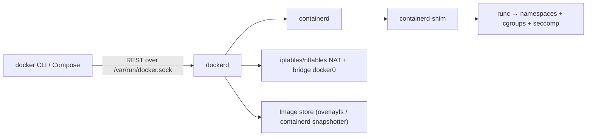

# Docker

> [!abstract] TL;DR
> Docker packages an app and its dependencies into an **image** (layered, content-addressed, OCI-standard) and runs it as an isolated **container** (Linux namespaces + cgroups, sharing the host kernel). It's the deployment unit under [[Coolify]], [[Kubernetes]], CI and most PaaS. Master **Dockerfile layering, multi-stage builds, networking/volumes and Compose**. The big risks are **image bloat, root containers, the Docker socket and Docker bypassing your host firewall**.

## Introduction
- Released by dotCloud (Solomon Hykes) in Mar 2013. Docker Inc. now sells Desktop/Hub/Scout/Build Cloud. The engine core (Moby) is Apache-2.0, and runtime pieces were donated to CNCF/OCI (containerd, runc).
- **OCI** standards (image spec, runtime spec, distribution spec) mean images built with Docker run on containerd, Podman, CRI-O and Kubernetes.
- It solves "works on my machine": reproducible builds, immutable artifacts, dense multi-app hosting on one VPS.
- Where it sits: dev environments, CI builds, single-host production via Compose/[[Coolify]], and the image format for [[Kubernetes]].

## Core Concepts

| Concept | Meaning |
|---|---|
| **Image** | Read-only stack of layers + config (entrypoint, env, user), addressed by digest `sha256:…` |
| **Container** | Running instance: image layers + thin writable layer + namespaces + cgroups |
| **Registry** | Image store (Docker Hub, GHCR, ECR, self-hosted `registry:2`) |
| **Tag vs digest** | `node:24-alpine` is mutable. `node@sha256:…` is immutable, so pin digests for reproducibility |
| **Volume** | Docker-managed persistent storage (`/var/lib/docker/volumes`) |
| **Bind mount** | Host path mapped into the container |
| **Network** | `bridge` (default), user-defined bridge (DNS by service name), `host`, `none`, `overlay` (Swarm) |
| **Compose** | Declarative multi-container app (`compose.yaml`), run by `docker compose` |
| **BuildKit / buildx** | Modern builder: parallel stages, cache mounts, secrets, multi-platform (`linux/amd64,linux/arm64`) |

### Dockerfile (multi-stage, production-grade)
```dockerfile
# syntax=docker/dockerfile:1.7
FROM node:24-alpine AS deps
WORKDIR /app
COPY package.json pnpm-lock.yaml ./
RUN --mount=type=cache,target=/root/.local/share/pnpm corepack enable && pnpm install --frozen-lockfile

FROM deps AS build
COPY . .
RUN pnpm build && pnpm prune --prod

FROM node:24-alpine AS runtime
ENV NODE_ENV=production
WORKDIR /app
COPY --from=build --chown=node:node /app/dist ./dist
COPY --from=build --chown=node:node /app/node_modules ./node_modules
USER node
EXPOSE 3000
HEALTHCHECK --interval=30s --timeout=3s CMD wget -qO- http://127.0.0.1:3000/health || exit 1
CMD ["node", "dist/server.js"]
```
- **Layer caching**: copy lockfiles → install → copy source. Any change invalidates every layer after it.
- Use **exec form** `CMD ["node", "x.js"]` so the process is PID 1 and receives `SIGTERM`. Shell form wraps it in `sh -c`, which swallows signals. Add `init: true` (tini) if the app spawns children.
- Add a `.dockerignore` (`node_modules`, `.git`, `.env*`, `dist`) to keep the context small and secrets out.

### Compose
```yaml
# compose.yaml — no "version:" key (obsolete)
services:
  api:
    image: ghcr.io/rarticle/api:1.4.2
    env_file: .env
    depends_on:
      db: { condition: service_healthy }
    networks: [internal, proxy]
    deploy: { resources: { limits: { memory: 512m, cpus: "1.0" } } }
    restart: unless-stopped
  db:
    image: postgres:18
    volumes: [pgdata:/var/lib/postgresql/data]
    healthcheck: { test: ["CMD-SHELL", "pg_isready -U postgres"], interval: 5s, retries: 10 }
    networks: [internal]          # no "ports:" → not reachable from the host network
volumes: { pgdata: {} }
networks:
  internal: {}
  proxy: { external: true }       # shared with Traefik
```

## Architecture / How It Works



- **Isolation** = kernel features, not a VM:
  - Namespaces: pid, net, mnt, uts, ipc, user, cgroup.
  - **cgroups v2**: CPU/memory/pids limits.
  - Capabilities dropped by default, a seccomp profile, AppArmor/SELinux.
  - The kernel is **shared**, so a kernel or runc bug means a container escape.
- **Storage**: overlayfs stacks read-only image layers under a writable upper dir. Since Engine 29, new installs default to the **containerd image store** (multi-platform images, attestations).
- **Networking**: user-defined bridges give embedded DNS (`db:5432`). Published ports (`-p 80:80`) are implemented with iptables DNAT rules **ahead of host firewall rules (UFW)**.
- **Rootless mode** runs the daemon as an unprivileged user (some networking/perf limits). **userns-remap** maps container root to an unprivileged host UID.

## Project Structure
```text
service/
├── Dockerfile
├── .dockerignore
├── compose.yaml            # local dev / single-host prod
├── compose.override.yaml   # dev-only: bind mounts, hot reload, exposed ports
├── .env.example            # documented, no secrets
└── docker/
    └── entrypoint.sh       # optional: migrations then exec "$@"
```

## Use Cases
| Use case | Why it fits |
|---|---|
| Single-VPS production (Hostinger KVM + [[Coolify]]) | Many isolated apps per host, easy rollback by tag |
| Reproducible CI builds ([[CI-CD]]) | Same image tested and deployed. Cache layers in the registry |
| Local dev parity | `compose up` brings Postgres/Redis/n8n identical to prod |
| Self-hosting OSS ([[n8n]], Chatwoot, Supabase, Grafana) | Vendors ship official images + Compose files |
| Image format for [[Kubernetes]] | OCI images run unchanged on K8s/containerd |

## Pros & Cons
| Pros | Cons |
|---|---|
| Ubiquitous: every tool/vendor supports OCI images | Shared kernel means weaker isolation than VMs (gVisor/Kata/Firecracker for hostile workloads) |
| Fast startup, dense packing, immutable deploys | Docker socket access = root on the host |
| Compose is a simple multi-service model for one host | Compose has no multi-host scheduling or self-healing across nodes |
| Huge image ecosystem | Public images carry CVEs and supply-chain risk |
| BuildKit caching and multi-arch builds | Docker Desktop licensing for larger companies. Hub rate limits |

## Alternatives & Peers
| Alternative | Strength vs Docker | Weakness vs Docker | Pick it when… |
|---|---|---|---|
| Podman | Daemonless, rootless by default, Docker-CLI compatible | Compose support via `podman compose` is less polished | Security-sensitive hosts, RHEL |
| containerd + nerdctl | Leaner, what K8s actually uses | Fewer conveniences | Minimal hosts, K8s nodes |
| [[Kubernetes]] | Multi-node scheduling, self-healing, autoscaling | Operational complexity for a solo dev | Many nodes / teams / HA requirements |
| Firecracker / Kata | VM-level isolation with container UX | More overhead, setup | Running untrusted code (AI agent sandboxes) |
| Nix / plain systemd | No container layer, reproducible via Nix | Less portable to PaaS | Single-purpose servers |

## Tips & Reminders
> [!tip] Image hygiene
> - Use slim bases (`-alpine`, `-slim`, distroless) and pin major+minor tags, or digests for prod.
> - Run as non-root (`USER node`), add `--read-only` + `tmpfs` where possible, use `cap_drop: [ALL]`, `security_opt: [no-new-privileges:true]`.
> - Never `COPY .env` or bake secrets into layers. Use BuildKit `--secret` at build time and env/secrets at runtime. `docker history` exposes `ARG`/`ENV` values.
> - Scan images: `docker scout cves`, Trivy, Grype. Rebuild weekly to pick up base-image patches.

> [!tip] Operations
> - Set log rotation in `/etc/docker/daemon.json`: `{"log-driver":"json-file","log-opts":{"max-size":"10m","max-file":"3"}}`. Unrotated logs are the #1 "disk full" cause on small VPSes.
> - Prune on a schedule: `docker system prune -af --filter "until=168h"` (never with `--volumes` on prod).
> - Set memory limits on every service so one leak doesn't OOM-kill the whole host.

> [!tip] In ZP's stack
> - **UFW doesn't protect published ports.** Bind internal services to `127.0.0.1:5432:5432` or don't publish them at all, and let [[Traefik]] route via the Docker network. Alternatively use the `ufw-docker` rules or the `DOCKER-USER` chain.
> - [[Coolify]] and [[Traefik]] both mount `/var/run/docker.sock`. Treat both dashboards as root access to the server.
> - Pin the Engine version with apt (`apt-mark hold docker-ce`) and upgrade deliberately (see the Engine 29 note below).

## Versions & Breaking Changes
| Version | Released | Key changes | Breaking / migration notes |
|---|---|---|---|
| Compose v2 | 2022-04 GA | `docker compose` plugin (Go) | `docker-compose` v1 (Python) EOL 2023-06. `version:` key obsolete |
| Engine 23–25 | 2023–2024 | BuildKit default builder, cgroup v2 maturity | Legacy builder deprecated |
| Engine 28 | 2025-02 | Firewall/iptables hardening, GPU/CDI improvements | Stricter default networking rules can break hacks relying on cross-bridge access |
| Engine 29 | 2025-11 | containerd image store default for new installs, nftables work | **Min API version raised (1.44)**: old clients, including Traefik < 3.6.1's Docker provider, broke. Upgrade clients before the Engine |
| Engine 29.3.1 | 2026-04 | Fix for CVE-2026-34040 | Upgrade if you use authorization plugins |

> [!warning] Unverified — check before relying on this
> Exact Engine 28/29 release months, current 29.x patch and Docker Hub rate-limit numbers weren't verified this run. Check https://docs.docker.com/engine/release-notes/.

## Critical Issues & Gotchas
> [!danger] runc container escapes (Nov 2025)
> **CVE-2025-31133, CVE-2025-52565, CVE-2025-52881**: races around `/dev/null` masking and `/proc` writes let a malicious image or Dockerfile escape to host root. Fixed in runc 1.2.8 / 1.3.3 / 1.4.0-rc.3. Earlier: CVE-2024-21626 "Leaky Vessels" (Jan 2024, fd leak → host filesystem). Keep containerd/runc patched, and don't run untrusted images on hosts with secrets.

> [!danger] CVE-2026-34040 — Engine authorization plugin bypass (Apr 2026)
> Crafted API requests bypassed AuthZ plugins, enabling privileged operations and host compromise. Fixed in **Engine 29.3.1**.

> [!danger] CVE-2025-9074 — Docker Desktop (CVSS 9.3, Aug 2025)
> Any container could reach the Docker Engine API on the internal subnet without the socket mounted, which means host takeover on Windows/macOS dev machines. Fixed in Desktop 4.44.3. Keep Desktop updated, because dev laptops hold client credentials.

> [!danger] Docker socket = root
> Mounting `/var/run/docker.sock` (Traefik, Coolify, Portainer, Watchtower) gives that container full control of the host. Use a read-only socket proxy (`tecnativa/docker-socket-proxy`) for components that only need to read.

> [!warning] Footguns
> - `docker compose down -v` deletes named volumes, including your database.
> - `latest` tags + `pull_policy: always` → surprise major upgrades (e.g. `postgres:latest` jumping a major refuses to start on old data).
> - Exposed Docker API (`tcp://0.0.0.0:2375`) without TLS gets crypto-mining bots within minutes.
> - Alpine/musl differences break some native modules (sharp, Prisma engines, Python wheels). Use `-slim` (glibc) when in doubt.
> - Timezone: containers default to UTC. Set `TZ=Asia/Kuching` only for display-time services, and keep DBs in UTC.

## Deep Dives
- (planned) [[Docker - Dockerfile & Image Best Practices]]
- (planned) [[Docker - Networking & Volumes]]

## Related
- [[Coolify]] — PaaS layer on top of Docker in ZP's stack
- [[Traefik]] — reverse proxy reading Docker labels
- [[Kubernetes]] — multi-node orchestration for OCI images
- [[Linux Essentials]] — namespaces, cgroups, iptables
- [[CI-CD]] — build/push pipelines
- [[PostgreSQL]] · [[Redis]] · [[n8n]] — typical containerized services

## References
- Docs: https://docs.docker.com/
- Engine release notes: https://docs.docker.com/engine/release-notes/
- Dockerfile best practices: https://docs.docker.com/build/building/best-practices/
- runc CVEs (Sysdig): https://www.sysdig.com/blog/runc-container-escape-vulnerabilities
- Docker and UFW: https://docs.docker.com/engine/network/packet-filtering-firewalls/
