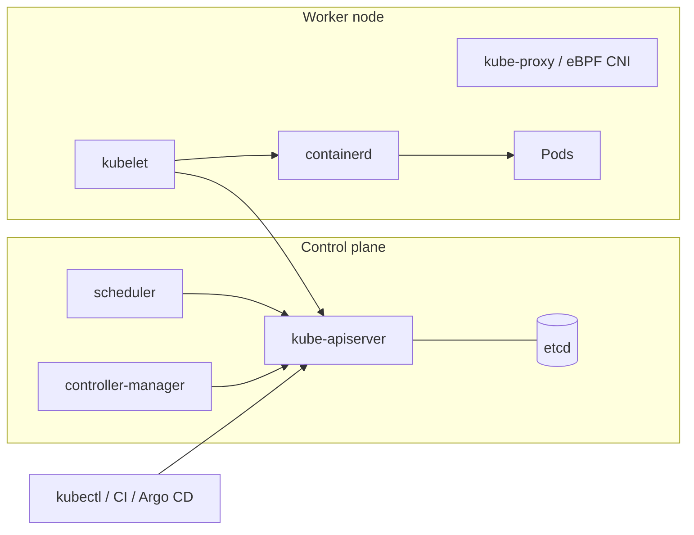

# Kubernetes

> [!abstract] TL;DR
> Kubernetes is a **declarative container orchestrator**. You describe the desired state (Deployments, Services, …) in YAML, and controllers continuously reconcile the cluster towards it: scheduling, self-healing, rolling updates, service discovery and autoscaling across many nodes.
> - **When it pays off**: many services, a team, multi-node HA, or a platform you sell.
> - **When it doesn't**: for a solo founder with a few apps, it's usually **overkill** next to [[Coolify]] or [[Docker]] Compose.
> - **2026 must-knows**: Ingress NGINX is **retired** (no fixes after March 2026), so migrate to **Gateway API**. cgroup v1 is gone. Minors release every ~4 months with ~14 months of support.

## Introduction
- **Origin**: Google open-sourced it in 2014, inspired by Borg/Omega. It's a CNCF graduated project with ~3 minor releases per year.
- **Problem**: running containers across a fleet of machines, with placement, restarts, networking, config/secrets, rollouts and scaling, without hand-written scripts per server.
- **Where it sits**: the substrate under managed platforms (GKE, EKS, AKS, DigitalOcean, Linode), internal developer platforms, and most CNCF tooling (Argo CD, Prometheus, cert-manager). Lightweight distributions (**k3s**, k0s, MicroK8s, Talos) bring it to single VPS / edge.

## Core Concepts

### Objects you use daily
| Object | Purpose |
|---|---|
| **Pod** | Smallest unit: 1+ containers sharing network namespace and volumes. Ephemeral |
| **Deployment** → ReplicaSet | Stateless apps: replicas, rolling updates, rollback |
| **StatefulSet** | Stable identity + per-pod volumes (databases, Kafka, Redis) |
| **DaemonSet** | One pod per node (log shippers, CNI, node exporters) |
| **Job / CronJob** | Run-to-completion / scheduled tasks (migrations, backups) |
| **Service** | Stable virtual IP + DNS for a set of pods (`ClusterIP`, `NodePort`, `LoadBalancer`) |
| **Ingress / Gateway API** | HTTP(S) routing from outside. **Gateway API** (`Gateway`, `HTTPRoute`) is the successor |
| **ConfigMap / Secret** | Config and credentials (Secrets are only base64 by default. Enable encryption at rest) |
| **PersistentVolumeClaim** | Storage request bound to a StorageClass |
| **Namespace** | Scope for names, RBAC, quotas, network policies |
| **HPA / VPA** | Horizontal/vertical autoscaling on CPU/memory/custom metrics |

### Minimal app
```yaml
apiVersion: apps/v1
kind: Deployment
metadata: { name: api, namespace: shop }
spec:
  replicas: 2
  selector: { matchLabels: { app: api } }
  template:
    metadata: { labels: { app: api } }
    spec:
      containers:
        - name: api
          image: ghcr.io/rarticle/api:1.4.0          # immutable tag, never :latest
          ports: [{ containerPort: 3000 }]
          envFrom: [{ secretRef: { name: api-env } }]
          resources:
            requests: { cpu: 100m, memory: 256Mi }
            limits:   { memory: 512Mi }               # CPU limits often omitted to avoid throttling
          readinessProbe: { httpGet: { path: /healthz, port: 3000 }, periodSeconds: 5 }
          livenessProbe:  { httpGet: { path: /livez, port: 3000 }, initialDelaySeconds: 10 }
          securityContext: { runAsNonRoot: true, allowPrivilegeEscalation: false, readOnlyRootFilesystem: true }
---
apiVersion: v1
kind: Service
metadata: { name: api, namespace: shop }
spec: { selector: { app: api }, ports: [{ port: 80, targetPort: 3000 }] }
---
apiVersion: gateway.networking.k8s.io/v1
kind: HTTPRoute
metadata: { name: api, namespace: shop }
spec:
  parentRefs: [{ name: public-gw, namespace: infra }]
  hostnames: ["api.example.my"]
  rules: [{ backendRefs: [{ name: api, port: 80 }] }]
```

### kubectl essentials
```bash
kubectl get pods -n shop -o wide
kubectl describe pod api-7d9c -n shop          # events: scheduling, probe failures, OOMKilled
kubectl logs deploy/api -n shop -f --since=10m
kubectl rollout status deploy/api -n shop && kubectl rollout undo deploy/api -n shop
kubectl exec -it deploy/api -n shop -- sh
kubectl debug -it pod/api-7d9c --image=busybox --target=api   # ephemeral debug container
kubectl apply -k overlays/prod                 # kustomize
```

## Architecture / How It Works

- **API server** is the only component that talks to **etcd** (the strongly consistent key-value store of all state). Everything else watches the API.
- **Reconciliation loops**: controllers compare desired vs actual state and act (the ReplicaSet controller creates missing pods, for example). That's why Kubernetes is "level-triggered" and self-healing.
- **Scheduler** places pods on nodes by resource **requests**, affinity/anti-affinity, taints/tolerations and topology spread.
- **kubelet** on each node runs pods via the CRI (containerd/CRI-O; dockershim was removed in 1.24), executes probes, and reports status.
- **Networking**: every pod gets an IP, and pods reach each other without NAT (the CNI provides this: Cilium, Calico, Flannel). Services are implemented by kube-proxy (iptables/IPVS/nftables) or eBPF (Cilium). CoreDNS resolves `svc.namespace.svc.cluster.local`.
- **Rolling update**: a new ReplicaSet scales up while the old one scales down, gated by **readiness probes** (`maxSurge`, `maxUnavailable`). Pods get `SIGTERM` and then `terminationGracePeriodSeconds` (30 s) before `SIGKILL`.

## Project Structure
```text
deploy/
├── base/                       # kustomize base
│   ├── deployment.yaml
│   ├── service.yaml
│   ├── httproute.yaml
│   └── kustomization.yaml
├── overlays/
│   ├── staging/kustomization.yaml   # replicas, image tag, hostnames
│   └── prod/kustomization.yaml
└── charts/                     # or a Helm chart: Chart.yaml, values.yaml, templates/
```
- **GitOps**: Argo CD or Flux syncs `deploy/` from Git to the cluster, and CI only bumps image tags. That gives audit trail and drift correction.
- Secrets: External Secrets Operator (from a vault), Sealed Secrets, or SOPS. Never commit plain `Secret` YAML.

## Use Cases
| Use case | Why it fits |
|---|---|
| Many microservices with a platform team | Standard API, RBAC, namespaces, autoscaling |
| Multi-node HA for critical workloads | Self-healing, pod anti-affinity, rolling updates |
| SaaS with per-tenant environments | Namespaces + quotas + GitOps templates |
| Batch / ML jobs | Jobs, queues (Kueue), GPU scheduling (DRA) |
| Hybrid / multi-cloud portability | Same manifests on GKE, EKS, k3s on bare metal |
| Solo founder, 3–10 small apps on one VPS | **Poor fit**. [[Coolify]] / Compose gives 90% of the value at 10% of the ops |

## Pros & Cons
| Pros | Cons |
|---|---|
| Declarative, self-healing, rolling updates built in | Steep learning curve, YAML sprawl |
| Huge ecosystem (Helm, Argo CD, cert-manager, Prometheus) | Operating a control plane (etcd backups, upgrades every ~4 months) is real work |
| Portable across clouds and bare metal | Managed control planes cost money (EKS ~USD 73/month per cluster) |
| Horizontal scaling and bin packing | Resource overhead: control plane + system pods eat RAM on small VPS |
| Strong multi-tenancy primitives (RBAC, NetworkPolicy, quotas) | Insecure defaults (flat network, broad service accounts) need hardening |
| Industry standard: hiring, docs, tooling | Debugging spans many layers (CNI, DNS, kube-proxy, CRI) |

## Alternatives & Peers
| Alternative | Strength vs Kubernetes | Weakness vs Kubernetes | Pick it when… |
|---|---|---|---|
| [[Coolify]] | Simple UI, git push deploys, one VPS, Traefik built in | Single-node focus, limited HA, younger security record | Solo/small team, SME client apps |
| [[Docker]] Compose (+ Swarm) | Minimal concepts, fast | No real scheduler/HA (Swarm is in maintenance) | One host, few services |
| HashiCorp Nomad | Simpler, runs non-container workloads | BSL license (2023), smaller ecosystem | Mixed workloads, HashiCorp shops |
| Managed PaaS (Fly.io, Render, Railway, Cloud Run) | Zero cluster ops | Vendor lock-in, cost at scale | Product teams without ops capacity |
| k3s (a lightweight K8s distribution) | Single binary, ~512 MB RAM, built-in Traefik | Still Kubernetes complexity | You need K8s APIs on small VPS/edge |

## Tips & Reminders
> [!tip]
> - Always set **requests** (the scheduler needs them) and a **memory limit**. Without requests, nodes get overcommitted and pods are evicted randomly.
> - Readiness ≠ liveness. Liveness failures restart the container, so never make liveness depend on downstream DBs (that causes cascading restarts).
> - Use `PodDisruptionBudget` + ≥2 replicas + topology spread for anything customer-facing. Otherwise node upgrades cause downtime.
> - Default-deny `NetworkPolicy` per namespace, then allow explicitly. Disable `automountServiceAccountToken` unless needed.
> - Upgrade one minor at a time (1.35 → 1.36). Run `kubectl convert` / Pluto to find removed APIs first.
> - **In ZP's stack**: stay on [[Coolify]] + [[Traefik]] on Hostinger KVM until a client needs multi-node HA or you run > ~15 services. If that day comes, start with **k3s** (3 nodes for HA etcd), Gateway API via Traefik or Envoy Gateway, cert-manager + [[Cloudflare]] DNS-01, and Argo CD. Keep stateful services ([[PostgreSQL]], [[Redis]]) managed or on dedicated VMs, not in-cluster.

## Versions & Breaking Changes
| Version | Released | Key changes | Breaking / migration notes |
|---|---|---|---|
| 1.24 | 2022-05 | dockershim removed | Use containerd/CRI-O |
| 1.25 | 2022-08 | PodSecurityPolicy removed → Pod Security Admission | Migrate PSP policies |
| 1.29–1.32 | 2023-12 → 2024-12 | Sidecar containers (beta → GA 1.33), nftables kube-proxy, DRA progress | — |
| 1.33 | 2025-04 | Sidecars GA, in-place pod resize beta, `Endpoints` API deprecated | Move tools to EndpointSlices |
| 1.34 | 2025-08 | Dynamic Resource Allocation (DRA) GA | — |
| 1.35 | 2025-12 | In-place pod resize GA. **cgroup v1 support removed** (kubelet fails on cgroup v1 nodes). Last release supporting containerd 1.x | Upgrade node OS to cgroup v2 and containerd 2.x first. EOL 2027-02 |
| **1.36** | 2026-04 | Current stable line (1.36.x patches through 2026) | Check the release notes for removed beta APIs |

> [!warning] Unverified — check before relying on this
> A newer minor may have shipped since mid-2026. Check https://kubernetes.io/releases/ for the current minor and EOL dates.

## Critical Issues & Gotchas
> [!danger] Ingress NGINX retired (March 2026)
> The community `kubernetes/ingress-nginx` controller stopped receiving releases and **security fixes** in March 2026, after the **IngressNightmare** CVEs (CVE-2025-1974, CVSS 9.8: unauthenticated RCE via the admission webhook leading to cluster-wide secret access). Existing installs keep running but are unpatched. Migrate to **Gateway API** (Envoy Gateway, Traefik, Cilium, NGINX Gateway Fabric) or a maintained Ingress controller. F5's `nginxinc/kubernetes-ingress` is a different, still-maintained project.

> [!danger] etcd is your whole cluster
> Losing etcd without a backup means losing every object definition. Take scheduled `etcdctl snapshot save` backups (managed control planes do this for you), test restores, and keep etcd on fast SSDs. Disk latency causes leader elections and API timeouts.

> [!danger] Bitnami image/chart catalog changes (2025)
> Broadcom moved most free Bitnami container images to a frozen "legacy" repository in 2025, with maintained images behind a paid subscription. Helm charts pinned to `docker.io/bitnami/*` stopped receiving updates or broke on pull. Mirror the images you depend on and pin digests. Prefer official upstream images/charts.

> [!warning] Gotchas
> - `latest` tags + `imagePullPolicy: IfNotPresent` → different nodes run different code.
> - Secrets are base64, not encrypted. Anyone with `get secrets` in the namespace (or etcd access) reads them.
> - CPU limits cause CFS throttling and latency spikes even on idle nodes. Many teams set requests only.
> - OOMKilled pods (exit 137) mean the memory limit is too low **or** the runtime ignores the cgroup (set Node's `--max-old-space-size`, the JVM's `-XX:MaxRAMPercentage`).
> - DNS: the `ndots:5` default makes external lookups try 5 search domains first. Use FQDNs with a trailing dot or lower `ndots` for chatty clients.
> - Deleting a namespace deletes **everything** inside it, including PVCs. Protect production with RBAC and admission policies.

## Deep Dives
- (planned) [[Kubernetes - Core Objects]]

## Related
- [[Docker]] — images and container runtime basics
- [[Coolify]] — simpler self-hosted alternative in ZP's stack
- [[Traefik]] · [[Nginx]] — ingress / Gateway API implementations
- [[CI-CD]] — build, push, GitOps deploy
- [[Linux Essentials]] — cgroups, namespaces, networking underneath
- [[Go]] — the language Kubernetes is written in

## References
- Official docs: https://kubernetes.io/docs/
- Releases and support windows: https://kubernetes.io/releases/
- Ingress NGINX retirement: https://kubernetes.io/blog/2025/11/11/ingress-nginx-retirement/
- Steering/SRC statement (2026-01): https://kubernetes.io/blog/2026/01/29/ingress-nginx-statement/
- Gateway API: https://gateway-api.sigs.k8s.io/
- k3s: https://docs.k3s.io/
- Production best practices: https://kubernetes.io/docs/setup/production-environment/
