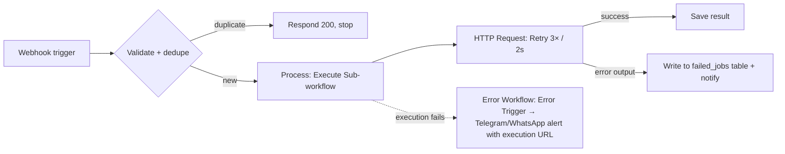

# n8n - Error Handling & Workflow Patterns

> [!info] Deep dive of [[n8n]]

> [!abstract] TL;DR
> Production n8n workflows fail in predictable ways: API errors and rate limits, bad input, duplicates from retried webhooks, timeouts and partial runs. The toolbox:
> - per-node **Retry On Fail** and **On Error** settings (stop / continue / continue with error output),
> - a global **Error Workflow** for alerting,
> - **Stop and Error** for business-rule failures,
> - **idempotency keys**, **sub-workflows** with typed inputs, and **batching**.
>
> Remember: **design every workflow to be safely re-runnable**, because webhooks will be delivered twice and you will need to replay failed executions.

## Concept
| Mechanism | Scope | Use |
|---|---|---|
| **Retry On Fail** (node setting) | One node | Transient errors (5xx, timeouts, 429): max tries + wait between tries |
| **On Error → Stop Workflow** (default) | One node | Fail fast, triggers the Error Workflow |
| **On Error → Continue** | One node | Ignore a non-critical failure (e.g. optional enrichment) |
| **On Error → Continue (using error output)** | One node | Route failed items to a separate branch (dead-letter, fallback) |
| **Error Workflow** (workflow setting) | Whole workflow | Alerting/logging when an execution fails (Error Trigger node) |
| **Stop and Error** node | Explicit | Fail on business-rule violations with a clear message |
| **Execution retry** (UI / API) | Execution | Replay failed executions from the failed node (with the original or current workflow version) |
| **Wait** node | Flow control | Delays, rate limiting, human approval via resume webhook/form |

## How It Works



- **Error propagation**: a failed node (without Continue) stops the execution, marks it as error, and fires the Error Workflow configured in **Workflow Settings → Error workflow**. The Error Trigger receives `execution.id`, `execution.url`, `execution.error.message`, `workflow.name` and `lastNodeExecuted`.
- **Sub-workflow errors** bubble up to the parent's Execute Workflow node, which can have its own On Error setting.
- **Items are processed per node, not per item end-to-end**: if item 37 of 100 fails in node 3 with Stop, nodes 4+ never run for **any** item. Use error outputs or per-item sub-workflows when partial success matters.
- **Retries replay side effects**: a retry from the failed node re-runs that node and everything after it. Upstream nodes keep their stored output (only if execution data was saved).

## Practical Usage

### Global error workflow (one per instance or per client)
```text
Error Trigger
 → Set: { workflow: {{$json.workflow.name}}, node: {{$json.execution.lastNodeExecuted}},
          error: {{$json.execution.error.message}}, url: {{$json.execution.url}} }
 → IF: severity rules (e.g., ignore known transient errors after N occurrences)
 → Telegram / WhatsApp / Email alert
 → Postgres: INSERT INTO n8n_failures (...)   # audit trail for SLA reporting
```

### Idempotent webhook intake
```js
// Code node after Webhook — dedupe on provider event id (Redis or Postgres)
const id = $json.body?.entry?.[0]?.changes?.[0]?.value?.messages?.[0]?.id;
if (!id) throw new Error("Missing message id");          // → Stop and Error semantics
return [{ json: { ...$json, dedupe_key: `wa:${id}` } }];
```
Then **Redis node**: `SET dedupe_key 1 NX EX 86400`. Or **Postgres**: `INSERT … ON CONFLICT DO NOTHING RETURNING id`. If nothing is returned → duplicate → respond 200 and stop.

### HTTP Request resilience settings
| Setting | Recommended |
|---|---|
| Retry On Fail | On. 3–5 tries, 1–5 s wait (exponential via a Wait node loop if needed) |
| Timeout | Explicit (e.g. 15–30 s). Never unlimited |
| On Error | Continue (using error output) for per-item failures, Stop for critical ones |
| Batching (node options) | Items per batch + interval to respect rate limits (e.g. 10 per 1 s) |
| Response | "Include response headers and status" to branch on 4xx vs 5xx |

### Sub-workflow as a function
```text
Parent:  … → Execute Workflow (mode: each item / once, wait: true) → …
Child:   Execute Workflow Trigger (input schema: order_id: string, tenant_id: string)
         → logic → Return (last node output)
```
- Typed inputs document the contract and validate callers. Keep sub-workflows small (one responsibility), so they're reusable across clients' flows and testable on their own.

### Business-rule failure
```text
IF amount > credit_limit → Stop and Error: "Order {{$json.id}} exceeds credit limit for {{$json.customer}}"
```

### Human-in-the-loop with Wait
```text
… → Send approval request (WhatsApp/Email with {{$execution.resumeUrl}}) → Wait (On Webhook Call, timeout 24h)
  → IF approved → continue / else → notify and stop
```

## Patterns & Anti-patterns
| Pattern | When | Anti-pattern to avoid |
|---|---|---|
| Error Workflow on every production workflow | Always | Discovering failures from angry clients |
| Error output branch → dead-letter table + replay workflow | Per-item failures in batches | `Continue` everywhere, silently dropping failed items |
| Idempotency key per external event | Webhooks, payments, messaging | Assuming exactly-once delivery |
| Validate input first (IF/Code + Stop and Error) | Any external trigger | Letting bad data fail deep inside the workflow |
| Sub-workflows with typed inputs | Shared logic | 80-node monolith workflows |
| Batching + Wait for rate limits | Bulk API calls | Firing 5,000 parallel requests → 429/ban |
| Store config in one place (Set node, DB table, env via credentials) | Multi-client templates | Hard-coded IDs/URLs scattered across nodes |
| Version workflows in git (export JSON / source control) | Teams, client handover | Editing production directly with no history |

## Performance & Trade-offs
- Retries add latency and can amplify load on struggling APIs. Cap tries and use backoff.
- Saving execution data for every run helps debugging but bloats the DB. Keep failures, sample successes.
- Per-item sub-workflow calls isolate failures but multiply executions (and DB writes). Use them for critical side effects only.
- Wait nodes with long timeouts keep executions "waiting" in the DB. Fine at moderate volume, but clean up abandoned ones.

## Tips & Reminders
> [!tip]
> - Name nodes descriptively (`HTTP · Create HubSpot contact`), because error alerts show node names.
> - Include `execution.url` in every alert, which gets you one-click debugging.
> - Pin test data (`Pin data`) while building, and unpin it before publishing.
> - Set a workflow **timeout** (Workflow Settings) so hung executions don't run forever.
> - **In ZP's stack**: per client, one Error Workflow → your ops Telegram + a `n8n_failures` table in [[PostgreSQL]]. That table doubles as SLA evidence in monthly reports. WhatsApp inbound: dedupe by message ID in [[Redis]], respond 200 immediately, then process.

## Version Notes
| Version | Change |
|---|---|
| 1.0 (2023) | New execution order (per-branch depth-first). Error output on nodes |
| 1.x (2024–25) | Execute Workflow Trigger input schemas, improved retry from failed node, workflow history |
| 2.0 (2025-12) | Save vs **Publish** split: retries and production use the published version. Plan replays accordingly |

> [!warning] Unverified — check before relying on this
> The exact option names in node "Settings" panels change between versions. Verify in your instance.

## Critical Issues & Gotchas
> [!danger] Duplicate side effects on retry/replay
> Replaying a failed execution re-runs nodes after the failure point. Without idempotency (dedupe keys, upserts, provider idempotency headers), you send duplicate WhatsApp messages, double-charge, or create duplicate CRM records. Make every external write idempotent.

> [!warning] Gotchas
> - `Continue` on error passes the **error item** downstream, so later nodes may process `{ error: … }` objects as data.
> - The Error Workflow doesn't fire for executions you stop manually, or for errors inside the Error Workflow itself. Keep it simple and test it.
> - Expressions referencing `$('Node')` fail when that node didn't run on a branch ("Node hasn't been executed"). Guard with `$('Node').isExecuted`.
> - Webhook test URLs (`/webhook-test/`) differ from production URLs. Clients configured with test URLs break when the editor tab closes.
> - Rate-limit 429s with `Retry-After`: the default retry wait may ignore it. Read the header and Wait accordingly.

## Related
- [[n8n]]
- [[n8n - Queue Mode & Scaling]] — runtime behind retries and executions
- [[REST API]] — idempotency keys, status codes
- [[Redis - Data Structures & Patterns]] — dedupe and rate limiting
- [[AI Agents]] — workflow vs agent design

## References
- Error handling: https://docs.n8n.io/flow-logic/error-handling/
- Error Trigger node: https://docs.n8n.io/integrations/builtin/core-nodes/n8n-nodes-base.errortrigger/
- Sub-workflows: https://docs.n8n.io/flow-logic/subworkflows/
- Wait node: https://docs.n8n.io/integrations/builtin/core-nodes/n8n-nodes-base.wait/
