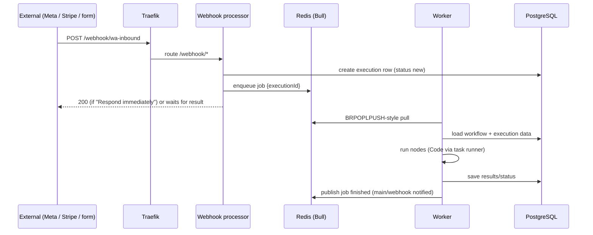

# n8n - Queue Mode & Scaling

> [!info] Deep dive of [[n8n]]

> [!abstract] TL;DR
> In **queue mode** (`EXECUTIONS_MODE=queue`) n8n splits into roles:
> - the **main** process handles the editor/API, triggers and schedules,
> - optional **webhook processors** receive production webhooks,
> - **workers** execute workflows.
>
> They coordinate via a **Redis (Bull) queue** and share state in **PostgreSQL**. Scale by adding workers and tuning `--concurrency`. Every process shares the same `N8N_ENCRYPTION_KEY`, DB and Redis. Binary data must go to the **database or S3**, not the local filesystem. Remember: **n8n's bottleneck is usually the database (execution data) and per-execution memory, not CPU.** Prune executions and keep payloads small before adding workers.

## Concept
| Role | Command | Responsibilities | Scale |
|---|---|---|---|
| **Main** | `n8n start` | UI, REST API, schedules/polling triggers, workflow activation, enqueueing | 1 (multi-main HA is an Enterprise feature) |
| **Webhook processor** | `n8n webhook` | Receive `/webhook/*` calls, enqueue executions | N behind a load balancer |
| **Worker** | `n8n worker --concurrency=10` | Pull jobs, run workflows, write results to DB | N (horizontal) |
| **Task runner** | `n8nio/runners` (external mode) | Execute Code node JS/Python in isolation | Sidecar per worker/main |
| **Redis** | — | Bull queue (job IDs), pub/sub between instances | 1 (persistent, `noeviction`) |
| **PostgreSQL** | — | Workflows, credentials, executions, binary data (db mode) | 1 primary (+ backups) |

## How It Works



- **Job payload** is just the execution ID. Workers load everything from Postgres, so the DB load scales with execution count and data size.
- **Webhook response modes**: "Immediately" (respond 200 at once) scales best. "When last node finishes" / "Respond to Webhook node" keeps the HTTP request open while a worker runs, which ties up connections.
- **Concurrency**: each worker runs up to `--concurrency` executions in parallel (default 10) in one Node process. Memory per execution depends on item count and binary data.
- **Manual executions** (editor test runs) run on main by default. `OFFLOAD_MANUAL_EXECUTIONS_TO_WORKERS=true` moves them to workers.
- **Binary data (2.0+)**: `database` is the default in queue mode, `filesystem` is unsupported across processes, and `s3` is available for large or high-volume files.
- **Graceful shutdown**: `N8N_GRACEFUL_SHUTDOWN_TIMEOUT` lets workers finish running jobs on deploy. Bull's stalled-job detection re-queues jobs from crashed workers.

## Practical Usage

### Compose skeleton (queue mode + external task runners)
```yaml
x-n8n: &n8n
  image: n8nio/n8n:2.41.6
  env_file: .env                      # DB_*, N8N_ENCRYPTION_KEY, QUEUE_BULL_REDIS_*, WEBHOOK_URL...
  environment:
    EXECUTIONS_MODE: queue
    N8N_RUNNERS_ENABLED: "true"
    N8N_RUNNERS_MODE: external
    OFFLOAD_MANUAL_EXECUTIONS_TO_WORKERS: "true"
    N8N_DEFAULT_BINARY_DATA_MODE: database
    QUEUE_HEALTH_CHECK_ACTIVE: "true"
  depends_on: [postgres, redis]
  restart: unless-stopped

services:
  n8n-main:    { <<: *n8n, command: start }
  n8n-webhook: { <<: *n8n, command: webhook, deploy: { replicas: 2 } }
  n8n-worker:  { <<: *n8n, command: worker --concurrency=10, deploy: { replicas: 3 } }
  n8n-runner:
    image: n8nio/runners:2.41.6       # keep in lockstep with n8n version
    environment: { N8N_RUNNERS_AUTH_TOKEN: "${N8N_RUNNERS_AUTH_TOKEN}", N8N_RUNNERS_TASK_BROKER_URI: "http://n8n-worker:5679" }
  redis:    { image: "redis:8.10", command: ["redis-server", "--appendonly", "yes", "--maxmemory-policy", "noeviction"] }
  postgres: { image: "postgres:18", volumes: ["pgdata:/var/lib/postgresql/data"] }
volumes: { pgdata: {} }
```
> [!warning] Unverified — check before relying on this
> Runner broker wiring (one runner per worker vs shared, `N8N_RUNNERS_TASK_BROKER_URI` value) differs between versions and deployment shapes. Follow the official task-runner docs for your exact version.

### Traefik routing: webhooks to processors, UI to main
```yaml
labels:
  - traefik.http.routers.n8n-webhook.rule=Host(`n8n.example.com`) && PathPrefix(`/webhook`)
  - traefik.http.routers.n8n-webhook.priority=100
  # main router: Host(`n8n.example.com`) behind Cloudflare Access (editor never public)
```

### Execution data hygiene
```bash
EXECUTIONS_DATA_PRUNE=true
EXECUTIONS_DATA_MAX_AGE=168                 # hours
EXECUTIONS_DATA_PRUNE_MAX_COUNT=50000
EXECUTIONS_DATA_SAVE_ON_SUCCESS=none        # keep errors only for high-volume workflows
EXECUTIONS_DATA_SAVE_ON_PROGRESS=false
N8N_CONCURRENCY_PRODUCTION_LIMIT=-1         # regular mode only; queue mode uses worker --concurrency
```

### Capacity planning (rule of thumb)
| Load | Setup on one KVM (8 vCPU / 16–32 GB) |
|---|---|
| < 5k executions/day, light data | Regular mode or queue mode with 1 worker |
| 5k–100k/day | Queue mode: main + 2–4 workers (concurrency 5–10) + 1–2 webhook processors |
| > 100k/day or heavy AI/binary | Separate DB host, S3 binary mode, more workers across hosts, consider splitting per client |

## Patterns & Anti-patterns
| Pattern | When | Anti-pattern to avoid |
|---|---|---|
| Respond to webhooks immediately, process async | Meta/Stripe callbacks | Holding requests open during 30 s AI workflows |
| Prune + save only failures for high-volume flows | Busy instances | Keeping every successful execution's data forever |
| Batch items (Loop Over Items, chunked HTTP) | Large datasets | 50k items in one execution → worker OOM |
| Separate instances per major client | Isolation, blast radius, billing | One shared instance with all clients' credentials |
| Pin image tags, upgrade main/workers/runners together | Version safety | Mixed versions across roles (DB migrations/protocol mismatches) |
| Redis `noeviction` + AOF | Queue durability | Sharing an evicting cache Redis with the queue |

## Performance & Trade-offs
- Throughput is often limited by **Postgres write I/O** (execution data JSON). Pruning and `SAVE_ON_SUCCESS=none` can cut DB load by an order of magnitude.
- Worker memory: Node heap per worker process. Set `NODE_OPTIONS=--max-old-space-size=4096` for data-heavy flows, and keep concurrency lower for memory-heavy workflows.
- More workers don't help if executions wait on slow external APIs with rate limits. Tune concurrency to the API limits instead.
- Webhook processors are cheap and stateless. Scale them for spiky inbound traffic.

## Tips & Reminders
> [!tip]
> - Monitor the queue: Bull waiting/active counts (Prometheus metrics via `N8N_METRICS=true` and `QUEUE_HEALTH_CHECK_ACTIVE`), worker restarts, DB size, Redis memory.
> - Back up `N8N_ENCRYPTION_KEY` + DB together. A restore needs both.
> - Upgrade path: read the release notes → staging instance → stop main → migrate DB (main runs migrations) → start workers/webhooks on the same version.
> - **In ZP's stack**: on [[Coolify]], deploy n8n as a Docker Compose resource with the roles above. [[Redis]] and [[PostgreSQL]] stay on the internal network only, and the editor sits behind Cloudflare Access with only `/webhook/*` and `/form/*` public.

## Version Notes
| Version | Change |
|---|---|
| 0.x | Queue mode introduced (Bull + Redis) |
| 1.x (2024–25) | Task runners introduced (opt-in), multi-main (Enterprise), worker health checks |
| 2.0 (2025-12) | Task runners on by default. In-memory binary mode removed. Binary defaults: `filesystem` (regular) / `database` (queue). MySQL/MariaDB dropped |
| 2.x (2026) | Weekly minors. Check release notes for queue/runner changes |

## Critical Issues & Gotchas
> [!danger] Version mismatch & encryption key mismatch
> Workers with a different `N8N_ENCRYPTION_KEY` fail to decrypt credentials ("Credentials could not be decrypted"). Workers on a different version than main can corrupt or misread execution data after migrations. Always deploy all roles from one env file and one image tag.

> [!danger] Exposed editor on a scaled instance
> Queue mode doesn't change the attack surface: the 2025–26 critical CVEs (Ni8mare unauthenticated file read, expression-escape RCEs) hit the main and webhook processes. Patch every role, and keep the editor private.

> [!warning] Gotchas
> - Filesystem binary mode in queue mode → "binary data not found" on workers. Use `database` or `s3`.
> - Webhook URLs must use `WEBHOOK_URL` (the public URL), or registered webhooks (Telegram, Meta) point to internal hostnames.
> - Schedules run on main. Multiple mains without multi-main setup = duplicate cron executions.
> - Redis restarts without persistence lose queued jobs (executions stuck in "new").
> - Task runner and n8n version drift → Code node failures after upgrades.

## Related
- [[n8n]]
- [[n8n - Error Handling & Workflow Patterns]]
- [[Redis - Persistence & High Availability]] — queue durability
- [[PostgreSQL]] — execution storage, pruning
- [[Coolify]] · [[Docker]] · [[Traefik]] — deployment

## References
- Queue mode: https://docs.n8n.io/hosting/scaling/queue-mode/
- Binary data handling: https://docs.n8n.io/deploy/host-n8n/configure-n8n/scaling/handle-binary-data
- Task runners: https://docs.n8n.io/hosting/configuration/task-runners/
- Execution data pruning: https://docs.n8n.io/hosting/scaling/execution-data/
- v2.0 breaking changes: https://docs.n8n.io/2-0-breaking-changes/
