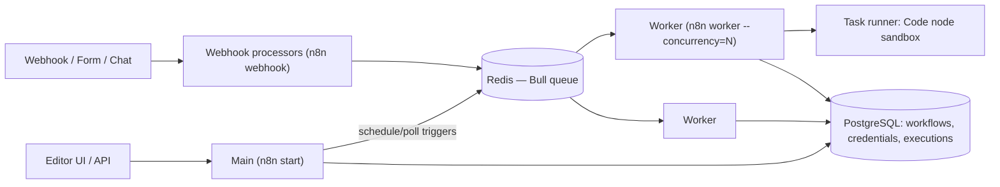

# n8n

> [!abstract] TL;DR
> n8n is a fair-code, self-hostable workflow automation platform: a visual node graph (400+ integrations, HTTP Request, Code, AI Agent nodes) with a Node.js/TypeScript engine, Postgres state and optional **queue mode** (Redis + workers) for scale. It's ZP's core delivery tool for SME automation. **n8n 2.0** (Dec 2025) hardened defaults: task runners on, env access blocked, risky nodes disabled, Save ≠ Publish. **2025–26 brought several CVSS 9.9–10 CVEs**, so patch cadence and network exposure are now operational requirements, not nice-to-haves.

## Introduction
- Founded by Jan Oberhauser (Berlin) in 2019. The **Sustainable Use License** (fair-code) allows free self-hosting for internal business use. Reselling n8n itself as a hosted service, or embedding it in a product, needs a commercial/Embed license.
- It solves glue work between SaaS apps, webhooks, databases and LLMs without writing a full backend, while still allowing code (JS/Python) when needed.
- Editions: Community (self-host, free), Business/Enterprise (SSO, Git source control, environments, external secrets, log streaming, queue-mode S3 binaries), and n8n Cloud.
- Where it sits: between front-door channels (WhatsApp Cloud API, forms, CRMs) and systems of record ([[PostgreSQL]], Google Sheets, ERPs), increasingly as an **[[AI Agents|agent]] orchestration layer** (AI Agent node built on LangChain.js, MCP client/server nodes).

## Core Concepts

| Concept | Meaning |
|---|---|
| **Workflow** | Graph of nodes. Stored as JSON. Has a *published* version (2.0+) separate from the draft |
| **Trigger node** | Starts executions: Webhook, Schedule (cron), app triggers (polling), Form, Chat, Execute Workflow Trigger |
| **Items** | Data flows as an array of items `[{ json: {...}, binary: {...} }]`. Most nodes run **once per item** |
| **Expressions** | `{{ $json.email }}`, `{{ $('Node Name').item.json.id }}`, `{{ $now.setZone('Asia/Kuching') }}`. JS in a sandbox |
| **Credentials** | Encrypted in the DB with `N8N_ENCRYPTION_KEY`. Referenced by nodes, never exported in workflow JSON |
| **Execution** | One run. Data persisted per node for debugging (prunable) |
| **Sub-workflow** | `Execute Workflow` node calls another workflow. Use it to modularize and reuse |
| **Error workflow** | Workflow triggered when another fails (Error Trigger), for alerting |
| **Code node** | JS (or Python) per item or for all items. Since 2.0 it runs in **task runners** (isolated process) |
| **AI nodes** | AI Agent, Chat Model, Memory, Tools, Vector Store, Text Classifier, Structured Output Parser, MCP |

### Item linking (the #1 confusion)
```js
// Code node — "Run Once for All Items"
return $input.all().map(item => ({
  json: { phone: item.json.wa_id.replace(/^\+/, ""), total: Number(item.json.amount) * 100 },
  pairedItem: item.pairedItem,            // keep lineage so $('Node').item works downstream
}));
```

### Execution data flow
- Node output = array of items. Branching (IF/Switch) splits items. **Merge** recombines them (append, by key, by position).
- `Loop Over Items` (Split in Batches) for rate-limited APIs. Use `Wait` nodes for throttling, delays and human-in-the-loop resumes (webhook resume URLs).

## Architecture / How It Works



- **Regular mode**: one process does UI + triggers + executions. Fine for < ~a few thousand executions/day.
- **Queue mode** (`EXECUTIONS_MODE=queue`):
  - The main process handles UI/API/triggers and enqueues job IDs in **[[Redis]]**.
  - **Workers** pull jobs and execute them, loading the workflow and data from Postgres.
  - Optional **webhook processors** scale inbound HTTP.
  - Every process must share the same `N8N_ENCRYPTION_KEY`, DB and Redis.
- **Task runners**: Code node execution moves out of the main/worker process into a runner (internal child process, or external `n8nio/runners` sidecar with `N8N_RUNNERS_MODE=external`). That gives isolation and lets heavy JS avoid blocking the engine.
- **Persistence**: Postgres (SQLite is for dev only; MySQL/MariaDB dropped in 2.0). Binary data lives in the DB/filesystem or S3 (S3 is required for multi-worker setups that share binaries across processes).

## Project Structure
```text
n8n-stack/
├── compose.yaml          # n8n-main, n8n-worker (×N), n8n-webhook, n8n-runner, postgres, redis
├── .env                  # see below — back up N8N_ENCRYPTION_KEY separately
├── workflows/            # exported JSON under git (n8n export:workflow --backup)
└── backups/              # pg_dump + credentials export (encrypted)
```
```bash
# Core env for queue mode (all n8n processes)
DB_TYPE=postgresdb
DB_POSTGRESDB_HOST=postgres
N8N_ENCRYPTION_KEY=<32+ random chars — losing it = all credentials unreadable>
EXECUTIONS_MODE=queue
QUEUE_BULL_REDIS_HOST=redis
N8N_RUNNERS_ENABLED=true
N8N_RUNNERS_MODE=external
N8N_RUNNERS_AUTH_TOKEN=<random>
EXECUTIONS_DATA_PRUNE=true
EXECUTIONS_DATA_MAX_AGE=336            # hours (14 days)
EXECUTIONS_DATA_SAVE_ON_SUCCESS=none   # keep failures, drop successes (big DB savings)
GENERIC_TIMEZONE=Asia/Kuching
WEBHOOK_URL=https://n8n.example.com/
N8N_PROXY_HOPS=1                       # behind Traefik/Cloudflare
```

## Use Cases
| Use case | Why it fits |
|---|---|
| WhatsApp Cloud API bots / CRM sync | Webhook trigger → AI Agent / Switch → Graph API HTTP calls, credentials managed |
| Lead capture → CRM → notifications | 400+ app nodes, minimal code |
| AI document processing (invoices, IC, receipts) | LLM + Structured Output Parser + Google Drive/Sheets |
| Internal ops automations for SMEs | Visual, explainable to non-devs, quick to change |
| RAG chatbots | Vector Store nodes (pgvector, Qdrant) + AI Agent + memory |
| Scheduled reports / data sync | Cron triggers, DB nodes, retries, error workflows |

## Pros & Cons
| Pros | Cons |
|---|---|
| Self-hostable, so data stays in the client's infra (PDPA story) | Fair-code license limits reselling n8n-as-a-service |
| Visual + code escape hatches (Code, HTTP Request) | Workflow JSON is hard to diff, review and test |
| Queue mode scales horizontally with Redis workers | Item/paired-item model confuses newcomers and causes subtle bugs |
| Strong AI/agent nodes, MCP support | Fast release cadence (weekly minors) with occasional regressions |
| Large community + template library | Several critical CVEs in 2025–26. Exposed instances get exploited |

## Alternatives & Peers
| Alternative | Strength vs n8n | Weakness vs n8n | Pick it when… |
|---|---|---|---|
| [[Windmill]] | Code-first (TS/Python/Go), git-native, very fast, AGPL | Fewer prebuilt SaaS nodes | Engineering-heavy internal tools, scripts as workflows |
| Make (Integromat) | Polished SaaS, huge app catalog | SaaS-only, ops-based pricing gets expensive, no self-host | Non-technical clients wanting zero infra |
| Zapier | Largest catalog, simplest UX | Expensive per task, limited logic | Very simple automations for non-tech users |
| Temporal / Inngest | Durable execution as code, strong guarantees | No visual builder, dev-only | Mission-critical long-running business processes |
| Activepieces | MIT core, n8n-like UX | Smaller ecosystem | License-sensitive embedding/reselling |
| Custom code (Next.js + BullMQ) | Full control, testable | Build everything yourself | Productized SaaS features, not client glue |

## Tips & Reminders
> [!tip] Workflow engineering
> - One trigger per workflow. Put business logic in **sub-workflows** with typed inputs (Execute Workflow Trigger input schema).
> - Add an **Error Workflow** to every production workflow, alerting to Telegram/WhatsApp/email with the execution URL.
> - Make webhook handlers **idempotent** (dedupe on message/event ID in Postgres/Redis). Meta and Stripe retry.
> - Respond to webhooks fast (`Respond to Webhook` early), then process asynchronously. Meta expects a 200 within seconds.
> - Pin node `typeVersion`s and test upgrades in a staging instance first.

> [!tip] In ZP's stack
> - Queue mode on [[Coolify]]: main + 2–4 workers (`--concurrency=10`), [[Redis]] with `appendonly yes`, [[PostgreSQL]] with pruning on. Monitor the Bull queue length.
> - **Back up `N8N_ENCRYPTION_KEY` outside the server** (password manager). A restore with the wrong key = every client credential lost.
> - Don't expose the editor publicly. Put `/` behind Cloudflare Access / VPN and expose only `/webhook/*` (and `/form/*` if used) through [[Traefik]] rules.
> - Per-client isolation: separate instances (or at least projects + credentials) per client. One compromised workflow shouldn't reach other clients' tokens.
> - Contracts: define in the SOW who owns credentials, the hosting location and the upgrade/patch responsibility. Security patches are an ongoing duty, not a one-off delivery.

## Versions & Breaking Changes
| Version | Released | Key changes | Breaking / migration notes |
|---|---|---|---|
| 0.x → 1.0 | 2023-07 | New execution order (depth-first per branch), Python in Code node | Old workflows keep legacy order via a setting |
| 1.x (2024–25) | — | AI Agent/LangChain nodes, task runners, MCP nodes, Forms, Projects/RBAC | — |
| **2.0** | 2025-12 | Security-first defaults, Save vs **Publish** separation, faster saves | Task runners on by default. `$env` blocked in Code/expressions (`N8N_BLOCK_ENV_ACCESS_IN_NODE`). ExecuteCommand + LocalFileTrigger disabled. In-memory binary mode removed. **MySQL/MariaDB unsupported**. `--tunnel` removed. Run the migration report (Settings → Migration) first |
| 2.40 | 2026-09 | "Build once, use anywhere" agents | — |
| **2.41.6 / 2.42** | 2026-09 | Current stable / beta | Weekly minors. Read release notes for node changes |

> [!warning] Unverified — check before relying on this
> The exact 2.0 GA date and per-minor details weren't verified this run. Check https://docs.n8n.io/release-notes/.

## Critical Issues & Gotchas
> [!danger] Critical CVE streak (Dec 2025 → 2026)
> - **CVE-2025-68613** (CVSS 9.9, Dec 2025): expression-injection RCE for authenticated users.
> - **CVE-2026-21858 "Ni8mare"** (CVSS 10.0, Jan 2026): **unauthenticated** arbitrary file read via webhook/form content-type handling. Leaks the config, then `N8N_ENCRYPTION_KEY`, then forges an admin session, giving full takeover. Affects ≤ 1.65.x and some later lines.
> - **CVE-2026-25049** (Feb 2026): expression sandbox escape bypassing the Dec fix. Fixed in 1.123.17 / 2.5.2.
> - **CVE-2026-33660** (Mar 2026): another RCE.
>
> National CERTs (Singapore CSA, Australia ACSC) issued alerts. **Mitigation**: stay on the latest 2.x, restrict editor access, limit who can create workflows, use task runners (external mode), and rotate the encryption key and credentials after any suspected compromise.

> [!danger] Losing the encryption key
> The DB backup alone is useless without `N8N_ENCRYPTION_KEY`, because credentials can't be decrypted. Conversely, anyone with the DB + key holds every client's SaaS tokens. Store and back it up like a root secret.

> [!warning] Footguns
> - Execution data bloat: `execution_data` grows to tens of GB on busy instances and slows the UI. Turn pruning on and skip saving successful runs.
> - Google OAuth apps in "Testing" mode → refresh tokens expire after 7 days, which looks like "random credential failures". Publish the OAuth app (see [[OAuth 2.0 & OIDC]]).
> - Code node `return` must be an array of `{ json }` objects. Returning a bare object breaks downstream nodes.
> - Paired-item errors ("Can't get data for expression") come from lost lineage in Code/Merge nodes. Set `pairedItem` explicitly.
> - Queue mode + filesystem binary mode across separate worker containers → "binary data not found". Use S3 or database mode.
> - Fair-code license: hosting n8n **for** clients as a paid platform can require a commercial license. Get this confirmed before productizing.

## Deep Dives
- (planned) [[n8n - Queue Mode & Scaling]]
- (planned) [[n8n - Error Handling & Workflow Patterns]]

## Related
- [[Redis]] — queue-mode broker
- [[PostgreSQL]] — workflow/credential/execution store
- [[Docker]] · [[Coolify]] · [[Traefik]] — deployment path
- [[AI Agents]] · [[LangChain & LangGraph]] — n8n AI Agent nodes use LangChain.js
- [[Windmill]] — code-first peer
- [[OAuth 2.0 & OIDC]] — credential flows

## References
- Docs: https://docs.n8n.io/
- Release notes: https://docs.n8n.io/release-notes
- v2.0 breaking changes: https://docs.n8n.io/2-0-breaking-changes/
- Queue mode: https://docs.n8n.io/hosting/scaling/queue-mode/
- Ni8mare CVE-2026-21858: https://thehackernews.com/2026/01/critical-n8n-vulnerability-cvss-100.html
- CVE-2026-25049: https://www.endorlabs.com/learn/cve-2026-25049-n8n-rce
- The Register on repeated fixes: https://www.theregister.com/2026/02/05/n8n_security_woes_roll_on/
