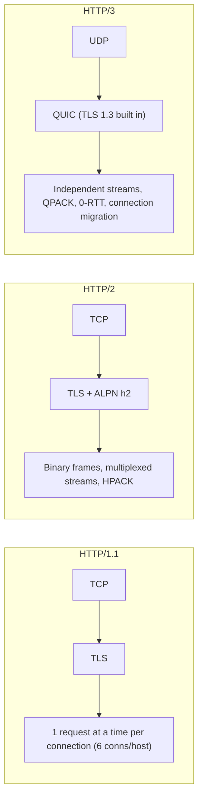

# HTTP & HTTPS

> [!abstract] TL;DR
> HTTP is the stateless request/response protocol of the web. **HTTPS** is HTTP over **TLS** (encryption + server authentication). The semantics (methods, status codes, headers, caching) are version-independent (RFC 9110). The wire format evolved: **HTTP/1.1** (text, one request at a time per connection), **HTTP/2** (binary, multiplexed over TCP) and **HTTP/3** (over **QUIC/UDP**, no TCP head-of-line blocking). In 2026: TLS 1.3 everywhere, post-quantum hybrid key exchange on by default in major browsers/CDNs, and **public certificates capped at 200 days** (falling to 47 by 2029). Automate renewal or break.

## Introduction
- Created by Tim Berners-Lee (CERN, 1989–91): HTTP/0.9 → 1.0 (RFC 1945, 1996) → 1.1 (RFC 2068/2616, 1997/99).
- Specs were reorganized in **2022**: semantics RFC 9110, caching RFC 9111, HTTP/1.1 RFC 9112, HTTP/2 RFC 9113, HTTP/3 RFC 9114. QUIC is RFC 9000 (2021). TLS 1.3 is RFC 8446 (2018).
- It solves uniform client–server communication across any network, with caching, content negotiation and intermediaries (proxies, CDNs).
- Where it sits: under [[REST API]]s, GraphQL, webhooks, [[WebSocket]] upgrades and gRPC (HTTP/2). Terminated at the edge by [[Cloudflare]] and [[Traefik]] in ZP's stack.

## Core Concepts

### Request / response
```http
POST /api/orders HTTP/1.1
Host: api.example.com
Content-Type: application/json
Authorization: Bearer eyJ...
Idempotency-Key: 7f9c2b1e-...

{"sku":"A123","qty":2}
```
```http
HTTP/1.1 201 Created
Location: /api/orders/9812
Content-Type: application/json
Cache-Control: no-store

{"id":9812,"status":"pending"}
```

### Methods
| Method | Safe | Idempotent | Typical use |
|---|---|---|---|
| GET / HEAD | ✅ | ✅ | Read |
| OPTIONS | ✅ | ✅ | CORS preflight, capabilities |
| PUT | ❌ | ✅ | Replace resource |
| DELETE | ❌ | ✅ | Delete |
| POST | ❌ | ❌ | Create / actions. Make it idempotent with `Idempotency-Key` |
| PATCH | ❌ | ❌ (can be) | Partial update |

### Status codes that matter
| Code | Meaning | Gotcha |
|---|---|---|
| 200/201/204 | OK / Created / No Content | 201 should include `Location` |
| 301/308 vs 302/307 | Permanent vs temporary redirect | 307/308 preserve method + body. 301/302 may turn POST into GET |
| 304 | Not Modified (conditional GET) | Needs `ETag`/`Last-Modified` |
| 400/422 | Bad request / validation error | — |
| 401 vs 403 | Not authenticated vs not allowed | 401 must include `WWW-Authenticate` |
| 404/410 | Not found / gone | — |
| 409/412 | Conflict / precondition failed | Optimistic concurrency with `If-Match` |
| 429 | Too Many Requests | Send `Retry-After` |
| 499 | Client closed (nginx) | Non-standard |
| 502/503/504 | Bad gateway / unavailable / gateway timeout | Usually proxy ↔ upstream issues |

### Headers worth knowing
- **Caching**: `Cache-Control` (`no-store`, `private`, `max-age`, `s-maxage`, `stale-while-revalidate`), `ETag`, `Vary`, `Age`.
- **Security**: `Strict-Transport-Security`, `Content-Security-Policy`, `X-Content-Type-Options: nosniff`, `Referrer-Policy`, `Permissions-Policy`, `Cross-Origin-*-Policy`.
- **Cookies**: `Set-Cookie: sid=…; HttpOnly; Secure; SameSite=Lax; Path=/; Max-Age=…`. `__Host-` prefix to lock the domain/path.
- **CORS**: `Access-Control-Allow-Origin` (never `*` with credentials), `-Allow-Methods`, `-Allow-Headers`, `-Allow-Credentials`. Preflight on non-simple requests.
- **Proxies**: `Forwarded` / `X-Forwarded-For`, `X-Forwarded-Proto`, `X-Real-IP`. Trust them only from known proxies.

## Architecture / How It Works



- **TLS 1.3 handshake**: 1-RTT (ClientHello with key share → ServerHello + cert + Finished). 0-RTT resumption is possible but **replayable**, so use it only for idempotent requests.
  - Forward secrecy is mandatory (ECDHE). Legacy RSA key exchange, CBC and SHA-1 are removed.
  - Post-quantum hybrid key exchange (**X25519MLKEM768**) is enabled by default in Chrome/Firefox and Cloudflare since 2024–25.
- **Certificates**: the server proves its identity with an X.509 chain to a trusted root. The browser checks name (SAN), validity, chain and Certificate Transparency SCTs.
  - Revocation (OCSP/CRL) is weak in practice. **Let's Encrypt shut down OCSP in 2025**, and the industry answer is **short-lived certs**.
- **HTTP/2**: one TCP connection, many streams. Packet loss stalls *all* streams (TCP head-of-line). Server push is effectively dead (removed in Chrome).
- **HTTP/3/QUIC**: streams are independent over UDP. Faster on lossy mobile networks. Connection IDs survive Wi-Fi ↔ 4G switches. Discovered via the `Alt-Svc` header or HTTPS DNS records.
- **ALPN** negotiates `h2`/`http/1.1` inside the TLS handshake. **SNI** tells the server which certificate to present. **ECH** (Encrypted Client Hello) hides SNI and is rolling out at Cloudflare and in browsers.

## Project Structure
N/A — a protocol, not a framework. Typical edge configuration in ZP's stack:

```yaml
# Traefik dynamic config — security headers + HTTPS redirect
http:
  middlewares:
    secure-headers:
      headers:
        stsSeconds: 31536000
        stsIncludeSubdomains: true
        stsPreload: true
        contentTypeNosniff: true
        referrerPolicy: strict-origin-when-cross-origin
        frameDeny: true
    https-redirect:
      redirectScheme: { scheme: https, permanent: true }
```
```bash
curl -sv --http2 https://api.example.com/health -o /dev/null   # protocol, TLS version, cert chain
curl -sI --http3 https://example.com                           # HTTP/3 (curl built with QUIC)
openssl s_client -connect example.com:443 -servername example.com </dev/null | openssl x509 -noout -dates -subject -issuer
```

## Use Cases
| Use case | Why it fits |
|---|---|
| Web pages and APIs | Universal client support, caching, proxies/CDNs |
| Webhooks (WhatsApp Cloud API, Stripe, n8n) | Simple POST callbacks. Verify signatures (HMAC headers) |
| File delivery / media | Range requests (`Range`, `206`), CDN caching |
| Real-time | SSE (`text/event-stream`) for server push. Upgrade to [[WebSocket]] for bidirectional traffic |
| RPC (gRPC) | HTTP/2 framing + protobuf |

## Pros & Cons
| Pros | Cons |
|---|---|
| Universal, firewall-friendly, huge tooling | Stateless: sessions/auth layered on top (cookies, tokens) |
| Rich caching + intermediary model | Header bloat. Complex caching semantics |
| HTTP/2–3 remove most latency hacks (sprites, domain sharding) | HTTP/2/3 bring new DoS classes (Rapid Reset, MadeYouReset) |
| TLS 1.3 is fast and secure by default | Certificate lifecycle ops (200→47-day certs) demand automation |
| Evolvable: same semantics across versions | Request smuggling when proxies and backends parse differently |

## Alternatives & Peers
| Alternative | Strength vs HTTP & HTTPS | Weakness vs HTTP & HTTPS | Pick it when… |
|---|---|---|---|
| [[WebSocket]] | Full-duplex, low overhead per message | No caching, stateful connections, scaling complexity | Chat, live dashboards, collaborative apps |
| gRPC (over HTTP/2) | Typed contracts, streaming, efficient | Poor browser support (needs gRPC-Web), opaque payloads | Service-to-service RPC |
| MQTT | Tiny overhead, pub/sub, unreliable networks | Broker infra, not for browsers | IoT devices |
| Raw TCP/UDP | Maximum control | Reinvent framing, security, tooling | Games, custom protocols |
| WebTransport (over HTTP/3) | Datagrams + streams in the browser | Early ecosystem | Low-latency media/gaming in browsers |

## Tips & Reminders
> [!tip] Defaults that age well
> - HTTPS everywhere + **HSTS** (preload once you're sure every subdomain supports HTTPS).
> - TLS 1.2 minimum (prefer 1.3 only for new services). Disable TLS 1.0/1.1.
> - **Automate certificates** (ACME: Let's Encrypt, ZeroSSL, Cloudflare). Manual renewal can't survive 200- then 47-day lifetimes. Monitor expiry anyway.
> - Make POST endpoints idempotent with `Idempotency-Key` for payments and webhooks.
> - Set explicit timeouts at each hop (client → CDN → proxy → app → DB) and make the outer ones longer than the inner ones.
> - Compress text (`br`/`zstd`/`gzip`). Never compress secrets alongside attacker-controlled input (BREACH).

> [!tip] In ZP's stack
> - **[[Cloudflare]] SSL mode = Full (strict)**, never Flexible. Flexible sends plaintext from Cloudflare to the origin, and redirect loops follow. Use a Cloudflare Origin CA cert or Let's Encrypt on the origin.
> - [[Traefik]] behind Cloudflare: configure `forwardedHeaders.trustedIPs` with Cloudflare ranges (or use Cloudflare Tunnel) so client IPs and `X-Forwarded-Proto` are correct, and so attackers can't spoof them.
> - WhatsApp/Meta webhooks: verify `X-Hub-Signature-256` (HMAC-SHA256 of the raw body) **before** parsing JSON. Respond 200 fast, then process async.
> - Next.js/Supabase cookies: `Secure; HttpOnly; SameSite=Lax`. Test CORS for the Flutter web build separately from mobile (mobile apps don't enforce CORS).

## Versions & Breaking Changes
| Version | Released | Key changes | Breaking / migration notes |
|---|---|---|---|
| HTTP/1.1 | 1997 / 1999 (RFC 2616), 2014 (RFC 7230-5), 2022 (RFC 9112) | Persistent connections, chunked encoding, Host header | — |
| TLS 1.2 / 1.3 | 2008 / 2018 | 1.3: 1-RTT, mandatory forward secrecy, removed legacy ciphers | TLS 1.0/1.1 deprecated (RFC 8996, 2021) |
| HTTP/2 | 2015 (RFC 7540), 2022 (RFC 9113) | Binary framing, multiplexing, HPACK | Server push deprecated in practice |
| QUIC / HTTP/3 | 2021 (RFC 9000) / 2022 (RFC 9114) | UDP transport, 0-RTT, connection migration | Needs UDP/443 open at firewalls |
| PQ hybrid key exchange | 2024–25 | X25519MLKEM768 default in major browsers/CDNs | Larger ClientHello. Some middleboxes break |
| Let's Encrypt OCSP shutdown | 2025 | CRLs only. Short-lived (6-day) certs available | Remove OCSP stapling requirements |
| **CA/B Forum SC-081v3** | 2026-03-15 | Max public cert lifetime **200 days** | **100 days from 2027-03, 47 days from 2029-03**. Domain validation reuse shrinks too |

## Critical Issues & Gotchas
> [!danger] HTTP/2 Rapid Reset (CVE-2023-44487) and MadeYouReset (CVE-2025-8671)
> Abusing stream creation and cancellation (`RST_STREAM`) lets tiny botnets produce record DDoS (398M rps against Google in 2023). MadeYouReset (Aug 2025) triggers server-side resets via malformed frames. Patch proxies/servers (nginx, Envoy, Go, Node, Traefik) and keep a CDN/WAF in front.

> [!danger] Request smuggling / desync
> Front-end and back-end disagree on message boundaries (`Content-Length` vs `Transfer-Encoding`, or HTTP/2 → HTTP/1.1 downgrades), so attackers inject requests into other users' connections, poisoning caches or hijacking sessions. Normalize at the edge, reject ambiguous requests, and keep proxies updated.

> [!danger] Certificate expiry outages
> Expired certificates repeatedly take down major services (Microsoft Teams 2020, Starlink 2023, and many smaller ones). With 200→47-day lifetimes, any manual step guarantees outages. Automate ACME and alert at 14 days.

> [!warning] Footguns
> - Caching personalized responses at a CDN (missing `Cache-Control: private` / `Vary: Cookie`) serves user A's data to user B.
> - `Access-Control-Allow-Origin` reflecting any `Origin` with credentials = cross-site data theft.
> - Trusting `X-Forwarded-For` from the internet enables IP spoofing for rate limits and audit logs.
> - 302 redirects after POST in APIs → clients replay as GET. Use 303/307/308 deliberately.
> - Mixed content (HTTP assets on HTTPS pages) gets blocked by browsers.
> - Large headers/cookies (> 8–16 KB) → 431/400 errors at proxies. JWT-in-cookie bloat is a common cause.

## Deep Dives
- [[HTTP & HTTPS - TLS Handshake & Certificates]]

## Related
- [[REST API]] — resource design on HTTP semantics
- [[WebSocket]] — upgrade from HTTP for duplex messaging
- [[Traefik]] · [[Cloudflare]] — TLS termination and edge
- [[OAuth 2.0 & OIDC]] · [[JWT]] — auth over HTTP
- [[Network Security]] — attacks at the transport and application layer

## References
- RFC 9110 (HTTP Semantics): https://www.rfc-editor.org/rfc/rfc9110
- RFC 9114 (HTTP/3): https://www.rfc-editor.org/rfc/rfc9114
- RFC 8446 (TLS 1.3): https://www.rfc-editor.org/rfc/rfc8446
- MDN HTTP: https://developer.mozilla.org/en-US/docs/Web/HTTP
- CA/B Forum 47-day schedule (DigiCert): https://www.digicert.com/blog/tls-certificate-lifetimes-will-officially-reduce-to-47-days
- 200-day limit in 2026: https://certera.com/blog/ca-b-approved-47-day-ssl-tls-validity-by-2029-how-to-prepare/
