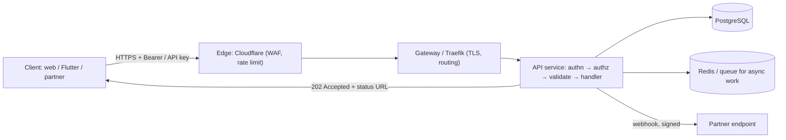

# REST API

> [!abstract] TL;DR
> REST is an architectural style (Roy Fielding, 2000) for resource-oriented APIs over [[HTTP & HTTPS|HTTP]]: nouns as URLs, standard methods as verbs, status codes as outcomes, representations (JSON) as payloads, stateless requests. In practice "REST API" means a **pragmatic JSON-over-HTTP API described by OpenAPI**. Get the fundamentals right: consistent resource naming, correct status codes, **RFC 9457 problem details** for errors, cursor pagination, idempotency keys, versioning and auth. Most API pain comes from inconsistency, not from the style itself.

## Introduction
- Defined in Fielding's PhD dissertation (UC Irvine, 2000). The constraints are:
  - client–server
  - stateless
  - cacheable
  - uniform interface
  - layered system
  - code-on-demand (optional)
- **HATEOAS** (hypermedia-driven) is rarely implemented in practice. Most "REST" APIs are Richardson Maturity Level 2: resources + HTTP verbs.
- **OpenAPI** (formerly Swagger, governed by the OpenAPI Initiative under the Linux Foundation) is the de facto contract format. 3.1 (2021) aligned with JSON Schema 2020-12, and **3.2 (Sep 2025)** added the `QUERY` method, hierarchical tags and streaming media types.
- Where it sits: the default public/partner API style. Also used for webhooks, mobile backends ([[Flutter]] apps) and [[Supabase]] (PostgREST auto-generates REST from Postgres).

## Core Concepts

### Resource design
```text
GET    /v1/customers?status=active&limit=50&cursor=eyJpZCI6...   list (filter + cursor pagination)
POST   /v1/customers                                             create → 201 + Location
GET    /v1/customers/{id}                                        read
PATCH  /v1/customers/{id}                                        partial update (JSON Merge Patch)
DELETE /v1/customers/{id}                                        delete → 204
GET    /v1/customers/{id}/orders                                 sub-collection
POST   /v1/orders/{id}/cancel                                    action (non-CRUD state transition)
```
- Plural nouns, lowercase, hyphens (`/payment-methods`). IDs are opaque (UUID/ULID/prefixed `cus_…`), never sequential integers exposed publicly.
- Model **state transitions as actions** or sub-resources (`POST /orders/{id}/cancel`) rather than letting clients `PATCH` a `status` field freely.
- Consistent casing in JSON (`snake_case` or `camelCase`, pick one), ISO-8601 UTC timestamps, money as integer minor units + currency (`{"amount": 12990, "currency": "MYR"}`).

### Errors: RFC 9457 Problem Details
```http
HTTP/1.1 422 Unprocessable Content
Content-Type: application/problem+json

{
  "type": "https://api.example.com/problems/validation-error",
  "title": "Validation failed",
  "status": 422,
  "detail": "phone must be in E.164 format",
  "instance": "/v1/customers",
  "errors": [{ "pointer": "/phone", "message": "Expected +60…" }],
  "request_id": "req_01J9…"
}
```

### Pagination
| Style | Pros | Cons |
|---|---|---|
| Offset/limit (`?page=3`) | Simple, random access | Slow on big tables, duplicates/misses when data changes |
| **Cursor/keyset** (`?cursor=…`) | Stable, fast (`WHERE (created_at,id) < …`) | No random page jumps |
| Link headers (RFC 8288) | Standard, HATEOAS-ish | Less convenient for JS clients |

### Idempotency & concurrency
- `Idempotency-Key` header on `POST` (payments, orders, webhook-triggered creates). The server stores the key → response for 24 h and replays it on retry.
- Optimistic concurrency: `ETag` + `If-Match` → `412 Precondition Failed` on conflicting updates.

### Versioning
| Strategy | Example | Notes |
|---|---|---|
| URL major version | `/v1/…` | Most common, explicit, cache-friendly |
| Header / date-based | `Stripe-Version: 2026-09-30` | Fine-grained evolution, more server complexity |
| Media type | `Accept: application/vnd.acme.v2+json` | Purist, awkward tooling |

- Additive changes (new fields, endpoints) are non-breaking. Removing or renaming fields, changing types or tightening validation is breaking, so announce a `Deprecation`/`Sunset` header and a timeline.

## Architecture / How It Works



- **Request pipeline**: auth (JWT/OAuth/API key) → rate limit → schema validation (from OpenAPI/Zod) → authorization (resource ownership!) → handler → serialization → logging with `request_id`.
- **Long-running work**: return `202 Accepted` + `Location: /v1/jobs/{id}`, then let clients poll or receive a webhook.
- **Caching**: `GET` responses with `ETag`/`Cache-Control`. Private data gets `Cache-Control: private, no-store` at CDNs.
- **Contract-first**: write OpenAPI, then generate types/clients/mock servers. Or code-first: generate OpenAPI from Zod/Pydantic/NestJS decorators. Either way, the spec must be **validated in CI**.

## Project Structure
```text
api/
├── openapi/openapi.yaml        # source of truth (or generated from code), linted with Spectral/Redocly
├── src/
│   ├── routes/customers.ts     # handlers thin: parse → service → respond
│   ├── services/               # business logic, authz checks
│   ├── schemas/                # zod schemas → types + OpenAPI
│   ├── middleware/             # auth, rate limit, idempotency, request-id, problem+json errors
│   └── webhooks/               # outbound signing + retries
├── tests/contract/             # schemathesis / dredd against the spec
└── docs/                       # rendered reference (Scalar/Redoc) + changelog
```

## Use Cases
| Use case | Why it fits |
|---|---|
| Public / partner APIs | Universal tooling, cacheable, easy to document and secure |
| Mobile app backends | Simple, works with any HTTP client, CDN caching for reads |
| Webhooks (outbound) | Plain POST + HMAC signature + retries |
| CRUD over a database | [[Supabase]]/PostgREST generate it automatically |
| Integration with [[n8n]]/Zapier/Make | HTTP Request nodes speak REST natively |

## Pros & Cons
| Pros | Cons |
|---|---|
| Ubiquitous: every language, tool, proxy, CDN | Over/under-fetching. N+1 round trips for nested data |
| HTTP caching and semantics for free | No standard for filtering, sorting, errors beyond conventions (RFC 9457 helps) |
| Human-readable, easy to debug with `curl` | Versioning and breaking changes need discipline |
| OpenAPI ecosystem: codegen, docs, mocks, testing | Not ideal for real-time or streaming (use [[WebSocket]]/SSE) |

## Alternatives & Peers
| Alternative | Strength vs REST API | Weakness vs REST API | Pick it when… |
|---|---|---|---|
| [[GraphQL]] | Client-shaped queries, one endpoint, typed schema | Caching harder, N+1 server risk, query cost attacks | Many clients needing different shapes of rich graph data |
| [[gRPC]] | Fast binary protobuf, streaming, strict contracts | Browser support needs gRPC-Web. Less human-debuggable | Internal service-to-service, polyglot microservices |
| tRPC / oRPC | End-to-end TS types, no codegen | TS-only clients, coupled to server code | Full-stack TS monorepo (Next.js) |
| [[WebSocket]] / SSE | Real-time push | Stateful, no caching | Live updates, chat |
| JSON-RPC | Simple RPC semantics (used by MCP, Ethereum) | No HTTP-level semantics/caching | Command-style APIs, protocols |

## Tips & Reminders
> [!tip] Design checklist
> - Write the OpenAPI spec (or generate it) and **lint it** (Spectral/Redocly rules: naming, pagination, error schema).
> - Use one error format everywhere (`application/problem+json`) and include a `request_id`.
> - **Authorization per object**: always check that the caller owns `{id}`. Missing checks are the #1 API vulnerability (BOLA).
> - Set rate limits per key/IP and return `429` + `Retry-After` and `RateLimit-*` headers.
> - Return only the fields clients need. Never serialize ORM models directly (it leaks `password_hash`, internal flags).
> - Webhooks: sign (HMAC-SHA256 + timestamp), retry with backoff, and make receivers idempotent.

> [!tip] In ZP's stack
> - [[Supabase]]: PostgREST + RLS gives a REST API for free. Add Next.js route handlers or Edge Functions only for business logic, third-party calls and webhooks.
> - [[Next.js]] route handlers: validate with Zod, return `NextResponse.json(problem, { status })`, and generate OpenAPI from the Zod schemas so clients (Flutter) get typed SDKs.
> - [[n8n]] webhook endpoints are REST endpoints too: version them (`/webhook/v1/...`), validate input and return proper status codes.
> - Document client-facing APIs (Scalar/Redoc) as part of the delivery handover. That's also your scope boundary in the SOW.

## Versions & Breaking Changes
| Version | Released | Key changes | Breaking / migration notes |
|---|---|---|---|
| Fielding dissertation | 2000 | REST constraints defined | — |
| Swagger 2.0 | 2014 | Popular API description format | — |
| OpenAPI 3.0 | 2017-07 | Components, callbacks, links, `requestBody` | Restructured from Swagger 2.0 |
| OpenAPI 3.1 | 2021-02 | Full JSON Schema 2020-12 alignment, webhooks | `nullable` → `type: [x, "null"]`. `example` → `examples` |
| RFC 9457 | 2023-07 | Problem Details (obsoletes RFC 7807) | Compatible. Adds a registry + clarifications |
| Arazzo 1.0 | 2024-05 | Multi-step API workflow descriptions | — |
| **OpenAPI 3.2** | 2025-09-23 | `QUERY` + arbitrary methods, hierarchical tags, streaming media types (SSE/JSONL), OAuth2 device flow metadata | Backward compatible with 3.1. Tooling support still rolling out |

## Critical Issues & Gotchas
> [!danger] Broken Object Level Authorization (OWASP API #1)
> `GET /v1/invoices/123` returns any invoice when the handler checks only "is logged in", not "owns invoice 123". This is behind many real breaches (e.g. Optus 2022, an unauthenticated API with enumerable IDs → 10M customer records). Enforce ownership in queries (`WHERE tenant_id = $ctx`) or with RLS, and use non-guessable IDs.

> [!danger] Excessive data exposure & mass assignment
> Returning full DB rows leaks internal fields. Binding request JSON directly to models lets clients set `role: "admin"` or `price: 0`. Use explicit response schemas and allow-listed input fields.

> [!warning] Footguns
> - `200 OK` with `{"error": …}` bodies. It breaks clients, retries and monitoring. Use real status codes.
> - Unbounded list endpoints (`GET /orders` with no limit) cause DB timeouts and DoS. Enforce max `limit`.
> - Breaking changes deployed without a version bump: the mobile app in the store can't update instantly. Keep old versions alive.
> - Timezones: returning local times without an offset.
> - Retrying non-idempotent `POST` without idempotency keys creates duplicate orders or charges.

## Deep Dives
N/A — none planned yet. Candidates: API versioning & evolution, pagination/filtering conventions.

## Related
- [[HTTP & HTTPS]] — methods, status codes, caching semantics
- [[GraphQL]] · [[gRPC]] · [[WebSocket]] — alternative API styles
- [[OAuth 2.0 & OIDC]] · [[JWT]] — API authentication
- [[OWASP Top 10]] — API security risks
- [[Supabase]] — PostgREST auto-generated REST

## References
- Fielding dissertation, ch. 5: https://ics.uci.edu/~fielding/pubs/dissertation/rest_arch_style.htm
- OpenAPI 3.2 announcement: https://www.openapis.org/blog/2025/09/23/announcing-openapi-v3-2
- RFC 9457 (Problem Details): https://www.rfc-editor.org/rfc/rfc9457
- Arazzo spec: https://spec.openapis.org/arazzo/latest.html
- OWASP API Security Top 10: https://owasp.org/API-Security/
