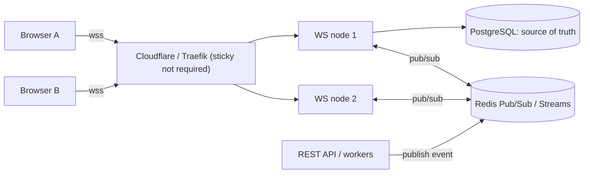

# WebSocket

> [!abstract] TL;DR
> WebSocket (RFC 6455, 2011) upgrades an HTTP connection into a **persistent, full-duplex, message-based channel** over TCP (`ws://` / `wss://`). It's the standard for real-time web features: chat, live dashboards, presence, collaborative editing, streaming agent output to UIs. The protocol is simple. The hard parts are **operational**: auth on connect, heartbeats, reconnection with resume, backpressure, horizontal scaling (pub/sub fan-out) and proxy/load-balancer timeouts. Prefer **SSE** when you only need server → client streaming.

## Introduction
- Standardized as RFC 6455 (Dec 2011), with the browser `WebSocket` API (WHATWG). Extensions: `permessage-deflate` (RFC 7692), WebSocket over HTTP/2 (RFC 8441) and HTTP/3 (RFC 9220).
- It solves real-time bidirectional communication without polling/long-polling overhead.
- Ecosystem:
  - Libraries: `ws` (Node), Socket.IO (protocol on top, with rooms, acks and fallback), uWebSockets.js, `web_socket_channel` (Flutter/Dart).
  - Managed: Supabase Realtime, Ably, Pusher, Cloudflare Durable Objects (WebSocket hibernation), AWS API Gateway WebSockets.
- Where it sits: alongside [[REST API]]s. REST does commands and queries, WebSocket does live events. Terminated through [[Traefik]]/[[Cloudflare]] like HTTPS.

## Core Concepts

### Handshake (HTTP/1.1 Upgrade)
```http
GET /ws HTTP/1.1
Host: app.example.com
Upgrade: websocket
Connection: Upgrade
Sec-WebSocket-Key: dGhlIHNhbXBsZSBub25jZQ==
Sec-WebSocket-Version: 13
Origin: https://app.example.com
Sec-WebSocket-Protocol: chat.v1

HTTP/1.1 101 Switching Protocols
Upgrade: websocket
Connection: Upgrade
Sec-WebSocket-Accept: s3pPLMBiTxaQ9kYGzzhZRbK+xOo=
Sec-WebSocket-Protocol: chat.v1
```

### Frames
| Opcode | Frame | Notes |
|---|---|---|
| 0x1 / 0x2 | Text (UTF-8) / Binary | Messages may be fragmented (continuation 0x0) |
| 0x8 | Close | Status code (1000 normal, 1001 going away, 1006 abnormal, i.e. no close frame, 1008 policy, 1011 server error) |
| 0x9 / 0xA | Ping / Pong | Keepalive. Browsers auto-reply to pings but can't send them, so add app-level heartbeats |

- Client → server frames are **masked** (XOR with a random key) to prevent proxy cache poisoning. Server frames are unmasked.
- There's no built-in message IDs, acks, rooms, reconnection or auth. You design those (or use Socket.IO / a managed service).

### Minimal server (Node, `ws`) with auth + heartbeat
```ts
import { WebSocketServer } from "ws";
import { verifySession } from "./auth";

const wss = new WebSocketServer({ noServer: true, maxPayload: 64 * 1024 });

server.on("upgrade", async (req, socket, head) => {
  if (req.headers.origin !== "https://app.example.com") return socket.destroy();     // CSWSH defense
  const user = await verifySession(req).catch(() => null);                          // cookie or ?token= short-lived ticket
  if (!user) { socket.write("HTTP/1.1 401 Unauthorized\r\n\r\n"); return socket.destroy(); }
  wss.handleUpgrade(req, socket, head, ws => wss.emit("connection", ws, user));
});

wss.on("connection", (ws, user) => {
  (ws as any).alive = true;
  ws.on("pong", () => ((ws as any).alive = true));
  ws.on("message", raw => handle(user, JSON.parse(raw.toString())));                 // validate with zod in real code
});

setInterval(() => wss.clients.forEach(ws => {
  if (!(ws as any).alive) return ws.terminate();
  (ws as any).alive = false; ws.ping();
}), 30_000);
```

### Client reconnection (browser / Flutter)
- Exponential backoff with jitter (1s, 2s, 4s … max 30s). Resume from the last received event ID (`?since=evt_123`) so no messages are lost. Show a connection state in the UI.

## Architecture / How It Works



- **Each connection is long-lived state on one server**, so horizontal scaling needs a **fan-out bus** ([[Redis]] Pub/Sub or Streams, NATS, Postgres `LISTEN/NOTIFY` for small scale) so an event published anywhere reaches clients connected to any node.
- **Connection limits**: each socket uses a file descriptor + memory (~10–50 KB idle in Node). Tune `ulimit -n`, proxy max connections and keepalive.
- **Timeouts**: proxies close idle connections (Cloudflare ~100 s idle, nginx `proxy_read_timeout` 60 s default). Heartbeats every 20–30 s keep them alive and detect dead peers.
- **Deploys** drop all connections. Clients must reconnect and resume. Drain gracefully (send close 1001, stop accepting, wait).
- **Backpressure**: check `ws.bufferedAmount` (browser) or `socket.bufferedAmount` (Node), and drop or coalesce updates for slow consumers instead of buffering unbounded.

## Project Structure
```text
realtime/
├── src/
│   ├── server.ts         # upgrade handling, auth, heartbeat, graceful shutdown
│   ├── protocol.ts       # message types (zod discriminated union), versioned: { v:1, type, id, data }
│   ├── rooms.ts          # subscriptions (tenant:123, conversation:456) + authz on subscribe
│   ├── bus.ts            # Redis pub/sub adapter
│   └── replay.ts         # resume from last event id (Redis Streams / DB)
└── test/load/            # k6 / artillery websocket scenarios
```

## Use Cases
| Use case | Why it fits |
|---|---|
| Chat / live agent inbox (WhatsApp → dashboard) | Bidirectional, low latency, typing/presence |
| Live dashboards & notifications | Push updates without polling |
| Collaborative editing (CRDT/Yjs) | Frequent small bidirectional messages |
| Multiplayer games / trading tickers | High-frequency updates |
| Voice/LLM realtime APIs | Provider realtime APIs use WebSocket for audio/token streams |

## Pros & Cons
| Pros | Cons |
|---|---|
| Full-duplex, low per-message overhead (2–14 byte headers) | Stateful connections complicate scaling, deploys and load balancing |
| Universal browser support (99%+), works through most proxies on 443 | No HTTP caching, no built-in auth/acks/reconnect |
| Binary + text frames | Corporate proxies or AV software sometimes break it |
| Lower latency than polling | Mobile networks/background apps kill sockets. Needs reconnection logic |

## Alternatives & Peers
| Alternative | Strength vs WebSocket | Weakness vs WebSocket | Pick it when… |
|---|---|---|---|
| Server-Sent Events (SSE) | Plain HTTP, auto-reconnect with `Last-Event-ID`, proxy/CDN friendly, HTTP/2 multiplexed | Server → client only, text only | LLM token streaming, notifications, live feeds |
| Long polling | Works everywhere, simple | Latency + overhead | Fallback only |
| WebTransport (HTTP/3) | Streams + unreliable datagrams, no HOL blocking | Limited support (no Safari until recently), new | Games, media |
| MQTT over WS | Pub/sub semantics, QoS levels | Broker needed | IoT + web dashboards |
| Managed realtime (Supabase Realtime, Ably, Pusher) | No infra, presence, history, scaling solved | Cost per connection/message, lock-in | Small team, need it reliable fast |
| Socket.IO | Rooms, acks, reconnection, fallbacks | Custom protocol (needs Socket.IO client both sides), overhead | Rapid chat-style features in Node |

## Tips & Reminders
> [!tip] Production checklist
> - **Authenticate during the upgrade** (cookie or short-lived one-time ticket from a REST call). Avoid long-lived JWTs in query strings, because they end up in logs.
> - **Check `Origin`** on upgrade to prevent Cross-Site WebSocket Hijacking.
> - **Authorize each subscription** (a room/channel belongs to the user's tenant).
> - Validate every inbound message with a schema, set `maxPayload`, and rate-limit messages per connection.
> - Version the message protocol (`{ v: 1, type, … }`).
> - Heartbeat 20–30 s, reconnect with jittered backoff, resume by event ID.

> [!tip] In ZP's stack
> - For [[Supabase]] apps, use **Supabase Realtime** (Postgres changes, broadcast, presence) before building your own WS server. RLS applies to Postgres-changes subscriptions.
> - [[Traefik]] proxies WebSocket upgrades automatically. Behind [[Cloudflare]], WebSockets are supported on all plans, but expect the ~100 s idle timeout, so heartbeat.
> - LLM streaming to a Next.js UI: SSE / streamed responses (AI SDK, RSC streaming) are simpler than WebSocket.
> - Chatwoot-replacement idea: WebSocket gateway + [[Redis]] Streams for fan-out and replay. Keep Postgres as the source of truth.

## Versions & Breaking Changes
| Version | Released | Key changes | Breaking / migration notes |
|---|---|---|---|
| Hixie drafts | 2009–2010 | Early browser implementations | Insecure. Superseded |
| **RFC 6455** | 2011-12 | Final protocol, masking, version 13 | — |
| RFC 7692 | 2015-12 | `permessage-deflate` compression | CPU/memory cost. Can enable compression-oracle attacks |
| RFC 8441 | 2018-09 | WebSocket over HTTP/2 (extended CONNECT) | Server/proxy support varies |
| RFC 9220 | 2022-06 | WebSocket over HTTP/3 | Early adoption |
| Node.js 22 | 2024-04 | Global `WebSocket` **client** stable (undici) | Servers still need `ws`/uWS |
| ws 8.20.1 | 2026 | Fix CVE-2026-45736 | Upgrade `ws` |

## Critical Issues & Gotchas
> [!danger] Cross-Site WebSocket Hijacking (CSWSH)
> Browsers send cookies on WebSocket upgrades from **any origin**, and the same-origin policy doesn't apply. Without an `Origin` check, a malicious site can open an authenticated socket as the victim and read their data. Validate `Origin` and prefer token/ticket auth.

> [!danger] `ws` library vulnerabilities
> **CVE-2024-37890**: a crafted request with many headers crashed `ws` servers (DoS), fixed in 8.17.1. **CVE-2026-45736**: uninitialized memory disclosure via `close()` with TypedArray reasons, fixed in **8.20.1**. Keep `ws` updated, because it sits under Socket.IO, Next.js dev servers and many frameworks.

> [!warning] Footguns
> - Unbounded broadcast loops (`for each client send`) on a single thread at 10k clients block the event loop. Batch and coalesce.
> - Memory leaks from never-removed listeners or room maps on disconnect.
> - Using WebSocket as the source of truth. Messages sent during a reconnect gap are lost unless you persist and replay.
> - `permessage-deflate` on a busy server multiplies memory (zlib context per connection). Disable or tune it.
> - Load balancer health checks that never upgrade, so broken WS paths go unnoticed. Add a synthetic WS check.

## Deep Dives
- (planned) [[WebSocket - Scaling & Reliability]]

## Related
- [[HTTP & HTTPS]] — upgrade mechanism, TLS, proxies
- [[REST API]] — commands/queries alongside realtime events
- [[Redis]] — pub/sub and streams for fan-out
- [[Supabase]] — Realtime service
- [[Traefik]] · [[Cloudflare]] — proxying and timeouts

## References
- RFC 6455: https://www.rfc-editor.org/rfc/rfc6455
- MDN WebSockets API: https://developer.mozilla.org/en-US/docs/Web/API/WebSockets_API
- `ws` (Node): https://www.npmjs.com/package/ws
- Browser support reference: https://websocket.org/reference/browser-support/
- CVE-2026-45736: https://www.sentinelone.com/vulnerability-database/cve-2026-45736/
