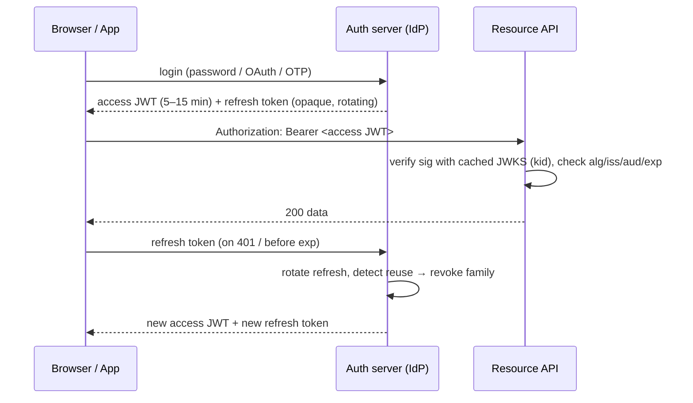

# JWT

> [!abstract] TL;DR
> A JWT is a compact, URL-safe set of **claims** that is signed (JWS) or encrypted (JWE). Any party holding the key can verify it **without a DB lookup**. That statelessness is the whole value and the whole problem: revocation is hard, and every library bug in `alg` handling is an auth bypass. Use short-lived access tokens with **asymmetric** keys (ES256/EdDSA) published via JWKS, **pin the algorithm**, validate `iss`/`aud`/`exp`, and keep sessions or refresh tokens server-side.

## Introduction
- Defined by **RFC 7519** (May 2015), part of the IETF **JOSE** family: JWS (RFC 7515), JWE (7516), JWK (7517), JWA (7518). Security best practices are in **RFC 8725** (Feb 2020). A revision (8725bis, draft-07) passed IETF Last Call and has been in the RFC Editor Queue since Aug 2026. It will obsolete RFC 8725.
- It solves cross-service identity propagation without shared session storage: an IdP signs, and many resource servers verify with a public key.
- It's the token format of [[OAuth 2.0 & OIDC]] (OIDC `id_token` is always a JWT; access tokens often are, per RFC 9068). Also used by [[Supabase]] Auth, Firebase, Auth0, Clerk, Cognito and Kubernetes service accounts.
- Where it sits: the transport layer for **authn result + authz hints** between browser ⇄ API ⇄ services. It is **not** a session mechanism by itself.

## Core Concepts

### Structure
```text
base64url(header) . base64url(payload) . base64url(signature)
eyJhbGciOiJFUzI1NiIsImtpZCI6ImsxIn0.eyJzdWIiOiJ1XzQyIiwiZXhwIjoxNzU5NDAwMDAwfQ.MEUCIQ...
```
```json
{ "alg": "ES256", "typ": "JWT", "kid": "2026-09-key-1" }
{ "iss": "https://auth.example.com", "sub": "u_42", "aud": "api.example.com",
  "exp": 1791000900, "iat": 1791000000, "nbf": 1791000000, "jti": "8f1c…", "scope": "orders:read" }
```
- **Base64url ≠ encryption.** Anyone can read a JWS payload, so never put secrets or PII you wouldn't show the user in it.
- The signature covers `header.payload` (ASCII bytes of the two segments).

### Registered claims (RFC 7519 §4.1)
| Claim | Meaning | Validate? |
|---|---|---|
| `iss` | Issuer | **Yes**, exact match |
| `sub` | Subject (user id) | Use as identity |
| `aud` | Audience (who it's for) | **Yes**. Prevents token reuse across APIs |
| `exp` | Expiry (NumericDate, seconds) | **Yes**, with ≤ 60 s leeway |
| `nbf` | Not before | Yes |
| `iat` | Issued at | Optional, max-age checks |
| `jti` | Unique id | For replay detection / denylist |

### Algorithms (JWA)
| `alg` | Type | Key | Notes |
|---|---|---|---|
| `HS256/384/512` | HMAC | Shared secret ≥ 256 bits | Every verifier can also **mint** tokens. Only for a single service |
| `RS256` | RSA PKCS#1 v1.5 | RSA ≥ 2048 | Most compatible, large signatures (~342 chars) |
| `PS256` | RSA-PSS | RSA ≥ 2048 | Better padding than RS256 |
| `ES256` | ECDSA P-256 | EC | Small, fast. **Recommended default** |
| `EdDSA` / `Ed25519` | EdDSA | OKP | Deterministic, no nonce footguns. Fully-specified `Ed25519` name in newer specs |
| `none` | Unsigned | — | **Must be rejected** by verifiers |

### JWS vs JWE vs nested
- **JWS**: integrity + authenticity, readable payload. This is what 99% of "JWT" means.
- **JWE**: confidentiality (`alg` = key management like `RSA-OAEP-256`/`ECDH-ES`, `enc` = `A256GCM`). 5 segments.
- **Nested**: sign, then encrypt (`cty: "JWT"`), for when claims must be hidden from the client.

### JWK / JWKS
```json
{ "keys": [ { "kty": "EC", "crv": "P-256", "kid": "2026-09-key-1", "use": "sig", "alg": "ES256",
              "x": "f83OJ3D2xF1Bg8vub9tLe1gHMzV76e8Tus9uPHvRVEU", "y": "x_FEzRu9m36HLN_tue659LNpXW6pCyStikYjKIWI5a0" } ] }
```
- Served at `/.well-known/jwks.json`. Verifiers pick the key by the token's `kid`, cache it and refresh on an unknown `kid`. This enables **key rotation** with zero downtime.

## Architecture / How It Works



**Verification order (do all of it):**
1. Parse the header. **Reject unless `alg` ∈ your allow-list** (e.g. exactly `["ES256"]`). Never derive the algorithm from the token.
2. Select the key by `kid` **from your trusted JWKS only**. Ignore `jku`, `x5u` and embedded `jwk` headers unless they're explicitly pinned.
3. Verify the signature with that key, and make sure the key type matches the algorithm (an RSA/EC public key must never be used as an HMAC secret).
4. Validate `exp`, `nbf`, `iss`, `aud`, then `typ` (e.g. `at+jwt` for RFC 9068 access tokens, to stop `id_token` ↔ access token confusion).
5. Only then trust `sub`, `scope` and roles.

**Revocation strategies** (pick consciously):
| Strategy | Latency to revoke | Cost |
|---|---|---|
| Short `exp` (5–15 min) + rotating refresh tokens | ≤ token lifetime | Refresh traffic |
| `jti` denylist in [[Redis]] (TTL = remaining `exp`) | Immediate | A lookup per request (gives up statelessness) |
| Token version / `session_id` claim checked against DB | Immediate | DB/cache hit per request |
| Key rotation | Immediate for **all** tokens | Logs everyone out |

## Project Structure
N/A — JWT is a token format, not a framework. Typical integration points instead:

```text
api/
├── middleware/auth.ts      # verify JWT, attach claims to request context
├── lib/jwks.ts             # remote JWKS fetch + cache (jose createRemoteJWKSet)
└── .env                    # JWT_ISSUER, JWT_AUDIENCE, JWKS_URL (never a private key in app servers that only verify)
```
```ts
// Node / Next.js route handler — jose (panva) is the reference-quality JS library
import { createRemoteJWKSet, jwtVerify } from "jose";

const JWKS = createRemoteJWKSet(new URL(process.env.JWKS_URL!));

export async function verify(token: string) {
  const { payload } = await jwtVerify(token, JWKS, {
    issuer: process.env.JWT_ISSUER,
    audience: process.env.JWT_AUDIENCE,
    algorithms: ["ES256"],          // pin — never omit
    clockTolerance: 30,
  });
  return payload;
}
```
```python
# Python — PyJWT ≥ 2.14 (patched for CVE-2026-48526)
import jwt
jwks = jwt.PyJWKClient(JWKS_URL, cache_keys=True)
key = jwks.get_signing_key_from_jwt(token).key
claims = jwt.decode(token, key, algorithms=["ES256"], audience=AUD, issuer=ISS, leeway=30)
```

## Use Cases
| Use case | Why it fits |
|---|---|
| OIDC `id_token` | Standardized, verifiable identity assertion from the IdP to the client |
| API access tokens across services | Each service verifies locally via JWKS, no central session store |
| [[Supabase]] RLS | Postgres reads `auth.uid()` / `auth.jwt()` claims directly in policies |
| Service-to-service auth (short-lived, `aud`-scoped) | Workload identity (K8s SA tokens, GitHub Actions OIDC → cloud) |
| Signed one-time links (email verify, magic link) | Self-contained, expiring, tamper-proof. Add `jti` for one-time use |
| Edge auth ([[Cloudflare]] Workers, Next.js middleware) | Verify with WebCrypto, no DB round-trip at the edge |

## Pros & Cons
| Pros | Cons |
|---|---|
| Stateless verification: horizontal scale, works at the edge | Revocation needs extra state (denylist, short TTL) |
| Standardized (IETF), libraries in every language | A huge spec surface (`alg`, `jku`, `x5u`, `crit`, JWE) is a big bug surface |
| Asymmetric keys separate the minter from the verifiers | Payload is readable. People leak PII into it |
| Carries claims for authz (scopes, tenant) | Stale claims: role changes don't apply until expiry |
| JWKS enables painless key rotation | Larger than opaque tokens (headers/cookies ~0.5–2 KB) |

## Alternatives & Peers
| Alternative | Strength vs JWT | Weakness vs JWT | Pick it when… |
|---|---|---|---|
| Opaque session id + server store (cookie) | Instant revocation, tiny, no crypto footguns | Needs a shared store (DB/[[Redis]]) on every request | Monolith / single web app (most Next.js apps) |
| Opaque OAuth token + introspection (RFC 7662) | Central revocation, no claims leak | Network call per request (cache it) | Third-party APIs, high-security revocation |
| PASETO (v4) | No algorithm agility: version fixes the crypto, no `none`/confusion | Smaller ecosystem, no OIDC support | Internal tokens you fully control |
| Biscuit / Macaroons | Offline attenuation (holder can restrict scope), Datalog authz | Niche, few libraries | Delegation chains, capability-based authz |
| mTLS / DPoP-bound JWT (RFC 8705 / 9449) | Token theft resistance (sender-constrained) | More client complexity | High-value APIs, open banking/FAPI |

## Tips & Reminders
> [!tip] Defaults that age well
> - Access token **5–15 min**, refresh token rotating, single-use, with **reuse detection** that revokes the whole family.
> - ES256 or EdDSA. Use HS256 only when issuer = verifier = one service, and with a ≥ 32-byte random secret.
> - Pin `algorithms`, require `iss` + `aud` + `exp`, and allow ≤ 60 s clock skew.
> - Put **only** ids and coarse scopes in claims. Look up volatile authz (plan, banned flag) server-side.

> [!tip] Browser storage
> - Use an `HttpOnly; Secure; SameSite=Lax` cookie (with CSRF defense on state-changing routes) over `localStorage`. XSS can read `localStorage`.
> - For SPAs talking to a third-party API, a **BFF** (backend-for-frontend) holds tokens server-side. This is the OAuth browser-apps BCP recommendation.

> [!tip] In ZP's stack
> - **[[Supabase]]**: projects now support **asymmetric JWT signing keys** (ES256/RS256) with a JWKS at `https://<ref>.supabase.co/auth/v1/.well-known/jwks.json`. Migrate off the legacy shared HS256 "JWT secret". Use `supabase.auth.getClaims()` to verify locally instead of `getUser()` round-trips.
> - Supabase access tokens default to 1 h. Lower it for admin apps. `service_role`/secret keys bypass RLS, so never ship them to Flutter/Next.js clients.
> - **[[Next.js]]** middleware: verify with `jose` (Edge-compatible) and keep the DB check for sensitive actions in the route handler.
> - **[[n8n]]** webhooks: verify the JWT in a Code node with pinned `algorithms`, or front them with Cloudflare Access (which issues its own JWT, `Cf-Access-Jwt-Assertion`) and verify `aud`.

## Versions & Breaking Changes
| Version | Released | Key changes | Breaking / migration notes |
|---|---|---|---|
| RFC 7515–7519 (JWS/JWE/JWK/JWA/JWT) | 2015-05 | Core JOSE + JWT specs | — |
| RFC 7797 | 2016-02 | Unencoded payload option (`b64: false`) | Must be listed in `crit` |
| RFC 8037 | 2017-01 | EdDSA (Ed25519/Ed448) in JOSE | — |
| RFC 8725 (BCP 225) | 2020-02 | JWT best practices: pin algs, validate `iss`/`aud`, explicit `typ` | Guidance, not wire changes |
| RFC 9068 | 2021-10 | JWT profile for OAuth 2.0 access tokens (`typ: at+jwt`) | Verifiers should check `typ` |
| RFC 9449 (DPoP) | 2023-09 | Sender-constrained tokens via proof-of-possession JWT | Opt-in |
| Fully-specified algorithms (JOSE/COSE) | 2025 | `Ed25519`/`Ed448` names replace polymorphic `EdDSA` | `EdDSA` deprecated for new deployments |
| RFC 8725bis | draft-07 2026-07, RFC Editor Queue 2026-08 | Updated BCP: attacks found since 2020, stricter guidance. Obsoletes RFC 8725, updates RFC 7519 | Expect publication as a new BCP RFC. Re-check guidance then |

> [!warning] Unverified — check before relying on this
> The RFC number and month of the fully-specified-algorithms spec weren't verified. 8725bis status was verified 2026-10-05 (RFC Editor Queue). Check the IETF datatracker for the final RFC number.

## Critical Issues & Gotchas
> [!danger] Algorithm confusion (still shipping in 2026)
> The root cause is trusting the token's `alg` to pick the verification method. An attacker switches `RS256` → `HS256` and signs with the **public** key as the HMAC secret. Recent cases:
> - **CVE-2026-48526** — PyJWT (CVSS 7.4). A public JWK treated as an HMAC secret. Fixed in **2.14.0** (2026-09-11).
> - **CVE-2026-34950** — `fast-jwt` (CVSS 9.1). A regression re-enabled a previously patched confusion.
> - **CVE-2026-22817** — Hono JWT middleware (CVSS 8.2). `alg` came from the token header.
> - **CVE-2026-27804** — Parse Server OAuth adapters (CVSS 9.3).
> - Historic: CVE-2022-29217 (PyJWT), CVE-2024-33663 (python-jose), CVE-2022-23540 (`jsonwebtoken` < 9 accepted `none` by default).
>
> **Mitigation**: always pass an explicit `algorithms` allow-list, use separate key objects per algorithm, and upgrade libraries.

> [!danger] "Psychic Signatures" — CVE-2022-21449 (Java 15–18)
> Java's ECDSA verification accepted `r = s = 0`, so **any** ES256 JWT validated with a blank signature. It's a reminder that "good algorithm" ≠ "good implementation". Patch runtimes, not only libraries.

> [!danger] Header-injected keys: `jku`, `x5u`, `jwk`, `kid`
> If a verifier fetches keys from a URL in the token (`jku`/`x5u`) or trusts an embedded `jwk`, the attacker supplies their own key. `kid` has been used for path traversal (`../../dev/null` → empty HMAC key) and SQL injection when used in a key lookup query. Treat every header field as attacker input.

> [!danger] Library choice
> `python-jose` is effectively unmaintained and has had repeated confusion bugs, so prefer **PyJWT** or **joserfc/authlib**. In Node, prefer **`jose`** (panva) over `jsonwebtoken` for new code (Edge/WebCrypto support, strict defaults).

> [!warning] Operational footguns
> - Long-lived access tokens (days) become bearer credentials that can't be revoked. Leaked logs and screenshots turn into account takeover.
> - Logging full `Authorization` headers to APM/[[LangChain & LangGraph|LLM traces]] leaks live tokens. Redact them.
> - Clock skew between containers → random 401s. Run NTP and keep a small leeway.
> - Mixing tokens: accepting an `id_token` as an API access token, or a token minted for API A at API B. Fix: `aud` + `typ` checks.
> - JWKS fetch on every request (no cache) means a self-inflicted DoS on the IdP. Cache it, and re-fetch only on an unknown `kid`, with rate limiting.

## Deep Dives
- (planned, unscheduled) JWT - Signing Algorithms, Keys & Rotation
- (planned, unscheduled) JWT - Refresh Tokens, Revocation & Storage

## Related
- [[OAuth 2.0 & OIDC]] — JWT is the token format, OAuth/OIDC is the protocol
- [[Authentication & Authorization]]
- [[Supabase]] — JWT claims drive RLS
- [[OWASP Top 10]] — A07 Identification & Authentication Failures
- [[HTTP & HTTPS]] — `Authorization: Bearer`, cookies
- [[Network Security]] — TLS in transit, edge rate limiting
- [[Redis]] — `jti` denylist store

## References
- RFC 7519 (JWT): https://www.rfc-editor.org/rfc/rfc7519
- RFC 8725 (JWT BCP): https://www.rfc-editor.org/rfc/rfc8725
- RFC 9068 (JWT access tokens): https://www.rfc-editor.org/rfc/rfc9068
- RFC 9449 (DPoP): https://www.rfc-editor.org/rfc/rfc9449
- jose (Node): https://github.com/panva/jose
- PyJWT CVE-2026-48526: https://zeropath.com/blog/cve-2026-48526-pyjwt-jwk-algorithm-confusion
- 2026 algorithm-confusion CVE roundup: https://dev.to/iamdevbox/jwt-algorithm-confusion-attacks-cve-2026-22817-cve-2026-27804-and-cve-2026-23552-fix-guide-4ac4
- fast-jwt CVE-2026-34950: https://www.thehackerwire.com/fast-jwt-algorithm-confusion-re-enabled-cve-2026-34950/
- Supabase JWT signing keys: https://supabase.com/docs/guides/auth/signing-keys
