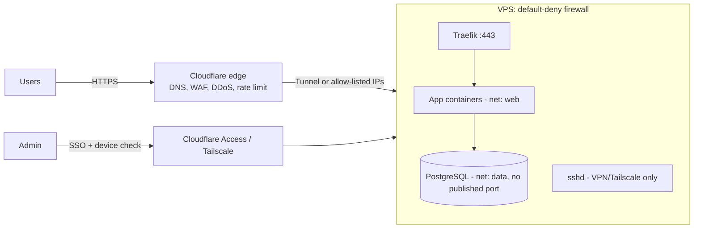

# Network Security

> [!abstract] TL;DR
> Network security limits **who can reach what, over which path, with what proof**. The principles:
> - Minimize exposed surface: default-deny firewalls, only 80/443 public, admin behind VPN/zero-trust.
> - Encrypt everything in transit (TLS 1.3, WireGuard).
> - Segment so one breach doesn't become all breaches.
> - Absorb or deflect DDoS at the edge.
> - Log enough to notice.
>
> 2026 realities:
> - Public TLS certs max out at **200 days** (→ 100 in 2027, 47 in 2029), so certificate automation is mandatory.
> - Post-quantum hybrid key exchange is on by default in browsers and Cloudflare.
> - On a single VPS, the biggest real risk is **ports you didn't know were open** (Docker bypassing UFW, a forgotten admin panel).

## Introduction
- **Scope**: the transport and infrastructure layer: firewalls, segmentation, VPNs, TLS, DNS, DDoS, SSH and remote access, detection. Application-layer attacks (XSS, SQLi, SSRF, CSRF) are covered in [[Network Security - Common Web Attacks]] and [[OWASP Top 10]]. Identity is covered in [[Authentication & Authorization]].
- **Evolution**: perimeter "castle and moat" (trusted LAN) → **zero trust** (never trust network location; authenticate and authorize every request: Google BeyondCorp, NIST SP 800-207).
- **Where it sits for a small SaaS**: [[Cloudflare]] edge (DNS, WAF, DDoS, Tunnel/Access) → VPS firewall → reverse proxy ([[Traefik]]) → [[Docker]] networks → app → DB on a private network.

## Core Concepts

### Defense layers
| Layer | Controls | Typical tools |
|---|---|---|
| Edge | DDoS absorption, WAF, bot management, rate limits, hide origin IP | [[Cloudflare]], AWS Shield/CloudFront |
| Perimeter | Default-deny inbound, allow 80/443 (+ SSH from known IPs / VPN only) | Provider firewall, `nftables`/UFW, security groups |
| Transport | TLS 1.2+/1.3, HSTS, mTLS between services | Let's Encrypt/ACME, Traefik, cert-manager |
| Remote access | No public SSH/admin UIs. VPN or identity-aware proxy | WireGuard, Tailscale/Headscale, Cloudflare Access/Tunnel |
| Segmentation | Separate networks for public, app, data, and admin | Docker networks, VLANs, VPCs, K8s NetworkPolicy |
| Host | Patching, SSH hardening, minimal services, fail2ban/CrowdSec | unattended-upgrades, CIS benchmarks |
| Detection | Logs, flow data, IDS, alerting | Wazuh, Suricata, CrowdSec, Grafana/Loki |

### Key terms
- **Attack surface**: every listening port, hostname, and API. Enumerate yours with `ss -tlnp`, plus `nmap` from **outside**.
- **Least privilege (network)**: a service can reach only what it needs. The DB accepts connections only from the app network.
- **Zero trust**: network location isn't identity. Every request carries user/device identity, checked by a policy engine.
- **Defense in depth**: assume every single layer fails sometimes.
- **East-west vs north-south**: traffic between internal services vs in and out of the system. Most breaches pivot east-west.

### TLS in practice
| Setting | 2026 baseline |
|---|---|
| Protocols | TLS 1.3 + 1.2 (disable 1.0/1.1, SSLv3) |
| Ciphers (1.2) | ECDHE + AEAD only (AES-GCM, ChaCha20-Poly1305) |
| Key exchange | X25519. Hybrid post-quantum **X25519MLKEM768** (default in Chrome, Firefox, Cloudflare) |
| Certificates | ACME automation. **Max 200-day validity since 2026-03-15**, 100 days from 2027-03-15, 47 days from 2029-03-15 |
| HSTS | `Strict-Transport-Security: max-age=31536000; includeSubDomains` (preload only when sure) |
| Origin ↔ edge | Cloudflare "Full (strict)" + Authenticated Origin Pulls, or Tunnel (no public origin) |

## Architecture / How It Works

- **Stateful firewalls** track connections. Allow inbound only for listening services, and allow established/related return traffic.
- **NAT ≠ firewall**: Docker publishes ports with its own iptables/nftables rules **before** UFW's chains. `-p 5432:5432` exposes Postgres to the internet even with `ufw deny 5432`. Bind to `127.0.0.1:5432:5432` or don't publish at all.
- **DDoS classes**:
  - **Volumetric** (UDP floods, reflection/amplification via DNS/NTP/memcached): absorb at the edge.
  - **Protocol** (SYN floods): SYN cookies, edge.
  - **Application** (HTTP floods, HTTP/2 Rapid Reset): WAF, rate limits, caching, challenge pages.
- **DNS security**: registrar lock + 2FA, DNSSEC where supported, CAA records (restrict which CAs can issue), monitoring for subdomain takeover (dangling CNAMEs).

## Project Structure
N/A — a concept domain, not a codebase. The minimal hardening baseline for a single VPS:
```bash
# 1. Firewall: default deny, allow web, SSH only from your VPN/Tailscale range
ufw default deny incoming && ufw default allow outgoing
ufw allow 80,443/tcp
ufw allow from 100.64.0.0/10 to any port 22 proto tcp      # Tailscale CGNAT range
ufw enable

# 2. SSH: keys only, no root, no passwords
cat >/etc/ssh/sshd_config.d/10-hardening.conf <<'EOF'
PermitRootLogin no
PasswordAuthentication no
KbdInteractiveAuthentication no
AllowUsers deploy
EOF
systemctl reload ssh

# 3. Patching + brute-force protection
apt install -y unattended-upgrades crowdsec && dpkg-reconfigure -plow unattended-upgrades

# 4. Verify from OUTSIDE (another machine)
nmap -Pn -p- your.server.ip
```
```yaml
# Docker Compose: keep data services off the host network
services:
  db:
    image: postgres:18
    networks: [data]                 # no "ports:", reachable only by services on "data"
  api:
    networks: [web, data]
  traefik:
    ports: ["443:443", "80:80"]
    networks: [web]
networks: { web: {}, data: { internal: true } }   # internal: no outbound internet either
```

## Use Cases
| Use case | Why it fits |
|---|---|
| Hardening a fresh VPS (Hostinger/DO) | Default-deny + SSH lockdown removes most opportunistic attacks |
| Exposing admin tools (Coolify, n8n editor, pgAdmin) | Zero-trust access instead of public login pages |
| Multi-tenant SaaS | Segmentation + mTLS limits blast radius |
| Compliance (PDPA, PCI DSS, ISO 27001) | Encryption in transit, access control and logging are explicit requirements |
| Surviving attacks on a public launch | Edge DDoS/WAF + rate limits |

## Pros & Cons
| Pros | Cons |
|---|---|
| Cheap controls (firewall, SSH keys, TLS) stop the majority of automated attacks | Network controls don't stop app-layer bugs (SQLi, broken auth) |
| Edge providers give enterprise DDoS protection for free/cheap | Edge dependence: an outage or ToS change at the provider takes you down |
| Zero trust removes the "inside = trusted" failure mode | Zero trust adds identity infrastructure and per-app policy work |
| Segmentation limits breach blast radius | More networks, rules and certificates to operate |
| Short-lived certs reduce key-compromise impact | Renewal automation becomes a hard dependency, and failure means an outage |

## Alternatives & Peers
| Approach | Strength | Weakness | Pick it when… |
|---|---|---|---|
| Traditional VPN (WireGuard/OpenVPN) | Simple, self-hosted, protects all protocols | Network-level trust once connected | Small team, few servers |
| Mesh VPN (Tailscale, Headscale, NetBird) | Zero config NAT traversal, ACLs, SSO | Tailscale coordination server is SaaS (Headscale self-hosts) | Admin access to many machines |
| Identity-aware proxy (Cloudflare Access, Pomerium, authentik) | Per-app SSO + device posture, no client for web apps | Vendor dependence (Cloudflare) or self-hosting effort | Exposing web admin UIs safely |
| Cloud security groups / VPCs | Native, API-driven | Cloud-specific | Running on AWS/GCP/Azure |
| Host firewall only | Zero cost | No DDoS absorption, origin IP exposed | Internal or low-risk services |

## Tips & Reminders
> [!tip]
> - Scan yourself from outside after every infra change. What `nmap` sees is the truth, not your UFW rules.
> - Hide the origin: if [[Cloudflare]] proxies your site but the origin IP is in old DNS history or MX/SPF records, attackers bypass the WAF. Use Cloudflare Tunnel or firewall to Cloudflare IP ranges only.
> - Rotate and scope credentials: per-service DB users, no shared root passwords, SSH keys per person (ed25519, passphrase-protected).
> - Set CAA DNS records (`0 issue "letsencrypt.org"`) and certificate-transparency monitoring (crt.sh, Cert Spotter) to catch rogue certs.
> - Rate-limit authentication endpoints at the edge **and** in the app.
> - **In ZP's stack**:
>   - Hostinger KVM firewall + UFW with Docker-safe port binding.
>   - [[Coolify]] dashboard, [[n8n]] editor and DB admin only via Tailscale or Cloudflare Access.
>   - Public apps through [[Cloudflare]] (proxied, Full strict) → [[Traefik]].
>   - [[PostgreSQL]]/[[Redis]] never on published ports.
>   - n8n webhooks on a separate hostname from the editor.

## Versions & Breaking Changes
| Version / change | Released | Key changes | Breaking / migration notes |
|---|---|---|---|
| TLS 1.3 (RFC 8446) | 2018-08 | 1-RTT handshake, AEAD only, forward secrecy mandatory | Middlebox issues mostly resolved |
| TLS 1.0/1.1 deprecated (RFC 8996) | 2021-03 | Formally deprecated | Old Android (<5) / Java 7 clients fail |
| Hybrid PQ key exchange (X25519MLKEM768) | 2024–2025 | Default in Chrome 131+, Firefox, Cloudflare, OpenSSL 3.5 | Larger ClientHello can break buggy middleboxes |
| Let's Encrypt ends OCSP | 2025 | CRLs only. Short-lived 6-day certs optional | Remove OCSP stapling assumptions |
| **CA/B Forum SC-081** | 2025-04 (vote) | Max public cert validity **200 d (2026-03-15)** → 100 d (2027-03-15) → 47 d (2029-03-15). Domain validation reuse shrinks to 10 days | Manual cert renewals become impractical. Automate with ACME/ARI |
| Let's Encrypt lifetimes | 2026–2028 | 45-day opt-in profile (2026-05). Default 90 → 64 days (2027-02) → 45 days (2028-02) | Renew at ~2/3 of lifetime or use ARI, not fixed 60-day crons |

## Critical Issues & Gotchas
> [!danger] Docker bypasses UFW
> Published container ports (`ports: "5432:5432"`) are inserted into iptables `DOCKER` chains ahead of UFW rules. Countless Postgres, Redis and Elasticsearch instances got wiped or ransomed this way. Bind to `127.0.0.1`, use internal networks, or filter in the `DOCKER-USER` chain. See [[Docker]].

> [!danger] Supply-chain backdoor in the SSH path: xz-utils (CVE-2024-3094)
> In March 2024, a multi-year social-engineering campaign planted a backdoor in xz/liblzma 5.6.0–5.6.1 that hooked OpenSSH's authentication via systemd on some distros. It was caught days before reaching stable Debian/Ubuntu releases. Lesson: restrict SSH exposure to VPN/zero-trust so even an sshd zero-day isn't internet-reachable.

> [!danger] OpenSSH regreSSHion (CVE-2024-6387)
> A signal-handler race in glibc-based OpenSSH 8.5p1–9.7p1 allowed unauthenticated remote code execution as root. Exploitation was slow (hours of attempts) but real. Patch promptly, and don't expose SSH publicly.

> [!danger] HTTP/2 Rapid Reset (CVE-2023-44487) and successors
> Abusing HTTP/2 stream cancellation produced record DDoS floods (398M rps at Google, 2023). Variants followed: "MadeYouReset" (2025), plus CONTINUATION frame floods (2024). Keep proxies ([[Traefik]], [[Nginx]], Node) patched, and let the edge absorb L7 floods.

> [!warning] Gotchas
> - Cloudflare "Flexible" SSL means HTTP between Cloudflare and your origin, so traffic is plaintext on the internet. Use **Full (strict)**.
> - IPv6: a host firewall that only covers IPv4 leaves services open on v6. Check `ufw status` shows `(v6)` rules, and `ip6tables`.
> - Fail2ban on a host behind a proxy bans the proxy's IP unless real client IPs are forwarded and trusted correctly.
> - Self-signed internal certs with verification disabled (`rejectUnauthorized: false`, `sslmode=require` without verification) make TLS pointless against MITM. Use `verify-full`.
> - Cert expiry outages: with 200-day (soon 47-day) lifetimes, a silently broken ACME renewal becomes an outage within weeks. Monitor expiry dates.

## Deep Dives
- (planned) [[Network Security - Common Web Attacks]]

## Related
- [[HTTP & HTTPS]] — TLS handshake, HSTS, HTTP/2/3
- [[Cloudflare]] — edge WAF, DDoS, Tunnel, Access
- [[Traefik]] · [[Nginx]] — TLS termination, rate limiting
- [[Docker]] — port publishing vs firewall, internal networks
- [[Linux Essentials]] — nftables, SSH, users
- [[OWASP Top 10]] · [[Authentication & Authorization]] — app-layer and identity security
- [[JWT]] · [[OAuth 2.0 & OIDC]] — token-based auth over the network

## References
- NIST SP 800-207 Zero Trust Architecture: https://csrc.nist.gov/pubs/sp/800/207/final
- Mozilla SSL Configuration Generator: https://ssl-config.mozilla.org/
- CA/B Forum SC-081 summary: https://www.ssl.com/article/ssl-certificate-validity-changes-what-you-need-to-know/
- Let's Encrypt certificate lifetimes: https://letsencrypt.org/docs/cert-lifetimes/
- CIS Benchmarks: https://www.cisecurity.org/cis-benchmarks
- Docker and UFW: https://docs.docker.com/engine/network/packet-filtering-firewalls/
- OWASP Cheat Sheet Series: https://cheatsheetseries.owasp.org/
