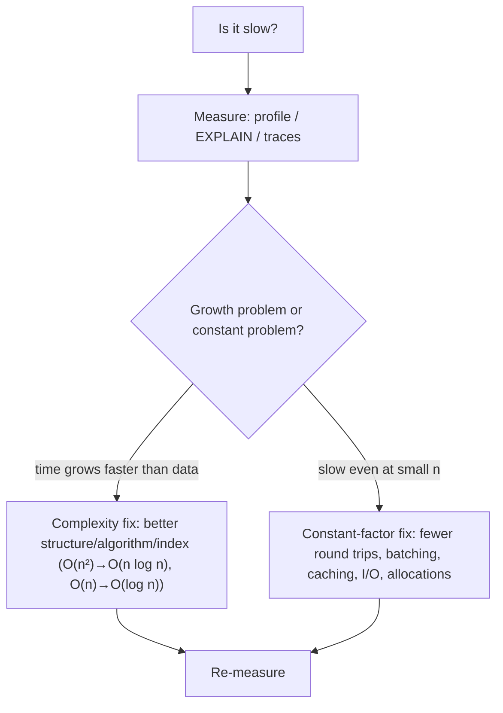

# Big O Notation

> [!abstract] TL;DR
> Big O describes how an algorithm's **time or memory grows as input size n grows**, ignoring constants and lower-order terms. It's an upper bound on growth rate, used to compare approaches before benchmarking. Memorize the common classes (O(1), O(log n), O(n), O(n log n), O(n²), O(2ⁿ)), know the complexity of the data structures you use daily (arrays, hash maps, B-trees, heaps), and remember that **constants, cache locality, I/O and network round trips** often dominate real-world performance at your actual n.

## Introduction
- Comes from mathematics (Bachmann 1894, Landau). Popularized in CS by Knuth in the 1970s, along with Ω (lower bound) and Θ (tight bound).
- It solves comparing algorithms independent of hardware, language or input specifics. It predicts **scalability**: what happens when data grows 10× or 1000×.
- Where it sits: interview staple, but practically it's for spotting **accidental quadratic** code (nested loops over arrays, N+1 queries) and choosing data structures and indexes in [[PostgreSQL]], [[Redis]] and app code.

## Core Concepts

### Definitions
- **O(g(n))**: f(n) ≤ c·g(n) for all n ≥ n₀. An upper bound. "Grows no faster than."
- **Ω(g(n))**: lower bound. **Θ(g(n))**: tight (both). In everyday engineering talk, "O" usually means Θ of the worst case.
- **Worst / average / best case**: e.g. quicksort is O(n log n) average, O(n²) worst. Hash table lookup is O(1) average, O(n) worst (all keys collide).
- **Amortized**: the average cost per operation over a sequence. Dynamic array `push` is O(1) amortized even though an occasional resize is O(n).
- **Space complexity**: extra memory used (auxiliary) or total. Recursion depth counts (call stack).

### Simplification rules
- Drop constants: O(3n + 10) → O(n).
- Keep the dominant term: O(n² + n log n) → O(n²).
- Different inputs get different variables: looping over `users` then `orders` is O(u + o), not O(n). Nested is O(u·o).
- Logarithm base doesn't matter (log₂ vs log₁₀ differ by a constant).

### Common classes (n = 1,000,000)
| Class | Name | ~ operations | Example |
|---|---|---|---|
| O(1) | Constant | 1 | Hash map get, array index |
| O(log n) | Logarithmic | ~20 | Binary search, B-tree index lookup, balanced BST |
| O(n) | Linear | 10⁶ | Scan array, single pass |
| O(n log n) | Linearithmic | ~2×10⁷ | Efficient sort (merge, heap, Timsort), building an index |
| O(n²) | Quadratic | 10¹² ❌ | Nested loops, naive dedupe, bubble sort |
| O(2ⁿ) | Exponential | astronomically ❌ | Brute-force subsets, naive recursive Fibonacci |
| O(n!) | Factorial | ❌ | Brute-force permutations (TSP) |

> At ~10⁸–10⁹ simple ops/sec, O(n²) on 1M items takes **hours**. O(n log n) takes **milliseconds**.

### Data structure cheat sheet (average case)
| Structure | Access | Search | Insert | Delete | Notes |
|---|---|---|---|---|---|
| Array / JS Array | O(1) | O(n) | O(1)* end / O(n) middle | O(n) | *amortized push |
| Hash map (`Map`, `dict`, Redis hash) | — | O(1) | O(1) | O(1) | O(n) worst on collisions |
| Set (hash) | — | O(1) | O(1) | O(1) | `arr.includes` in a loop → use a `Set` |
| Sorted array | O(1) | O(log n) | O(n) | O(n) | Binary search |
| Balanced BST / B-tree | — | O(log n) | O(log n) | O(log n) | DB indexes, Redis sorted set (skip list) |
| Heap / priority queue | O(1) peek | O(n) | O(log n) | O(log n) | Schedulers, top-k |
| Linked list | O(n) | O(n) | O(1) at known node | O(1) at known node | Rarely best in practice (cache misses) |
| Trie | — | O(k) | O(k) | O(k) | k = key length. Autocomplete |

### Analysing code
```ts
// O(n·m) — accidental quadratic: includes() is O(m) inside a loop of n
const vipOrders = orders.filter(o => vipIds.includes(o.customerId));

// O(n + m) — build a Set once
const vip = new Set(vipIds);
const vipOrders2 = orders.filter(o => vip.has(o.customerId));
```
```ts
// O(log n) — binary search on sorted array
function bsearch(a: number[], x: number) {
  let lo = 0, hi = a.length - 1;
  while (lo <= hi) {
    const mid = (lo + hi) >>> 1;
    if (a[mid] === x) return mid;
    a[mid] < x ? (lo = mid + 1) : (hi = mid - 1);
  }
  return -1;
}
```
- Recursion: write the recurrence. Merge sort T(n) = 2T(n/2) + O(n) → O(n log n) (Master theorem). Naive Fibonacci T(n) = T(n-1) + T(n-2) → O(φⁿ). Memoization brings it to O(n).

## Architecture / How It Works



- Big O models **operations**, but real machines care about **memory hierarchy**: an O(n) linear scan over a contiguous array can beat an O(log n) pointer-chasing tree for small n because of CPU cache locality.
- **I/O dominates**: one network round trip (~1 ms in a data centre, 50–200 ms to Malaysia from US regions) is worth ~10⁶ CPU operations. N+1 queries are O(n) **round trips**. Batching makes it O(1) round trips.
- Databases: an index lookup is O(log n) (B-tree), a sequential scan O(n), a nested-loop join without an index O(n·m). `EXPLAIN` shows which one you got.

## Project Structure
N/A — a concept, not a tool. Practical application points: code review checklists (loops inside loops, `.find`/`.includes` inside `.map`), DB query review (`EXPLAIN (ANALYZE)`), load testing with growing data sizes.

## Use Cases
| Use case | Why it matters |
|---|---|
| Choosing data structures | `Set`/`Map` lookups vs array scans |
| Database indexing | O(log n) index lookups vs O(n) seq scans on large tables |
| API pagination | Offset pagination O(offset) vs keyset O(log n) |
| Batch jobs / ETL | Join in memory via hash map O(n+m) instead of nested loops |
| Interviews & technical communication | Shared vocabulary for scalability trade-offs |
| Rate limiters / caches ([[Redis]]) | O(1) / O(log n) commands vs O(n) (`KEYS *`) blocking the server |

## Pros & Cons
| Pros | Cons |
|---|---|
| Hardware-independent way to compare approaches | Ignores constants that dominate at small/medium n |
| Predicts behaviour as data grows | Ignores memory hierarchy, I/O, parallelism, GC |
| Quick mental model for code review | Average vs worst case confusion leads to wrong conclusions |
| Universal vocabulary | Not a substitute for profiling real workloads |

## Alternatives & Peers
| Alternative | Strength vs Big O Notation | Weakness vs Big O Notation | Pick it when… |
|---|---|---|---|
| Benchmarking / profiling | Real numbers on real hardware | Input-specific, doesn't predict growth | Optimizing hot paths at known n |
| Amortized analysis | Accurate for operation sequences | More involved | Dynamic arrays, hash tables, splay trees |
| Cache-oblivious / I/O model | Counts memory/disk transfers | Academic, less familiar | DB engines, large-data algorithms |
| Load testing (k6, Locust) | System-level behaviour incl. network/DB | Slow to set up | Capacity planning |

## Tips & Reminders
> [!tip] Practical heuristics
> - Smell test: a loop inside a loop over growing collections means likely O(n²). `.find`/`.includes`/`.indexOf`/`.filter` inside `.map` is a hidden nested loop.
> - Build lookup tables (`Map`/`Set`) once, outside loops.
> - Sorting is O(n log n). Don't sort inside a loop.
> - In SQL, the "loop" is the join. Missing indexes on join/filter columns turn O(log n) into O(n).
> - For n < ~100, readability beats asymptotics. Optimize when n grows or profiling says so.

> [!tip] In ZP's stack
> - [[n8n]]: "Loop Over Items" + an HTTP/DB call per item = O(n) round trips. Use batch APIs, `IN (...)` queries or Merge-by-key nodes.
> - [[Redis]]: avoid O(n) commands on big keys in production (`KEYS`, `SMEMBERS` on huge sets, `HGETALL` on huge hashes). Use `SCAN`/`SSCAN`.
> - [[PostgreSQL]]: keyset pagination and proper composite indexes keep list endpoints O(log n + page size).
> - React: rendering a 10k-row table is O(n) DOM nodes per render. Virtualize the list.

## Versions & Breaking Changes
N/A — a mathematical notation, stable since the 1970s (Knuth's 1976 paper "Big Omicron and big Omega and big Theta" standardized usage in CS).

## Critical Issues & Gotchas
> [!danger] Algorithmic complexity attacks
> Inputs crafted to hit worst-case complexity:
> - **Hash-flooding** (2011, PHP/Java/Python) forced O(n²) hash table inserts with colliding keys, so a single POST could pin a CPU. Languages moved to randomized hashing (SipHash).
> - **ReDoS**: catastrophic regex backtracking (e.g. `(a+)+$`) goes exponential. Cloudflare's 2019 global outage came from a WAF regex with catastrophic backtracking.
>
> Bound input sizes and use linear-time regex engines (RE2) for user-supplied patterns.

> [!warning] Footguns
> - "O(1)" hash lookups aren't free: hashing long strings is O(k).
> - String concatenation in loops is O(n²) in some languages/runtimes. Use builders/joins.
> - `Array.prototype.shift()` is O(n) in JS. Use an index pointer or a proper queue for BFS-style loops.
> - Recursion depth limits: O(n) recursion can stack-overflow at n ~ 10⁴–10⁵ in JS/Python.
> - Assuming the average case holds under adversarial input (hash collisions, sorted input for naive quicksort).

## Deep Dives
N/A — none planned. Related CS topics: [[Data Structures]], [[Algorithms]].

## Related
- [[Data Structures]] — where each complexity comes from
- [[Algorithms]] — sorting, searching, graph algorithms
- [[System Design]] — scalability beyond single-machine complexity
- [[PostgreSQL]] — index vs scan complexity in practice
- [[Redis]] — command complexities documented per command

## References
- Big-O cheat sheet: https://www.bigocheatsheet.com/
- Knuth, "Big Omicron and big Omega and big Theta" (1976): https://dl.acm.org/doi/10.1145/1008328.1008329
- Redis command complexity (per command docs): https://redis.io/docs/latest/commands/
- Cloudflare 2019 regex outage post-mortem: https://blog.cloudflare.com/details-of-the-cloudflare-outage-on-july-2-2019/
