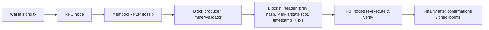

# Blockchain Fundamentals

> [!abstract] TL;DR
> A blockchain is an **append-only, replicated ledger** where mutually distrusting nodes agree on the order of transactions without a central operator.
> - **Building blocks**: hash-linked blocks, Merkle trees, digital signatures, and a **consensus** mechanism (Proof of Work or Proof of Stake) that makes rewriting history economically infeasible.
> - **The price**: low throughput, probabilistic or delayed finality, public data, and irreversible mistakes.
>
> Reach for it only when you need **shared state across parties who don't trust a single operator** (settlement, custody, tokenized assets). Otherwise use a database.

## Introduction
- **Origin**: the Bitcoin whitepaper (Satoshi Nakamoto, 2008; mainnet January 2009) combined hash chains (Haber–Stornetta, 1991), Merkle trees, PoW (Hashcash) and P2P gossip to solve double-spending without a trusted third party.
- **Evolution**:
  - Bitcoin (UTXO, scripting) → [[Ethereum & EVM]] (2015, general-purpose smart contracts).
  - Ethereum's move to PoS (The Merge, 2022-09).
  - Rollup-centric scaling (L2s from 2021), and high-throughput L1s (Solana, Sui, Aptos).
- **Where it sits**: settlement and asset layer under DeFi, stablecoins, tokenization (RWA), payments, NFTs and identity. Apps interact via RPC nodes, [[Web3 Wallets]] and smart contracts written in [[Solidity]] or Rust.

## Core Concepts

### Cryptographic primitives
| Primitive | Role | Examples |
|---|---|---|
| Hash function | Block linking, IDs, PoW puzzle, commitments | SHA-256 (Bitcoin), Keccak-256 (Ethereum) |
| Merkle tree | Compact proof that a tx is in a block (O(log n)) | Bitcoin tx root. Ethereum Merkle-Patricia tries for state |
| Digital signatures | Prove ownership without revealing keys | ECDSA secp256k1, Schnorr (Taproot), BLS (Ethereum validators), Ed25519 (Solana) |
| Key derivation | Many accounts from one seed | BIP-39 mnemonic → BIP-32/44 HD paths |

### Ledger models
| Model | How state works | Used by | Trade-off |
|---|---|---|---|
| **UTXO** | Coins are unspent outputs. A tx consumes inputs, creates outputs | Bitcoin, Cardano (eUTXO) | Parallelizable, privacy-friendlier. Awkward for complex contracts |
| **Account** | Global map address → balance/nonce/code/storage | Ethereum, BNB Chain, Tron | Simple for smart contracts. Nonce ordering, harder parallelism |
| Object/resource | State as owned objects | Sui, Aptos (Move) | Parallel execution. Newer tooling |

### Consensus
| Mechanism | Security comes from | Finality | Examples |
|---|---|---|---|
| **Proof of Work** | Energy/hardware cost: attack needs > 50% hash power | Probabilistic (6 blocks ≈ 1 h on Bitcoin is the convention) | Bitcoin, Litecoin |
| **Proof of Stake** | Staked capital that gets **slashed** for equivocation | Economic finality (Ethereum ≈ 2 epochs ≈ 12.8 min) | Ethereum, Solana, Cardano |
| BFT-style (Tendermint/HotStuff) | ≥ 2/3 honest validators by stake | **Instant/deterministic** (one round) | Cosmos chains, Aptos, Sui |
| Proof of Authority | Known validators | Fast, centralized | Private/consortium chains, testnets |

### Transaction lifecycle
1. User signs a tx in a wallet (nonce, fee, payload).
2. It's broadcast to the **mempool** via P2P gossip.
3. A miner/validator picks txs (usually by fee) and builds a block.
4. The block propagates, and nodes **re-execute and verify** every tx and the header.
5. Confirmations accumulate until the block is **final** (economically irreversible).

### Fees and MEV
- Fees ration scarce blockspace. Ethereum's EIP-1559 splits the fee into a **burned base fee** and a priority tip.
- **MEV** (maximal extractable value): block producers reorder, insert or censor txs for profit (sandwich attacks, arbitrage, liquidations). Ethereum mitigates it with proposer-builder separation (MEV-Boost) and private orderflow.

## Architecture / How It Works

- **Immutability is economic, not magical**: changing block *n* changes its hash, which breaks every later block's `prev_hash`. Rewriting needs majority hash power (PoW) or getting a third or more of stake slashed (PoS).
- **Nodes**: full nodes (verify everything, prune old state), archive nodes (all historical state, TBs), light clients (headers + proofs). Most apps rely on hosted RPC providers (Infura, Alchemy, QuickNode), which is a centralization and trust point.
- **Scaling trilemma**: decentralization, security, scalability, where you pick two at L1. Scaling paths:
  - **L2 rollups** (optimistic: Arbitrum, Optimism, Base; ZK: zkSync, Starknet, Scroll) post data/proofs to L1.
  - **Sidechains**: own consensus, weaker security.
  - **State channels** (Lightning).
- **Oracles** (Chainlink, Pyth) bring off-chain data on-chain, and are a frequent attack surface (price manipulation).
- **Bridges** lock assets on chain A and mint on chain B. They're historically the **largest hack category**.

### Reorg-safe event indexing (off-chain side)
```ts
// viem: poll finalized blocks only for money-moving logic; track block hashes for "latest"-based UX
import { createPublicClient, http, parseAbiItem } from 'viem';
import { mainnet } from 'viem/chains';

const client = createPublicClient({ chain: mainnet, transport: http(process.env.RPC_URL) });
const transfer = parseAbiItem('event Transfer(address indexed from, address indexed to, uint256 value)');

const finalized = await client.getBlock({ blockTag: 'finalized' });
const from = await cursor.get();                                    // last processed finalized block
const logs = await client.getLogs({ address: USDC, event: transfer, fromBlock: from + 1n, toBlock: finalized.number });
await db.tx(async (t) => {
  for (const l of logs) await t.insertDeposit({ txHash: l.transactionHash, logIndex: l.logIndex, blockHash: l.blockHash, ...l.args });   // unique (txHash, logIndex)
  await cursor.set(finalized.number, t);
});
```
- Idempotency key = `(tx_hash, log_index)`. Credit balances only from finalized data. Show "pending" for unfinalized blocks.

## Project Structure
N/A — a concept note. Practical setups live in [[Ethereum & EVM]] (nodes, RPC, tooling) and [[Solidity]] (Foundry/Hardhat projects).

## Use Cases
| Use case | Why it fits |
|---|---|
| Stablecoins and cross-border payments | 24/7 settlement, programmable money (USDT, USDC). Rails for remittances |
| DeFi (lending, DEXs, derivatives) | Composable open contracts, transparent collateral |
| Tokenization of real-world assets (RWA) | Fractional ownership, automated compliance in contracts (permissioned tokens) |
| Custody and proof of reserves | Verifiable on-chain balances (Merkle-proof PoR for exchanges) |
| Supply-chain / document notarization | Timestamped hash anchoring (store hashes, not data) |
| Internal company database, CRM, SME inventory | **Poor fit**. A [[PostgreSQL]] database is cheaper, faster, private and editable |

## Pros & Cons
| Pros | Cons |
|---|---|
| No single operator. Censorship-resistant | Low throughput / high latency vs databases |
| Tamper-evident history, public auditability | All data public by default (privacy, PDPA conflicts) |
| Programmable assets (smart contracts) | Bugs are irreversible. Exploits drain funds in one tx |
| Global, permissionless access 24/7 | Key management burden on users (lost keys = lost funds) |
| Composability between protocols | Regulatory uncertainty, licensing requirements |
| Open-source, verifiable rules | Fee volatility, MEV, UX complexity |

## Alternatives & Peers
| Alternative | Strength vs blockchain | Weakness vs blockchain | Pick it when… |
|---|---|---|---|
| Central database ([[PostgreSQL]]) + audit log | Fast, cheap, private, editable | Trust the operator | One organization controls the data (most apps) |
| Append-only ledgers (immudb, QLDB-style, pgaudit) | Tamper-evident, simple | Still centralized | Audit trails without multi-party trust |
| Permissioned chains (Hyperledger Fabric, Corda, Besu QBFT) | Privacy, known participants, higher throughput | Consortium governance, small ecosystems | Multi-company workflows with legal agreements |
| Traditional payment rails (DuitNow, FPX, SWIFT) | Regulated, reversible, consumer protection | Banking hours, intermediaries, FX costs | Domestic payments in Malaysia |
| Signed documents + timestamps (RFC 3161) | Legal recognition, no chain | Trust in TSA | Notarization without crypto exposure |

## Tips & Reminders
> [!tip]
> - Ask the "do you need a blockchain" questions: multiple writers? No trusted operator? Need public verifiability? If any answer is no, use a database.
> - Store **hashes on-chain, data off-chain** (IPFS/S3 + hash). It's cheaper and keeps personal data off an immutable ledger.
> - Treat finality per chain explicitly: credit deposits only after N confirmations or finalized checkpoints (Ethereum: the `finalized` block tag).
> - Use multiple RPC providers with failover. Hosted RPC outages are common single points of failure.
> - **In ZP's stack**: for crypto-adjacent products (exchange tooling, deposit monitoring), index chain events into [[PostgreSQL]] via a worker (viem/ethers + reorg-aware cursors), push alerts via [[n8n]], and keep custody/signing in a hardened, separate service or MPC/HSM provider, never in the web app.
> - **Malaysia**: operating a digital-asset exchange, custody or token offering needs **Securities Commission Malaysia** registration (DAX/DAC/IEO operator rules under the CMSA prescription order, 2019+). BNM doesn't recognize crypto as legal tender. AMLA reporting obligations apply.

## Versions & Breaking Changes
| Milestone | Date | Key changes | Impact |
|---|---|---|---|
| Bitcoin genesis | 2009-01 | PoW + UTXO ledger | First decentralized digital cash |
| Ethereum mainnet | 2015-07 | Account model + EVM smart contracts | Programmable money, tokens (ERC-20) |
| Bitcoin SegWit / Taproot | 2017-08 / 2021-11 | Witness separation, Schnorr signatures, MAST | Lightning viable, cheaper multisig |
| EIP-1559 (London) | 2021-08 | Base-fee burn | Predictable fees |
| **The Merge** | 2022-09 | Ethereum PoW → PoS | ~99.9% less energy. Miners gone |
| Dencun (EIP-4844 blobs) | 2024-03 | Cheap data blobs for rollups | L2 fees dropped ~10–100× |
| Bitcoin 4th halving | 2024-04 | Block subsidy 6.25 → 3.125 BTC | Miner economics |
| Ethereum Pectra / Fusaka | 2025-05 / 2025-12 | Smart-account EOAs (EIP-7702), higher blob capacity (PeerDAS) | See [[Ethereum & EVM]] |

## Critical Issues & Gotchas
> [!danger] Bridges and key compromise are the biggest losses
> - **Ronin** (2022, ~USD 625M): 5 of 9 validator keys compromised.
> - **Wormhole** (2022, ~USD 325M): signature verification bug.
> - **Bybit** (2025-02, ~USD 1.5B, attributed to North Korea's Lazarus Group): a compromised Safe{Wallet} front-end tricked signers into approving a malicious multisig upgrade.
>
> Lesson: multisig doesn't help if every signer blindly signs what a compromised UI shows. Verify calldata independently and use hardware signers.

> [!danger] Immutability vs data protection
> Personal data written on-chain can never be deleted, which conflicts with PDPA/GDPR rights to correction and erasure. Never put personal data, even hashed low-entropy data like IC numbers or phone numbers, on a public chain.

> [!warning] Gotchas
> - **Reorgs**: recent blocks can be replaced. Indexers must handle rollbacks (store block hashes, re-check parents).
> - "Decentralized" apps often rely on centralized pieces: RPC providers, front-end hosting, admin multisigs, upgradeable proxies, oracles. Each is a trust and failure point.
> - 51% attacks are realistic on small PoW chains (Ethereum Classic suffered several reorg attacks in 2020).
> - Stablecoins carry issuer, depeg and regulatory risk (TerraUSD collapse, 2022-05, ~USD 40B wiped). Issuers can freeze addresses.
> - Test on testnets (Sepolia, Holesky's successor Hoodi), but mainnet behaviour (MEV, gas spikes) differs.

## Deep Dives
N/A — no deep dives planned yet. Candidates: consensus & finality, L2 rollups & bridges.

## Related
- [[Ethereum & EVM]] — the dominant smart-contract platform
- [[Solidity]] — writing contracts
- [[Web3 Wallets]] — keys, signing, account abstraction
- [[System Design]] — consistency and consensus in distributed systems
- [[PostgreSQL]] — the usual off-chain index and app database
- [[Network Security]] — infrastructure hardening for nodes and signers

## References
- Bitcoin whitepaper: https://bitcoin.org/bitcoin.pdf
- Ethereum docs (intro to blockchains): https://ethereum.org/en/developers/docs/intro-to-ethereum/
- Mastering Bitcoin (open edition): https://github.com/bitcoinbook/bitcoinbook
- Rekt leaderboard (exploits): https://rekt.news/leaderboard/
- SC Malaysia digital assets: https://www.sc.com.my/development/digital
