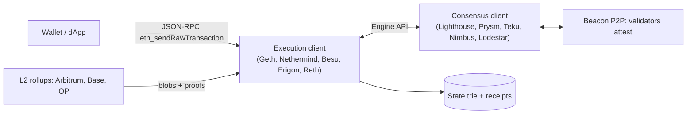

# Ethereum & EVM

> [!abstract] TL;DR
> Ethereum is a Proof-of-Stake smart-contract chain. The **EVM** is its deterministic, gas-metered, 256-bit stack machine, and it's the de facto standard runtime for smart contracts: Arbitrum, Base, Optimism, BNB Chain, Polygon and Avalanche C-Chain all run EVM bytecode.
> - **Scaling**: Ethereum L1 is the settlement and data-availability layer, and most user activity runs on **L2 rollups** that post blobs to it.
> - **Upgrades**: Pectra (2025-05) brought EIP-7702 smart-account EOAs. Fusaka (2025-12) brought PeerDAS and more blobs. **Glamsterdam** (ePBS, block access lists, higher gas limit) targets Q4 2026.

## Introduction
- **Origin**: proposed by Vitalik Buterin (2013) and launched 2015-07. It's maintained by a decentralized set of client teams, with the Ethereum Foundation coordinating research and All Core Devs calls.
- **Problem**: Bitcoin's scripting was intentionally limited. Ethereum provides a Turing-complete (gas-bounded) environment for arbitrary programs (**smart contracts**) holding and moving assets.
- **Where it sits**: the reference platform for DeFi, stablecoins (USDC/USDT on Ethereum and L2s), tokenization and NFTs. App stack: contracts in [[Solidity]]/Vyper → RPC nodes → [[TypeScript]] libraries (viem, ethers) → [[Web3 Wallets]].

## Core Concepts

### Accounts
| Type | Controlled by | Has code | Notes |
|---|---|---|---|
| **EOA** (externally owned) | Private key (secp256k1) | No, but since Pectra it can **delegate** to code via EIP-7702 | Pays gas, has a nonce |
| **Contract account** | Its code | Yes (immutable bytecode, unless a proxy pattern) | Has storage, can't initiate txs |
| Smart account (ERC-4337 / 7702) | Arbitrary validation logic | Yes | Batching, gas sponsorship, passkeys, session keys |

- Address = last 20 bytes of `keccak256(pubkey)`. EIP-55 mixed-case checksum.
- Units: 1 ETH = 10⁹ gwei = 10¹⁸ wei. Always use `bigint`/`uint256`, never floats.

### Gas and fees (EIP-1559)
- `fee = gasUsed × (baseFee + priorityFee)`. The **base fee is burned** and adjusts ±12.5% per block towards a 50% full target. The tip goes to the proposer.
- `maxFeePerGas` caps the total, and unused headroom is refunded.
- **Blob gas** (EIP-4844) is a separate fee market for rollup data. Blobs are pruned after ~18 days.
- Gas limit per block is set by validator voting: ~60M after Fusaka, with a path to ~200M discussed for Glamsterdam.

### Transaction types
| Type | EIP | Purpose |
|---|---|---|
| 0 | legacy | `gasPrice` |
| 1 | 2930 | Access lists |
| **2** | 1559 | Default: base fee + tip |
| 3 | 4844 | Blob-carrying (rollups) |
| 4 | 7702 | Set EOA code delegation (authorization list) |

### EVM data locations
| Location | Lifetime | Cost | Use |
|---|---|---|---|
| Stack | Instruction | Cheapest | 1024 × 256-bit words |
| Memory | Call | Expands quadratically | Temporary arrays, ABI encoding |
| Calldata | Tx (read-only) | Cheap to read | Function inputs |
| **Storage** | Permanent | `SSTORE` new slot 20k gas. Cold `SLOAD` 2,100 | Contract state (2²⁵⁶ slots × 32 bytes) |
| Transient storage (EIP-1153) | Tx | ~100 gas | Reentrancy locks, intra-tx flags |
| Logs/events | Permanent, not readable by contracts | Cheap-ish | Off-chain indexing |

### Standards (ERCs)
ERC-20 (fungible tokens), ERC-721/1155 (NFTs), ERC-4626 (tokenized vaults), EIP-2612 (permit, gasless approvals), EIP-712 (typed structured signing), ERC-4337 (account abstraction), ERC-1967 (proxy storage slots).

## Architecture / How It Works

- **Two clients per node** since The Merge. The execution layer runs the EVM, keeps state and serves the mempool. The consensus layer runs PoS (Gasper: LMD-GHOST fork choice + Casper FFG finality).
- **Time**: 12-second **slots**, 32 slots = 1 **epoch** (6.4 min). A block is **finalized** after 2 epochs (~12.8 min) when ≥ 2/3 of stake attests.
- **Validators**: 32 ETH minimum stake. Pectra (EIP-7251) raised the max effective balance to 2,048 ETH (consolidation). Penalties apply for downtime, and **slashing** for double-signing.
- **Execution**: each tx runs bytecode opcode by opcode, charging gas per opcode. Out-of-gas reverts state changes but still charges the gas. State root, receipts root and logs bloom go into the block header.
- **MEV**: today ~90% of blocks are built by external builders via MEV-Boost relays (off-protocol). **ePBS** (EIP-7732, Glamsterdam) moves proposer-builder separation into the protocol.
- **L2 security**: optimistic rollups rely on fraud proofs with a 7-day withdrawal window. ZK rollups rely on validity proofs. Many still have **upgradeable contracts controlled by multisigs** (check L2BEAT "stages").

## Project Structure
Typical dApp monorepo:
```text
dapp/
├── contracts/                # Foundry project
│   ├── foundry.toml
│   ├── src/Vault.sol
│   ├── test/Vault.t.sol      # forge test (fuzzing, invariants)
│   └── script/Deploy.s.sol   # forge script --broadcast --verify
├── indexer/                  # Ponder / custom viem worker → PostgreSQL
└── web/                      # Next.js + wagmi + viem + a wallet connector (RainbowKit, Reown)
```
```bash
forge init contracts && cd contracts
forge test -vvv --fuzz-runs 10000
anvil --fork-url $MAINNET_RPC                           # local fork of mainnet state
cast call $USDC "balanceOf(address)(uint256)" $ADDR --rpc-url $RPC
forge script script/Deploy.s.sol --rpc-url $SEPOLIA_RPC --broadcast --verify
```
```ts
// viem: read + write with typed ABI
import { createPublicClient, createWalletClient, http, parseUnits } from 'viem';
import { base } from 'viem/chains';
const pub = createPublicClient({ chain: base, transport: http(RPC) });
const bal = await pub.readContract({ address: USDC, abi: erc20Abi, functionName: 'balanceOf', args: [user] });
const hash = await wallet.writeContract({ address: USDC, abi: erc20Abi, functionName: 'transfer', args: [to, parseUnits('10', 6)] });
const receipt = await pub.waitForTransactionReceipt({ hash, confirmations: 2 });
```

## Use Cases
| Use case | Why it fits |
|---|---|
| Stablecoin payments / treasury | Deepest USDC/USDT liquidity, L2 fees of a few cents |
| DeFi integrations (swaps, lending, yield) | Largest composable ecosystem (Uniswap, Aave, Morpho) |
| Tokenized assets (RWA, funds) | Institutional adoption (BlackRock BUIDL etc.), permissioned ERC-20 variants |
| Exchange deposit/withdrawal infra | One codebase covers all EVM chains (same addresses, RPC, ABI) |
| On-chain identity / attestations | EAS, ENS, Sign-In with Ethereum (EIP-4361) |
| High-frequency micro-transactions on L1 | **Poor fit**. Use an L2 or a non-blockchain system |

## Pros & Cons
| Pros | Cons |
|---|---|
| Most battle-tested smart-contract platform, highest economic security | L1 fees still spike under demand. UX pushes users to L2s |
| EVM is the industry standard: write once, deploy to dozens of chains | Liquidity and UX are fragmented across L2s, and bridging adds risk |
| Multiple independent clients (client diversity) | Complex upgrade cadence. Breaking gas/opcode changes for contracts |
| Mature tooling (Foundry, viem, OpenZeppelin, Tenderly) | Smart-contract bugs are permanent and public |
| Credible neutrality, strong decentralization of validators | Staking is concentrated (Lido, CEXs), and MEV centralizes block building |
| Rollup-centric roadmap scales without sacrificing L1 security | Many L2s still have centralized sequencers and upgrade keys |

## Alternatives & Peers
| Alternative | Strength vs Ethereum | Weakness vs Ethereum | Pick it when… |
|---|---|---|---|
| Ethereum L2s (Base, Arbitrum, OP) | 10–100× cheaper, same EVM | Sequencer centralization, bridge/withdrawal delays | Consumer apps, payments (default choice) |
| Solana | Single global state, ~400 ms slots, very low fees | Different VM (SVM, Rust), past outages | High-frequency trading, consumer apps on one chain |
| BNB Chain | Cheap EVM, large Asian retail base | Small validator set, Binance-centric | Retail reach in Asia |
| Tron | Dominant USDT transfer rail in SEA/emerging markets | Centralized governance | Stablecoin transfer support for exchanges |
| Move chains (Sui, Aptos) | Resource-safe language, parallel execution | Smaller ecosystems | New protocols valuing safety/performance |
| Permissioned EVM (Besu QBFT) | Privacy, known validators | No public liquidity | Consortium/enterprise pilots |

## Tips & Reminders
> [!tip]
> - Use the **`finalized`** (or `safe`) block tag for crediting deposits. `latest` can reorg.
> - Prefer **viem** (typed, tree-shakable) for new TS code. ethers v6 is fine for existing code. Use **Foundry** for contracts (Solidity tests, fuzzing, fork tests).
> - Approvals: use exact amounts or Permit2 and support revocation. Unlimited approvals are the top retail drain vector.
> - Verify contracts on Etherscan/Blockscout/Sourcify, and pin compiler versions.
> - Check L2 maturity on L2BEAT before custodying funds there.
> - **In ZP's stack**: for exchange-style deposit monitoring, run a viem indexer worker per chain (Base, Arbitrum, Ethereum, BSC) writing to [[PostgreSQL]] with `(chain_id, tx_hash, log_index)` uniqueness and finalized cursors. Use ≥2 RPC providers, and route alerts through [[n8n]]. Keep hot-wallet signing in an isolated service with MPC/HSM and withdrawal limits, never in the API process.

## Versions & Breaking Changes
| Upgrade | Released | Key changes | Breaking / migration notes |
|---|---|---|---|
| Frontier → Homestead | 2015-07 / 2016-03 | Launch, stability | — |
| (DAO fork) | 2016-07 | Irregular state change after The DAO hack | Chain split → Ethereum Classic |
| London | 2021-08 | **EIP-1559** base fee burn | Wallets/tx builders moved to type-2 txs |
| **The Merge** (Paris) | 2022-09 | PoW → PoS. `DIFFICULTY` → `PREVRANDAO` | Contracts using difficulty as randomness changed |
| Shanghai/Capella | 2023-04 | Staking withdrawals, `PUSH0` | `PUSH0` broke deployments of 0.8.20+ bytecode on L2s lacking it |
| Dencun | 2024-03 | **EIP-4844 blobs**, transient storage (1153), `SELFDESTRUCT` neutered (6780) | `SELFDESTRUCT` no longer deletes code (except same-tx creation) |
| **Pectra** | 2025-05 | **EIP-7702** EOA code delegation, max effective balance 2,048 ETH (7251), BLS precompile, more blobs | 7702 breaks `tx.origin == msg.sender` "is EOA" checks |
| **Fusaka** | 2025-12 | **PeerDAS** (data-availability sampling), blob-parameter-only forks, gas limit ~60M, tx gas cap (EIP-7825) | Very large single txs (> ~16.7M gas) rejected |
| Glamsterdam | Target Q4 2026 | **ePBS** (7732), **block-level access lists** (7928), state/gas repricing, larger contract size limit, cheaper ETH transfers | Gas-cost assumptions in contracts may break. Testnets from 2026-10 |

> [!warning] Unverified — check before relying on this
> Glamsterdam's final EIP list and mainnet date were still moving in October 2026 (testnets slipped at least once). Check https://ethereum.org/roadmap and the All Core Devs notes.

## Critical Issues & Gotchas
> [!danger] Permanent losses from contract bugs and key management
> - **The DAO** (2016): reentrancy drained 3.6M ETH and led to the hard fork.
> - **Parity multisig** (2017): a user "accidentally" self-destructed a library and froze 513k ETH forever.
> - **Bybit** (2025-02): ~USD 1.5B lost via a compromised Safe front-end that showed signers benign data.
>
> Mitigation: audits + fuzz/invariant tests, timelocks on upgrades, hardware wallets with **clear signing** (decode calldata on-device), and independent tx simulation before multisig approval.

> [!danger] EIP-7702 phishing ("sweeper delegations")
> After Pectra, attackers trick users into signing a 7702 authorization delegating their EOA to a malicious contract, which then drains every asset the account will ever receive. Wallets must display delegation requests prominently. Treat any "upgrade your account" signature request as high-risk.

> [!danger] Client bugs and finality incidents
> In May 2023 the Beacon Chain **lost finality twice** (~25 min and ~1 h) due to consensus-client load bugs. A single client with > 1/3 share having a bug can halt finality, and one with > 2/3 can finalize an invalid chain. Run minority clients if you operate validators/nodes.

> [!warning] Gotchas
> - `tx.origin` for auth is unsafe (phishing via intermediary contracts), and `extcodesize == 0` no longer proves "EOA" (constructor calls, 7702).
> - Token decimals vary (USDC/USDT 6, most ERC-20s 18). USDT's `approve` requires resetting to 0 first, and some tokens don't return `bool`. Use OpenZeppelin `SafeERC20`.
> - Nonce management: concurrent sends from one hot wallet need a nonce manager. A stuck low-nonce tx blocks all later ones (replace with a higher fee, same nonce).
> - Same address on multiple EVM chains ≠ same contract. Funds sent to a contract address on the wrong chain may be unrecoverable.
> - Archive data (historical state) needs archive nodes or paid RPC tiers. Plan indexing before launch.

## Deep Dives
N/A — no deep dives planned yet. Candidates: gas optimization & EVM internals, L2 rollups & bridging.

## Related
- [[Blockchain Fundamentals]] — consensus, finality, ledger models
- [[Solidity]] — contract language for the EVM
- [[Web3 Wallets]] — keys, signing, EIP-7702 / ERC-4337 smart accounts
- [[TypeScript]] — viem/ethers/wagmi client code
- [[PostgreSQL]] — off-chain indexing
- [[Next.js]] — dApp front ends

## References
- Ethereum developer docs: https://ethereum.org/en/developers/docs/
- EVM opcodes and gas: https://www.evm.codes/
- Ethereum roadmap: https://ethereum.org/en/roadmap/
- EIPs: https://eips.ethereum.org/
- Glamsterdam overview: https://everstake.one/resources/blog/ethereum-glamsterdam-upgrade-explained
- L2BEAT: https://l2beat.com/
- Foundry book: https://book.getfoundry.sh/
- viem: https://viem.sh/
