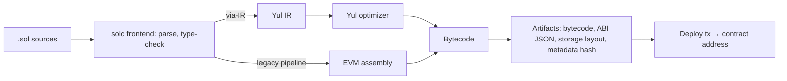

# Solidity

> [!abstract] TL;DR
> Solidity is the dominant statically typed, contract-oriented language that compiles to [[Ethereum & EVM|EVM]] bytecode. It looks like JavaScript/C++, but the semantics are closer to a database transaction with money attached:
> - Every state write costs gas.
> - Every function is a public API attackers will call in the worst order.
> - Deployed code is immutable unless you deliberately use a proxy.
>
> Use **0.8.x** (latest **0.8.36**, 2026-07), **Foundry** for build/test/fuzz, **OpenZeppelin 5.x** for standard components, and treat security (reentrancy, access control, oracle manipulation, upgrade safety) as the main engineering work.

## Introduction
- **Origin**: proposed by Gavin Wood (2014). It's developed by the Solidity team (Argot Collective, formerly part of the Ethereum Foundation). The compiler is `solc`, written in C++, with a Yul intermediate representation.
- **Problem**: a high-level language for contracts that hold and move value on EVM chains, with an ABI so off-chain code and other contracts can call it.
- **Where it sits**: contracts in Solidity → compiled with Foundry/Hardhat → deployed to Ethereum or L2s → called from [[TypeScript]] (viem/ethers) front ends and indexers, and signed by users' [[Web3 Wallets]]. Peers: Vyper (Pythonic EVM language) and Rust-based ecosystems (Solana, Stylus on Arbitrum).

## Core Concepts

### Anatomy of a contract
```solidity
// SPDX-License-Identifier: MIT
pragma solidity 0.8.36;                                   // pin exact version for deployments

import {ERC20} from "@openzeppelin/contracts/token/ERC20/ERC20.sol";
import {Ownable} from "@openzeppelin/contracts/access/Ownable.sol";
import {ReentrancyGuardTransient} from "@openzeppelin/contracts/utils/ReentrancyGuardTransient.sol";

contract Vault is Ownable, ReentrancyGuardTransient {
    ERC20 public immutable asset;                         // set once in constructor, stored in bytecode
    uint256 public constant MAX_DEPOSIT = 1_000_000e6;    // compile-time constant
    mapping(address user => uint256 shares) public sharesOf;
    uint256 public totalShares;

    event Deposited(address indexed user, uint256 amount);
    error ZeroAmount();
    error ExceedsMax(uint256 requested, uint256 max);

    constructor(ERC20 asset_, address owner_) Ownable(owner_) { asset = asset_; }

    function deposit(uint256 amount) external nonReentrant {
        if (amount == 0) revert ZeroAmount();
        if (amount > MAX_DEPOSIT) revert ExceedsMax(amount, MAX_DEPOSIT);
        sharesOf[msg.sender] += amount;                   // effects before interactions
        totalShares += amount;
        emit Deposited(msg.sender, amount);
        asset.transferFrom(msg.sender, address(this), amount);   // use SafeERC20 for arbitrary tokens
    }
}
```

### Language essentials
| Concept | Key points |
|---|---|
| Visibility | `external` (ABI only), `public` (ABI + internal + auto getter), `internal`, `private` (still **readable on-chain**: private ≠ secret) |
| Mutability | `view` (reads state), `pure` (no state), `payable` (accepts ETH) |
| Data locations | `storage` (persistent), `memory` (call-scoped), `calldata` (read-only input, cheapest), `transient` state vars (0.8.28+, cleared per tx) |
| Types | `uint256`/`int256` (and smaller sizes), `address`/`address payable`, `bytes32`, `bytes`, `string`, `mapping`, structs, enums, fixed/dynamic arrays, user-defined value types |
| Errors | `require(cond, CustomError())` (0.8.26+), `revert CustomError(args)`, `assert` for invariants (Panic). Custom errors are cheaper than strings |
| Arithmetic | **Checked by default since 0.8.0** (overflow reverts). `unchecked { }` to opt out where provably safe |
| Special functions | `constructor`, `receive()` (plain ETH), `fallback()` (unknown selector), modifiers |
| Inheritance | Multiple, C3-linearized (right-most base is "most derived"). `virtual`/`override` required |
| Libraries & interfaces | `library` (internal functions inlined, or external linked), `interface` (ABI-only) |
| Globals | `msg.sender`, `msg.value`, `block.timestamp`, `block.chainid`, `tx.origin` (avoid for auth) |

### Storage layout
- State variables pack into 32-byte **slots** in declaration order. Small types share a slot if they fit (`uint128 a; uint128 b;` = 1 slot).
- `mapping(k => v)` value lives at `keccak256(abi.encode(k, slot))`. Dynamic arrays live at `keccak256(slot) + i`.
- **Upgradeable contracts** must never reorder or remove existing variables. Use **ERC-7201 namespaced storage** (0.8.35 adds an `erc7201(...)` builtin to compute the base slot).

## Architecture / How It Works

- **ABI encoding**: a function is selected by the first 4 bytes of `keccak256("transfer(address,uint256)")`. Arguments are ABI-encoded in calldata. Events are logs with up to 3 `indexed` topics.
- **via-IR** (`--via-ir`) compiles through Yul with more aggressive optimization and fixes "stack too deep" in many cases, but compiles slower. **Audit with the same pipeline you deploy.**
- **Optimizer `runs`**: low (200) optimizes deployment cost; high (10,000+) optimizes call cost for hot contracts.
- **EVM version target** (`evmVersion`): newer defaults (Shanghai `PUSH0`, Cancun `MCOPY`/transient storage, Prague) emit opcodes that older or other EVM chains may lack. Set it explicitly per target chain.
- **Contract size limit**: 24,576 bytes of runtime code (EIP-170). Split into libraries/modules or use the diamond pattern if you exceed it.
- **Calls between contracts**:
  - `call` executes in the callee's context.
  - `delegatecall` executes the callee's code in **your** storage. That's the basis for proxies, and the source of the most catastrophic bugs.
  - `staticcall` is read-only.

## Project Structure
```text
contracts/                      # Foundry
├── foundry.toml                # solc_version, optimizer, via_ir, evm_version, remappings
├── src/
│   ├── Vault.sol
│   └── interfaces/IVault.sol
├── test/
│   ├── Vault.t.sol             # unit + fuzz tests (forge-std Test)
│   └── invariant/VaultInvariants.t.sol
├── script/Deploy.s.sol         # forge script --broadcast --verify
├── lib/                        # forge install: openzeppelin-contracts, forge-std
└── .github/workflows/ci.yml    # forge fmt --check, forge build --sizes, forge test, slither
```
```solidity
// test/Vault.t.sol: fuzzing is the default style in Foundry
function testFuzz_DepositMintsShares(uint256 amount) public {
    amount = bound(amount, 1, vault.MAX_DEPOSIT());
    deal(address(usdc), alice, amount);
    vm.startPrank(alice);
    usdc.approve(address(vault), amount);
    vault.deposit(amount);
    assertEq(vault.sharesOf(alice), amount);
}
```

## Use Cases
| Use case | Why it fits |
|---|---|
| Tokens (ERC-20/721/1155), stablecoins | Standard interfaces, OpenZeppelin implementations |
| DeFi protocols (AMMs, lending, vaults ERC-4626) | Largest ecosystem of audited building blocks |
| Multisig / treasury / escrow | Safe contracts, timelocks, programmable release conditions |
| Account abstraction (ERC-4337 accounts, 7702 delegates) | Custom validation logic for wallets |
| Tokenized RWA with compliance hooks | Transfer restrictions, allow-lists (ERC-3643-style) |
| Heavy computation, private data, large storage | **Poor fit**. Compute off-chain, prove on-chain (ZK) or store hashes only |

## Pros & Cons
| Pros | Cons |
|---|---|
| De facto EVM standard: largest talent pool, docs, audits | Footgun-rich semantics (delegatecall, reentrancy, storage collisions) |
| Mature tooling (Foundry, Hardhat, Slither, Echidna, Certora) | Bugs are permanent and directly monetizable by attackers |
| OpenZeppelin/Solady battle-tested libraries | Gas optimization pressure leads to unreadable assembly |
| Deploys to every EVM chain unchanged | Compiler bugs exist (track the known-bugs list per version) |
| Checked arithmetic, custom errors, transient storage | Upgrade patterns add complexity and governance risk |
| Static typing + ABI makes integration predictable | 24 KB size limit and "stack too deep" friction |

## Alternatives & Peers
| Alternative | Strength vs Solidity | Weakness vs Solidity | Pick it when… |
|---|---|---|---|
| Vyper | Simpler, Pythonic, fewer footguns, auditable | Smaller ecosystem. 2023 compiler reentrancy-lock bug (Curve exploit) | Simple, security-critical contracts (Curve-style) |
| Huff / raw Yul | Maximum gas control | Unreadable, error-prone | Micro-optimized primitives only |
| Rust (Solana/Anchor) | Memory safety, parallel runtime | Different chain/VM | Building on Solana |
| Rust/C via Arbitrum Stylus (WASM) | Cheaper compute, existing Rust libs | Arbitrum-only, newer | Compute-heavy logic on Arbitrum |
| Move (Sui/Aptos) | Resource types prevent double-spend classes of bugs | Non-EVM, smaller ecosystem | Building on Move chains |

## Tips & Reminders
> [!tip]
> - **Checks-effects-interactions**: validate → update state → external calls last. Add `nonReentrant` on functions that call out.
> - Use OpenZeppelin `SafeERC20`, `AccessControl`/`Ownable2Step`, `Pausable`, and `ReentrancyGuardTransient` instead of rolling your own.
> - Pin `pragma solidity 0.8.36;` (exact) for deployed contracts. Use `^0.8.x` only in libraries.
> - Run `slither .`, `forge test --fuzz-runs 10000`, invariant tests, and `forge coverage` in CI. Use mainnet-fork tests for integrations (`--fork-url`).
> - Emit events for every state change an off-chain system needs. Indexers can't read storage history cheaply.
> - Prefer immutable contracts. If upgradeable, use UUPS/transparent proxies with a **timelock + multisig** and storage-layout checks (`forge inspect storageLayout`, the OZ upgrades plugin).
> - **In ZP's stack**: most client work is integration, not contract authoring: reading/writing existing contracts via viem from [[Node.js]] workers and Next.js. If a client needs a custom token or escrow, start from OpenZeppelin Wizard, keep logic minimal, and budget for an external audit (typically USD 5k–50k+). Don't ship unaudited contracts holding client funds.

## Versions & Breaking Changes
| Version | Released | Key changes | Breaking / migration notes |
|---|---|---|---|
| 0.5.0 | 2018-11 | Explicit data locations, `address payable` | Many syntax breaks |
| 0.6.0 | 2019-12 | `virtual`/`override`, `try/catch`, `receive`/`fallback` split | Inheritance annotations required |
| 0.7.0 | 2020-07 | `now` removed, constructor visibility removed | Minor syntax |
| **0.8.0** | 2020-12 | **Checked arithmetic by default**, ABI coder v2 default | `unchecked` for wrapping math. SafeMath obsolete |
| 0.8.4 | 2021-04 | Custom errors | — |
| 0.8.20 | 2023-05 | Default EVM Shanghai (`PUSH0`) | Bytecode failed on chains without `PUSH0`. Set `evmVersion` |
| 0.8.24–0.8.25 | 2024-01/03 | Cancun: `tstore`/`tload`, `mcopy`. Cancun default | — |
| 0.8.28 | 2024-10 | **Transient state variables** (value types) | — |
| 0.8.30 | 2025-05 | Default EVM Prague | — |
| 0.8.34 | 2026-02 | Fix for a **high-severity IR-pipeline bug** clearing storage/transient variables | Affects `delete` on transient vars under via-IR. Recompile and redeploy if affected |
| 0.8.35 | 2026-04 | `erc7201()` builtin, `--experimental` flag for in-dev features | — |
| **0.8.36** | 2026-07 | Two medium-severity bug fixes. Experimental EOF backend removed (EOF dropped from Fusaka) | — |

> [!warning] Unverified — check before relying on this
> No 0.9.0 release was confirmed as of 2026-10. Breaking changes accumulate on the `breaking` branch. Check https://soliditylang.org/blog/category/releases/ and the per-version known-bugs list (`docs.soliditylang.org/en/latest/bugs.html`).

## Critical Issues & Gotchas
> [!danger] Reentrancy and cross-function state
> The DAO (2016, 3.6M ETH) and countless later exploits (read-only reentrancy via `view` functions used as oracles, ERC-777/1155 callback hooks) come from making external calls before state is consistent. Mitigation: checks-effects-interactions, reentrancy guards across **all** functions sharing state, and never trusting a `view` of another protocol mid-transaction.

> [!danger] Upgrade and initialization bugs
> - **Parity** (2017): an uninitialized library contract was claimed and self-destructed, freezing 513k ETH.
> - **Nomad bridge** (2022, ~USD 190M): an upgrade initialized the trusted root to `0x00`, making every message "proven", and was copy-paste exploited by hundreds of addresses.
>
> Mitigation: `_disableInitializers()` in implementation constructors, initializer tests, upgrade simulations on forks, and timelocked upgrades.

> [!danger] Compiler and toolchain bugs
> The 2023 Vyper reentrancy-lock bug (versions 0.2.15–0.3.0) let attackers drain ~USD 70M from Curve pools despite correct-looking source code. Solidity has had its own optimizer/IR bugs (e.g. the 0.8.34 fix). Check the compiler's known-bugs list for your exact version and pipeline.

> [!warning] Gotchas
> - `private` variables are publicly readable via `eth_getStorageAt`. Never store secrets on-chain.
> - `block.timestamp` can be nudged by proposers (seconds), and `blockhash`/`prevrandao` aren't safe randomness for value-bearing games. Use Chainlink VRF or commit-reveal.
> - Integer division truncates. Multiply before divide, and pick rounding direction in favour of the protocol (ERC-4626 inflation attacks).
> - Signature replay: include `chainid`, contract address, nonce and deadline (EIP-712 domain separator).
> - `transfer`/`send` forward a fixed 2,300 gas and can fail with smart-account recipients. Use `call{value: x}("")` + a reentrancy guard.
> - Fee-on-transfer, rebasing and non-standard tokens (USDT) break naive accounting. Measure balance deltas.

## Deep Dives
- (planned) [[Solidity - Smart Contract Security]]

## Related
- [[Ethereum & EVM]] — execution environment, gas, upgrades
- [[Blockchain Fundamentals]] — consensus, finality
- [[Web3 Wallets]] — signing, EIP-712, account abstraction
- [[TypeScript]] — viem/wagmi client code against Solidity ABIs
- [[OWASP Top 10]] — compare with web app vulnerability classes

## References
- Solidity docs: https://docs.soliditylang.org/
- Release announcements: https://soliditylang.org/blog/category/releases/
- Known bugs list: https://docs.soliditylang.org/en/latest/bugs.html
- Foundry book: https://book.getfoundry.sh/
- OpenZeppelin Contracts: https://docs.openzeppelin.com/contracts/5.x/
- SWC / smart contract weakness patterns: https://swcregistry.io/
- Solidity by Example: https://solidity-by-example.org/
