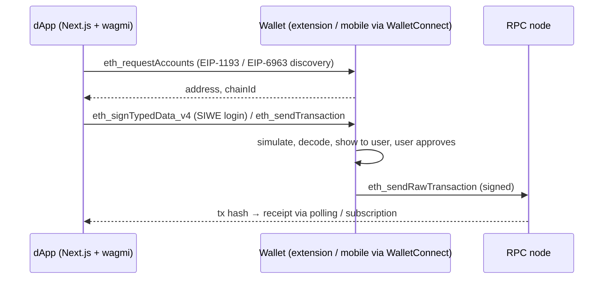

# Web3 Wallets

> [!abstract] TL;DR
> A wallet is **key management + transaction signing + a user interface**. It doesn't hold coins: assets live on-chain, and the wallet controls the key or logic that authorizes moving them.
> - **Types**: EOAs (one secp256k1 key, seed phrase), hardware wallets (keys in a secure element), MPC/custodial wallets (key split across parties or held by a provider), and **smart accounts** (ERC-4337 contracts, or EOAs delegating to code via **EIP-7702** since Pectra 2025).
> - **What users actually lose funds to**: blind signing, approval/permit phishing, compromised front-ends, and leaked seeds. Cryptography is rarely the weak point.

## Introduction
- **Evolution**:
  - Raw keys and paper wallets.
  - **HD wallets** (BIP-32/39/44, one mnemonic → many accounts).
  - Browser extensions (MetaMask, 2016) and mobile wallets.
  - Hardware wallets (Trezor 2014, Ledger).
  - **MPC** wallets for institutions (Fireblocks).
  - **Account abstraction** (ERC-4337, 2023; EIP-7702, 2025).
  - **Passkey** wallets.
- **Problem**: give users self-custody without making them cryptographers, and give businesses custody without single points of failure.
- **Where it sits**: between the user and [[Ethereum & EVM]] chains. dApps talk to wallets via EIP-1193 providers (injected) or WalletConnect/Reown (QR/deep link). Exchanges and fintechs run **custody** infrastructure: hot/warm/cold wallets, MPC/HSM signing, withdrawal policies.

## Core Concepts

### Wallet types
| Type | Key model | Recovery | Strengths | Risks |
|---|---|---|---|---|
| Software EOA (MetaMask, Rabby, Trust) | Single key from a seed phrase, stored encrypted on device | Seed phrase | Universal compatibility | Malware, phishing, seed leakage |
| Hardware wallet (Ledger, Trezor, Keystone) | Key in secure element, signs on device | Seed phrase (or Shamir backup) | Key never touches the PC | **Blind signing** unreadable calldata, supply-chain/firmware trust |
| MPC / TSS (Fireblocks, Coinbase WaaS, Privy, Dynamic) | Key shares across devices/servers, signature computed jointly | Provider-assisted / share re-sharing | No single key ever exists, policy engines | Vendor dependence, opaque implementations |
| Custodial (exchange accounts) | Provider holds keys | Account recovery (KYC) | UX, fiat rails | Counterparty risk (FTX), regulatory freezes |
| **Smart account** (Safe, Coinbase Smart Wallet, Kernel, 7702 delegates) | Contract logic validates signatures (multisig, passkeys, session keys) | Social recovery / guardians | Batching, gas sponsorship, spending limits, key rotation | Contract bugs, more gas, chain-specific deployment |

### Key derivation (HD wallets)
```text
entropy (128–256 bit) → BIP-39 mnemonic (12/24 words) → PBKDF2 seed
  → BIP-32 master key → BIP-44 path m/44'/60'/0'/0/i   (60' = Ethereum, i = account index)
```
- The same mnemonic derives the same addresses in any compliant wallet. That's portability, and also why a leaked seed compromises **every** chain and account derived from it.
- An optional BIP-39 passphrase ("25th word") creates a fully separate wallet tree.

### Signing types
| Method | What gets signed | Risk level |
|---|---|---|
| `eth_sendTransaction` | A full tx (to, value, data) | High: moves assets directly |
| `personal_sign` (EIP-191) | Arbitrary message with prefix | Low–medium (login, SIWE) |
| `eth_signTypedData_v4` (**EIP-712**) | Structured typed data with a domain | **High**: Permit/Permit2 approvals and off-chain orders can drain tokens without an on-chain tx from the victim |
| EIP-7702 authorization | Delegation of the EOA to contract code | **Critical**: a malicious delegate controls the account |
| `eth_sign` (raw hash) | Arbitrary 32 bytes | Critical: deprecated, most wallets block it |

### Account abstraction
- **ERC-4337** (no protocol change): users send `UserOperation`s to an alt-mempool. **Bundlers** package them into txs calling the **EntryPoint** contract, which calls the smart account's `validateUserOp`. **Paymasters** sponsor gas or accept ERC-20 for fees.
- **EIP-7702** (Pectra): an EOA signs an authorization to set its code to a delegate contract. It keeps its address and assets, and gains batching, sponsorship and session keys. Pairs with 4337 infrastructure.
- **Passkeys**: secp256r1 (P-256) signatures verified on-chain via the RIP-7212 precompile on L2s and **EIP-7951** on L1 (Fusaka). That enables Face ID/Touch ID wallets without seed phrases.

## Architecture / How It Works

- **EIP-6963** lets multiple injected wallets announce themselves (no more `window.ethereum` fights).
- **WalletConnect / Reown**: encrypted relay between dApp and mobile wallet, paired via QR or deep link.
- **Sign-In with Ethereum (EIP-4361)**: the wallet signs a nonce-bound message and the server verifies it to create a session. It's the Web3 analogue of [[OAuth 2.0 & OIDC]] login, but it proves key control, not identity.
- **Custody architecture** (exchange/fintech):
  - **Hot wallet** (online, automated, small float) ↔ **warm** (MPC with policy approvals) ↔ **cold** (offline/HSM, manual quorum).
  - A **policy engine** enforces withdrawal limits, address whitelists, velocity checks and human approval above thresholds.

## Project Structure
N/A — wallets are products and protocols, not a codebase layout. A typical dApp wallet-integration setup:
```ts
// wagmi config (Next.js app)
import { createConfig, http } from 'wagmi';
import { base, mainnet } from 'wagmi/chains';
import { injected, walletConnect, coinbaseWallet } from 'wagmi/connectors';

export const config = createConfig({
  chains: [base, mainnet],
  connectors: [injected(), walletConnect({ projectId: process.env.NEXT_PUBLIC_WC_PROJECT_ID! }), coinbaseWallet({ appName: 'Rarticle Demo' })],
  transports: { [base.id]: http(process.env.NEXT_PUBLIC_BASE_RPC), [mainnet.id]: http(process.env.NEXT_PUBLIC_MAINNET_RPC) },
  ssr: true,
});
```
```ts
// server: verify SIWE login (viem)
import { verifySiweMessage, parseSiweMessage } from 'viem/siwe';
const fields = parseSiweMessage(message);
if (fields.nonce !== session.nonce || fields.domain !== 'app.example.my') throw new Error('bad SIWE');
const ok = await verifySiweMessage(publicClient, { message, signature });   // also supports ERC-1271/6492 smart accounts
```

## Use Cases
| Use case | Why it fits |
|---|---|
| dApp login and payments | SIWE + wallet tx signing, no passwords |
| Exchange / fintech custody | MPC/HSM + policy engine, hot/cold segregation |
| Treasury management | Safe multisig with timelocks and role modules |
| Consumer onboarding without seed phrases | Passkey smart accounts, embedded wallets (Privy, Dynamic), gas sponsorship |
| Recurring payments / subscriptions | Session keys and spending limits on smart accounts |
| Storing personal data or credentials | **Poor fit**. Wallets prove key control, not identity (combine with KYC/OIDC) |

## Pros & Cons
| Pros | Cons |
|---|---|
| Self-custody: no intermediary can freeze native assets | No "forgot password": lost keys = lost funds |
| Portable identity across dApps and chains | Signing UX is opaque. Users can't read calldata/typed data |
| Smart accounts add recovery, limits, batching | Smart accounts are chain-specific deployments with contract risk |
| MPC removes single-key compromise for businesses | MPC vendor lock-in, costly enterprise contracts |
| Hardware wallets isolate keys from malware | Hardware still needs clear signing and verified firmware |
| Open standards (EIP-1193, 712, 4337, 7702) | Fragmented standards and wallet support across chains |

## Alternatives & Peers
| Alternative | Strength | Weakness | Pick it when… |
|---|---|---|---|
| Custodial accounts (exchange, PSP) | Familiar UX, recovery, fiat | Counterparty risk, regulated access | Retail users who want simplicity |
| Embedded/MPC wallets (Privy, Dynamic, Web3Auth) | Email/social login, no extension | Vendor dependence, partial custody questions | Consumer apps onboarding Web2 users |
| Safe multisig | Battle-tested, transparent policy | UX friction, per-chain setup | Company treasuries, protocol admin keys |
| HSM (AWS CloudHSM/KMS with secp256k1) | Compliance-grade key storage | Single-key model unless combined with policy/MPC | Regulated custodians, signing services |
| Traditional auth ([[OAuth 2.0 & OIDC]]) | Identity, recovery, mature | No asset control | Apps that only need user identity |

## Tips & Reminders
> [!tip]
> - **Never handle user seed phrases** in your app. No "import wallet" forms, ever. Any site asking for a seed is a scam by definition. Tell clients this explicitly.
> - Show human-readable intent before signing: decode calldata, simulate (Tenderly/Blowfish-style), and display token amounts and spenders. Prefer exact-amount approvals or Permit2 with expiries.
> - Support smart-account signatures server-side: ERC-1271 (deployed) and ERC-6492 (counterfactual) in SIWE verification.
> - For business custody: separate hot/warm/cold, enforce whitelists + time delays for new withdrawal addresses, require 2-of-3+ approvals above limits, and reconcile on-chain balances to the ledger daily.
> - **In ZP's stack**: for CEX-style or payment products, run deposit-address generation from an xpub (no private key on the server), index deposits into [[PostgreSQL]], and isolate signing in a separate service backed by MPC or HSM with a policy engine. Alert on withdrawals via [[n8n]]. Under **SC Malaysia** rules, operating custody for others requires registration as a digital asset custodian. Don't build custody for clients without a licensed partner.

## Versions & Breaking Changes
| Standard / change | Released | Key changes | Breaking / migration notes |
|---|---|---|---|
| BIP-32 / BIP-39 / BIP-44 | 2012–2014 | HD keys, mnemonics, derivation paths | Path differences between wallets cause "missing funds" confusion |
| EIP-712 | 2017 (wide use 2020+) | Typed structured data signing | Enabled Permit, and Permit phishing |
| EIP-1193 | 2020 | Standard provider API (`request`) | Legacy `web3.currentProvider` APIs deprecated |
| WalletConnect v2 | 2023-06 (v1 shut down) | Multi-chain sessions, relay network | v1 integrations stopped working. WalletConnect Inc rebranded **Reown** (2024) |
| ERC-4337 EntryPoint v0.6 → v0.7 → v0.8 | 2023-03 → 2024 → 2025 | Account abstraction without a fork, packed UserOps, 7702 support | Accounts are bound to an EntryPoint version. Migration needs new accounts or module upgrades |
| EIP-6963 | 2023 | Multi-injected provider discovery | Use it instead of `window.ethereum` |
| **EIP-7702** (Pectra) | 2025-05 | EOAs delegate to smart-account code | `tx.origin`/`extcodesize` EOA checks break. New phishing vector |
| **EIP-7951** (Fusaka) | 2025-12 | secp256r1 precompile on L1 | Passkey wallets verify cheaply on mainnet |

> [!warning] Unverified — check before relying on this
> EntryPoint version numbers and wallet support for 7702 change quickly. Check https://eips.ethereum.org/EIPS/eip-4337 and the wallet vendors' docs before integrating.

## Critical Issues & Gotchas
> [!danger] Blind signing and compromised front-ends
> **Bybit** (2025-02, ~USD 1.5B) signers approved a Safe transaction whose real payload (a `delegatecall` upgrading the multisig to an attacker contract) differed from what a compromised Safe{Wallet} UI displayed, and their hardware wallets showed only unreadable data. **Ledger Connect Kit** (2023-12) shipped a malicious npm version that injected a drainer into many dApps for ~5 hours. Mitigation: clear signing, independent calldata verification and simulation, pinned/verified front-end dependencies.

> [!danger] Drainers, permit phishing and address poisoning
> Drainer-as-a-service kits (Inferno, Angel, Pink) steal hundreds of millions per year via fake mints/airdrops that request `setApprovalForAll`, Permit/Permit2 signatures, or 7702 delegations. **Address poisoning** sends zero-value transfers from look-alike addresses so victims copy the wrong one from history. Educate users to verify the full address, use allow-lists, and revoke approvals (revoke.cash).

> [!danger] Weak key generation
> The **Profanity** vanity-address generator used a 32-bit seed, so keys were brute-forceable, leading to the Wintermute loss (~USD 160M, 2022). Browser-wallet and library RNG bugs have caused similar losses. Only use audited key generation (hardware, well-known libraries). Never use online "address generators".

> [!warning] Gotchas
> - Chain IDs: signing for the wrong chain or replaying across forks. EIP-155 and the EIP-712 domain `chainId` must be checked.
> - The same address on another chain may not be controlled by the same smart account (counterfactual deployment differs per chain).
> - Hot wallet nonce management under concurrent withdrawals needs a single sender queue per address.
> - Mobile deep links / universal links for WalletConnect differ per wallet. Test on real iOS and Android devices.
> - Seed phrases stored in cloud notes, screenshots or password managers synced to compromised accounts are a common real-world loss path.

## Deep Dives
- (planned) [[Web3 Wallets - Key Management & Account Abstraction]]

## Related
- [[Ethereum & EVM]] — accounts, tx types, EIP-7702
- [[Solidity]] — smart-account contracts, ERC-1271 signatures
- [[Blockchain Fundamentals]] — keys, signatures, finality
- [[Network Security]] — protecting signing infrastructure
- [[OAuth 2.0 & OIDC]] — contrast: identity vs key-control login
- [[Next.js]] — dApp front ends with wagmi

## References
- EIP-1193: https://eips.ethereum.org/EIPS/eip-1193
- EIP-712: https://eips.ethereum.org/EIPS/eip-712
- ERC-4337: https://eips.ethereum.org/EIPS/eip-4337
- EIP-7702: https://eips.ethereum.org/EIPS/eip-7702
- Sign-In with Ethereum (EIP-4361): https://eips.ethereum.org/EIPS/eip-4361
- wagmi: https://wagmi.sh/
- Safe docs: https://docs.safe.global/
- revoke.cash (approval hygiene): https://revoke.cash/
