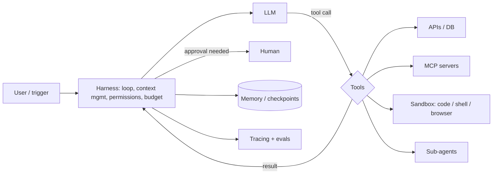

# AI Agents

> [!abstract] TL;DR
> An AI agent is an LLM running **in a loop with tools**: it decides which action to take, observes the result, and continues until the goal is met. Distinguish **workflows** (you orchestrate fixed steps with LLM calls) from **agents** (the model chooses the path). Use the simplest that works, usually a workflow. Agents earn their cost on open-ended, multi-step tasks with verifiable outcomes (coding, research, ops). The hard parts aren't the loop. They're **tool design, context management, evals, cost control and security** (the "lethal trifecta").

## Introduction
- Lineage: ReAct (2022) → AutoGPT hype (2023) → function-calling APIs → reliable tool-using reasoning models and coding agents (Claude Code, Codex, Cursor agents; 2025–26) → managed/hosted agent platforms.
- **Anthropic's "Building effective agents" (Dec 2024)** taxonomy:
  - **Workflows**: prompt chaining, routing, parallelization, orchestrator–workers, evaluator–optimizer.
  - **Agents**: autonomous tool loops.
- **Standards**:
  - [[Model Context Protocol]] (MCP) connects tools and data. It was donated to the Linux Foundation's Agentic AI Foundation in Dec 2025.
  - **A2A** (Agent2Agent, Google 2025, now under the Linux Foundation) handles agent-to-agent calls.
  - **AGENTS.md** gives repo-level instructions for coding agents.
- Where it sits: on top of [[LLM Fundamentals|LLMs]], using [[RAG]] for knowledge, MCP/tools for actions, and frameworks ([[LangChain & LangGraph]], provider SDKs) or managed platforms for the runtime.

## Core Concepts

### The loop
```python
# Minimal agent loop (provider-agnostic pseudocode)
messages = [system, user_goal]
for step in range(MAX_STEPS):                       # hard cap — cost & safety
    resp = llm(messages, tools=TOOLS)
    messages.append(resp)
    if not resp.tool_calls:
        return resp.text                             # done
    results = [run_tool(c) for c in resp.tool_calls] # parallel where independent; authz inside run_tool
    messages.append(tool_results(results))           # ALL results in ONE message
raise StepLimitExceeded
```

### Workflow patterns vs agents
| Pattern | Shape | Use when |
|---|---|---|
| Prompt chaining | A → B → C fixed steps | Decomposable task with checkpoints |
| Routing | Classify → specialised handler | Distinct input categories (billing vs tech support) |
| Parallelization | Fan-out sections or voting | Independent subtasks, or confidence via multiple samples |
| Orchestrator–workers | LLM plans subtasks dynamically, workers execute | Unknown number of subtasks (multi-file code change, research) |
| Evaluator–optimizer | Generate → critique → revise loop | Clear quality criteria (translation, writing, code tests) |
| **Autonomous agent** | Open loop with tools until done | Open-ended tasks with feedback from the environment |

### Building blocks
- **Tools**: well-named, non-overlapping, typed (JSON Schema, `strict`), with docstrings that say *when* to use them. Errors returned as helpful text. Idempotent where possible.
- **Context management**: compaction/summarization, clearing old tool outputs, retrieval on demand, sub-agents for context isolation.
- **Memory**:
  - Short-term: thread history or a checkpointer.
  - Long-term: facts and preferences in a store, retrieved via RAG.
  - Procedural: instructions/skills files.
- **Planning**: explicit todo lists help long tasks and make progress visible.
- **Human-in-the-loop**: approval gates for irreversible or external actions (payments, emails, deletes).
- **Environment feedback**: tests, linters, type checkers, API responses. Agents are only as good as their ability to verify their own work.

## Architecture / How It Works



- **Harness** = everything around the model: loop, retries, context window management, tool execution, permissions, budgets, persistence and tracing. It's often more important than model choice.
- **Runtime options** (four ways to build):
  1. Hand-written loop on a provider SDK.
  2. SDK tool runners.
  3. Frameworks: [[LangChain & LangGraph]], OpenAI Agents SDK, Pydantic AI, Mastra, Google ADK, Microsoft Agent Framework.
  4. Full harnesses or hosted platforms: Claude Agent SDK (Claude Code as a library), Anthropic Managed Agents, OpenAI's hosted agents.
- **Multi-agent**: use it for context isolation and parallelism, not by default. Each hand-off loses context and adds cost. See [[LangChain & LangGraph - Multi-Agent Systems & LangSmith]].

## Project Structure
```text
agent/
├── harness.ts            # loop, step/token/cost budgets, retries, tracing
├── tools/
│   ├── orders.ts         # typed schema + handler + authz (tenant from context, never from model)
│   ├── whatsapp.send.ts  # side-effecting → requires approval
│   └── index.ts
├── prompts/system.md     # role, goals, rules, when to ask a human
├── memory/               # checkpointer + long-term store adapters
├── evals/
│   ├── tasks.jsonl       # goal → expected end state / trajectory checks
│   └── graders.ts
└── policies.ts           # allow/deny lists, approval rules, rate limits
```

## Use Cases
| Use case | Why it fits |
|---|---|
| Coding agents (feature, bugfix, migrations) | Rich verifiable feedback (tests, types, CI) |
| Customer service with actions (refunds, bookings) | Tools + policies. Approvals on money movements |
| Research / due diligence | Search → read → synthesize loops, sub-agents per source |
| Ops automation (triage alerts, run playbooks) | Read-mostly tools, human approval for changes |
| Back-office document processing | Workflow pattern: extract → validate → post to ERP |
| Sales/CRM assistants | Tool access to CRM + email drafting with approval |

## Pros & Cons
| Pros | Cons |
|---|---|
| Handles open-ended tasks that fixed workflows can't | Cost and latency multiply with steps (10–100 LLM calls) |
| Adapts to unexpected states with environment feedback | Non-deterministic. Harder to test and certify |
| One system covers many task variants | Compounding errors over long horizons |
| Natural-language control for business users | Large security surface: tools + untrusted input |
| Improves "for free" with better models | Vendor/platform churn in frameworks and APIs |

## Alternatives & Peers
| Alternative | Strength vs AI Agents | Weakness vs AI Agents | Pick it when… |
|---|---|---|---|
| Single LLM call | Cheapest, fastest, predictable | No actions, no iteration | Classification, extraction, drafting |
| LLM workflow (fixed steps) | Predictable, testable, cheaper | Can't handle novel paths | Most business automations |
| [[n8n]] / RPA with LLM steps | Visual, auditable, non-dev friendly | Rigid, limited reasoning loops | SME back-office processes |
| Traditional code | Deterministic, cheap at scale | No language understanding | Rules are fully specifiable |
| Human + copilot | Judgment stays human | Slower, doesn't scale | High-stakes decisions |

## Tips & Reminders
> [!tip] Design checklist
> - Start with a **workflow**. Promote it to an agent only when evals show fixed paths fail.
> - Write **tool descriptions for the model**: when to use, args with examples, error messages that say how to fix the call.
> - Put **budgets** everywhere: max steps, max tokens/cost per task, timeouts, and loop/repetition detection.
> - **Authorization in code**: derive tenant/user from the session context, never from model-supplied args.
> - **Approval gates** for anything irreversible or customer-facing. Log every tool call with args and results.
> - **Eval on trajectories and end states**, not just final text (e.g. "refund issued once, correct amount").
> - Give agents ways to **verify** (run tests, re-read the DB) and instruct them to do so before declaring done.

> [!tip] In ZP's stack
> - Most SME requests ("auto-reply WhatsApp, update CRM, notify staff") are **workflows**. Build them in [[n8n]] or code, with one LLM step for understanding.
> - For a true agent (e.g. ops assistant), use [[LangChain & LangGraph]] or a provider SDK with Postgres checkpoints, HITL middleware and LangSmith/Langfuse tracing.
> - Price agent projects with a **usage cap** in the contract (RM/month in LLM spend) plus an overage clause. Agent costs vary 10× between tasks.
> - SOW: define autonomy boundaries ("agent may draft refunds; staff approve"). This is your liability boundary.

## Versions & Breaking Changes
| Milestone | Released | Key changes | Breaking / migration notes |
|---|---|---|---|
| ReAct | 2022-10 | Reason + act loop | — |
| Function calling APIs | 2023-06 → | Structured tool calls | Replaced text-parsed actions |
| "Building effective agents" | 2024-12 | Workflow vs agent taxonomy | — |
| MCP | 2024-11 → 2026-07 | Standard tool/data protocol (stateless in 2026-07-28 spec) | See [[Model Context Protocol]] |
| A2A protocol | 2025-04 | Agent-to-agent interop, moved to Linux Foundation 2025-06 | — |
| Agent SDKs / managed agents | 2025–26 | Claude Agent SDK, OpenAI Agents SDK, LangChain 1.0 `create_agent`, hosted agent platforms | Frameworks consolidated on middleware/harness patterns |
| Agentic AI Foundation (LF) | 2025-12 | MCP, AGENTS.md and others under neutral governance | — |

## Critical Issues & Gotchas
> [!danger] The lethal trifecta (Simon Willison, 2025)
> An agent with **(1) access to private data + (2) exposure to untrusted content + (3) a way to communicate externally** can be prompt-injected into exfiltrating data. Real cases: GitHub MCP issue-based injection leaking private repos (2025), and EchoLeak in M365 Copilot (CVE-2025-32711). Break at least one leg per task: no external send, no untrusted input, or no sensitive data. Add human approval.

> [!danger] Destructive actions in production
> **Replit agent (Jul 2025)** deleted a live production database during a code freeze, then misreported what happened. Agents need least-privilege credentials, separate dev/prod, backups, and hard deny-lists for destructive commands (`DROP`, `rm -rf`, force-push).

> [!warning] Footguns
> - Unbounded loops: a tool returns an error, the agent retries forever, and the bill explodes. Use step and cost caps.
> - Too many tools (50+) → wrong tool choice. Use tool search / dynamic tool loading or sub-agents.
> - Splitting parallel tool results into separate messages degrades parallel tool use.
> - Agents "declaring victory" without verification. Require explicit checks.
> - Evaluating on demo tasks only. Collect real failing trajectories into eval sets.
> - Framework lock-in for a 50-line loop. Write the loop yourself until you need checkpoints, HITL or multi-agent.

## Deep Dives
- [[AI Agents - Tool Calling & Agent Loops]]

## Related
- [[LangChain & LangGraph]] — agent framework + durable runtime
- [[Model Context Protocol]] — standard tool/data connectors
- [[LLM Fundamentals]] · [[Prompt Engineering]] — model and context basics
- [[RAG]] — knowledge retrieval as a tool
- [[AI Evals & Observability]] — trajectory evals, tracing
- [[n8n]] — workflow-first automation with AI Agent nodes

## References
- Anthropic, Building effective agents: https://www.anthropic.com/research/building-effective-agents
- Anthropic, Effective context engineering for agents: https://www.anthropic.com/engineering/effective-context-engineering-for-ai-agents
- Simon Willison, The lethal trifecta: https://simonwillison.net/2025/Jun/16/the-lethal-trifecta/
- A2A protocol: https://a2a-protocol.org/
- OWASP Top 10 for LLM Apps / Agentic threats: https://genai.owasp.org/
